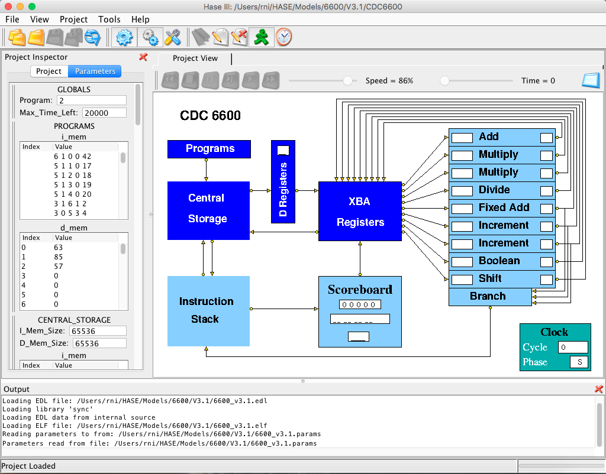
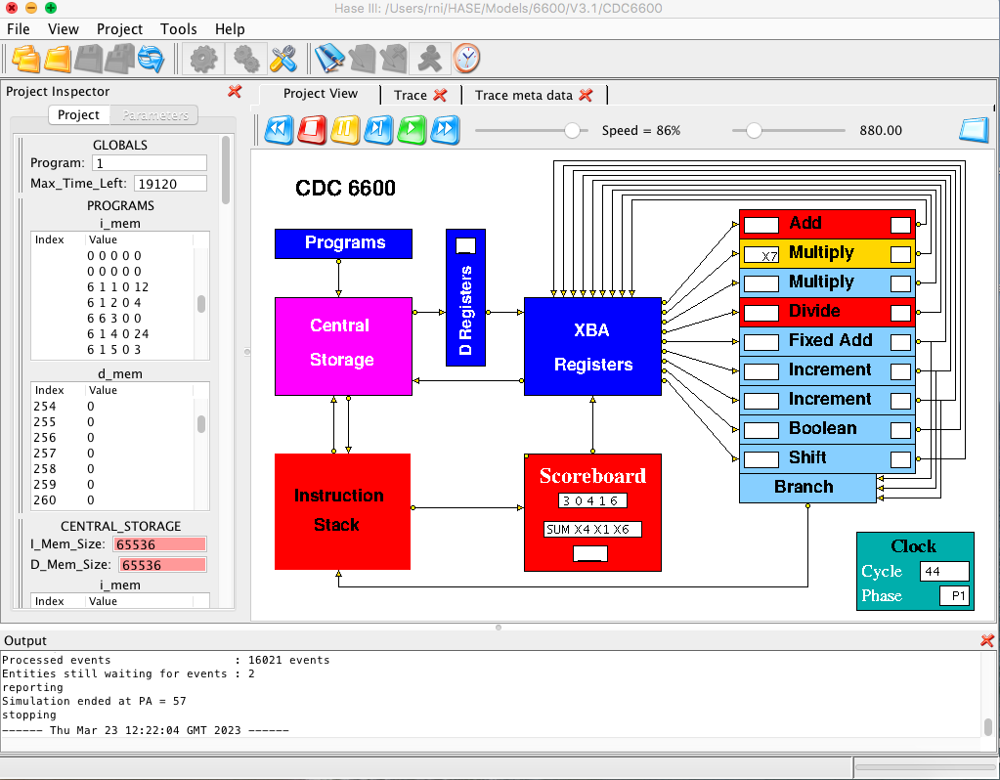
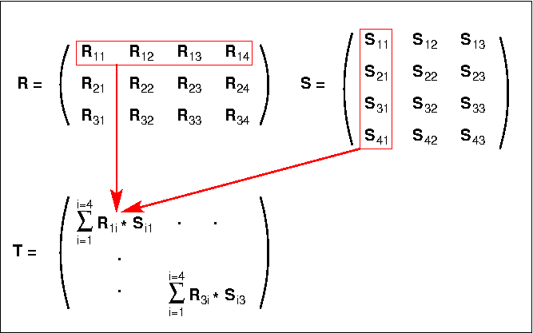

## HASE CDC 6600 Simulation Model

The CDC 6600 was first demonstrated by the Control Data Corporation in 1964. The design team was led by Seymour Cray, who went on to design the CDC 7600 and later, after he left CDC to form his own company, the Cray-1.  The 6600 was designed to solve problems substantially beyond contemporary computer capability. It achieved its performance by the use of parallel functional units, instruction buffering and by off-loading peripheral handling to separate peripheral processors. 
 
This document describes the design of the CDC 6600 central processor and explains how the HASE simulation model works. There are two versions of the model. Version 1 contains a program in its memory that demonstrates the operation of many of the CDC 6600 instructions implemented in the model. Version 2 contains a matrix multiplication program (most early supercomputers were designed specifically to perform well on this problem).  The two versions of the model are otherwise identical.

The files for version 1 can be downloaded from <https://github.com/HASE-Group/cdc6600/tree/V1.1>

The files for version 2 can be downloaded from <https://github.com/HASE-Group/cdc6600/tree/V2.1>

Instructions on how to use HASE models can be found at

<a href="http://www.icsa.inf.ed.ac.uk/research/groups/hase/models/use.html"
target="_blank">Downloading, Installing and Using HASE</a>.

### Design of the 6600

The design of the CDC 6600 is comprehensively described in the book "Design of a Computer - The Control Data 6600" [1] by J.E. Thornton, who was responsible for most of the detailed design, under the leadership of Seymour Cray. Much of the material provided here derives from this book, though some is from [2], relevant parts of which also derivefrom [1].

*(To avoid tortuous grammatical constructs, much of the following description of the 6600 is written in the present tense, even though there are no longer any real 6600s in operation.)*

The CDC 6600 was designed to solve problems substantially beyond contemporary computer capability and, in order to achieve this end, a high degree of functional parallelism was incorporated into the design of the central processor, as shown in Figure 1.  In order to exploit this parallelism, the instruction set uses a three-address format (Figure 2) that allows successive instructions to refer to totally independent input and result operands.  This would be quite impossible with a one-address instruction format, for example, where one of the inputs for an arithmetic operation is normally taken from, and the result returned to, a single implicit accumulator.  Despite the potential for instruction overlap, dependencies between instructions can still occur in a three-address system. For example, where one instruction requires as its input the result of an immediately preceding instruction, the hardware must ensure that this ordering is strictly maintained.  This would have been difficult if full store addresses were involved, since it would have made 6600 instructions prohibitively long, and it would in any case have been impossible to move operands in and out of Central Storage at a rate matching the execution rates of the functional units.  The use of a small number of Scratch Pad Registers overcame both these problems.

**Figure 1. 6600 processor organisation**

During program execution, instructions are taken in sequence from the Instruction Stack and issued by the Scoreboard to the appropriate execution unit. Each unit takes its input operands from among the 24 scratch-pad registers (eight 60-bit X (operand) registers, eight 18-bit A (address) registers, and eight 18-bit B (index) registers) and returns its result to one of these registers.  The maximum rate of issue is one instruction per minor clock cycle (100 ns), while the units take typically 300 or 400 ns to complete their operations. Thus while the units can in principle all operate simultaneously, simultaneous operation of three or four units is more typical in practice. The issuing of instructions is not straightforward, since instruction dependencies can require that some instructions be held up until the completion of other, previously issued, instructions. In order to maximise the amount of concurrent processing, the Scoreboard is designed to issue each instruction as early as possible, within the limits set by these dependencies, so as to allow the following instruction to be issued, hopefully to a different unit. Dependency conflicts are resolved by the Scoreboard through control signals which link it to each unit and by the use of information buffered about the registers in respect of each unit and about the units in respect of each register.

**Figure 2. 6600 instruction format**

### The Instruction Stack

The Instruction Stack in the 6600 consists of eight 60-bit registers (I0-I7 in Figure 3) which operate as a push-up stack and which can contain instruction loops. Programs are initiated in by an * Exchange Jump* in which the contents of all addressable registers in the central processor are interchanged with the contents of a designated store area. Following such an Exchange Jump the new contents of the program address register are used to access the first instruction word. This word is received from Central Storage into an Input Register and then loaded into the bottom register of the Instruction Stack.

**Figure 3. 6600 instruction stack**

Instruction words are made up of four 15-bit*parcels* and as the first instruction word enters the bottom register of the stack (I0), the first two parcels within the word (starting from the left) are transferred into a series of instruction registers within the Scoreboard control logic.  At the same time, a further instruction fetch is initiated. Two parcels are taken to allow for long format (30-bit) instructions. If the first parcel is a short format (15-bit) instruction, the second parcel is ignored and in the next processor minor cycle the second and third parcels are taken from I0. When a long instruction is encountered an extra minor cycle is spent skipping over the second half, so that dealing with one complete instruction word never takes less than four 100 ns minor cycles. This matches the rate at which instructions move into the stack. Whenever a new instruction fetch is initiated, the contents of the stack ripple upwards one register every half minor cycle, with the topmost location (I7) being overwritten first. At the end of four minor cycles the contents of I0 are moved up and I0 is then ready to receive a new instruction from the Input Register.

In practice the rate at which instructions could be accessed from Central Storage turned out to be lower than anticipated at the design stage, which meant that a new instruction word would not actually be available until after a total of eight minor cycles. Since the rate at which instructions are issued to the functional units cannot often be maintained at one per minor cycle, however, the overall effect of this delay on performance was not quite so bad as might be imagined, and when executing loops which can be contained within the stack, no Central Storage accesses for instructions are required at all.

#### Branches

Information about the contents of the stack is contained in two registers: the Depth (D), which measures the number of valid instruction words in the stack, and the Locator (L), which specifies the location in the stack of the instruction word currently in use. During execution of a loop held entirely in the stack, the instructions remain in fixed locations and the program address register can point to any one of the stack registers within a distance D from the bottom. D is re-set to zero whenever a branch out of the stack is taken, and is incremented by one for every new instruction word brought in. When the stack is full, D remains equal to seven.

When a conditional branch is decoded, a test for*jump within stack* is made. This involves subtracting the current program address from the branch address. If the absolute value of the result is less than seven words, and if the values in D and L indicate that the branch is to a location within the stack, no further store accesses are made for instruction words until instruction parcels are again taken from I0. Thus a branch may jump forwards or backwards within the stack and loops may be held in the stack in various forms.

### The Simulation Model

The HASE user interface window contains three panes, as shown in Figure 4, where the simulation model of the 6600 is displayed in the main (right hand) Project View pane. Parameters of the model (*e.g.* register and store contents) are displayed in the (left hand) Project Inspector pane while the lower, Output pane shows information produced by HASE when the model is compiled and run. The icons in the top row allow the user to load a model, compile it, run the simulation code thus created and to load the trace file produced by running a simulation back into the model for animation.

**Figure 4. The CDC 6600 simulation model loaded into HASE**

Once a trace file has been loaded, the animation control icons at the top of the Project View pane become active. From left to right, these allow the animation to be rewound, stopped, paused, single stepped, run or fast forwarded to the end.  As the animation proceeds, packets of information can be seen passing between entities while the entities themselves change colour to reflect their states (idle, busy, waiting).  The model does not include the Peripheral Processors and Peripheral Channels shown in Figure 1 but does include the D registers (not shown in Figure 1) which act as buffer registers between Central Storage and the XBA Registers.

 
**Figure 5. The CDC 6600 simulation model during animation**

Table 1 shows the full instruction set of the 6600, with the instructions grouped according to the functional unit that executes them. Not all of them are implemented in the HASE model; those that are implemented have their octal code shown in red. Most of those that are not (shown in blue) have been omitted because they are specific to the implementation of floating-point numbers (somewhat unusually in 1's complement in the 6600). In the model, all numbers are implemented as integer (fixed-point) values. This is because memories in HASE are implemented as C++ arrays and the type-checking in C++ means that it is not possible to mix different types of element in a single array. This is not a major issue in terms of holding instructions and operands in different arrays, since in real computers they are normally stored in quite separate regions of memory. For floating-point variables the choice is between representing them as the integer equivalents of their floating-point bit patterns (as in version 2 of the HASE DLX model, for example), and implementing the appropriate conversions, or simply confining the model to fixed-point variables. The latter option was chosen for the 6600, as it was for the HASE MU5 model.

<small>Left hand column of each table = Octal Code,  IMPLEMENTED/NOT IMPLEMENTED in the model</small> 

**Table 1. 6600 instruction set**

As shown in Figure 2, instructions can be 15 or 30 bits long.  For 15-bit instructions, the**F** and**m** fields determine which type of register to use (X, B or A),**j** and**k** determine which of the X, B or A register to use as operand sources, while**i** identifies which register to use as the destination. The**F** and**m** fields also determine the length of the instruction. In 30-bit instructions the second 15 bits are concatenated with the**k** field to produce an 18-bit**K** field, used as an immediate operand. Type checking in C++ means that instructions and immediate values cannot be mixed in the arrays used to hold instructions (in Central Storage and the Instruction Stack), so all instructions in the model have the same format. The model does however check that the values of **i**,**j** and, in a k-type instruction, **k** do not fall outside the range 0 - 7 and that in a K-type instruction the value of **K** does not fall outside the range 0 - 2^18; if either check fails, the simulation stops.

Operands are transferred between the X registers and Central Storage by instructions which load an address into registers A1-A5 (thus causing the corresponding operand to be read from that address instore and loaded into X1-X5), or into registers A6 or A7 (thus causing the contents of X6 or X7 to be transferred to that address in store). The 6600 had a complicated arrangement of data highways linking groups of the functional units and the registers, in order to balance performance against engineering and cost constraints. The HASE model simply provides whatever highways are needed.

The Instruction Stack in the model consists of eight registers (as in the real 6600) but each is only two instructions wide (for clarity in the display, instructions are held one per word in the memory of the model but are fetched in pairs from even/add addresses). This lack of verisimilitude is at least partly ameliorated by the fact that all instructions in the model are the same length, whereas, in the real 6600, programs contained a mixture of 15-bit and 30-bit instructions, so each register in the Instruction Stack might contain four instructions but would frequently only contain two or three. It also turns out that the inner loop of the matrix multiplication program contained in version 2 of the model can be contained within the Instruction Stack, as would have been the case in the real 6600.

An important programming constraint imposed by the hardware design of the 6600 was that the target of a branch instruction could only be an instruction at the start of a 60-bit store word so, in the model, the target has to be instruction at an even store address. In both systems, this can require the code to be padded out with PASS instructions, more about which can be found below.

### Demonstration Program

Version 1 of the model contains the demonstration program shown in Table 2, together with some appropriate data.  For each instruction, the table shows its program address (PA), its machine code representation as the values of **F m i j k/K**, the instruction definition, the actions performed and the resulting outcome(s), *i.e.* the values written into the various X, A and B registers and Central Storage locations (CS n). Note that the model only uses a single instruction format, not two as in the real 6600, so that while **F**, **m**, **i** and **j** are all single digit octal values, **k/K** is treated as an octal value when it is a register designator (**k**) but as a decimal value when it is an immediate operand (**K**).

The program is intended to demonstrate the operation of the architectural features of the central processor, in particular the way the scoreboard handles first, second and third order conflicts, as well as to test many of the instructions implemented in the model. Note that the instructions are not necessarily in the order that a simple compiler might have placed them but have been re-ordered to improve performance *e.g.* the instructions at PA = 15 and PA = 16. The first instruction tries (and fails) to load a non-zero value into B0 because B0 is defined in the architecture to always contain zero. Details about the remaining instructions are given in the section below the table.

|PA|F&nbsp;m&nbsp;i&nbsp;j&nbsp;k/K| Instruction | Action | Result |
|--:|:----------:|:--------|:------|:---------|
|0|6 1 0 0 42|SUM of Bj and K to Bi| Tries to set B0 = 42 | B0 = 0|
|1| 5 1 1 0 17 | SUM of Bj and K to Ai  |  A1 = B0 + 17 Loads X1 from CS  17  | A1 = 17 X1 = 513  |
|2| 5 1 2 0 18 | SUM of Bj and K to Ai  |  A2 = B0 + 18 Loads X2 from CS  18  | A2 = 18 X2 = 514  |
|3| 5 1 3 0 19 | SUM of Bj and K to Ai  |  A3 = B0 + 19 Loads X3 from CS  19  | A3 = 19 X3 = 515  |
|4| 5 1 4 0 20 | SUM of Bj and K to Ai  |  A4 = B0 + 20 Loads X4 from CS  20  | A4 = 20 X4 = 516  |
|5| 3 1 6 1 2 | FLOATING DIFFERENCE of Xj and Xk to Xi  |  X6 = X1 - X2  | X6 = -1  |
|6| 3 0 5 3 4 | FLOATING SUM of Xj and Xk to Xi  |  X5 = X3 + X4  | X5 = 1031  |
|7| 4 0 6 1 2 | FLOATING PRODUCT of Xj and Xk to Xi  |  X6 = X1* X2  | X6 = 263682  |
|8| 3 0 6 4 5 | FLOATING SUM of Xj and Xk to Xi  |  X6 = X4 + X5  | X6 = 1547  |
|9| 4 4 7 6 4 | FLOATING DIVIDE Xj by Xk to Xi  |  X7 = X6 / X4  | X7 = 2  |
|10| 4 0 5 4 7 | FLOATING PRODUCT of Xj and Xk to Xi  | X5 = X4* X7  | X5 = 1032  |
|11| 3 0 4 1 6 | FLOATING SUM of Xj and Xk to Xi  | X4 = X1 + X6  | X4 = 2060  |
|12| 5 1 1 0 0 | SUM of Bj and K to Ai |  A1 = B0 + 0  Loads X1 from CS  0   | A1 = 0 X1 = 63 |
|13| 5 1 2 0 1 | SUM of Bj and K to Ai |   A2 = B0 + 1 Loads X2 from CS  1 | A2 = 1 X2 = 85 |
|14| 1 1 6 1 2 | LOGICAL PRODUCT of Xj and Xk to Xi |  X6 = X1 &amp; X2 | X6 = 21 |
|15| 5 1 3 0 2 | SUM of Bj and K to Ai | A3 = B0 + 2 Loads X3 from CS  2 | A3 = 2 X3 = 57 |
|16| 5 1 6 0 3  | SUM of Bj and K to Ai  | A6 = B0 + 3 Writes X6 to CS  3  | A6 = 3 CS  3 = 21  |
|17| 1 2 7 2 3  | LOGICAL SUM of Xj and Xk to Xi  | X7 = X2 \| X3  | X7 = 125  |
|18| 1 3 6 2 3  | LOGICAL DIFFERENCE of Xj and Xk to Xi  |  X6 = X2 ^ X3  | X6 = 108  |
|19| 5 1 7 0 4  | SUM of Bj and K to Ai  | A7 = B0 + 4 Writes X7 to CS  4  | A7 = 4 CS  4 = 125  |
|20| 5 1 6 0 5  | SUM of Bj and K to Ai  |  A6 = B0 + 5 Writes X6 to CS  5  | A6 = 5 CS  5 = 108  |
|21| 1 4 7 1 2  | TRANSMIT Xk~ to Xi  | X7 = X2k~  | X7 = -86  |
|22| 1 5 6 1 2  | LOGICAL PRODUCT of Xj and Xk~ to Xi  |  X6 = X1 & X2~  | X6 = 42  |
|23| 5 1 7 0 6  | SUM of Bj and K to Ai  | A7 = B0 + 6 Writes X7 to CS  6  | A7 = 6  CS  6 = -86  |
|24| 5 1 6 0 7  | SUM of Bj and K to Ai   | A6 = B0 + 7 Writes X6 to CS  7  | A6 = 7 CS  7 = 42  |
|25| 1 6 7 2 3  | LOGICAL SUM of Xj and Xk~ to Xi  | X7 = X2 \| X3  | X7 = -41  |
|26| 1 7 6 2 3  | LOGICAL DIFFERENCE of Xj and Xk~ to Xi  |  X6 = X2 ^ X3~  | X6 = -109  |
|27| 5 1 7 0 8  | SUM of Bj and K to Ai   | A7 = B0 + 8 Writes X7 to CS  8  | A7 = 8 CS  8 = -41  |
|28| 5 1 6 0 9  | SUM of Bj and K to Ai   | A6 = B0 +9 Writes X6 to CS  9  | CS  9 = -109  |
|29| 4 7 0 0 6 | SUM of 1's in Xk to Xi | X0 = no. of 1's in X6  | X0 = 28 |
|30| 1 0 7 1 0 | TRANSMIT Xj to Xi | Copies X1 to X7 | X7 = 63 |
|31| 4 0 6 4 5 | FLOATING PRODUCT OF Xj and Xk to Xi | X6 = X4* X5 | X6 = 2125920  |
|32| 6 1 1 0 4 | SUM of Bj and K to Bi  | B1 = B0 + 4  | B1 = 4  |
|33| 6 1 2 0 -3 | SUM of Bj and K to Bi  | B2 = B0 + (-3)  | B2 = -3  |
|34| 2 0 7 1 5 | SHIFT Xi LEFT jk places | Shifts X7 left 13 places | X7 = 33030144 |
|35| 2 0 6 2 3 | SHIFT Xi RIGHT jk places | Shifts X6 right 19 places | X6 = 259 |
|36| 2 2 4 1 0 | SHIFT Xi NOMINALLY LEFT Bj places  | Shifts X4 left B1 places  | X4 = 32960  |
|37| 2 2 5 2 0 | SHIFT Xi NOMINALLY LEFT Bj places  | Shifts X5 right -B2 places  | X5 = 129  |
|38| 2 3 4 2 0 | SHIFT Xi NOMINALLY RIGHT Bj places  | Shifts X4 left -B2 places  | X4 = 263680  |
|39| 2 3 5 1 0 | SHIFT Xi NOMINALLY RIGHT Bj places  | Shifts X5 right B1 places  | X5 = 8  |
|40| 5 1 7 0 10  | SUM of Bj and K to Ai   | A7 = B0 + 10 Writes X7 to CS  10  | A7 = 10 CS  10 = 33030144  |
|41| 3 6 4 2 3 | INTEGER SUM of Xj and Xk to Xi | X4 = X2 + X3 | X4 = 142</td> </tr>
|42| 5 1 6 0 11  | SUM of Bj and K to Ai  | A6 = B0 + 11 Writes X6 to CS  11  | A6 = 11 CS  11 = 259  |
|43| 1 0 7 4 0 | TRANSMIT Xj to Xi | Copies X4 to X7 | X7 = 142 |
|44| 3 7 6 1 3 | INTEGER DIFFERENCE of Xj and Xk to Xi | X6 = X1 - X3 | X6 = 6 |
|45| 5 1 7 0 12 | SUM of Bj and K to Ai | A7 = B0 + 12 Writes X7 to CS  12  | A7 = 12 CS  12 = 142  | 
|46| 5 1 6 0 13 | SUM of Bj and K to Ai | A6 = B0 + 13 Writes X6 to CS  13  | A6 = 13 CS  13 = 6 |
|47| 7 1 0 0 0  | SUM of Bj and K to Xi  | X0 = B0 + 0  | X0 = 0  |
|48| 7 5 2 3 1  | DIFFERENCE of Aj and Bk to Xi  | X2 = A3 - B4  | X2 = -2  |
|49| 0 3 0 0 52  | GO TO K IF Xj = zero   | X0 = 0, so branch    | PA = 52  |
|50| 0 3 1 1 56  | GO TO K IF Xj &#8800; zero   | X1 = 63, so branch  | PA = 56  |
|51| 4 6 0 0 0  | PASS |   |   |
|52| 0 3 3 2 54  | GO TO K IF Xj = negative   | X2 = -2, so branch  | PA = 54 |
|53| 4 6 0 0 0  | PASS  |   |   |
|54| 0 3 2 2 56  | GO TO K IF Xj = positive  | X2 = -2, so don't branch  | PA = 55  |
|55| 0 2 1 0 46 | GO TO K + Bi  | branch to 46 + B1 | PA = 50 |
|56| 4 6 0 0 0  | PASS  |   |   |
|57| 0 0 0 0 0  | STOP  |   |   |

**Table 2. The demonstration program**

### The Functional Units

Execution times for each instruction in the real 6600 were given in terms of minor (100ns) cycles, being 3 minor cycles for operations in the Boolean, Shift, Long Add and Increment Units, 4 minor cycles in the Add Unit, 10 in the Multiply Unit and 29 in the Divide Unit. These times included the time to transfer the result to the destination register. In the model, each unit includes an identical pipeline of result registers. The result itself is produced in the first clock cycle and moved through this pipeline in each successive clock period. A latency value is set in each unit to allow the result to be selected from the appropriate stage of this pipeline and sent to the registers. Except in the case of the Divide Unit, the latency value is set to one less than the number of 6600 minor cycles to allow for the transfer time to the registers. Waiting for 29 clocks in the simulation model for the Divide Unit to complete would be tedious, so its latency is set to 14.

#### Add Unit

In the real 6600, the (floating-point) Add Unit used 1's complement representation for the 48-bit mantissae of floating-point numbers and an 11-bit biassed binary exponent (an exponent value of 0 is represented as 10000000000). The mantissae were assumed, unusually, to be integers rather than fractions. This had the advantage of allowing fixed-point integers to be converted to floating-point numbers by simply *OR*ing in the exponent bias. In the model, the Add Unit simply operates on integers and only implements the two simple SUM and DIFFERENCE operations (octal codes 30 and 31). Examples of these (displayed as SUM and DIF) are included in the Demonstration Program in Version 1 of the model (and shown in Table 1) at instructions 5 and 6 (*i.e.* at PA = 5 and PA = 6).

#### Multiply Unit

Like many high performance computers, the 6600 was designed to perform well on matrix multiplication. Matrix multiplication involves the execution of repeated scalar product calculations, which themselves involve repeated floating-point multiplications and additions. Because the time for multiplication (1000 ns) was more than double that for addition (400 ns), the 6600 included two identical Multiply Units. This unit was a very interesting example of a high performance arithmetic unit, combining as it did the techniques of carry-save addition, multiplier pairs and split multiplier operation. However, as in the case of the Add Unit, the HASE model simply operates on integers and only implements the simple FLOATING PRODUCT operation (octal code 40). An example of this instruction (displayed as MUL) is included in the Demonstration Program at PA = 10.

#### Divide Unit

Floating-point division was the longest arithmetic operation in the 6600, as it is in most computers, and required 2900 ns to return a result to the designated result register. The divide group of instructions includes instruction 44: Floating Divide (DIV), instruction 45: Round Floating Divide (not implemented in the HASE model) and instruction 47: Population Count (POP), which counts the number of 1's in Xk, and a PASS instruction (46). There is a nice anecdote in Thorton's book about this:

>
"*In the design of this unit, one humorous incident stands out and should be related. The instruction codes shown above represent a very simple and convenient combination if code 46 is included. However, code 46 was selected as the PASS instruction. As the reader has perhaps already suspected, the PASS instruction design ended up triggering a complete Divide Sequence! Needless to say, this minor embarrassment was corrected.*"

The significance of this, of course, is that PASS instructions occur quite often in compiled or hand-written machine code  programs because of the requirement that branch target instructions be placed at the start of a 60-bit word.

Examples of these instructions (DIV, POP and PASS) are included in the Demonstration Program at instructions 9, 29 and 51/53/56 respectively. 

#### Boolean Unit

The model implements all the boolean instructions in the 6600 instruction set.  An example of each is included in the Demonstration Program among the instructions from PA = 14 to PA = 26.

#### Fixed Add Unit

In the real 6600, the Fixed Add Unit performed 1's complement fixed-point addition and subtraction operations on 60-bit integers. In the HASE model, it performs the INTEGER SUM and INTEGER DIFFERENCE operations (instructions 41 and 44 in the Demonstration Program) using standard C++ integer operations.

The Fixed Add Unit is also used as a partner to the Branch Unit when the latter is executing a conditional branch instruction which depends on a value in an X register.

#### Shift Unit

In most computers, floating-point arithmetic units produce result values which have been internally normalised, *i.e.* leading zeros/ones in positive/negative numbers have been eliminated by shifting the mantissa the appropriate number of places to the left and adjusting the exponent accordingly. In the 6600, however, in order to minimise execution times, normalisation was an optional extra that had to be programmed in using a NORMALIZE instruction executed by the Shift Unit. In fact over half the operations performed by the Shift Unit were concerned with manipulating floating-point numbers.  Since the HASE model does not implement floating-point, these operations have themselves not been implemented.

In the model, the Shift Unit just performs the simple shift left and shift right operations. Instruction 20 and 21 combine the **j** and **k** fields into a 2-octal-digit number that determines the shift distance, while instructions 22 and 23 use the value in **Bj** to determine the distance but also reverse the direction of the shift if the value in **Bj** is negative.  Examples of these operations are included in the Demonstration Program as instructions 34 to 39.

#### Increment Unit

As in the case of the Multiply Unit, the 6600 included two Increment Units, each of which could perform fixed-point addition or subtraction on 18-bit numbers in 300 ns. These operations are used for indexing, for initiating operand transfers between an X register and Central Storage (by loading the corresponding A register) and for conditional branch tests that depends on a value in a B register. The model implements all the instructions in the 6600 set, examples of some of which are included in the Demonstration Program.

#### Branch Unit

The result register of the Branch Unit is the Program Address register, which is overwritten by an unconditional branch or a conditional branch for which the condition is met.  Determination of the condition is carried out by a partner unit, an Increment Unit in the case of a B value being involved or the Fixed Add Unit in the case of an X value. In the model, some of the functionality of the Branch Unit is carried out within the Instruction Stack, *e.g.* the *jump within stack* test to determine whether or not the target instruction of a branch is in the Instruction Stack. Branch instructions took 800 or 900 ns to complete in the 6600 if the target instruction was in the Instruction Stack, and 1400 or 1500 ns if not. Branch instructions hold up the issuing of further instructions until they have completed.

### Instruction dependencies

Dependency conflicts between successive instructions in the 6600 are classified by Thornton into three types: first order, second order and third order. The Scoreboard resolves these conflicts using the control signals which link it to each unit. The Scoreboard can send an Issue, Go Read and Go Store signal to each unit separately, and can receive from each unit a Request Release signal (Figure 6). The Issue signal enters information into the unit identifying the source of its input operands and the mode in which it is required to operate, while Go Read causes the operands themselves to be copied into the unit. When a unit completes its operation it sends a Request Release signal to the Scoreboard, which, when certain conditions are satisfied, responds with Go Store, a signal which allows the result of the operation to be copied out of the unit's Temporary Register and into the appropriate result register.

**Figure 6. Control schematic for a 6600 functional unit**

#### First Order Conflicts

A first order conflict occurs whenever an instruction which is about to be issued requires the use of an arithmetic unit or a result register which is alreadyin use or has been reserved by a previously issued, but as yet uncompleted instruction.  Both instructions in the following pair, instructions 5 and 6 in the Demonstration Program, require the use of the Add Unit:

X6 =  X1 - X2  
X5 = X3 + X4

The second instruction is therefore held up in the Scoreboard until the first has completed ("ADD" is displayed in the first order conflict display in the Scoreboard). In fact the first instruction itself has to wait until X2 has received its value from Central Storage and likewise the second has to wait for X4.

Both instructions in the following pair instructions7 and 8 in the Demonstration Program) require X6 as their result register:

X6 = X1* X2  
X6 = X4 + X5

Although this latter example is unlikely to arise in normal programming practice, it must nevertheless give the correct result. Without proper interlocks the add operation would complete first and the result in X6 would then be overwritten by that of the multiplication. This situation subsequently became known as the Write After Write problem.

Both these conflicts are resolved by holding up the issue signal for the second instruction until the first has completed. Issuing an instruction involves a sequence of four separate actions. Firstly the functional unit required by the instruction is reserved by the setting of its *busy flag*, and the required operation, derived from the *F* and *m* fields of the instruction, is entered into it. No subsequent instruction can be sent to this unit until its busy flag has been re-set at the completion of the instruction which reserved it. Secondly register designators **Fi**, **Fj** and *Fk*, derived from the **i**, **j** and **k** fields of the instruction, are copied into the functional unit in order to identify the operand and result registers which it will use. Thirdly the Scoreboard copies into the current unit two numbers, Qj and Qk, taken from the identifier registers associated with these operand registers, and finally the identifier register associated with the result register is loaded with the unit number of the current unit. Thus a subsequent instruction which requires the content of this result register as an input operand will receive this unit number as a Q number, and a subsequent instruction which also requires this register as a result register will not be issued until the identifier has been cleared. The importance of Q numbers becomes clear when second order conflicts are considered.

In the model, the Scoreboard displays in its bottom panel the unit or register that is the cause of a first order conflict. The (octal) Q numbers used in the model correspond to those used in the real 6600, as shown in Table 3. The D Registers receive values from Central Storage destined for the corresponding X Registers.

|Q | Functional Unit | Q | Functional Unit |
|---:|:--------|:------|:---------|
|00  | Branch | 08  | no result pending  |
|01  | Increment 1 | 09  | D Register 1 |
|02  | Increment 2 | 10  | D Register 2  |
|03  | Shift | 11 | D Register 3  |
|04  | Boolean | 12 | D Register 4  |
|05  | Divide | 13 | D Register 5  |
|06  | Multiply 1 | 14  | Long Add  |
|07  | Multiply 2 | 15  | Add  |

**Table 3. Q Numbers**

#### Second Order Conflicts

A second order conflict occurs whenever an instruction which is about to be issued requires the result of a previously issued but as yet uncompleted instruction. This situation subsequently became known as the Read After Write problem. An example of such a conflict is the following (instructions 8 and 9 in the Demonstration Program):

X6  =  X1 + X2  
X7  = X5 / X6  

Here the second instruction can be issued, but must not be allowed to start until the result of the first instruction has been entered into X6. This is achieved by holding up the Go Read signal. The first action within a functional unit at the start of any operation is the simultaneous copying into the unit of the two input operands, and this can only occur when Go Read is set.  Go Read is the logical *AND* of the Read Flags associated with each of the two input operands.

The sequence of events for the example above is as follows.  The unit number of the Add Unit is entered into the identifier register of X6 when the first instruction is issued. When the second instruction is issued, this unit number is copied from the X6 identifier register into the Qk register in the Divide Unit. When the Add Unit completes its operation it sends its Request Release signal to the Scoreboard, and on receiving a Go Store response, sends a Release signal to all the other functional units. Because the Divide Unit has the unit number of the Floating Add Unit set in its Qk register, it detects this Release signal and sets the **k** operand Read Flag. Assuming that the Qj register contains the value 8 (indicating that there was no outstanding result destined for X5 at the time when the divide instruction was issued), the Read Flag for the **j** operand would have been set immediately, and the divide operation therefore starts as soon as the Read Flag for the **k** operand is set.

In the model, the left hand panel shown as part of each unit displays the **Fj** or **Fk** designator of the register causing the second order conflict.

#### Third Order Conflicts

A third order conflict occurs when an instruction which has just completed its operation wishes to store its result in a register which is waiting to supply an input operand for a previously issued, but as yet unstarted instruction.  This situation subsequently became known as the Write After Read problem. Such a conflict occurs in the following sequence (instructions 9, 10 and 11 in the Demonstration Program):

X7 = X6 / X4  
X5 = X4* X7  
X4 = X1 + X6  

The third order conflict here is on register X4, and arises because of the second order conflict on X7. The second instruction can be issued immediately after the first, but is held up for its Go Read signal because both input register values must be read simultaneously and X4 cannot be read until the Divide Unit completes its operation and writes to X7. The third instruction can likewise be issued immediately after the second, and since there are no result reservations on its input operands, the Add Unit also receives Go Read immediately and starts its operation. The floating-point add operation completes in very much less time than division, however, and the Add Unit is therefore ready to store its result in X4 before the Multiply Unit has read the current value in X4. Thus the Add Unit sends its Request Release signal to the Scoreboard, but the Scoreboard holds up the Go Store response until after the multiplication has started.

This interlock is achieved through use of the Read Flags.  When the multiplication instruction is issued there are no reservations on X4, and its Read Flag is set immediately. This Read Flag remains set until the X7 Read Flag is set at the end of the division operation, after which the multiplication is started and both Read Flags are re-set. Thus the fact that the value in a particular register is required as an input operand by a previously issued, but as yet unstarted, instruction is indicated by the presence of a Read Flag for that register.  Conversely, if there are no Read Flags set for a particular register, that register can be described as *All Clear* and a Go Store can be returned to a unit which is ready to send a result to it. The All Clear signal is produced by decoding the **Fj** and **Fk** operand designators for each unit and *AND*ing the decoder outputs with the corresponding Read Flag signal to produce an indication of whether or not the unit has a Read Flag set for a given register. For each register the signals from all the units are then combined to produce the All Clear signal indicating whether or not there are any Read Flags set for it. The Go Store signal for a particular unit is formed by decoding its *Fi* (result register) designator and combining together the results of *AND* operations between these decoded **Fi** signals and the corresponding All Clear signals for the registers.

In the example above the **Fi** designator for the Add Unit identifies register X4, and until the multiplication starts the Multiply Unit has a Read Flag set for X4, inhibiting the X4 All Clear signal. When the multiplication starts, this Read Flag is re-set, the X4 All Clear signal becomes true, and the Add Unit receives Go Store. It then sends its result and **Fi** value along a data highway to the XBA registers where the **Fi** value is decoded to control entry of the result into the appropriate register, and the clearing of the result reservation in the corresponding identifier register.

In the model, the right hand panel shown as part of each unit displays the **Fi** designator of the register causing the third order conflict.

#### Matrix Multiplication Program

The matrix multiplication program contained in Version 2 of the HASE 6600 simulation model multiplies together a 4x3 matrix R and a 3x4 matrix S to produce a 3x3 matrix T, as shown in Figure 7. The first element of the first row of T is the scalar (dot) product of the first row of R and the first column of S, the second is the scalar product of the first row of R with the second column of S, *etc*. All three matrices are stored by row.

**Figure 7. Matrix multiplication example**

A typical matrix multiplication program involves a triple nested loop in which the outer loop increments the R row number at each iteration, the middle loop increments the S column number at each iteration, while the inner loop forms the scalar products. In a computer with multiple registers, however, performance can be enhanced by fetching row elements of R from memory only once, keeping them in the registers and reusing them as each column of S is processed. The inner loop can then be unrolled, reducing the number of branches required and further enhancing performance. The 6600 has sufficient registers to accommodate a row of 4 elements. To accommodate larger matrices, the R rows would be broken down into sections.

Table 4 shows the program contained in the model. It firsts sets up the required matrix parameters and variables in B registers, then fetches the elements of the first row of matrix R from memory and loads them into registers X1 - X4. It then fetches the elements of the first column of S in turn, loading each one into X5, forming the relevant sub-product in X6 using the values in X1 to X4 in turn, and adding each sub-product to the running total in X7. When all 4 sub-products have been added, the value in X7 is written to the first element of T. The T address is then incremented and the program loops back to start the second scalar product using elements of the second column of S.

Instructions 12 - 27 contain the unrolled loop calculating the scalar product of a row of matrix R and a column of matrix S. Instruction 27 tests whether all the columns of S have been processed for the current R row and branches back to instruction 12 if not. If they have, the next three instructions increment the R row number, move the current R element address to the start of the next row and reset the current S column number to zero. Instruction 31 tests whether all the rows of R have been processed and branches back to instruction 8 if not. The effective inner loop of this program is thus between instructions 12 and 27, *i.e.* 16 instructions in total. These instructions can be contained within the Instruction Stack, so for each R row, no instruction accesses to Central Storage occur during the second, third and fourth executions of this loop, as can be observed during animation of the model.

| PA | Instruction | Action | Comment | Result |
|--:|:-------|:-------|:--|-------|:--|
| 0 | 6 1 1 0 12 | B1 = B0 + 12  |  B1 = address of first element of R   |  B1 = 12 |
| 1 | 6 1 2 0 4 | B2 = B0 + 4  | B2 = R row length   |  B2 = 4|
| 2 | 6 6 3 0 0 | B3 = B0 + B0  | B3 = current R row  | B3 = 0 | 
| 3 | 6 1 4 0 24 | B4 = B0 + 24  | B4 = address of first element of S   | B4 = 24 |
| 4 | 6 1 5 0 3 | B5 = B0 + 3  | B5 = S row length   | B5 = 3 |
| 5 | 6 6 6 0 0 | B6 = B0 + B0  | B6 = current S column   | B6 = 0 |
| 6 | 6 6 7 0 0 | B7 = B0 + B0  | B7 = element address in T  | B7 = 0 |
| 7 | 4 6 0 0 0 | PASS  |   |  |
| 8 | 5 6 1 1 0 | A1 = B1 + B0  | load X1 with first element of R row   | X1 = 1, *etc* |
| 9 | 5 1 2 1 1 | A2 = B1 + 1  | load X2 with second element of R row   | X2 = 2, *etc* |
| 10 | 5 1 3 1 2 | A3 = B1 + 2  | load X3 with third element of R row   | X3 = 3, *etc* |
| 11 | 5 1 4 1 3 | A4 = B1 + 3  | load X4 with fourth element of R row   | X4 = 4, *etc* |
| 12 | 5 6 5 4 6 | A5 = B4 + B6  | load X5 with first element of S column   | X5 = 13, *etc* |
| 13 | 6 1 6 6 1 | B6 = B6 + 1  | increment B6 ready for next cycle  | B6 = 1, *etc*|
| 14 | 4 0 6 1 5 | X6 = X1* X5  | multiply X1 by X5 to form first sub-product  | X5 = 12, *etc* |
| 15 | 5 4 5 5 5  | A5 = A5 + B5  | load X5 with second element of S column  | X5 = 15, *etc* |
| 16 | 1 0 7 6 0 | X7 = X6  | load first sub-product  into X7   |  |
| 17 | 4 0 6 2 5 | X6 = X2* X5  | multiply X2 by X5 to form second sub-product  |  |
| 18 | 5 4 5 5 5 | A5 = A5 + B5  | load X5 with third element of S column  |  |
| 19 | 3 0 7 7 6 | X7 = X7 + X6  | add second sub-product to sum   |  |
| 20 | 4 0 6 3 5 | X6 = X3* X5  | multiply X3 by X5 to form third sub-product  |  |
| 21 | 5 4 5 5 5 | A5 = A5 + B5  | load X5 with fourth element of S column   |  |
| 22 | 3 0 7 7 6 | X7 = X7 + X6  | add third sub-product to sum   |  |
| 23 | 4 0 6 4 5 | X6 = X4* X5  | multiply X4 by X5 to form fourth sub-product  |  |
| 24 | 3 0 7 7 6 | X7 = X7 + X6  | add fourth sub-product to sum   |  |
| 25 | 5 1 7 7 36 | A7 = B7 + 36  | write sum of products in X7 to element of T  |  |
| 26 | 6 1 7 7 1 | B7 = B7 + 1  | increment T address  |  |
| 27 | 0 5 6 5 11 | GO TO PA 12 if B6 &#8800; B5  | start next scalar product if S column number &#60; 3 |
| 28 | 6 1 3 3 1 | B3 = B3 + 1  | increment R row number   | |
| 29 | 6 6 1 1 2 | B1 = B1 + B2  | set R address to start of next row   | |
| 30 | 6 6 6 0 0 | B6 = B0 + B0  | reset current S column number to 0   | |
| 31 | 0 5 3 5 7 | GO TO PA 8 if B3 &#8800; B5  | read next row of R if row number &#60; 3  | |
| 32 | 0 0 0 0 0  | STOP  |   | |

**Table 4. The matrix multiplication program**

### References

1. J.E. Thornton  
"Design of a Computer - The Control Data 6600"  
*Scott, Foresman and Company*, 1970  
<http://www.bitsavers.org/pdf/cdc/cyber/books/DesignOfAComputer_CDC6600.pdf>  
2. Roland N. Ibbett  
"The Architecture of High Performance Computers"  
*The Macmillan Press*, 1982  
<http://www.springer.com/gb/book/9780387912158?countryChanged=true>

