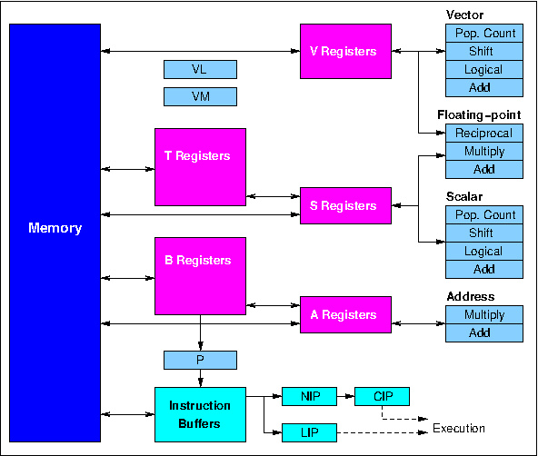

## HASE Simulation Model of the Cray-1

The Cray-1 was the logical successor to the CDC 7600. The instruction issue bottleneck in the 7600 which prevented floating-point operations from being executed at a rate in excess of 1 per clock was overcome in the CRAY-1 processor by the use of vector orders, which caused streams of up to 64 data elements to be processed as a result of one instruction issue. Vectors were contained in a set of eight V registers, each capable of holding 64 elements (each of 64 bits), and a typical vector instruction caused sets of operands to be taken from two V registers and the results to be returned to a third.

This document describes the design of the Cray-1 central processor and explains how the HASE simulation model works. The model contains three
demonstration programs, all held in a Programs entity. The GLOBALS parameter <b>Program</b> can be edited after the model has been loaded into HASE, allowing the user to choose which of the programs to run.

The model files be downloaded from cray1_v1.2.zip.

*This Cray 1 model was originally built as an MSc project by Helen Berringer in 1998. It has since been considerably revised by Roland Ibbett.*

Instructions on how to use HASE models can be found at Downloading, Installing and Using HASE. 

### Design of the Cray-1

Much of the description of the Cray-1 given here is taken from [2] which itself drew heavily on the material provided in the Cray1 Hardware Reference Manual [1]. *(To avoid tortuous grammatical constructs, much of the description is written in the present tense, even though there are no longer any real Cray-1s in operation.)*

Vectors are contained in a set of eight V registers, each capable of holding 64 elements (each of 64 bits), and a typical vector instruction causes sets of operands to be taken from two V registers and the results to be returned to a third. In the following instruction sequence:

V0 &#8592; V1 + V2  
V3 &#8592; V4 * V5

the second instruction uses different registers and a different functional unit from the first and can be issued one clock period after the first instruction. Subsequent to the pipeline start-up delays in the functional units (each of which can carry out operations at a rate of one per clock period), a floating-point result will appear from both the adder and the multiplier in each successive clock period. Thus if performance is estimated in terms only of floating-point addition and multiplication, the maximum floating-point execution rate is 2 FLOPS/CLOCK. Furthermore, around 60 other instructions can be issued before these units require further instructions to keep them busy. With a clock period of 12.5 ns, 2 FLOPS/CLOCK corresponds to 160 MFLOPS.

The other serious bottleneck in the CDC 7600 architecture was the entry of results into the X registers, which was also limited to one per clock period. In the Cray-1 each vector register has its own input multiplexer circuitry for selecting results from among the seven functional units which can produce vector results and, correspondingly, each vector functional unit has its own input multiplexers for selecting vector register operands. Without these circuits the Cray-1 would also be limited to 1 FLOP/CLOCK.

The overall design of the Cray-1 processor is shown in Figure 1. In addition to the eight 64-element V registers, there are eight 64-bit S (scalar) registers and eight 24-bit A (address) registers (corresponding to the X and A registers in the CDC 6600 and 7600), together with 64 B registers (each of 24 bits) and 64 T registers (each of 64 bits). The B and T registers are used in a different way from any of the registers in the 6600 and 7600, however, in that they act as buffer stores for A and S register values, respectively. The functional units take their input operands from the A, S and V registers only, and only return results to these registers.

**Figure 1. Cray-1 processor organisation**

The A registers are used primarily as address and index registers for scalar and vector memory references, but are also used for loop control, input-output operations and to provide values for shift counts. An A register can be loaded either from a B register or direct from memory, while the B register contents can be transferred to or from memory in block copy operations which proceed at a rate of one per clock period. The S registers contain scalar operands, which may be used in scalar operations in the same way that X register values are used in the 6600 and 7600, but an S register in the Cray-1 may also supply a scalar value required for a vector operation. S register values may be transferred to or from memory or the T registers, the latter allowing intermediate results of complex computations to be held in fast buffers rather than main memory. T register values can be transferred to or from memory in the same way as B register values.

The instruction format used in the Cray-1 (Figure 2) is very similar to that used in the CDC 6600 and 7600, except that the major function field (g) contains four bits rather than three, and instructions are therefore 16 or 32 bits long rather than 15 or 30. The extra function bit allows vector as well as scalar operations to be specified, and a typical vector instruction takes the form:

Vi &#8592; Vj + Vk

  
implying that successive elements of Vk are to be added to successive elements of Vj, and the results returned as successive elements of Vi. Instructions which cause the transfer of an operand between A and B or S and T registers use the combined j and k fields to specify the B or T register.  The j and k fields are also combined to produce shift counts in shift instructions. Instructions are issued by the control logic associated with the CIP (Current Instruction Parcel) register. In the case of a 2-parcel (32-bit) instruction, the m field is taken from the LIP (Lower Instrucion Parcel) register, which is filled from the Instruction Buffers concurrently with the NIP (Next Instruction Parcel) register.

**Figure 2. Cray-1 instruction formats**

Instructions which use immediate (literal) operands use the 32-bit format and combine the j, k and m fields to produce a 22-bit literal value. Memory referencing instructions similarly combine the j, k and m fields to produce a 22-bit memory address, and also use the h field to specify an A register for indexing. (The memory itself is an 8-way or 16-way interleaved 50 ns cycle-time semiconductor store containing 0.5M, 1M, 2M or 4M words according to the configuration.) Branch instructions combine the i, j, k and m fields to produce a 24-bit memory address field, allowing any 16-bit instruction parcel within a 64-bit word to be specified.

In addition to the operating and buffer registers, the Cray-1 processor also contains several additional registers which support the control of program execution: the program counter (P), the Vector Mask register (VM) and the Vector Length register (VL). The VM register contains 64 bits, one per element position in the vector registers. In merge operations each bit in VM is used to select the corresponding element of one or other source vector for copying into the destination vector, while in test operations bits in VM are set according to whether or not corresponding elements in a source vector satisfy the chosen condition. The VL register contains a number in the range 0 to 64 and determines how many vector elements take part in an operation. In the case of an operation on a 150-element vector, for example, the hardware would be required to treat this as two successive 64-element operations (with VL = 64) followed by a 22-element operation (with VL = 22).

### The Simulation Model

The HASE user interface window contains three panes, as shown in Figure 3, where the simulation model of the Cray-1 is displayed in the main (right hand) Project View pane. Parameters of the model (*e.g.* register and store contents) are displayed in the (left hand) Project Inspector pane while the lower, Output pane shows information produced by HASE when the model is compiled and run. The icons in the top row allow the user to load a model, compile it, run the simulation code thus created and to load the trace file produced by running a simulation back into the model for animation.

Also shown are two entities that form part of the model rather than the Cray-1 itself, *i.e.* the standard HASE Clock entity and a Programs entity.  The Programs entity contains two arrays, one for instructions and one for (integer) data.  Because memories in HASE are implemented as C++ arrays, the type-checking in C++ means that it is not possible to mix different types of element in a single array.  The Memory has therefore been implemented as an array of 16-character hexadecimal words and at the start of a simulation the contents of the two arrays in the Progam entity are converted into 16-character hexadecimal format and copied into the Memory.

The Programs entity was introduced to allows users to create code in readable Cray-1 format while keeping the Memory as a single array (in most other HASE models, the memories are implemented using separate arrays for code and data). The problem of floating-point remains, however, as in other HASE models. In principle, users could convert all their code and data into 16-character hexadecimal format, thus allowing instructions, fixed-point (integer) values and floating-point (real) values all to be held in the single Memory, but in the current version of the model, the presence of the Programs entity means that only integer data values are allowed.

When downloaded, the Programs entity contains three programs, held in the **PROGRAMS.prog_mem.mem** file. After loading the project, the user can choose which program to run by editing the GLOBALS parameter **Program** and updating the model's parameter file by clicking the "Write Parameters" button 
. Users can add a program of their own, as Program 4, in the **PROGRAMS.prog_mem.mem** file, starting at locations 1536. Program 1 requires no data and Programs 2 and 3 use the same data held in the **PROGRAMS.data_mem.mem** file. 

**Figure 3. Cray-1 simulation model loaded into HASE**

Once a trace file has been loaded, the animation control icons at the top of the Project View pane become active, as shown in Figure 4. From left to right, these allow the animation to be rewound, stopped, paused, single stepped, run or fast forwarded to the end. As the animation proceeds, packets of information can be seen passing between entities while the entities themselves change colour to reflect their states (idle, busy, waiting). The vector registers (individually identified as small rectangles) can be in one of three states:
*idle* , *reserved* , *chained* . Right clicking on one of these vector register icons pops the corresponding register contents list out of the Project Inspector pane, as it does for the A, B, S and T registers.  Demonstration Program 3, described below, shows how the <i>chaining</i> mechanism operates.

**Figure 4. Cray-1 simulation model during animation**

Table 1 shows the instruction in the Cray-1 instruction set that have been implemented in the HASE model while Table 2 shows those instructions that have not (yet) been implemented, mostly because they are specific to the implementation of floating-point numbers. More instructions may be implemented in future versions.

**Table 1. Cray-1 instructions implmented in the model**

**Table 2. Cray-1 instructions not implmented in the model**

### Demonstration Program 1
#### Instruction Buffers &amp; Branch Instructions

The Cray-1 processor obtains its instructions from a set of instruction buffers(Figure 5).  Demonstration Program 1 (Table 3) is essentially a test program that checks that the Instruction Buffers and the branch instructions are working correctly. Each of the four buffers holds 64 consecutive 16-bit instruction parcels, and if an instruction request cannot be satisfied from within these buffers, a full 64-parcel block of instructions is transferred from main store into one of them.  A new instruction is accessed whenever the P register (program counter) is updated. For sequential instructions this occurs as an instruction parcel enters the Next Instruction Parcel register (NIP).  From NIP the instruction parcel is copied into the Current Instruction Parcel register (CIP), where it waits to be issued. In the case of a 32-bit instruction the second parcel iscontained in the Lower Instruction Parcel register (LIP) which is loaded in parallel with NIP.

**Figure 5. Cray-1 Instruction Buffers**

The Cray-1 has a 22-bit instruction address and the first instruction parcel in a buffer always has an address starting on a 64-parcel address boundary. Any one buffer is therefore defined by the 16 most significant bits of a parcel address, and for each buffer there is a 16-bit Bank Address Register containing this value. At each clock cycle the high order bits of the program address counter are compared with the contents of these registers. If a match occurs the required instruction parcel is selected from within the appropriate buffer either immediately, if the buffer concerned is the same as the one which supplied the previous parcel, or after a two clock period delay if a change of buffers is involved.

If no match occurs, instructions must be loaded into one of the instruction buffers before execution can continue. A two-bit counter is used to determine which buffer is to be loaded; this counter is incremented by one whenever a load operation occurs, thus implementing a cyclic replacement algorithm. The 64-bit main store in the Cray-1 is an 8-way or 16-way interleaved bipolar semiconductor store having a 50 ns cycle time. During a block transfer all other store requests are inhibited, and sequential accesses can be made at a rate of one per 12.5 ns clock period. In the case of transfers to an instruction buffer, four storage banks can be accessed in parallel, giving access to 16 instruction parcels in one cycle and allowing all 16 banks in a 16-bank configuration to be accessed in four clock periods. Since the cycle time is also equal to four clock periods, the first four banks are then ready to accept a further request, and a complete block transfer to an instruction buffer occupies four cycles of each bank. The total time required to access the first group of instruction parcels is nevertheless quite long, and a 14 clock period delay is incurred whenever a buffer has to be loaded.  This delay is constant regardless of the position of the first parcel required from the buffer, so the first group of 16 parcels delivered to the buffers is always the one required immediately by the processor.  Subsequent groups arrive at a rate of 16 parcels per clock period and fill the buffer circularly.

When a branch is taken the new value in the program address counter is compared with the contents of the buffer starting address registers in exactly the same way as it is following execution of instructions in sequence.  If a match occurs the required instruction is selected from the appropriate buffer, and if not a block transfer is initiated. Separate subroutines, or even non-contiguous segments of code within a loop, may be held concurrently in separate buffers.

#### Instruction Issue

An instruction in CIP is issued when the conditions in the function units and operating registers are such that the instruction can be carried through to completion without conflicting with any previously issued, but as yet uncompleted instructions. In a single clock period, any number of the V registers can accept a result but only one A register and one S register can do so. Issue of an instruction is therefore delayed if it would cause a result to arrive at either of the S or A registers at the same time as a result from an instruction previously issued to a different function unit. Furthermore, an instruction cannot be issued if it requires as an input operand the content of a register that is awaiting a result from an as yet uncompleted instruction (the well known Read-After-Write problem).

To meet these requirements, the Cray-1 uses a reservation mechanism (similar to that used in the CDC 7600). When an instruction is issued that will deliver a new result to a V, S or A register, a reservation is set for that register which prevents the issuing of any subsequent instruction requiring the use of that register until the result has been delivered. In the model, the reservations on the S and A registers are displayed in two ways: (1) in the Project View pane by the presence of an "R" under the relevant register number; (2) in the CIP section of the Parameters pane by the presence of a function unit identifying letter ("A" for Add, <i>etc</i>) in the S_entries/A_entries queues, which show the progress of the instruction through the relevant function unit pipeline. The reservation mechanism for the V registers is more complex, as explained below in the section describing Demonstration Program 3.

The first action that occurs at the start of a simulation is the P Register sending its current value to the Instruction Buffers (effectively a branch, to location 0 in this case).  Initially the Bank Address Registers are set to all 1's while the buffers themselves are all empty. The Instruction Buffers therefore send a request to Memory. When the first 16 instruction parcels arrive from Memory, they are loaded into Instruction Buffer 0 and the instruction at address 0 is sent to NIP and thence to CIP.  The first 4 instructions set up values in registers A0 - A3 for use in later instructions in the progaram. The next instruction is a conditional branch instruction, for which the condition is not satisfied, so doesn't branch. This is shown to be the case by the execution of the next instruction which increments A2. The instruction after this is a conditional branch for which the condition is satisfied, so does branch, to an instruction that is not in Buffer 0. This causes a second request to Memory and the returned instructions to be loaded into Buffer 1.

Subsequent instructions check for correct *branch/no branch* outcomes of all the different conditional and unconditional branch instructions and for correct operation of the buffers. In Table 3 each branch from/to pair in the program is highlighted in a different colour. Entries in the **IB Action** column show the actions that occur in the Buffers each time P is updated by a branch instruction.

The last instruction to be executed is an 004 (*normal exit*) instruction that stops the simulation. The *ijk* fields of an 004 instruction are ignored in the Cray-1 itself but this simulation model uses the *ijk* value to report which instance of the 004 instruction in the program ended the simulation. In this case the report should be "Simulation stopped by 004 instruction 0". At the end of the simulation the value in A2 should be 13, while the value in A3 should be unaltered, *i.e.* 0.

**Table 3. Demonstration Program 1**

### Demonstration Program 2
#### Block Transfer, Address & Scalar instructions

The Block Transfer instructions 034-037 (Memory to B Registers, B Registers to Memory, Memory to T Registers, T Registers to Memory) use the value in A0 as the starting address in memory and the value of *jk* as the starting register number to transfer the number of words given by the value in A<i>i</i> from/to Memory and the B/T registers. If register B77/T77 is reached before all (A<i>i</i>) values have been transferred, processing continues at B00/T00.

Transfers between the B/T registers and the A/S registers use the *i* field to select the A/S register and *jk* to select the B/T register. Transfers to/from the Vector Mask (VM) register use the *j*/*i* field respectively to select an S register.

#### The Address Units

The Address Add and Address Multiply Units perform 24-bit 2's complement integer arithmetic on operands obtained from the A registers and both return their results to an A register. The Address Add Unit (which performs both addition and subtraction) is pipelined into two stages. The Address Multiply Unit is pipelined into six stages; it produces as its result the least significant 24 bits of the integer product of two 24-bit operands. Address multiplication is frequently used in the handling of multi-dimensional arrays.

#### The Scalar Units

The Scalar Add, Scalar Shift and Scalar Logical Units perform operations on 64-bit operands taken from S registers and each delivers a 64-bit result to an S register. The Scalar Add Unit performs 2's complement integer addition and subtraction and is pipelined into three stages. The Scalar Shift Unit performs single and double-length shifts on one or two S register operands, the former requiring two clock periods and the latter three (only single-length shifts have so far been implemented in the model). The Scalar Logical Unit produces its results in one clock period.  It performs Logical Product (AND), Logical Sum (OR) and Logical Difference (Non-equivalence) operations.

The fourth unit in this group is the Population and Leading Zero Count Unit which takes a 64-bit operand from an S register and returns a 7-bit result, equal to the number of ones in the operand or the number of zeros preceding the most significant 1 in the operand, to an A register. The first of these operations requires four clock periods for its execution, and the second three.

<table border>
<tr><td><b>P</b></td><td><b>&nbsp;g &nbsp;h i j k </b></td><td><b>Instruction</b></td><td><b>Result</b></td></tr>
<tr><td></td><td></td><td colspan=2><i>Integer values are shown in black, hexadecimal values in blue</i></td></tr>
<tr><td>00</td><td>02 0 0 0 0</td><td> Transmit jkm to A0 </td><td>  </td></tr>
<tr><td>01</td><td>00 0 4 0 0</td><td> <b> m</b> field  </td><td>A0 = 256</td></tr>
<tr><td>02</td><td>02 2 1 1 0</td><td> Transmit jk to A1 </td><td> A1 = 8 </td></tr>
<tr><td>03</td><td>03 4 1 7 4</td><td> Block transfer: Memory to B registers</td><td> B60-63 = 128-131, B00-03 = 132-135</td></tr>
<tr><td>04</td><td>02 4 2 7 4</td><td> Transmit (B60) to A2 </td><td> A2 = 128</td></tr>
<tr><td>05</td><td>02 4 3 7 5</td><td> Transmit (B61) to A3 </td><td> A3 = 129</td></tr>
<tr><td>06</td><td>03 2 4 2 3</td><td> Integer product of (A2) and (A3) to A4 </td><td> A4 = 16512</td></tr>
<tr><td>07</td><td>03 0 5 0 3</td><td> Integer sum of (A0) and (A3) to A5 </td><td> A5 =129 [A0 = 0]</td></tr>
<tr><td>08</td><td>03 0 6 4 0</td><td> Integer sum of (A4) and (A0) to A6 </td><td> A6 =16513 [A0 = 1]</td></tr>
<tr><td>09</td><td>03 0 7 4 5</td><td> Integer sum of (A4) and (A5) to A7 </td><td> A7 =16641 </td></tr>
<tr><td>0A</td><td>02 5 6 0 4</td><td> Transmit (A6) to B04 </td><td>B04 = 16513 </td></tr>
<tr><td>0B</td><td>02 5 7 0 5</td><td> Transmit (A7) to B05 </td><td>B05 =16641 </td></tr>
<tr><td>0C</td><td>02 1 4 0 1</td><td> Transmit ~jkm to A4 </td><td>  </td></tr>
<tr><td>0D</td><td>00 0 0 7 1</td><td> <b> m</b> field </td><td>A4 = -65594</td></tr>
<tr><td>0E</td><td>02 5 4 0 6</td><td> Transmit (A4) to B06 </td><td>B06 = -65594 </td></tr>
<tr><td>0F</td><td>03 1 4 7 6</td><td> Integer difference of (A7) and (A6) to A4  </td><td> A4 = 128</td></tr>
<tr><td>10</td><td>02 5 4 0 7 </td><td> Transmit (A4) to B07 </td><td>B07 = 128 </td></tr>

<tr><td>11</td><td>04 0 1 0 0</td><td> Transmit jkm to S1 </td><td>  </td></tr>
<tr><td>12</td><td>00 0 0 0 1</td><td> <b> m</b> field </td><td> S1 = 1 </td></tr>
<tr><td>13</td><td>04 0 2 5 2</td><td> Transmit jkm to S2 </td><td> </td></tr>
<tr><td>14</td><td>01 0 5 7 5</td><td> <b> m</b> field </td><td> S2 = 2756989 </td></tr>
<tr><td>15</td><td>04 1 3 0 0</td><td> Transmit ~jkm to S3 </td><td> </td></tr>
<tr><td>16</td><td>00 0 0 0 1</td><td> <b> m</b> field </td><td> S3 = -2 </td></tr>
<tr><td>17</td><td>02 6 1 1 0</td><td> Population count of S1 to A1 </td><td> A1 = 1 </td></tr>
<tr><td>18</td><td>02 7 2 1 0</td><td> Leading zero count of S1 to A2 </td><td> A2 = 63 </td></tr>
<tr><td>19</td><td>02 6 3 2 0</td><td> Population count of S2 to A3 </td><td> A3 = 11 </td></tr>
<tr><td>1A</td><td>02 7 4 2 0</td><td> Leading zero count of S2 to A4 </td><td> A4 = 42 </td></tr>
<tr><td>1B</td><td>02 6 5 3 0</td><td> Population count of S3 to A5 </td><td> A5 = 63 </td></tr>
<tr><td>1C</td><td>02 7 6 3 0</td><td> Leading zero count of S3 to A6 </td><td> A6 = 0 </td></tr>
<tr><td>1D</td><td>02 3 7 2 0</td><td> Transmit S2 to A7 </td><td> A7 = 2756989  </td></tr>
<tr><td>1E</td><td>02 5 1 1 0</td><td> Transmit (A1) to B08 </td><td>B08 = 1 </td></tr>
<tr><td>1F</td><td>02 5 2 1 1</td><td> Transmit (A2) to B09 </td><td>B09 = 63 </td></tr>
<tr><td>20</td><td>02 5 3 1 2</td><td> Transmit (A3) to B10 </td><td>B10 = 11 </td></tr>
<tr><td>21</td><td>02 5 4 1 3</td><td> Transmit (A4) to B11 </td><td>B11 = 42 </td></tr>
<tr><td>22</td><td>02 5 5 1 4</td><td> Transmit (A5) to B12 </td><td>B12 = 63 </td></tr>
<tr><td>23</td><td>02 5 6 1 5</td><td> Transmit (A6) to B13 </td><td>B13 = 0 </td></tr>
<tr><td>24</td><td>02 5 7 1 6</td><td> Transmit (A7) to B14 </td><td>B14 = 2756989 </td></tr>
<tr><td>25</td><td>02 0 0 0 0</td><td> Transmit jkm to A0 </td><td>  </td></tr>
<tr><td>26</td><td>00 0 6 0 0</td><td> <b> m</b> field </td><td>A0 = 384</td></tr>
<tr><td>27</td><td>02 2 1 1 3</td><td> Transmit 11 to A1 </td><td> A1 = 11 </td></tr>
<tr><td>28</td><td>03 5 1 0 4</td><td> Block transfer: B registers to Memory  </td><td>M[384-394] = (B04-14) </td></tr>

<tr><td>29</td><td>02 0 0 0 0</td><td> Transmit jkm to A0 </td><td>  </td></tr>
<tr><td>2A</td><td>00 0 4 1 5</td><td> <b> m</b> field </td><td>A0 = 269</td></tr>
<tr><td>2B</td><td>02 2 1 0 4</td><td> Transmit jk to A1 </td><td> A1 = 4 </td></tr>
<tr><td>2C</td><td>03 6 1 0 0</td><td> Block transfer: Memory to T registers</td><td> T00-03 = 141, 142, 143, 256</td></tr>
<tr><td>2D</td><td>07 4 0 0 0</td><td> Transmit (T00) to S0 </td><td> S0 = 141</td></tr>
<tr><td>2E</td><td>07 4 1 0 1</td><td> Transmit (T01) to S1 </td><td> S1 = 142</td></tr>
<tr><td>2F</td><td>06 0 3 0 1</td><td> Integer sum of (S0) and (S1) to S3 </td>
 <td> S3 = 142 [S0 = 0] </td></tr>
<tr><td>30</td><td>07 4 2 0 2</td><td> Transmit (T02) to S2 </td><td> S2 = 143</td></tr>
<tr><td>31</td><td>06 0 4 1 2</td><td> Integer sum of (S1) and (S2) to S4 </td>
 <td> S4 = 285 </td></tr>
<tr><td>32</td><td>06 1 5 3 4</td><td> Integer difference of (S3) and (S4) to S5 </td>
 <td> S5 = -143 </td></tr>
<tr><td>33</td><td>07 5 3 1 0</td><td> Transmit (S3) to T08 </td><td> T08 = 142 </td></tr>
<tr><td>34</td><td>07 5 4 1 1</td><td> Transmit (S4) to T09 </td><td> T09 = 285 </td></tr>
<tr><td>35</td><td>07 5 5 1 2</td><td> Transmit (S5) to T10 </td><td> T10 = -143 </td></tr>

<tr><td>36</td><td>04 0 1 2 5</td><td> Transmit jkm to S1</td><td> </td></tr>
<tr><td>37</td><td>25 2 5 2 5</td><td><b>m</b> field </td>
 <td>S1 = 0000000000155555</td></tr>
<tr><td>38</td><td>05 1 2 0 1</td><td> Logical sum of (S0) and (S1) to S2 </td>
 <td>S2 = 0000000000155555 [S0 = 0]</td></tr>
<tr><td>39</td><td>05 4 2 2 6</td><td>Shift (S2) left 22 places to S2</td>
 <td>S2 = 0000055555400000 </td></tr>
<tr><td>3A</td><td>05 1 2 2 1</td><td>Logical sum of (S2) and (S1) to S2</td>
 <td>S2 = 0000055555555555 </td></tr> 
<tr><td>3B</td><td>05 4 2 2 6</td><td>Shift (S2) left 22 places to S2</td>
 <td>S2 = 5555555555400000 </td></tr> 
<tr><td>3C</td><td>05 1 2 2 1 </td><td>Logical sum of (S2) and (S1) to S2</td>
 <td>S2 = 5555555555555555 </td></tr> 
<tr><td>3D</td><td>00 3 0 2 0</td><td>Transmit (S2) to vector mask</td>
 <td>VM = 5555555555555555 </td></tr> 
<tr><td>3E</td><td>07 3 3 0 0</td><td>Transmit (VM) to S3</td>
 <td>S3 = 1431655765 </td></tr>
<tr><td>3F</td><td>05 3 3 3 0</td><td>Shift S3 right 64-24 places to S0</td><td>S0 = 5592405</td></tr>
<tr><td>40</td><td>05 5 3 2 1</td><td>Shift S3 right 64-17 places to S3</td>
 <td>S3 =  000000000000AAAA</td></tr>
<tr><td>41</td><td>07 5 0 1 3</td><td> Transmit (S0) to T11 </td><td> T11 = 5592405 </td></tr>
<tr><td>42</td><td>07 5 3 1 4</td><td> Transmit (S3) to T12 </td><td> T12 = 170 </td></tr>
<tr><td>43</td><td>05 2 4 0 4</td><td> Shift (S4) left jk places to S0 </td><td> S0 = 4560 </td></tr>
<tr><td>44</td><td>07 5 0 1 5</td><td> Transmit (S0) to T13 </td><td> T13 = 4560 </td></tr>
<tr><td>45</td><td>04 2 1 6 3</td><td> Form 64-51 bits of 1's mask in S1 from right </td>
 <td> S1 = 0000000000001FFF </td></tr>
<tr><td>46</td><td>04 3 2 6 6</td><td> Form 54 bits of 1's mask in S2 from left </td><td> S2 = -1024 </td></tr>
<tr><td>47</td><td>04 4 4 1 3</td><td> Logical product of (S1) and (S3) to S4 </td>
 <td> S4 = 0000000000000AAA </td></tr>
<tr><td>48</td><td>04 5 5 1 3</td><td> Logical product of (S1) and ~(S3) to S5 </td>
 <td> S5 = 0000000000001555</td></tr>
<tr><td>49</td><td>04 6 6 1 3</td><td> Logical difference of (S1) and (S3) to S6 </td>
 <td> S6 = 000000000000B555</td></tr>
<tr><td>4A</td><td>04 7 7 1 3</td><td> Logical equivalence of (S1) and (S3) to S7 </td>
 <td> S7 = FFFFFFFFFFFF4AAA</td></tr>
<tr><td>4B</td><td>07 5 1 1 6</td><td>Transmit (S1) to T14</td><td>T14 = 8191</td></tr>
<tr><td>4C</td><td>07 5 2 1 7</td><td>Transmit (S2) to T15</td><td>T15 = -1024</td></tr>
<tr><td>4D</td><td>07 5 3 2 0</td><td>Transmit (S3) to T16</td><td>T16 = 43690</td></tr>
<tr><td>4E</td><td>07 5 4 2 1</td><td>Transmit (S4) to T17</td><td>T17 = 2730</td></tr>
<tr><td>4F</td><td>07 5 5 2 2</td><td>Transmit (S5) to T18</td><td>T18 = 5461</td></tr>
<tr><td>50</td><td>07 5 6 2 3</td><td>Transmit (S6) to T19</td><td>T19 = 46421</td></tr>
<tr><td>51</td><td>07 5 7 2 4</td><td>Transmit (S7) to T20</td><td>T20 = -46422</td></tr>
<tr><td>52</td><td>02 0 0 0 0</td><td>Transmit jkm to Ai </td><td> </td></tr>
<tr><td>53</td><td>00 0 6 2 0</td><td><b> m</b> field  </td><td>A0 = 400 </td></tr>
<tr><td>54</td><td>02 2 1 1 5</td><td>Transmit jk to A1  </td><td>A1 = 13 </td></tr>
<tr><td>55</td><td>03 7 1 1 0</td><td>Block Transfer (A1) T registers to memory</td><td>M[400-412] = (T08-20)</td></tr>
<tr><td>56</td><td>10 2 6 0 0</td><td>Read from ((A2) + jkm) to A6</td><td> </td></tr>
<tr><td>57</td><td>00 0 3 5 3</td><td><b>m</b> field</td><td>A6 = M[298] = 394</td></tr>
<tr><td>58</td><td>11 6 7 0 0</td><td>Store (A7) to (A6) + jkm </td><td> </td></tr>
<tr><td>59</td><td>00 0 0 0 1</td><td><b>m</b> field</td><td>M[395] = 2A117D</td></tr>
<tr><td>5A</td><td>12 2 6 0 0</td><td>Read from ((A2) + jkm) to S1 </td><td> </td></tr>
<tr><td>5B</td><td>00 0 3 5 4</td><td><b>m</b> field</td><td>S1 = M[299] = 395</td></tr>
<tr><td>5C</td><td>13 6 7 0 0</td><td>Store (S7) to (A6) + jkm </td><td> </td></tr>
<tr><td>5D</td><td>00 0 0 0 2</td><td><b>m</b> field</td><td>M[396] = FFFFFFFFFFFF4AAA</td></tr>
<tr><td>5E</td><td>00 4 0 0 0</td><td> Stop </td><td> </td></tr>
</table>
<b>Table 4. Demonstration Program 2 </b>

### Demonstration Program 3
### Vector Instructions

#### Vector Register Reservations

Whilst a vector operation is being executed, a reservation is set not only for the result register but also for the operand register(s). The need for these reservations arises from the nature of the integrated circuits used in the construction of the V registers. These each contain 16 x 4 bits, representing 4 data bits in each of 16 vector register elements, and only one set of 4 bits can be accessed in any one clock period. If two vector instructions using the same operand V registers were in progress at the same time, they would require access to two different elements simultaneously. Similarly, in the case of a result register it is impossible to read one element from within a vector register while a new value is being written into another element. These reservations do not apply to S registers taking part in vector operations or to the VL register, since their values are copied into the unit carrying out the operation when the instruction is issued.

The only other exception to these reservation requirements occurs when an element value which is being delivered to a vector register can, in the same clock period, be routed to another functional unit as an input operand. This arrangement allows *chaining* of vector operations.  Chaining starts when a match occurs between one of the V register operand designators of an instruction awaiting issue in CIP, and the V register result designator of a previously issued instruction which has not yet returned its first result element. When this element becomes available for delivery to the result register, the instruction in CIP is issued (provided there are no other hold-ups) and the result element is forwarded with this instruction to the appropriate functional unit. Successive elements follow until the whole vector has been both written into its result register and forwarded to the second functional unit. The results of this second vector operation may themselves be chained into a third operation, and so on, as shown in the following example:

V0 &#8592;  Memory  
V1 &#8592;  Memory  
V2 &#8592; S1 * V1  
V3 &#8592; V0 + V2

Assuming that VL is set to 64, the first instruction causes 64 operands from a designated area in memory to be read out and copied in sequence into the 64 element positions in V0. Store requests are pipelined in such a way that the store appears to the processor as a pseudo functional unit. Thus after a start-up delay of seven clock periods, the first element of the vector from store becomes available for delivery to V2, and successive elements follow in successive clock periods.

The second instruction can only be issued once the first instruction has completed because only one vector element at a time can be read from Memory.  In the clock period following the issue of the second instruction, the third instruction in the sequence is copied into CIP, but the reservation on V1 prevents it from being issued immediately. This reservation is lifted, however, allowing the instruction to issue, during the clock period in which the first vector element arrives from Memory ready for delivery to V1. This clock period is known as chain slot time. Chaining allows the vector elements being copied into V1 to flow directly from the memory read pipeline into the Floating-point Multiply Unit pipeline, where each element is multiplied by the value taken from S1 at the start of the operation, to produce the vector V2.

The fourth instruction in the sequence becomes ready for issue in the clock period following issue of the third instruction, and it too is held up by a reservation on one of its input operands, this time V2. When the first element of V2 appears from the Floating-point Multiply Unit, the reservation on V2 is lifted, allowing this fourth instruction to issue. Now the elements emanating from the Floating-point Multiply Unit can flow directly into the Floating-point Add Unit pipeline as well as into the result register V2. Thus the memory read pipeline, and the Floating-point Multiply and Floating-point Add Unit pipelines are all chained together to produce the elements of V3. One of the reasons why this works is that the memory and the functional units can each deliver a new result in each successive clock period.

In Program 3 in the model, the instruction at P = 02 sets VL to 16 (to avoid the tedium of watching 64-element operations), while the 4 instructions described above are at P = 05 and P = 0A - 0C. The instructions at P = 06 - 09 can proceed whilst the transfer from Memory to V1 is in progress, since they don't involve any Memory accesses. Likewise, the instruction at P = 0D, which sets A0 equal to the Memory start address for the subsequent block transfer of V5 to Memory, can proceed whilst the floating sums operation is in progress, but the block transfer itself cannot be chained to the floating sums operation because the first action of a block transfer instruction, at chain slot time, is the transfer of the start address in A0 to the Vector Registers, not the first transfer of a data value to Memory.

<table border>
<tr><td><b>P</b></td><td><b>&nbsp;&nbsp;g&nbsp;h&nbsp;i&nbsp;j&nbsp;k&nbsp; </b></td><td><b>Instruction</b></td><td><b>Result</b></td></tr>
<tr><td></td><td></td><td colspan=2><i>Integer values are shown in black, hexadecimal values in blue</i></td></tr>

<tr><td>00 </td><td>02 2 1 2 0</td><td> Transmit jk to A1 </td><td> A1 = 16</td></tr>
<tr><td>01 </td><td>02 2 2 0 1</td><td> Transmit jk to A2 </td><td> A2 = 1</td></tr>
<tr><td>02 </td><td>00 2 0 0 1</td><td> Transmit (A1) to VL </td><td> VL = 16</td></tr>
<tr><td>03 </td><td>02 0 0 0 0</td><td> Transmit jkm to A0 </td><td> </td></tr>
<tr><td>04 </td><td>00 0 4 0 0</td><td> <b>m</b> field </td><td> A0 = 256 </td></tr>
<tr><td>05 </td><td>17 6 0 0 2</td><td> Block transfer:  Memory[256-271] to V0  </td>
 <td> V0 = 128, 129, 130, 131, 132, 133, 134, 135, 
&nbsp; &nbsp; &nbsp; &nbsp; &nbsp; 136, 137, 138, 139, 140, 141, 142, 143</td></tr>
<tr><td>06 </td><td>04 0 1 0 0</td><td>Transmit jkm to S1 </td><td> </td></tr>
<tr><td>07 </td><td>00 0 0 0 5 </td><td><b>m</b> field </td><td> S1 = 5 </td></tr>
<tr><td>08 </td><td>02 0 0 0 0</td><td> Transmit jkm to A0 </td><td> </td></tr>
<tr><td>09 </td><td>00 0 4 4 0</td><td> <b>m</b> field </td><td> A0 = 272</td></tr>
<tr><td>0A </td><td>17 6 1 0 2</td><td> Block transfer:  Memory[272-287] to V1  </td>
 <td>V1 = 384, 385, 386, 387, 388, 398, 390, 391, 
&nbsp; &nbsp; &nbsp; &nbsp; &nbsp; 392, 393, 394, 395, 396, 397, 398, 399 </td></tr>
<tr><td>0B </td><td>16 0 2 1 1</td><td> Floating products  (S1) and (V1) to V2  
(<i>V1 chained</i>)</td>
<td> V2 = 1920, 1925, 1930, 1935, 1940, 1945, 1950, 1955, 
&nbsp; &nbsp; &nbsp; &nbsp; &nbsp; 1960, 1965, 1970, 1975, 1980, 1985, 1990, 1995 </td></tr>
<tr><td>0C </td><td>17 1 3 2 0</td><td> Floating sums   (V2) and (V0) to V3  
(<i>V2 chained</i>)</td>
 <td> V3 = 2048, 2054, 2060, 2066, 2072, 2078, 2084, 2090, 
&nbsp; &nbsp; &nbsp; &nbsp; &nbsp; 2096, 2102, 2108, 2114, 2120, 2126, 2132, 2138 </td></tr>
<tr><td>0D </td><td>16 1 4 0 1</td><td> Floating products    (V0) and (V1) to V4   </td><td>
   V4 = 49152, 49665, 50180, 50697, 51216, 51737,  
&nbsp; &nbsp; &nbsp; &nbsp; &nbsp; 52260, 52785, 53312, 53841, 54372, 54905, 
&nbsp; &nbsp; &nbsp; &nbsp; &nbsp; 55440, 55977, 56516, 57057 </td></tr>
<tr><td>0E </td><td>04 0 2 0 0</td><td>Transmit jkm to S2 </td><td> </td></tr>
<tr><td>0F </td><td>15 0 1 0 0 </td><td><b>m</b> field </td><td> S2 = 53312 </td></tr>
<tr><td>10 </td><td>17 2 5 2 4 </td><td> Floating differences   (S2) and (V4) to V5  
(<i>V4 chained</i>)</td>
 <td> V5 = 4160, 3647, 3132, 2615, 2096, 1575, 1052, 527, 
&nbsp; &nbsp; &nbsp; &nbsp; &nbsp; 0, -529, -1060, -1593, -2128, -2665, -3204, -3745</td></tr>
<tr><td>11 </td><td>02 0 0 0 0</td><td> Transmit jkm to A0<td> </td></tr>
<tr><td>12 </td><td>00 0 6 2 0</td><td><b>m</b> field </td><td> A0 = 384 </td></tr>
<tr><td>13 </td><td>17 7 0 5 2</td><td> Block transfer:  V5 to Memory 
(<i>Can't be chained</i>)</td>
<td>Memory[384-399] = (V5) </td></tr>
<tr><td>14 </td><td>04 0 2 0 0 </td><td>Transmit jkm to S2 </td><td> </td></tr>
<tr><td>15 </td><td>00 3 6 3 6 </td><td> <b>m</b> field </td><td> S2 = 1950 </td></tr>
<tr><td>16 </td><td>17 0 6 3 0 </td><td> Floating sums  (S3) and (V0) to V6 </td>
 <td> V6 = 2078, 2079, 2080, 2081, 2082, 2083, 2084, 2085,  
&nbsp; &nbsp; &nbsp; &nbsp; &nbsp; 2086, 2087, 2088, 2089, 2090, 2091, 2092, 2093</td></tr>
<tr><td>17 </td><td>02 0 0 0 0</td><td> Transmit jkm to A0 </td><td> </td></tr>
<tr><td>18 </td><td>00 0 5 0 0</td><td> <b>m</b> field </td><td> A0 = 320 </td></tr>
<tr><td>19 </td><td>17 6 0 0 2</td><td> Block transfer:  Memory[320-335] to V0  </td>
 <td> V0 = 42, -56, 0, -27, 17, 0, -48, 0,  
&nbsp; &nbsp; &nbsp; &nbsp; &nbsp; 89, 0, 127, -96, 0, -45, 74, -25</td></tr>
<tr><td>1A </td><td>17 5 0 0 0</td><td> VM[e] = 1 if (V0[e]) = 0 
(<i>V0 chained</i>)</td>
<td> VM = 2548000000000000</td></tr>
<tr><td>1B </td><td>14 7 3 1 2</td><td> Merge (V1) and (V2) to V3 </td>
 <td> V3 = 1920, 1925, 386, 1935, 1940, 389, 1950, 391, 
&nbsp; &nbsp; &nbsp; &nbsp; &nbsp; 1960, 393, 1970, 1975, 396, 1985, 1990, 1995</td></tr>
<tr><td>1C </td><td>17 5 0 0 1</td><td> VM[e] = 1 if (V0[e]) != 0 </td>
<td> VM = DAB7000000000000</td></tr>
<tr><td>1D </td><td>04 0 4 0 0</td><td>Transmit jkm to S4 </td><td> </td></tr>
<tr><td>1E </td><td>01 2 3 4 5 </td><td><b>m</b> field </td><td> S4 = 5349 </td></tr>
<tr><td>1F </td><td>14 6 4 4 2</td><td> Merge (S4) and (V2) to V4 </td>
 <td> V4 = 5349, 5349, 1930, 5349, 5349, 1945, 5349, 1955, 
&nbsp; &nbsp; &nbsp; &nbsp; &nbsp; 5349, 1965, 5349, 5349, 1980, 5349, 5349, 5349 </td></tr>
<tr><td>20 </td><td>17 5 0 0 2</td><td> VM[e] = 1 if (V0[e]) >= 0 </td>
<td> VM = ADEA000000000000 </td></tr>
<tr><td>21 </td><td>14 7 5 1 2</td><td> Merge (V1) and (V2) to V5 </td>
 <td> V5 = 384, 1925, 386, 1935, 388, 389, 1950, 391, 
&nbsp; &nbsp; &nbsp; &nbsp; &nbsp; 392, 393, 394, 1975, 396, 1985, 398, 1995 </td></tr>
<tr><td>22 </td><td>17 5 0 0 3</td><td> VM[e] = 1 if (V0[e]) < 0 </td>
<td> VM = 5215000000000000 </td></tr>
<tr><td>23 </td><td>14 7 6 1 2</td><td> Merge (V1) and (V2) to V6 </td><td>
V6 = 1920, 385, 1930, 387, 1940, 1945, 390, 1955, 
&nbsp; &nbsp; &nbsp; &nbsp; &nbsp; 1960, 1965, 1970, 395, 1980, 397, 1990, 399 
&nbsp; = 780, 181, 78A, 183, 794, 799, 186, 7A3,  
 &nbsp; &nbsp; 78A, 78D, 7B2, 18B, 7BC, 18D, 7C6, 18F</td></tr>
<tr><td>24 </td><td>15 5 7 4 5</td><td>Integer sums of  (V4) and (V5) to V7 </td>
<td> V7 = 5477, 5734, 516, 5736, 5481, 522, 5739, 526,  
&nbsp; &nbsp; &nbsp; 5485, 530, 5487, 5744, 536, 5746, 5491, 5748 
&nbsp; = 1565, 1666, 0204, 1668, 1569, 020A, 1668, 020E, 
 &nbsp; &nbsp; 156D, 0212, 156F, 1670, 0218, 1672, 1573, 1674
</td></tr>
<tr><td>25 </td><td>04 0 5 0 0</td><td>Transmit jkm to S5 </td><td> </td></tr>
<tr><td>26 </td><td>00 0 7 7 7 </td><td><b>m</b> field </td><td> S5 = 511 1FF </td></tr>
<tr><td>27 </td><td>14 0 3 5 7</td><td> Logical products of  (S5) and (V7) to V3</td>
<td> V3 = 357, 102, 4, 104, 361, 10, 107, 14  
&nbsp; &nbsp; &nbsp; &nbsp; &nbsp; 365, 18, 367, 112, 24, 114, 371, 116 
&nbsp; = 165, 066, 004, 068, 169, 00A, 06B, 00E 
 &nbsp; &nbsp; 16D, 012, 16F, 070, 018, 072, 173, 074
</td></tr>
<tr><td>28 </td><td>15 7 4 5 3</td><td>Integer differences of  (V5) and (V3) to V4  (<i>V3 chained</i>) </td>
<td> V4 = -229, 283, 126, 283, -229, 123, 283, 121, 
&nbsp; &nbsp; &nbsp; &nbsp; &nbsp; -229, 119, -229, 283, 116, 283, -229, 283 </td></tr>
<tr><td>29 </td><td>14 3 5 3 6</td><td>Logical sums of  (V3) and (V6) to V5 </td>
<td> V5 = 485, 231, 390, 235, 493, 399, 239, 399,  
&nbsp; &nbsp; &nbsp; &nbsp; &nbsp; 493, 411, 495, 251, 412, 255, 511, 255</td></tr>
<tr><td>2A </td><td>14 4 2 5 3</td><td>Logical differences of  (S5) and (V3) to V2</td>
<td> V2 = 09A, 199, 1FB, 197, 096, 1F5, 194, 1F1, 
&nbsp; &nbsp; &nbsp; &nbsp; &nbsp; 092, 1ED, 090, 18F, 1E7, 18D, 08C, 18B</td></tr> 
<tr><td>2B </td><td>07 7 0 4 1</td><td> Transmit (S4)  to V0 element (A1) </td><td> V0 element 16 = 5349</td></tr>
<tr><td>2C </td><td>07 6 3 3 2</td><td> Transmit V3  element (A2) to S3 </td><td> S3 = V3 element 1 = 102</td></tr>
<tr><td>2D </td><td>02 2 3 0 4</td><td> Transmit jk to A3 </td><td> A3 = 4 </td></tr>
<tr><td>2E </td><td>15 0 6 5 3</td><td> Single shift of (V5) left  by (A3) places to V6</td>
 <td> V6 = 32336, 7856, 30944, 8084, 32720, 31216,  
&nbsp; &nbsp; &nbsp; &nbsp; &nbsp; 6256, 31408, 32464, 31728, 32752, 6640, 
&nbsp; &nbsp; &nbsp; &nbsp; &nbsp;  32704, 6896, 32624, 7152</td></tr>
<tr><td>2F </td><td>15 1 7 6 0</td><td> Single shift of (V6) right  by 1 place to V7 
(shift by 1 if k = 0)</td>
 <td> V7 = 16168, 3928, 15472, 4024, 16360, 15608, 
&nbsp; &nbsp; &nbsp; &nbsp; &nbsp; 3128, 15704, 16232, 15864, 16376, 3320, 
&nbsp; &nbsp; &nbsp; &nbsp; &nbsp;  16352, 3448, 16312, 3576</td></tr>
<tr><td>30 </td><td>17 4 1 7 1</td><td> Population count   of (V7) to V1 </td>
 <td> V1 = 8, 7, 7, 8, 10, 9, 5, 8, 9, 10, 11, 7, 9, 7, 10, 8 </td></tr>
<tr><td>31 </td><td>17 4 2 7 2</td><td> Population count parities   of (V7) to V2 </td>
 <td> V2 = 0, 1, 1, 0, 0, 1, 1, 0, 1, 0, 1, 1, 1, 1, 0, 0 </td></tr>
<tr><td>32 </td><td>00 4 0 0 0</td><td> Stop </td><td> </td></tr>

</table>
<b>Table 5. Demonstration Program 3 </b>

### References

1. "CRAY-1 Hardware Reference Manual", May 1982
 
Available from <http://www.bitsavers.org/pdf/cray/CRAY-1/>
2. Roland N. Ibbett 
"The Architecture of High Performance Computers" 
*The Macmillan Press*, 1982 
Available from Springer Book Archives at: 
<http://www.springer.com/gb/book/9780387912158?countryCh\
anged=true>

