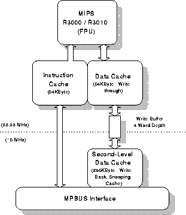
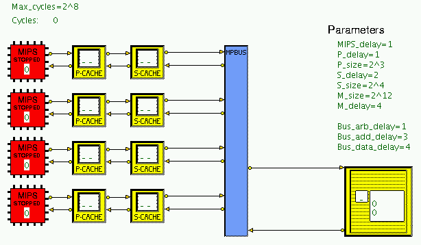
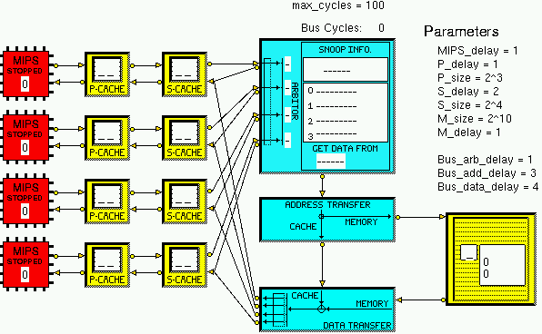

## Stanford DASH Architecture: Cluster Simulation Model

The Stanford DASH architecture was designed to prove the feasibility of building a scaleable high performance machine with multiple coherent caches and a single address space. There are currently two HASE simulation models of parts of the DASH architecture, originally built in 1995/6 by Lawrence Williams as parts of his MSc project, one modelling a single node and one modelling a cluster of four nodes. These models were designed to demonstrate the cache coherency protocols used in the DASH [1]. The Cluster model demonstrates the snoopy bus protocol.

This document describes the DASH architecture and explains how the HASE Cluster model works. The files for this model can be downloaded from https://github.com/HASE-Group/dashclus

Instructions on how to use HASE models can be found at https://github.com/HASE-Group/hase_iii_releases

## The Stanford DASH Architecture 

The DASH architecture [2, 3] was built in the Computer Systems Laboratory at Stanford University. The main motivation underlying its inception was a desire to prove the feasibility of building a scaleable high performance machine with multiple coherent caches and a single address space.  The intention was to produce a parallel architecture offering both ease of programmability (facilitated by the single-address space) and very high performance (by using hundreds to thousands of high performance (low-cost) processors). This architecture has been simulated in HASE as an MSc project and this demonstration is a part of this project.

The DASH hardware is organised as a hierarchy in which sets of processing nodes are grouped together in clusters of four, connected together via a common bus. Clusters are then connected together by an interconnection network.  The DASH cluster is based upon a modified version of the Silicon Graphics POWER Station 4D/340 [4], in which the major components are:

- **Four MIPS R3000 processors** each running at 33MHz (Figure 1). Each processor has two levels of cache memory. The first level has a 64 KByte instruction cache and 64 KByte write-through data cache; the second is a 256 KByte write-back cache. Both caches are direct mapped and use 16-byte cache lines. The first level caches match the processor speed (33MHz) whilst the second level cache matches that of the bus (16MHz).

- **The MPbus**, common to all four processors and utilising a snoopy-based cache coherency protocol. The MPbus is pipelined but does not support split transactions.
- **An I/O interface** for general purpose device handling.
- **Memory** shared between the processors and forming part of the global address space.

The simulation model of the processing node consists of the two data caches and a MIPS `processor' which, rather than attempt to simulate the MIPS instruction set and run programs to generate cache addresses, simply emits a sequence of addresses (with read/write status) held in a notional memory.  

 

**Figure 1. The Stanford DASH Node**

### DASH Cluster Simulation Model

The DASH Cluster simulation model is shown in Figure 2. The model
has a number of size and timing parameters as described below.

 

**Figure 2. The DASH Cluster Simulaton Model**

#### MIPS

The MIPS entity in the model contains an array of addresses to be sent to the Primary Cache. At the start of the simulation, the MIPS sends the first of these addresses, together with its Read/Write type, to the Primary Cache. Once the actions in the cache system are complete and the MIPS has received a reply, it sends the next address, and so on until it encounters an address of type **z**

#### Primary Cache

The primary cache is direct-mapped and operates a write-through/no-write-allocate policy. The line size is fixed at 4 words but the number of lines can be varied from 1 to 256 in multiples of 2 while the delay associated with a cache access can be varied from 1 to 8 clock cycles. As it processes each access, the cache icon displays the result (RH = Read Hit, RM = Read Miss, WH = Write Hit, WM = Write Miss).

The data structure central to the operation of this entity is a HASE memory array which represents the cache memory contents via a C++ based array of structs. This structure specifies storage for valid, modified and shared bits as well as the cache entry tag and stored values:

Valid Modified Shared Tag Block A0 A1 A2 A3

- Valid (1 = valid, 0 = invalid) 
- Modified = 1 indicates that the line has been the target of a write
      but note that this never gets set to 1 in the Primary Cache); 
      0 = Unmodified
- Shared = 1 indicates that there is a copy of the line in another
      cache; 
       Shared = 0 indicates exclusive ownership
- Tag = memory address of cache line
- Block (= address/4) is part of the display, but not part of the model
- A0 A1 A2 A3 are the addresses of the 4 words in the line

This cache line format is shared with the secondary cache unit; the only difference in use is that the primary cache need never use the shared bit. On receipt of an incoming packet a table lookup is performed and validity bit and tag checks are made. If a hit occurs a delay is initiated before sending the result back to the MIPS entity. On a miss the packet is referred (after the miss delay) to the secondary cache entity.

#### Secondary Cache

The secondary level processor cache is identical to the primary cache except that it operates a write-back/write-allocate policy.  As in the Primary Cache, the user can define cache size and latency through the use of entity parameters. 

A line in the Secondary Cache may be:

- Invalid
- Exclusive-Unmodified (EU)
- Shared-Unmodified (SU)
- Exclusive-Modified (EM)

#### The MPBus

In the full model of a cluster the MPBus is one of the most complex entities in the simulation.  It is responsible for displaying a large amount of state information detailing the on-going operation of the snoopy-bus protocol as well as carrying out the conventional tasks of bus arbitration, address and data transfer.

#### The Cluster Memory

The cluster memory is relatively simple in design. Because the simulation is only concerned with modelling the effects of read/writes throughout the system (and not the contents of memory locations) no actual storage needs to be modelled other than that present in the processor caches (and in these only addresses need be stored). Therefore a memory unit cycle consists of receiving an in-bound request, displaying read/write information on-screen and finally transmitting the result packet back onto the MPbus.

#### Parameters

The model has a number of size and timing parameters that can be varied:

| Parameter | Nominal Value |
|:------------|:----------------:|
| MIPS_delay | 1 |
| P_cache_delay | 1 |
| P_cache_size   (256 max) | 8 |
| S_cache_delay | 2 |
| S_cache_size   (1024 max) | 16 |
| M_size | 4096 |
| M_delay | 4 |
| Bus_arb_delay | 1 |
| Bus_add_delay | 3 |
| Bus_data_delay | 4 |

The maximum number of cycles which the model executes can also be varied.  This parameter is included so that if the termination access type is missing from one of the processor input files, the simulation will not run for ever.

### The MP (Multi-Processor) Bus

The MPBus is one of the most complex entities in the simulation.  It is responsible for displaying a large amount of state information detailing the on-going operation of the snoopy-bus protocol as well as carrying out the conventional tasks of bus arbitration, address and data transfer.

The DASH Cluster simulation model is shown in Figure 3  with the bus expanded to show its three separate sections. From top to bottom, these correspond to the phases of:

- Bus Arbitration and Snooping
- Address transfer 
- Data transfer

 

**Figure 3. The DASH Cluster MP Bus**
#### Bus Arbitration and Snooping

The icon representing the bus arbitration and snooping activities of the multiprocessor is the most complex component of the simulation model.

The panel shows the following information:

- **Input Indicator**: (ARBITOR) This shows by use of a small '**<**' symbol which appears on the input line on which the last data request was made

- **Request Type**: This classifies requests as being reads, writes *etc*

- **Data Source Indicator**: (GET DATA FROM) This identifies the source of data during a read operation:  
          <tt>MEMORY</tt>: data will come from the Memory  
          <tt>CACHE</tt>: data will come from another Cache  
          <tt>CAC/WB</tt>: data will come from another Cache and will
          also be written back to Memory

- **Snoop Effect**: The most complex part of the snoop information panel is the four line display in the centre of the icon. These lines give a summary of the snoop activity that occurs in each of the second levels caches. For example if a cache holds an exclusive-unmodified copy of a piece of data and another processor then reads the same item, the display line for this cache would read <tt>SU-(EU)</tt>. This code means the new cache line bit settings (after the snoop activity) reflect a shared-unmodified state. The value in brackets represents the `before' status of the cache line (i.e. exclusive-unmodified). The panel is also used to display the message <tt>INVALIDATION SENT TO ALL CACHES</tt> when a write-invalidate action occurs.

The possible values that the snoop display panel can display are:

1. **Invalid**<tt>(I)</tt>: Block does not contain valid data

2.**Exclusive-Unmodified**<tt>(EU)</tt>: No other cache has this block. Therefore the data in the block is consistent with main memory

3. **Shared-Unmodified**<tt>(SU)</tt>: Some other caches may have this block. Data in this block is once again consistent with main memory

4. **Exclusive-Modified**<tt>(EM)</tt>: No other cache has this block. Data in the block has been modified locally and is therefore inconsistent with main memory.

#### Address Transfer

This icon represents the address transfer stage of the bus cycle. Requests to be satisfied via main memory will be seen leaving this entity on the right hand port, other <tt>cache->cache</tt> transfers will be seen moving out of the bottom port (the fact that a request moves across this cache link implies the value has been obtained from another cache).

#### Data Transfer

This entity simply sends the results of the transfer back to the requesting entity.

### Demonstration

When the model is first loaded, the MIPS entities contain the sequences of accesses shown in the following table :

| MIPS0 | MIPS1 | MIPS2 | MIPS3 |
|:------|:------|:------|:------|
| 01 r d | 17 r d | 38 r d  | 00 r d |
| 01 w d | 17 w d | 39 w d  | 58 r d |
| 00 r d | 00 r d | 100 r d | 57 r d |
| 04 r d | 00 w d | 101 r d | 03 r d |
| 05 r d | 18 r d | 102 r d | 03 w d |
| 00 z d | 00 z d | 00 z d  | 00 z d |

These sequences can be changed by altering the contents of the files:

- <tt>MIPS0.mem_trace.mem</tt>
- <tt>MIPS1.mem_trace.mem</tt>
- <tt>MIPS2.mem_trace.mem</tt>
- <tt>MIPS3.mem_trace.mem</tt>

### References
1. L.M. Williams and R.N. Ibbett,  
"Simulating the DASH architecture in HASE",  
*29th Annual Simulation Symposium*, SCS, pp 137-146, 1996.
2. D.E. Lenoski,  
"The Design and Analysis of DASH: A Scalable Directory-Based Multiprocessor,  
*TR:CSL-TR-92-507 Computer Systems Laboratory: Stanford University*, 1992.
3. D.E. Lenoski, J. Laudon, T. Joe, D. Nakahira, L. Stevens, A. Gupta and J. Hennessy,  
"The DASH Prototype: Implementation and Performance"   
 *19th International Symposium on Computer Architecture*, pp 92-103, May 1992.
4. F. Baskett, T. Jermoluk and D. Solomon.,  
"The 4D-MP Graphics Superworkstation: Computing + Graphics = 40 MIPS + 40 MFLOPS and 100000 Lighted Polygons per Second",  
*Proc. Compcon Spring 88*, pp 468-471, February, 1988.
