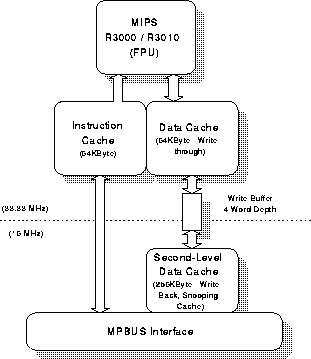
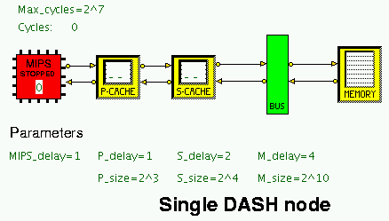
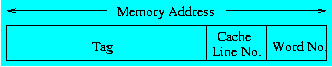

## Stanford DASH Architecture: Node Simulation Model

The Stanford DASH architecture was designed to prove the feasibility of building a scaleable high performance machine with multiple coherent caches and a single address space. There are currently two HASE simulation models of parts of the DASH architecture, originally built in 1995/6 by Lawrence Williams as parts of his MSc project, one modelling a single node and one modelling a cluster of four nodes. These models are designed to demonstrate the cache coherency protocols used in the DASH [1].  The Node model demonstrates a simple 2-level cache arrangement. The files for the HASE DASH Node model can be downloaded from <https://github.com/HASE-Group/hase_iii_models/dashnode/tree/V1.5>

Instructions on how to use HASE models can be found at

### The Stanford DASH Architecture

The DASH architecture [2, 3] was built in the Computer Systems Laboratory at Stanford University. The main motivation underlying its inception was a desire to prove the feasibility of building a scaleable high performance machine with multiple coherent caches and a single address space.  The intention was to produce a parallel architecture offering both ease of programmability (facilitated by the single-address space) and very high performance (by using hundreds to thousands of high performance (low-cost) processors).

The DASH hardware is organised as a hierarchy in which sets of processing nodes are grouped together in clusters of four, connected together via a common bus. Clusters are then connected together by an interconnection network.  The DASH cluster is based upon a modified version of the Silicon Graphics POWER Station 4D/340 [4], in which the major components are:

- **Four MIPS R3000 processors** each running at 33MHz
  (Figure 1).  Each processor has two levels of cache memory.
  The first level has a 64 KByte instruction cache and 64 KByte
  write-through data cache; the second is a 256 KByte write-back
  cache.  Both caches are direct mapped and use 16-byte cache lines.
  The first level caches match the processor speed (33MHz) whilst the
  second level cache matches that of the bus (16MHz).
- **The MPbus**, common to all four processors and utilising a
  snoopy-based cache coherency protocol. The MPbus is pipelined but
  does not support split transactions.
- **An I/O interface** for general purpose device handling.
- **Memory** shared between the processors and forming part of
  the global address space.

The simulation model of the processing node consists of the two data caches and a MIPS `processor' which, rather than attempt to simulate the MIPS instruction set and run programs to generate cache addresses, simply emits a sequence of addresses (with read/write status) held in a notional memory.

**Figure 1. The Stanford DASH Node**

### The HASE DASH Node Model

The HASE DASH Node simulation model is shown in Figure 2. The model has a number of size and timing parameters which can be varied via the HASE GUI.

**Figure 2. The HASE DASH Node model**

#### MIPS

The MIPS entity in the model contains an array of requests (address + request type) to be sent to the Primary Cache.  At the start of the simulation, the MIPS sends the first of these addresses, together with its Read/Write type, to the Primary Cache. Once the actions in the cache system are complete and the MIPS has received a reply, it sends the next address, and so on until it encounters an address of type **z**.

#### Primary Cache

The primary cache is direct-mapped and operates a write-through/no-write-allocate policy. The line size is fixed at 4 words but the number of lines can be varied from 1 to 256 in multiples of 2 while the delay associated with a cache access can be varied from 1 to 8 clock cycles. As it processes each access, the cache icon displays the result (RH = Read Hit, RM = Read Miss, WH = Write Hit, WM = Write Miss).

The data structure central to the operation of this entity is a HASE memory array which represents the cache memory contents via a C++ based array of structs. This structure specifies storage for valid, modified and shared bits as well as the cache entry tag and stored values:

Valid Modified Shared Tag Block A0 A1 A2 A3

- Valid (1 = valid, 0 = invalid)
- Modified
 --  1 indicates that the line has been the target of a write  
 (but note that this never gets set to 1 in the Primary Cache);  
 -- 0 indicates Unmodified  
- Shared 
 -- 1 indicates that there is a copy of the line in another cache;
 -- 0 indicates exclusive ownership
- Tag: the tag address is formed as shown in the following diagram (*i.e.* for a given address, its value depends on the cache size:
     

 

- Block (= address/4) is part of the display, but not part of the model
- A0 A1 A2 A3 are the addresses of the 4 words in the line

This cache line format is shared with the secondary cache unit; the only difference in use is that the primary cache need never use the shared bit. On receipt of an incoming packet a table lookup is performed and validity bit and tag checks are made. If a hit occurs a delay is initiated before sending the result back to the MIPS entity. On a miss the packet is referred (after the miss delay) to the secondary cache entity.

##### Secondary Cache

The secondary level processor cache is identical to the primary cache except that it operates a write-back/write-allocate policy.  As in the Primary Cache, the user can define cache size and latency through the use of entity parameters. 

A line in the Secondary Cache may be:
- Invalid
- Exclusive-Unmodified (EU)
- Shared-Unmodified (SU)
- Exclusive-Modified (EM)

#### The Bus
In the full model of a cluster the MPBus is one of the most complex entities in the simulation.  It is responsible for displaying a large amount of state information detailing the on-going operation of the snoopy-bus protocol as well as carrying out the conventional tasks of bus arbitration, address and data transfer. In the Node model the Bus entity simply passes memory requests from the secondary cache to the Memory and returns the results of each request back to the node after it has been processed.

#### Memory

The memory is relatively simple in design. Because the simulation is only concerned with modelling the effects of read/writes throughout the system (and not the contents of memory locations) no actual storage needs to be modelled other than that present in the processor caches (and in these only addresses need be stored).  Therefore a memory unit cycle consists of receiving an in-bound request, displaying read (R) read and write (W) or write-back (U) and finally transmitting the result packet back onto the MPbus. The memory delay can be varied between 1 and 16 clocks while the size can go up to 65536 words.

### Using the Model

The MIPS entity in the model contains the set of requests shown in the table below, chosen to show how the caches operate. A request can be read (r), write (w) or an end of sequence marker (z). All requests are for data (d); the DASH allows for instruction requests but these are not implemented in the model.  The table also shows the actions that occur in the caches as each request is issued by the MIPS entity.  (RH = Read Hit, RM = Read Miss, WH = Write Hit, WM = Write Miss).

<table border>

  <tr><td><b>00 r d</b></td><td> reads word 0: RM in Primary Cache, line 0 set to Valid; 
      RM in Secondary Cache, line 0 set to Valid</td></tr>

  <tr><td><b>05 r d</b></td><td> reads word 5: RM in Primary Cache, line 1 set to Valid;  
      RM in Secondary Cache, line 1 set to Valid</td></tr>

  <tr><td><B>02 w d</b></td><td> writes to word 2: WH in Primary Cache, line 0; 
      write through to Secondary Cache (WH), line 0 set to Modified</td></tr>

  <tr><td><B>10 r d</b></td><td> reads word 10: RM in Primary Cache, line 2 set to Valid;  
      RM in Secondary Cache, line 2 set to Valid</td></tr>

  <tr><td><B>03 w d</b></td><td> writes to word 3: WH in Primary Cache, line 0;  
      write through to Secondary Cache (WH), line 0</td></tr>

  <tr><td><B>34 r d</b></td><td> reads word 34: RM in Primary Cache, line 0 overwritten;  
      RM in Secondary Cache, line 8 set to Valid</td></tr>

<tr><td><B>35 r d</b></td><td> reads word 35: RH in Primary Cache, line 0</td></tr>

  <tr><td><B>36 w d</b></td><td> writes to word 36: WM in Primary Cache, line 1 overwritten;  
      WM in Secondary Cache, line 9 set Valid, write through to memory</td></tr>

  <tr><td><B>64 r d</b></td><td> reads word 64: RM in Primary Cache, line 0 overwritten;  
      WM in Secondary Cache, line 0 copied back to memory and overwritten</td></tr>

<tr><td><B>00 z d</b></td><td> stops simulation
</table>

This set of addresses can be modified via the HASE GUI or by editing the file **MIPS.mem_trace.mem**.

### Suggested Student Exercise

Create a sequence of read and write accesses which demonstrate all the possible actions of the cache and memory updating protocols. Your submission for this exercise should be in the form shown in the following table.

<table border>
<tr><td> </td><td>Address</td><td></td><td></td><td>Line/Tag</td><td>Mod?</td><td>Action (Tag)</td></tr>

<tr><td>0</td><td >00 r d</td><td>Primary Secondary</td><td>RM RM</td><td>0/- 0/-</td><td> No </td><td>Load P line 0 (0) Load S line 0 (0) Read Memory</td></tr>

<tr><td>1</td><td>32 r d</td><td>Primary Secondary</td><td>RM RM</td><td>0/0 8/-</td><td> No </td><td>Overwrite  P line 0 (1) Load S line 8 (0) Read Memory</td></tr>
</table>

Thus there should be one line for each access made by the processor showing its address, what happens to the access at the Primary and Secondary Caches, the target line in each cache for that address and the tag of its current content (a tag value of "-" implies that the line is not valid), whether the line had been modified prior to the current access (Mod?), and the action which occurs, *e.g.* for access 0 in the table above, line 0 of each cache, neither of which has a valid tag, is loaded with the value read from memory and with Tag 0 in both cases.

The memory sizes are set at Primary Cache = 8 lines (P_size 3), Secondary Cache = 16 lines (S_size 4), Memory = 1024 words (M_size 10). These sizes can be altered using the slider bars in the Parameters panel.

A **z** request is used to terminate the simulation run and a **z** request must always be placed at the end of an address trace. Without it, the simulation will run on until it times out.

If you need to increase the maximum simulation time of a simulation run, use the Timer slider bar in the Parameters panel. This is calibrated in powers of 2 and preset to 7.

### References

1. L.M. Williams and R.N. Ibbett  
      "Simulating the DASH architecture in HASE"  
      *29th Annual Simulation Symposium*, SCS, pp 137-146, 1996.
2. D.E. Lenoski  
    "The Design and Analysis of DASH: A Scalable Directory-Based Multiprocessor"  
  *TR:CSL-TR-92-507* Computer Systems Laboratory: Stanford University, 1992. 
3. D.E. Lenoski, J. Laudon, T. Joe, D. Nakahira, L. Stevens, A. Gupta and J. Hennessy  
  "The DASH Prototype: Implementation and Performance"  
  *19th International Symposium on Computer Architecture*, pp 92-103, May 1992.  
4. F. Baskett, T. Jermoluk and D. Solomon  
      "The 4D-MP   Graphics Superworkstation: Computing + Graphics = 40 MIPS + 40
      MFLOPS and 100000 Lighted Polygons per Second"  
      *Proc. Compcon Spring 88*, pp 468-471, February, 1988. 
