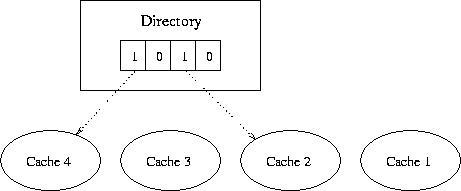
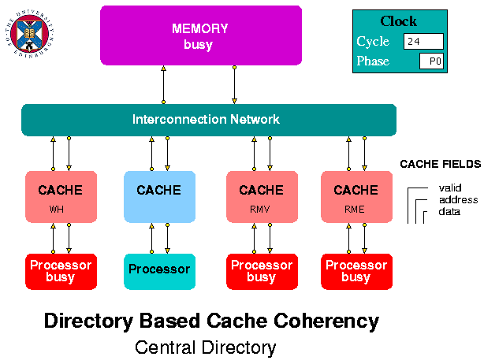
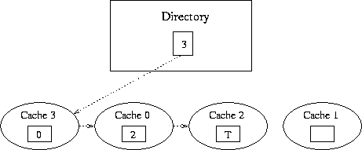
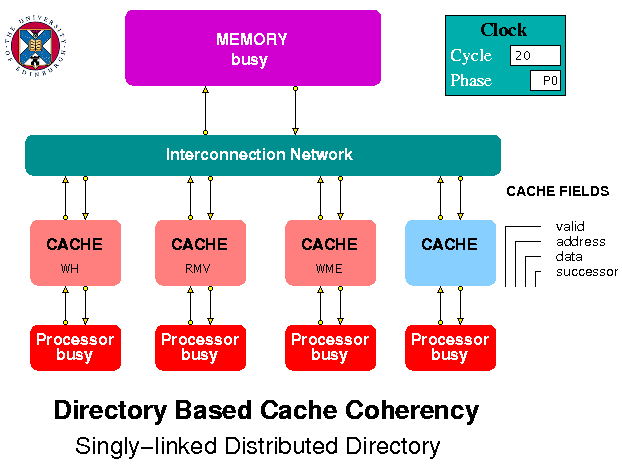
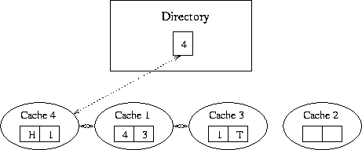
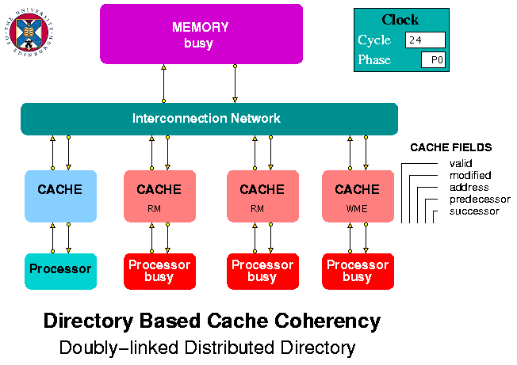

## Directory-based Cache Coherence
**
Directory-based cache coherence protocols were invented as a means of dealing with cache coherence in systems containing more processors than can be accommodated on a single bus. In single bus systems, cache coherence can be ensured using a snoopy protocol in which each processor's cache monitors the traffic on the bus and takes appropriate action when it sees an update to an address matching one that it holds.

In directory based systems, the directory can be held centrally with the main memory in a multi-processor system or can be distributed among the caches as singly or doubly linked lists. This website contains models demonstrating each of these three mechanisms.  For each model, students can be asked, as an exercise, to write a report explaining what protocol actions occur for each of the read and write requests that the processors make to their caches, *e.g.* by listing the packets which are sent around the system in response to each request and explaining the purpose of each packet.

The files for the Central Directory protocol model can be downloaded from <https://github.com/HASE-Group/dir-cache/tree/V1.3>  

The files for the Singly-linked list protocol model, based on the coherence mechanisms used in the SDD (Stanford Distributed Directory) protocol, can be downloaded from <https://github.com/HASE-Group/dir-cache/tree/V2.2>

The files for the Doubly-linked list protocol model, based on the coherence mechanisms used in the SCI (Scalable Coherent Interface) protocol, can be downloaded from  <https://github.com/HASE-Group/dir-cache/tree/V3.5>

Instructions on how to use HASE models can be found at <https://github.com/HASE-Group/hase_iii_releases>

### Central Directory Protocol

The HASE central directory protocol model is based on direct mapped caches with write-though and offers a choice of write-invalidate or write-update inter-cache policy.  The system is assumed to contain four processors (numbered 1-4 because the memory is assigned as 0 in the model), each with its own cache, and a main memory with a directory containing a bit vector for each block in the memory (where a block corresponds to a cache line and may contain several words). For a block that has been cached, the corresponding bit in the directory vector for that block in main memory is set to 1. In the example in Figure 1, Cache 4 and Cache 2 have cached copies for the line shown in the directory.

**Figure 1. Central directory structure**

**Write Invalidate Policy:** 

When a cache receives a write request from its processor, then if it finds a Write Hit, it sends a write update packet to the memory. The memory updates the block, sends out any necessary invalidate packets to other caches and returns a write acknowledgement packet to the originating cache. If the line is empty and the cache finds a Cache Miss, its sends a write request to the memory. The memory updates the block, sends out any necessary invalidate packets to other caches (and sets the corresponding bit in the directory vector to 0) and sends the (updated) block to the originating cache as part of a write acknowledgement. When a cache receives an invalidate packet, it resets the valid bit for the line containing the address in the packet.
	
**Write Update Policy:** 

When a cache receives a write request from its processor, then if it finds a Write Hit, it sends a write update packet to the memory. The memory updates the block, sends out any necessary update packets to other caches and returns a write acknowledgement packet to the originating cache. If the line is empty and the cache finds a Cache Miss, its sends a write request to the memory. The memory updates the block, sends out any necessary update packets to other caches and sends the (updated) block to the originating cache as part of a write acknowledgement. When a cache receives an update packet, it writes the new data into the line containing the address in the packet.
	
**Replacements:** 

If a Read or Write Miss is on a line containing a different valid address from the one requested, the cache sends an invalidate request for that address to memory. The memory sets the corresponding bit in the directory vector for that line to 0 and sends an invalidate acknowledgement packet to the cache. When the cache receives the acknowledgement packet, it issues a read or write request as for a Read or Write Miss on an empty line.

### Central Directory Model

Figure 2 show the HASE model of a multiprocessor system that uses a central directory to maintain cache coherence. The system contains four processors, each with its own cache, an interconnection network and a memory. Each line in the memory contains one data word (*i.e.* the block size is 1 for simplicity) and a directory vector. The interconnection network simply routes packets from its inputs, at a rate of one per clock period, to the output address that forms part of each packet.

**Figure 2. Central Directory Simulation Model**
  
The processors are modelled as arrays containing sequences of read and write requests to locations in the memory address space, *e.g.*  

**R &nbsp; &nbsp; 0 &nbsp;&nbsp;&nbsp; 0**  
**R &nbsp; &nbsp; 6 &nbsp;&nbsp;&nbsp; 0**  
**W &nbsp; &nbsp;5 &nbsp;&nbsp;42**  
**W &nbsp;14 &nbsp; 53**  
**Z &nbsp; &nbsp; 0 &nbsp;&nbsp;&nbsp; 0**  

Both read and write requests require a data field, because of the way the processor is modelled.  At the start of the simulation, each processor sends its first request to cache and when it receives a response, issues the next request in the succeeding clock period. When it encounters a request which is not r, R, w or W, this is treated as an end-of-list marker and the processor then increments a global **nodes_done** variable. **nodes_done** is monitored by the network in each clock period and when it reaches 4, the interconnection network stops the simulation. If the user omits an end-of-list marker, the simulation will eventually be stopped by a time-out.

The caches are the most complex entities in the model. They receive request packets from the processors and request and response packets from the interconnection network. Each packet contains a request type field. Packets from the processors have a single letter type field corresponding to a read request (r or R) or a write request (w or W). A cache displays its response to an incoming request as RH (Read Hit), RME (Read Miss on an Empty line), RMV (Read Miss on a Valid line containing a different address), WH (Write Hit), WME (Write Miss on an Empty line), WMV (Write Miss on a Valid line containing a different address).

A packet passing between caches or between the caches the memory, via the interconnection network, can have one of the following types:

**RR** - Read Request, sent from a cache to memory

**RA** - Read Acknowledge, sent from memory in response to a Read Request

**IV** - InValidate request, sent by memory or a cache 
 
**IA** - Invalidate Acknowledge, sent by memory

**WR** - Write Request, sent from a cache to memory

**WU** - Write Update, sent from a cache to memory

**WA** - Write Acknowledge, sent from memory to a cache  

**UD** - Update, sent from memory to a cache

The processor array files included in the model contain a series of Read and Write requests which demonstrate several of the protocol actions. Users of the model are invited to observe the simulation play-back to see their effects. These are different according to the choice of write-invalidate or write-update inter-cache policy. The choice of policy is made via a global parameter (at the bottom of the parameters window). Parameters can only be changed before the start of a play-back (*i.e.* normally after a re-wind) and the simulation needs to be re-run once a change has been made.

### Singly Linked List Protocol

The HASE singly linked list protocol model is based on direct mapped caches and a write-invalidate cache policy.  Figure 3 shows an example of the state of a list for a particular memory/cache block or line.  The system it represents is assumed to contain four processors, each with its own cache, and a main memory with a directory containing an entry for each block in the memory (where a block corresponds to a cache line and may contain several words). For a block that has been cached, the directory in main memory points to the current head of the list and the directory in each cache containing a copy of that block contains a pointer to its successor in the list (or a tail marker if it is at the end of the list).

**Figure 3. Singly Linked List Structure**
    
Initially, memory is in the uncached state, and cached copies are invalid. When a read request is directed to memory as a result of a cache miss, the requested data is returned to the requester. The directory of the relevant block is set to point to the requesting cache. When the requesting cache receives the data, it sets its successor pointer to indicate that it is the tail of the list (= -1 in the model). In the example in Figure 3, the first request would have been to Cache 2.

When a second cache receives a request for an address in this block, it directs a read request to memory. The memory responds by returning a pointer to the head of the list, in this case cache 0. The memory also updates the directory for the block, to indicate that cache 0 is now the head of the chain. When cache 0 receives this pointer, it sets its successor field to point to the old head of the list, effectively prepending itself to the list. In Figure 3, cache 3 was the next to request this address, so it is the head and points to cache 0.

**Write Requests:** 

A processor can only write data if it has the only copy of the block in question. However, it cannot know this, so if it has a copy, and therefore gets a Write Hit, it must write through to memory. The packet it sends to memory includes a copy of its successor field. The memory checks to see if the successor field is -1 and if the number of the cache matches the pointer in its directory.  If so, the memory updates its data and directory entry for the block and sends a Write Acknowledge to the cache. If the requesting cache is not both the head and tail of the list, the memory sends an Invalidate packet to the head of the list.  This packet includes the identity of the requesting cache (the new head of the list). A cache receiving an Invalidate packet invalidates its entry for that address and, if it is not the tail of the list, sends an Invalidate to the next cache in the list. The cache that is the tail of the list sends an Invalidate Acknowledge to the original requesting cache which now completes its write operation.
	
**Replacements:** 

Sometimes a cache needs to remove itself from a list because it gets a collision miss. In this case, the whole list must be invalidated because the cache does not know where it is in the list (unlike the situation in a doubly linked list protocol describe below). It therefore sends an Invalidate packet to the memory. If the cache is the head of the list, the memory replies with an Invalidate Acknowledge; if it is not the memory sends an Invalidate packet to the head of the list. As for a Write Request, the initiating cache will eventually receive an Invalidate Acknowledge, after which it can send a Write Request to the memory.

### Singly Linked List Model

Figure 4 shows the HASE model of a directory based cache coherence multiprocessor system using a singly-linked list distributed directory. The system contains four processors, each with its own cache, an interconnection network and a memory. Each line in the memory contains one data word (*i.e.* the block size is 1 for simplicity) and a head pointer. The interconnection network simply routes packets from its inputs, at a rate of one per clock period, to the output address that forms part of each packet.

**Figure 4. Singly Linked List Model**
  
The processors are modelled as arrays containing sequences of read and write requests to locations in the memory address space, *e.g.*  

**R &nbsp; &nbsp; 0 &nbsp;&nbsp;&nbsp; 0**  
**R &nbsp; &nbsp; 6 &nbsp;&nbsp;&nbsp; 0**  
**W &nbsp; &nbsp;6 &nbsp;&nbsp;42**  
**W &nbsp;14 &nbsp; 53**  
**Z &nbsp; &nbsp; 0 &nbsp;&nbsp;&nbsp; 0**  

Both read and write requests require a data field, because of the way the processor is modelled.  At the start of the simulation, each processor sends its first request to cache and when it receives a response, issues the next request in the succeeding clock period. When it encounters a request which is not r, R, w or W, this is treated as an end-of-list marker and the processor then increments a global **nodes_done** variable. **nodes_done** is monitored by the network in each clock period and when it reaches 4, the interconnection network stops the simulation. If the user omits an end-of-list marker, the simulation will eventually be stopped by a time-out.

The caches are the most complex entities in the model. They receive request packets from the processors and request and response packets from the interconnection network. Each packet contains a request type field. Packets from the processors have a single letter type field corresponding to a read request (r or R) or a write request (w or W). A cache displays its response to an incoming request as RH (Read Hit), RME (Read Miss on an Empty line), RMV (Read Miss on a Valid line containing a different address), WH (Write Hit), WME (Write Miss on an Empty line), WMV (Write Miss on a Valid line containing a different address).

A packet passing between caches or between the caches the memory, via the interconnection network, can have one of the following types:

**RR** - Read Request, sent from a cache to memory
replies with an RA packet

**RA** - Read Acknowledge, sent from memory in response to a Read Request

**IV** - InValidate request

**IA** - Invalidate Acknowledge

**WR** - Write Request, sent from a cache to memory

**WA** - Write Acknowledge, sent from memory to cache

The processor array files included in the model contain a series of Read and Write requests which demonstrate several of the protocol actions. Users of the model are invited to observe the simulation play-back to see their effects.

### Doubly Linked List Protocol

The HASE doubly linked list protocol model is based on the Scalable Coherent Interface protocol, an approved IEEE Standard.  Figure 5 shows an example of the state of a list for a particular memory/cache block or line.  The system it represents is assumed to contain four processors, each with its own cache, and a main memory with a directory containing an entry for each block in the memory (where a block corresponds to a cache line and may contain several words). For a block that has been cached, the directory in main memory points to the current head of the list and the directory in each cache containing a copy of that block contains a pointer to its predecessor in the list (which may be a head marker, effectively pointing to main memory) and its successor (or a tail marker (-1 in the model) if it is at the end of the list).
  

**Figure 5. Doubly Linked List Structure**

Initially, memory is in the uncached state, and cached copies are invalid. When a read request is directed to memory, the requested data is returned to the requester. The directory of the relevant block is set to point to the requesting cache. When the requesting cache receives the data, it sets the predecessor pointer in that block's directory entry as a head marker, and its successor pointer to indicate that it is the tail of the list. In the example in Figure 5, the first request would have been to Cache 3.

When a second cache receives a request for an address in this block, it directs a read request to memory. The memory responds by returning a pointer to the head of the list, in this case cache 3. The memory also updates the directory for the block, to indicate that cache 1 is now head of the chain. When cache 1 receives this pointer, it sends a *prepend* request to the previous head. On receiving this request, cache 3 sets its predecssor pointer to cache 1 and returns the data to cache 1. Cache 1 then sets its predecessor pointer to be the head of the list, and its successor pointer to cache 3. In Figure 5, this process has been repeated as a result of a request from Cache 4, so that the directory entry in Memory points to Cache 4. Cache 4's predecessor pointer is head pointer and its successor pointer to cache 1. In Cache 1, the predecessor pointer points to Cache 4 and the successor pointer to cache 3. In Cache 3, the predecessor pointer points to Cache 1 and the successor pointer is the tail marker.

**Write Requests:** 

A processor can only write data if it has the only copy of the block in question: it must be the only processor in the chain with its predecessor pointer pointing to memory and its successor pointer indicating that it is tail. In order to obtain such exclusive access, the chain head must first become the head of the list (even if it is already part of it), then write its data and then purge the other caches from the list. It does this by sending a *purge signal* to the next processor in the chain. When a processor receives a purge, it replies with an acknowledgement message, containing a pointer to the next cache in the list. This successor pointer is used to purge the next sharing list entry. When the writing cache receives an acknowledgement from the tail of the chain, it knows it is the only cache left. 
	
**Replacements:** 

Sometimes a cache needs to remove itself from the list by performing a *roll out*. For example, it might need to replace one of its cache blocks with a different memory block. In this case, before accessing memory for the new block, it sends a command containing its successor pointer to its predecessor, telling that cache to update its successor pointer, and a command containing its predecessor pointer to its successor, telling that cache to update its predecessor pointer. A roll out must also be performed if the cache is part of a list, but not the head of it, when it responds to a write request from its processor.

### Doubly Linked List Model

Figure 6 show the HASE model of a directory based cache coherence multiprocessor system using a doubly-linked list distributed directory. The system contains four processors, each with its own cache, an interconnection network and a memory.

**Figure 6. Doubly Linked List Model**

The processors are modelled as arrays containing sequences of read and write requests to locations in the memory address space, *e.g.* 
 
**R &nbsp; 4**  
**R &nbsp; 5**  
**W &nbsp;6**  
**Z &nbsp; 0**

At the start of the simulation, each processor sends its first request to cache and when it receives a response, issues the next request in the succeeding clock period. When it encounters a request which is not r, R, w or W, this is treated as an end-of-list marker and the processor then increments a global **nodes_done** variable. **nodes_done** is monitored by the network in each clock period and when it reaches 4, the interconnection network stops the simulation. If the user omits an end-of-list marker, the simulation will eventually be stopped by a time-out.

The interconnection network simply routes packets from its inputs, at a rate of one per clock period, to the output address that forms part of each packet.  The memory is modelled simply as an array containing integer values, initially all zero, that point to whichever cache is head of the list for the corresponding memory block (the blocks themselves are not modelled).

The caches are the most complex entities in the model. They receive request packets from the processors and request and response packets from the interconnection network. Each packet contains a request type field. Packets from the processors have a single letter type field corresponding to a read request (r or R) or a write request (w or W). A cache displays its response to an incoming request as RH (Read Hit), RM (Read Miss), WHH (Write Hit and Head of list), WHN (Write Hit but Not head of list), WME (Write Miss on an empty line), WMN (Write Miss on a Non-empty line).

A packet passing between caches or between the caches the memory, via the interconnection network, can have one of the following types:

**RR** - Read Request, sent from a cache to memory; memory replies with an RD packet or an HP packet

**RD** - Requested Data, sent from memory in response to a Read Request or from a cache in response to a prepend request

**HP** - Head Pointer, sent from memory if there is already a cached copy of the requested block

**PP** - PrePend request, sent from cache to cache on receipt of an HP packet

**UP** - Update Predecessor's successor field, sent from a cache to remove it from a list

**PA** - UP Acknowledge

**US** - Update Successor's predecessor field, sent from a cache to remove it from a list

**SA** - US Acknowledge

**IV** - InValidate request, sent from cache to cache

**IA** - Invalidate Acknowledge, sent from cache to cache

**WD** - Write Data to memory, sent from cache to memory

**WA** - Write Acknowledge, sent from memory to cache

The processor array files included in the model contain a series of Read and Write requests which demonstrate several of the protocol actions. Users of the model are invited to observe the simulation play-back to see their effects.
