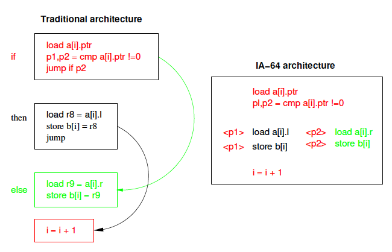
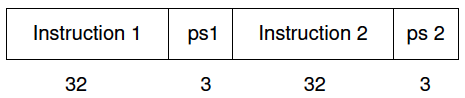
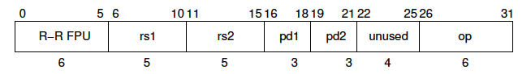
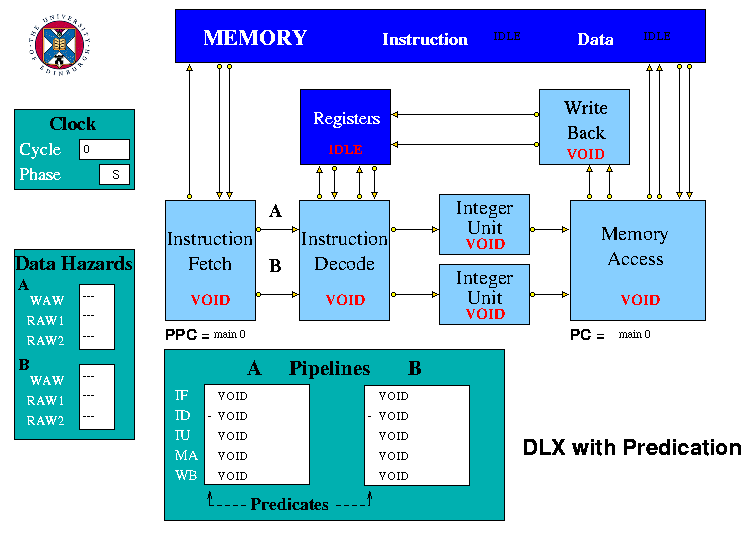

## HASE Predication Project

*Adapted from a final year undergraduate project report by John Hawkins, June 2002*

Predication is a technique which aims to reduce pipeline stalls due to control hazards. It allows branches to be removed from the code by executing both the *if* and *else* parts of a branch in parallel, removing the problem of mispredicted branches. In the Intel IA-64 for example, an instruction can have a predicate tag appended to it by the compiler and the instruction is only allowed to write its result if the corresponding predicate is true.

This website explains how predication works in the IA64 and describes a HASE simulation model of the DLX architecture, modified to include predication so as to illustrate the way predication work.

The files for this model can be downloaded from
https://github.com/HASE-Group/dlx-pred/tree/V4.3

Instructions on how to use HASE models can be found at https://github.com/HASE-Group/hase_iii_releases

### Predication

Predication is a technique intended to reduce pipeline stalls due to control hazards.  Modern processors have sophisticated methods for branch prediction such as branch history tables and correlating predictors, which greatly reduce the number of mispredicted branches. However, the penalty for a mispredicted branch is still large, involving stalling the pipeline and beginning to fetch instructions again from the branch target address. These stalls, while less frequent with the use of branch prediction hardware still have a significant effect on performance.  Typically, a misprediction rate of 5-10% may slow the processor down by as much as 30-40%. Predication allows branches to be removed from the code by executing both the *if* and *else* parts of a branch in parallel, removing the problem of mispredicted branches.

The Intel IA-64 is an example of a commercial microprocessor that uses predication.  Most instructions in the IA-64 (excluding some such as `return from exception') can have a predicate tag appended to them by the compiler.  The instruction will only be allowed to write its result if the corresponding predicate is true.  A branch construct can be rewritten using predication by making the *if* part predicated on a certain predicate register and the *else* part predicated on a complimentary register.  Since only one of the pair of predicate registers holds true, only one of the paths through the branch will write its result.

Comparison instructions, similar to those used to set conditions for a traditional conditional branch, are used to perform a comparison operation and set a pair of registers, one to true and one to false, depending on the result of the comparison.

Predication relies on the parallel execution of both instruction paths and thus requires the architecture to feature multiple instruction issue.  Since the IA-64 can issue several instructions per cycle, it can, for example, issue a compare and two instructions predicated on that instruction in the same cycle.  By the time the predicate is needed, it is already available after the comparison has been done. This is already a one cycle improvement over a system without predication, even if that system correctly predicts the branch.

Predication can be illustrated by the example given in [1] which uses the following code segment:  

    if a[i].ptr != 0 {  
    &nbsp;  &nbsp;  b[i] = a[i].l;  
    } else {  
    &nbsp;  &nbsp;  b[i] = a[i].r;  
    }  
    i = i + 1;  

The value of **a[i].ptr** is loaded from memory and used as the condition for a conditional branch.  In a traditional architecture this code is scheduled as four basic blocks (as shown at the left in Figure 1); the compare, the *if* part, the *else* part, and the add instruction which follows the conditional statement.  Clearly, the result of the compare is difficult to predict.  Even if a prediction scheme is used, it cannot correctly predict every time, and the penalty for an incorrect prediction is a pipeline stall costing several clock cycles.

**Figure 1. Traditional v. Predication Model of Code Execution**

The predication mechanism of the IA-64 allows the code to be scheduled by the compiler as a single basic block with the two possible paths through the conditional statement executing in parallel, controlled by the value of predicate registers (as shown at the right of Figure 1).

After the load instruction, a new compare instruction, **cmp**, compares the loaded value with zero, and sets the pair of predicate registers. The true predicate **p1**, is set if the compare was true, and the false predicate **p2**, is set if the compare was false.  Only the path with the true predicate is allowed write its result to memory, the other instruction being ignored.

### DLX-Pred Instruction Set

The instruction set of DLX-Pred is essentially the same as that of the standard DLX.  However, changes are necessary to the compare instructions, which must now set a pair of predicate registers, and to the instruction word, with the use of a VLIW.

The instruction word (Figure 2) is 70 bits long (but fetched as two successive 35 bit words in the model). Each half consists of a DLX instruction together with an additional 3-bit field to specify which of the predicate registers the instruction is predicated on.  **ps1** and **ps2** are the source predicate registers. If an instruction is not conditional, its source predicate register is set to **P1**, which is always true (**P0** is always 0).

  

**Figure 2. DLX-Pred Instruction Word**

Branch and jump instructions can only be placed in Instruction 1.  If Instruction 1 is a branch or jump instruction, Instruction 2 is treated in the same way as the delay slot in a conventional DLX, *i.e.* it is always executed, regardless of the branch outcome.

New versions of the DLX compare instructions are required to operate on the predicate instructions. The standard DLX architecture has six comparison instructions which compare the values in two registers and set the result in a third within the set of general purpose registers. The conditions available are: equality (**SEQ**), not equal (**SNE**), greater than (**SGT**), greater than or equal (**SGE**), less than (**SLT**) and less than or equal (**SLE**).  Corresponding instructions also exist for comparison of one register with an immediate value.

The DLX-Pred instruction set includes a second set of comparison instructions which set a pair of specified predicate registers, one to true and one to false, depending on the result of the comparison. These instructions are named similarly to the DLX compare instructions, but with the addition of a P, to show that they set predicate registers rather than general purpose registers.  Thus, the instructions are **SPEQ**, **SPNE**, **SPGT**, **SPGE**, **SPLT** and **SPLE**.

The instruction format is shown in Figure 3.  The field marked **op** stands for any of the six possible op-codes.

  

**Figure 3. DLX-Pred Compare Instruction Format**

The original DLX compare instructions remain in DLX-Pred to allow execution of DLX code if needed, and to avoid confusion between the two types.  The register-to-register ALU class of instructions has enough free op-codes to allow six more to be added.  This is not so important in the HASE simulation, but if this model was being built in hardware, where only a limited number of possible op-codes exist, a problem could be presented otherwise.

### DLX-Pred Pipeline Design

The five stages of the standard simple DLX pipeline remain in DLX-Pred (Figure 4).  The Predication model has two Integer Execution units, however, and all the other units each contain two data paths (A and B).  The Instruction Fetch unit fetches the two halves of the DLX instruction word from memory.  A pair of links from memory to this unit is used, one for each instruction.  It would be more realistic to send both instructions down the same link, but the use of two links makes it clearer during animation of the model which is the first, and which is the second instruction and removes the problem of the Instruction Fetch unit receiving two packets down the same link in one clock cycle.  The two instructions could be combined into a single packet from the Memory unit but again, this would not be as clear during animation.

**Figure 4. The HASE DLX-Pred Model**

The Instruction Fetch unit sends an instruction along each of the two data paths to the Instruction Decode unit.  The register file can supply the values of four registers in the same cycle.  In a real implementation this could be achieved in hardware by holding two copies of the registers, each of which would be accessed by one data path of the Instruction Decode unit and both of which would be updated together on a write.

In the model there is a mechanism for resetting the busy bit of a register which was set busy by an instruction which does not have its predicate set.

The Instruction Decode unit sends an instruction to each of the two Integer Execution units.

The Memory Access unit receives results from both Execution units.  It accesses the predicate registers and determines whether or not each instruction is to complete.  If the predicate for an instruction is true, the instruction may proceed as normal.  However, if the predicate is false, the instruction is terminated, does not read or write memory and does not proceed to the Write Back unit if it otherwise would.

The predicate registers are contained in the Memory Access unit which is the only unit which ever requires access to them. It is in Memory Access that they are read to determine whether an instruction should proceed through the unit.  It is also in the Memory Access unit that the result of the compare arrives so it is simple to write the result into predicate registers in that unit.  Keeping predicate registers in Memory Access, rather than with the general purpose registers, eliminates the need for any forwarding of predicates and hazard detection.

The DLX-Pred Pipeline display includes a field for each instruction in the Memory Access unit showing its predicate value, thus indicating whether or not that instruction will be executed.

### Demonstration Program

The Demonstration program contained in the model illustrates the execution of the code segment described in the Predication section, *i.e.*:

&nbsp; if a[i].ptr != 0  
&nbsp;  &nbsp;  {b[i] = a[i].l;}  
&nbsp; else  
&nbsp;  &nbsp;  {b[i] = a[i].r;}  
&nbsp; i = i + 1;  

The DLX-Pred code for this segment is contained within a loop which is repeated 8 times using a decrementing loop counter. This code is shown in Figure 5 along with the registers assignments in Figure 6.  In the model the code can be seen in the memory via the Parameters tab of the Project Inspector.  The data_mem section contains eight triplets of data, the pointer (0 = left, 1 = right) and the left and right hand values. As the program runs, the selected data values of the **a** array, left or right according to the pointer, are copied to successive locations in the **b** array.

| Instruction | Action|
|:------------|:------|
| ADDI R1 R0 8 1 | set R1 = 8 |
| ADDI R2 R0 0 1 | set R2 = 0 |
| ADDI R3 R0 0 1 | set R3 = 0 |
| ADDI R5 R0 100 1 | set R5 = 100 |
| ADDI R6 R0 0 1 | set R6 = 0 |
| NOP |  |
| loop: |  |
| ADD R4 R2 R3 1 | form input array address |
| ADD R7 R5 R6 1 | form output array address |
| LW R8 0(R4) 1	| R8 = (R4 + 0) = l/r pointer |
| SUBI R1 R1 1 1 | decrement loop counter |
| ADDI R3 R3 12 1 | increment input array index |
| ADDI R6 R6 4 1 | increment output array index |
| SPEQ R8 R0 2 3 1 | set predicates |
| NOP             |  |
| LW R9 4(R4) 2	| fetch l value  |
| LW R10 8(R4) 3 | fetch r value  |
| SW 0(R7) R9 2	| store l value  |
| SW 0(R7) R10 3 | store r value  |
| BNEZ R1 loop 1 | branch if R1 /= 0 |
| NOP 0 0         |  |
| TRAP 0 1        |  |
| NOP             |  |
| NOP             |  |
| NOP             |  |

**Figure 5. DLX-Pred Demonstration Code**

| R | Contents |
|:--|:---------|
| R1 | loop counter, initially 8 |
| R2 | start address of input array (0) |
| R3 | index into input array (initially 0, incremented by 12) |
| R4 | current address of input array element (= R2 + R3) |
| R5 | start address of output array (100) |
| R6 | index into output array (initially 0, incremented by 4) |
| R7 | current address of output array element (= R5 + R6) |
| R8 | l/r pointer value |
| R9 | l value |
| R10 | r value |

**Figure 6. Register Assignment**

### Reference

1. Carol Dulong, 
"The IA-64 Architecture at Work",  
*IEEE Computer*, Vol 31, No 7, July 1998
