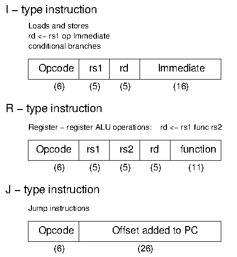
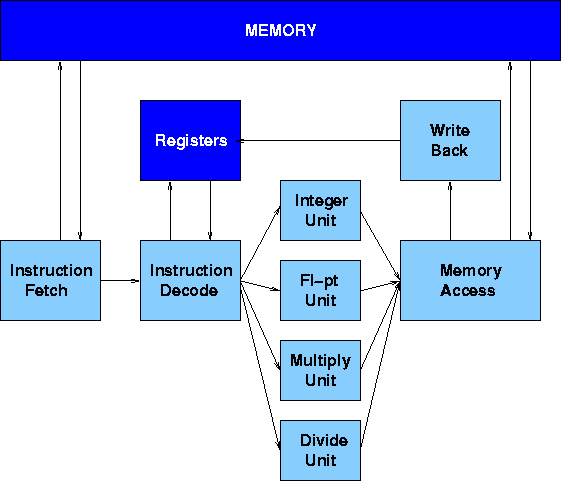
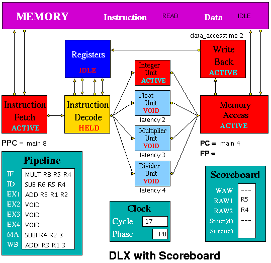
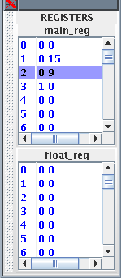
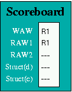
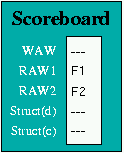
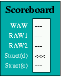
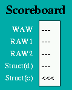

## HASE DLX Scoreboard Model

The first scoreboard was designed as part of the CDC 6600 as a means of controlling the flow of data between registers and multiple arithmetic units in the presence of inter-instruction dependencies such as Read-After-Write.  Scoreboards are still used today in a variety of modern microprocessor, though most are less complex than that used in the CDC 6600.  The DLX architecture is a generic RISC architecture designed by Hennessy and Patterson and described in early editions of [1]. Two HASE simulation models of architectures with parallel function units and a scoreboard have been built to illustrate the way scoreboards work, one based on the DLX, the other on the MIPS processor.

This website explains why Scoreboards are necessary and how the HASE DLX model works.  The files for the DLX/Scoreboard model can be downloaded
from <a href="http://www.icsa.inf.ed.ac.uk/research/groups/hase/models/dlx-scb/dlx-scb_v2.9.zip">dlx-scb_v2.9.zip</a>

Instructions on how to use HASE models can be found at
<a href="http://www.icsa.inf.ed.ac.uk/research/groups/hase/models/use.html"
target="_blank">Downloading, Installing and Using HASE</a>.

### Parallel Function Units

Like all register-register load/store architectures with parallel function units, the DLX derives from the CDC 6600.  To make effective use of this parallelism, the instruction set must include multiple-address (minimally two but more typically three) register-register arithmetic and logic operations, together with instructions which move data between the registers and memory, and sequencing (test and branch) instructions. Figure 1 shows the DLX instruction formats.

**Figure 1. DLX Instruction Formats**

Whereas the CDC 6600 had ten parallel execution units, most modern systems havefewer, and the DLX is normally assumed to have four: an Integer Unit, a Floating-point Add Unit, a Multiply Unit and a Divide Unit (with both of the latter two operating on both integer and floating-point numbers). Figure 2 shows a typical `implementation' of the DLX architecture.  The Integer Unit is used for bothdata and address arithmetic, so load/store instructions are processed by the Integer Unit before being sent to the Memory Access Unit and thence to Memory. The Integer Unit also executes the additions required for integer test and relative branch instructions, so the Memory Access Unit also executes branches.

**Figure 2. DLX with Parallel Function Units**

The Execution Units receive their operands from the Instruction Decode Unit, which is closely coupled to the Registers. These consist of 32 Integer and 32 Floating-point registers. The results from both arithmetic/logic and load instructions are returned to the Registers by the Write Back Unit.

### Instruction Hazards

Scoreboards are designed to control the flow of data between registers and multiple arithmetic units in the presence of conflicts caused by hardware resource limitations (structural hazards) and by dependencies between instructions (data hazards). Data hazards can be classified as *flow dependencies* (Read-After-Write), *output dependencies* (Write-After-Write) and *anti-dependencies* (Write-After-Read).

#### Read-After-Write (RAW) Hazards

A Read-After-Write hazard occurs when an instruction requires the the result ofa previously issued, but as yet uncompleted instruction. In the RAW example shown below, the second instruction requires the value in R6 which has not yet been produced by the first instruction.

**R6  =  R1 * R2**  
**R7  =  R5 + R6**

#### Write-After-Write (WAW) Hazards

A Write-After-Write hazard occurs when an instruction tries to write its result to the same register as a previously issued, but as yet uncompleted instruction. In the WAW example shown below, both instructions write their results to R6.  Although this latter example is unlikely to arise in normal programming practice, it must nevertheless give the correct result.  Without proper interlocks the add operation would complete first and the result in R6 would then be overwritten by that of the multiplication.

**R6  =  R1 * R2**  
**R6  =  R4 + R5**

#### Write-After-Read (WAR) Hazards

A Write-After-Read hazard occurs when an instruction tries to write to a register which has not yet been read by a previously issued, but as yet uncompleted instruction. This hazard cannot occur in most systems, but could occur in the CDC 6600 because of the way instructions were ssued to the arithmetic units. The WAR example shown below is based on the CDC 6600, in which floating-point values were held in X registers.

**X3  =  X1 / X2**  
**X5  =  X4 * X3**  
**X4  =  X0 + X6**

The WAR hazard here is on register X4 in the third instruction. It arises because instructions which are held up by a RAW hazard are nevertheless issued to their arithmetic unit, where they wait for their operands.  Thus the second instruction can be issued immediately after the first, but it is held up in the add unit waiting for its operands because of the WAR hazard on X3 which cannot be read until the divide unit completes its operation.  The third instruction can likewise be issued immediately after the second and it can start its operation. The floating-point add operation completes in very much less time than division, however, and the add unit is therefore ready to store its result in X4 before the multiply unit has read the current value in X4.  Thus there has to be an interlock between the multiply and add instructions to prevent the add instruction from writing to X4 before the multiply instruction has read its current value.

#### Structural Hazards

Structural hazards occur when two or more instructions try to access the same hardware resource (*e.g.* two instructions try to write their results to registers in the same clock period). This would occur, for example, if an instruction were to be issued to an arithmetic unit which takes three clocks periods to execute its operation in the clock period immediately following the issue of a previous instruction to a different arithmetic unit which takes four clock periods to execute.

### HASE DLX Simulation Model

The HASE Simulation Model of the DLX with Parallel Function Units is one of a number of HASE DLX simulations, each of which attempts to model one of the ways inwhich a DLX architecture might be implemented in hardware. The models contains entities representing each of the components in the DLX architecture, the memory,the registers and the pipeline units, together with three other entities which aid visualisation of the activities in the system: the Clock, the Scoreboard and the Pipeline Display.

In Figure 3 the Instruction Fetch Unit, the Integer Unit, the Memory Access Unit the Write Back Unit and the Memory are all busy, whilst the Registers and the Floating-point, Multiply and Divide Units are idle.  The Instruction Decode Unit is held up because its BNEZ order requires the value in R7 as its source operand and has to wait for the ADDI instruction in the Integer Unit to complete.

**Figure 3. HASE DLX with Scoreboard Model**

The latencies of the Floating-point, Multiply and Divide Units and the access time to the data memory can be varied (by using the sliders in the Project panel of the HASE window). The latency of the Integer unit and the access time to the instruction memory are fixed at 1.

This version of the model has been designed to be able to accept assembler output more easily than previous versions in which users were obliged to work out the branch distance and include this as an integer in the instruction. In the revised model, program addresses have two fields, one being a label (initially `main', at memory address 0) and the second an offset. In the figure, the ProgramCounter (PC) has just been updated to label1,0 whilst the Prefetch Program Counter (PPC) has just fetched the instruction at main,12 and will be updated to the new PC value at the next clock.

### HASE DLX Model - Instruction Set

The HASE Simulation Model of the DLX with Parallel Function Units implements most of the instructions defined in Sailer &amp; Kaeli [2], as shown in the tablebelow. In the DLX instruction set architecture:

**1.** DLX arithmetic assembly code instructions are of the form: &nbsp; rd &#60;- rs1 func rs2

so that, for example: ADD R1 R2 R3 means R1 = R2 + R3

**2.** R0 = 0 always.

**3.** Load instructions are of the form: &nbsp; LW R1 4(R0)

which means, in this case, load R1 with the value in the memory location whose address is formed by adding 4 to the contents of R0; memory addresses are big-endian byte addresses, *i.e.* this instruction accesses word 1 in memory since R0 = 0 and addresses are
shifted right by 2 places before being sent to memory.

**4.** Store instruction are of the form: &nbsp; SF 32(R7) F3

which means, in this case, write the value in F3 into the memory location whose address is formed by adding 32 to the contents of R7 and shifting the result 2 places to the right.
 
**5.** The DLX has a delayed branch mechanism which means that the instruction immediately following a branch is executed regardless of the outcome of the branch.

<table>
<tr><td>
<table border bgcolor=white>
<tr><td> ADD  </td><td> Add </td></tr>
<tr><td> ADDF </td><td> Add Floating Point</td></tr>
<tr><td> ADDI </td><td> Add Immediate</td></tr>
<tr><td> ADDU </td><td> Add Unsiged </td></tr>
<tr><td> ADDUI </td><td> Add Unsiged  Immediate</td></tr>
<tr><td> AND  </td><td> And </td></tr>
<tr><td> ANDI </td><td> And Immediate</td></tr>
<tr><td> BEQZ </td><td> Branch if RS = 0 </td></tr>
<tr><td> BFPF </td><td> Branch if FP = false </td></tr>
<tr><td> BFPT </td><td> Branch if FP = true </td></tr>
<tr><td> BNEZ </td><td> Branch if RS /= 0 </td></tr>
<tr><td> DIV  </td><td> Divide </td></tr>
<tr><td> DIVF </td><td> Divide Floating Point </td></tr>
<tr><td> EQF  </td><td> Set FP if =  </td></tr>
<tr><td> GEF  </td><td> Set FP if &#62;=  </td></tr>
<tr><td> GTF  </td><td> Set FP if &#62;  </td></tr>
<tr><td> J    </td><td> Jump </td></tr>
<tr><td> JR   </td><td> Jump Register </td></tr>
<tr><td> LB   </td><td> Load Byte Signed  </td></tr>
<tr><td> LBU  </td><td> Load Byte Unsigned </td></tr>
<tr><td> LEF  </td><td> Set FP if =&#60; (SPFP) </td></tr>
<tr><td> LF   </td><td> Load Floating Point </td></tr>
<tr><td> LH   </td><td> Load Half Word Signed </td></tr>
<tr><td> LHI  </td><td> Load Half Word (High) Immediate </td></tr>
<tr><td> LHU  </td><td> Load Half Word Unsigned </td></tr>
<tr><td> LTF  </td><td> Set FP if &#60; (SPFP) </td></tr>
<tr><td> LW   </td><td> Load Word </td></tr>
<tr><td> MOVD </td><td> Move Floating point (DP)  </td></tr>
<tr><td> MOVF </td><td> Move Floating point (SP) </td></tr>
<tr><td> MOVFP2I </td><td> Move SPFP to Integer </td></tr>
<tr><td> MOVI2FP </td><td> Move Integer to SPFP </td></tr>
<tr><td> MULT  </td><td> Multiply </td></tr>
<tr><td> MULTF </td><td> Multiply Floating point </td></tr>
<tr><td> NEF  </td><td> Set FP if /= (SPFP) </td></tr>
<tr><td> NOP  </td><td> No operation</td></tr>
</table>
</td><td>&nbsp; &nbsp; &nbsp; &nbsp; </td><td>
<table border bgcolor=white>
<tr><td> OR   </td><td> Or </td></tr>
<tr><td> ORI  </td><td> Or Immediate</td></tr>
<tr><td> SB   </td><td> Store Byte</td></tr>
<tr><td> SEQ  </td><td> Set RD = 1 if RS1 = RS2</td></tr>
<tr><td> SEQI </td><td> Set RD = 1 if RS = Immediate </td></tr>
<tr><td> SF   </td><td> Store Floating Point</td></tr>
<tr><td> SGE  </td><td> Set RD = 1 if RS1 &#62;= RS2 </td></tr>
<tr><td> SGEI </td><td> Set RD = 1 if RS &#62;= Immediate </td></tr>
<tr><td> SGT  </td><td> Set RD = 1 if RS1 &#62; RS2 </td></tr>
<tr><td> SGTI </td><td> Set RD = 1 if RS &#62; Immediate </td></tr>
<tr><td> SH   </td><td> Store Half Word </td></tr>
<tr><td> SLE  </td><td> Set RD = 1 if RS1 =&#60; RS2 </td></tr>
<tr><td> SLEI </td><td> Set RD = 1 if RS =&#60; Immediate </td></tr>
<tr><td> SLL  </td><td> Shift Left Logical </td></tr>
<tr><td> SLLI </td><td> Shift Left Logical by Immediate</td></tr>
<tr><td> SLT  </td><td> Set RD = 1 if RS1 &#60; RS2 </td></tr>
<tr><td> SLTI </td><td> Set RD = 1 if RS &#60; Immediate </td></tr>
<tr><td> SNE  </td><td> Set RD = 1 if RS1 /= RS2 </td></tr>
<tr><td> SNEI </td><td> Set RD = 1 if RS /= Immediate </td></tr>
<tr><td> SRA  </td><td> Shift Right Arithmetic </td></tr>
<tr><td> SRAI </td><td> Shift Right Arithmetic Immediate</td></tr>
<tr><td> SRL  </td><td> Shift Right Logical </td></tr>
<tr><td> SRLI </td><td> Shift Right Logical Immediate </td></tr>
<tr><td> SUB  </td><td> Subtract </td></tr>
<tr><td> SUBF </td><td>  Subtract  Floating point </td></tr>
<tr><td> SUBI </td><td> Subtract Immediate </td></tr>
<tr><td> SUBU </td><td> Subtract Unsigned </td></tr>
<tr><td> SUBUI </td><td> Subtract Unsigned Immediate </td></tr>
<tr><td> SW   </td><td> Store Word </td></tr>
<tr><td> TRAP </td><td> Stops simulation</td></tr>
<tr><td> VOID </td><td> Does nothing</td></tr>
<tr><td> XOR  </td><td> Exclusive OR </td></tr>
<tr><td> XORI </td><td> Exclusive OR Immediate </td></tr>
</table>
</table>

### Number Representation

Because the data memory is implemented as an array of elements all having the same (integer) format, it is necessary to treat the bit patterns of floating-point numbers as if they were integers. These "integers" are held in memory and passed into and out of the floating-point units as if they were actual integers, but are treated as floating-point numbers for the purpose of calculation (*i.e.* by ADDF and MULTF). This trickery is achieved by using dual pointers. The same trick is included in the programs shown below.

<table>
<tr><td>
<table bgcolor=white>
<tr><td>/*  Convert floating-point to integer*/</td></tr>
<tr><td>#include &lt;stdio.h&gt;</td></tr>
<tr><td>#include &lt;string.h&gt;</td></tr>
<tr><td>main()</td></tr>
<tr><td>{</td></tr>
<tr><td>&nbsp;    float f;</td></tr>
<tr><td> &nbsp;   int i, *p;</td></tr>
<tr><td>&nbsp;  printf("Input float: ");</td></tr>
<tr><td>&nbsp;  scanf("%f", &#38f);</td></tr>
<tr><td></td></tr>
<tr><td>&nbsp; /* convert_F2I */</td></tr>
<tr><td>&nbsp;    p = (int*)(&#38f); &nbsp; &nbsp; &nbsp; /* set up pointer to f */</td></tr>
<tr><td>&nbsp;    i = *p;         &nbsp; &nbsp; &nbsp; &nbsp; &nbsp; 
<tr><td>/* copy f into integer location */</td></tr>
<tr><td>&nbsp;    printf("%d\n", i);</td></tr>
<tr><td>}</td></tr>
</table>
</td><td>&nbsp; &nbsp; &nbsp; &nbsp;</td><td>
<table bgcolor=white>
<tr><td>/*  Convert integer to floating-point */</td></tr>
<tr><td>#include &lt;stdio.h&gt;</td></tr>
<tr><td>#include &lt;string.h&gt;</td></tr>
<tr><td>main()</td></tr>
<tr><td>{</td></tr>
<tr><td>&nbsp;    float f;</td></tr>
<tr><td>&nbsp;    int i, *p;</td></tr>
<tr><td>&nbsp;  printf("Input integer: ");</td></tr>
<tr><td>&nbsp;  scanf("%d", &#38i);</td></tr>
<tr><td></td></tr>
<tr><td>/* convert_I2F */</td></tr>
<tr><td>&nbsp;    p = (int*)(&#38f); &nbsp; &nbsp; &nbsp; /* set up pointer to f */</td></tr>
<tr><td>&nbsp;    *p = i; &nbsp; &nbsp; &nbsp; &nbsp; &nbsp; 
<tr><td>/* copy integer into location to which p points */</td></tr>
<tr><td>&nbsp;    printf("%f\n", f);</td></tr>
<tr><td>}</td></tr>
</table>
</td></tr>
</table>

These programs, or derivations of them, can be used to create input data for programs that used the FP units and to convert results back to floating-point.

### The Pipeline Units

#### Instruction Fetch

The Instruction Fetch Unit accesses the Memory for instructions using the address in a Prefetch Program Counter (PPC). PPC is initially set equal to main,0 (as is the PC register in the Memory Access Unit). If the IF Unit decodes a branch, it enters Held mode, waiting for the branch to be executed by the Memory Access Unit.  If the branch results in a change to PC (*i.e.* other than by a normal increment) the prefetched instruction waiting to be copied into the Input Buffer has to be discarded. Because of the prefetching, there has to be at least one extra instruction (*e.g.* NOP) at the end of a program.

#### Instruction Decode

The Instruction Decode Unit receives instruction packets from the Instruction Fetch Unit and sends instruction/operand packets to the Execution Units.  Before accessing operands from the Registers, it checks for hazards.  If a hazard is detected, the Unit enters the Held state and the instruction remains in the Instruction Decode Unit until the next clock, when the checks are repeated.

#### Execution Units

The Execution Units receive instruction/operand packets from the Instruction Decode Unit and send instruction/operand packets to the Memory Access Unit.  Each contains a pipeline with length equal to its latency value.  Except in the case of the Integer Unit, which has a fixed latency value of 1, this value is a parameter of the Unit, and the code is designed to deal with any value (>= 1) up to a maximum of 8 so that it can be common to all units.  In the current model the result of the arithmetic/logic instruction is computed in the first stage of each unit, using native-mode operations of the simulation execution platform, and simply copied through the remaining pipeline stages.  Detailed register transfer level simulation models of the arithmetic units may be developed in the future.

#### Memory Access

The Memory Access Unit receives all instructions that have completed execution. Each packet contains two data fields in addition to the instruction and status fields.  Arithmetic instruction packets contain the data to be sent to the registers via the Write Back Unit in the data1 field.  Load instruction packets contain a memory address in the data1 field which is sent to the Memory Unit. The data returned from the Memory is passed to the Write Back Unit.  Store instruction packets contain a memory address in the data1 field and the data to be sent to Memory in the data2 field.  Branch instruction packets contain the new PC address or the offset in the instruction field of the packet. Conditions are evaluated in the relevant Execution Unit and carried through as bits in the Status field of the packet.  When the appropriate change has been made to the Program Counter, an untraced packet is sent to the Instruction Fetch Unit to unlock the Held condition in that Unit and to update the Prefetch Program Counter.

#### Write Back

The Write Back Unit receives packets from the Memory Access Unit. Whenever a valid packet is received, the Write Back Unit constructs a *Register Write Request* packet and sends it to the Registers. The Registers are not clocked so no packet needs to be sent if there is no valid instruction in the Write Back Unit.  Synchronisation is maintained because the Registers always send a packet back to a requesting unit, and the requesting unit always waits for this response.  The Registers are assumed to have three ports, two for reading and one for writing. To ensure that the simulation works correctly, the writeback occurs in the second phase of the clock, *i.e.* after the WAW/RAW checks, which then clear in the next clock cycle.

### The Scoreboard

The Scoreboard is implemented as a separate entity which works in conjunction with the Instruction Decode unit to implement the mechanisms needed to deal with data and structural hazards. The Scoreboard also shows when and why the various hazards occur.

#### Data Hazards

The Scoreboard handles data hazards through * Use* bits. Each register has a Use bit which is set when an instruction that will write to the register is issued and reset when the result is written to the register. In the HASE DLX model the registers are implemented as C++ structs with three fields: register number, value and Use bit. In Figure 4, for example, which shows a sub-set of the Main (integer) and Floating-point Registers, Main Register 3 has its Use bit set, while all the others are in the reset state. (Register 2 is highlighted because it was the last one to be accessed.) Before accessing a source or destination register, the Instruction Decode Unit invokes a class in the Registers entity which reads the relevant Use bit.  If the Use bit for a Register required as a source operand is set, the Scoreboard registers a RAW hazard; if the Use bit for a Register required as a destination operand is set, the Scoreboard registers a WAW hazard.

<table>
<tr><td>
</td><td> &nbsp; &nbsp; &nbsp; &nbsp; </td>
<td><table>
<tr><td></td><td>&nbsp;</td></tr>
<tr><td align=center>(a)</td><td align=center>(b)</td></tr>
<tr><td></td><td>&nbsp;</td></tr>
<tr><td align=center>(c)</td><td align=center>(d)</td></tr>
</table></td></tr>
<tr><td align=center><b>Figure 4</b> </td><td></td><td align=center><b>Figure 5</b> </td></tr>
</table>

Figure 5(a) shows the Scoreboard display when the first of the following pair of instructions reaches the Integer Execution Unit:

LW R1 1(R0)  
ADDI R1 R1 2

The first instruction loads R1 with a value accessed from memory, and until it completes, the second instruction, which increments R1, suffers both a WAW and a RAW hazard. In the following sequence:

LF F1 4(R0)  
LF F2 5(R0)  
ADDF F3 F1 F2

The third instruction requires the values which the previous two instructions load into F1 and F2, and when it reaches the Instruction Decode Unit, it suffers a RAW hazard on both its source operands, as illustrated in Figure 5(b).

#### Structural Data Hazards

Structural Hazards occur when two instructions try to use the same pipeline stage simultaneously.  In the HASE DLX model, this situation can (potentially) occur in the Memory Access unit. Thus although there are four arithmetic Execution Units operating in parallel, the Memory Access Unit can only receive one result from these units in any one clock period. If the Instruction Decode Unit issues a 3-clock multiply instruction in one clock period, for example, then it cannot be allowed to issue a 2-clock floating-point add instruction in the immediately subsequent clock period because the floating-point add instruction would then arrive at the Memory Access Unit at the same time as the multiply instruction.

To ensure that such situations are correctly handled, the Scoreboard maintains a Latency Pipeline. When an instruction is issued, its latency value is entered into the Latency Pipeline.  As an instruction moves through the Execution Unit pipeline, its latency value moves through the Latency Pipeline (the position of each instruction in this pipeline is shown as EX1, EX2, EX3, EX4 in the Pipeline display icon), decremented by 1 at each move.  Thus a multiply instruction has a latency of 3 when it is issued, but in the next clock its remaining latency is only 2.

As latency values are moved through the Latency Pipeline in each clock period, the presence or absence of each possible latency value is recorded. If an instruction about to be issued to one of the execution units has the same latency value as an instruction already in the Latency Pipeline, it is held up for one clock period and then the check is performed again. Once there is no latency value in the Latency Pipeline equal to the new instruction&#8217;s latency value, it can be issued.  The Scoreboard displays the existence of a Struct (d) hazard as shown in Figure 5(c).

#### Structural Control Hazard

Branch instructions require an operand to be accessed via the normal route through the Integer Unit, so in the HASE model the Program Counter has been placed in the Memory Access Unit. Since any instructions following a Conditional Branch might have to be discarded, the Instruction Fetch Unit detects the presence of a Branch and goes into the Held state. It sends a copy of the Branch down the pipeline and then waits until the Memory Access Unit sends it the new PC value. This value is copied into PPC; the Instruction Fetch Unit returns to the Active state and recommences instruction fetching from the Memory.

A Branch cannot, in any case, be executed until all previous instructions have completed. Since a Branch instruction passing through the Integer Unit could overtake an instruction in the Multiply or Divide Units, a Branch must also be held up in the Instruction Decode Unit until there are no instructions in any of the Execution Units. This condition is monitored by the Scoreboard, which records the presence of any instruction with a latency value greater than zero in its Latency Pipeline, and displayed as a Struct (c) hazard as shown in Figure 5(d).

Clearly there are many alternative strategies for dealing with Branch instructions which could be modelled, and different HASE models will be developed over time. The current model shows the hold-ups ocurring in the Instruction Fetch and Instruction Decode Units and the values of PC and PPC changing.

### Demonstration Program

The model contains the following Demonstration Program, together with some appropriate data. Because the data memory is implemented as an array of elements all having the same (integer) format, it is necessary to treat the bit patterns of the floating-point numbers as if they were integers. These "integers" are held in memory and passed into and out of the floating-point units as if they were actual integers, but are treated as floating-point numbers for the purpose of calculation (i.e. by ADDF and MULTF).

The Floating-point Number Conversion page shows the programs use to prepare the input data for entry into the memory and to convert the output back to readable form.

<table border bgcolor=white>
<tr><td> </td><td><b>Instruction</b> </td><td> <b>Action</b> </td><td> <b>Result</b> </td><td><b>Hazard</b></td> </tr>
<tr><td></td><td>LW R1 4(R0)</td><td> Loads R1 from data memory word 1</td><td> R1 =15</td><td>  </td></tr>
<tr><td></td><td>LW R2 8(R0)</td><td> Loads R2 from data memory word 2</td><td> R2 = 9 </td><td>  </td></tr>
<tr><td></td><td>ADDI R3 R1 3</td><td> R3 = R1 + 3</td><td> R3 = 18 </td><td> RAW on R1 </td></tr>
<tr><td></td><td>SUBI R4 R2 3</td><td> R4 = R2 - 3</td><td> R4 = 6 </td><td>  </td></tr>
<tr><td></td><td>ADD R5 R1 R2</td><td> R5 = R1 + R2</td><td>R5 = 24 </td><td>  </td></tr>
<tr><td></td><td>SUB R6 R5 R4</td><td> R6 = R5 + R4</td><td>R6 = 18 </td><td> RAW on R5 </td></tr>
<tr><td>label1:</td><td>  </td><td>  </td><td> </td><td> </td></tr>
<tr><td></td><td>MULT R8 R5 R4</td><td>  R8 = R5 * R4</td><td> R8 = 144</td><td>  </td></tr>
<tr><td></td><td>BEQZ R7 label1</td><td> -> label1 if R7 = 0</td><td> 1: R7 = 0, branch   2: R7 = 42, no branch
</td><td> control   data </td></tr>
<tr><td>label2:</td><td>  </td><td>  </td><td>  </td></tr>
<tr><td></td><td>ADDI R7 R7 42</td><td> R7 = R7 + 42  (delay slot)</td><td>1: R7 = 42 2: R7 = 84</td><td>  </td></tr>
<tr><td></td><td>BNEZ R7 label2</td><td> -> label2 if R7 /=0</td><td>1: R7 = 84, branch 2: R7 = 0, no branch  </td><td>  </td></tr>
<tr><td></td><td>SUBI R7 R7 126</td><td> R7 = R7 - 126 (delay slot)</td><td>1: R7 = -42 2: R7 = -126 </td><td>  </td></tr>
<tr><td></td><td>J label3</td><td> -> label3  </td><td></td><td>  </td></tr>
<tr><td></td><td>ADDI R8 R0 68</td><td> R8 R0 + 68 </td><td> R8 = 68</td><td>  </td></tr>
<tr><td>label3:</td><td>  </td><td>  </td><td> </td><td> </td></tr>
<tr><td></td><td>ADDI R8 R0 17</td><td> R8 = R0 + 17  </td><td> R8 = 17 </td><td>  </td></tr>
<tr><td></td><td>JR R8</td><td> -> instruction main,17 (LF)  </td><td></td><td> RAW on R8 </td></tr>
<tr><td></td><td>NOP 0</td><td>  </td><td></td><td>  </td></tr>
<tr><td></td><td>ADDI R6 R7 32</td><td> R6 = R7 + 32 (not executed) </td><td></td><td>  </td></tr>
<tr><td></td><td>LF F0 12(R0)</td><td> Load F0 from memory word 3 </td><td> F0 = 1093035622 (10.4)</td><td>  </td></tr>
<tr><td></td><td>LF F1 16(R0)</td><td> Load F1 from memory word 4  </td><td>F1 = 1085695590 (5.7)</td><td>  </td></tr>
<tr><td></td><td>MULTF F2 F0 F1</td><td> F2 = F0 * F1 </td><td> F2 = 1114447543 (59.28)</td><td> RAW on F0, F1 </td></tr>
<tr><td></td><td>ADDF F3 F0 F1</td><td> F3 = F0 + F1 </td><td> F3 = 1098960076 (16.1)</td><td> data </td></tr>
<tr><td></td><td>BEQZ R3 label4</td><td> -> label4 if R4 = 0 </td><td></td><td> data and control  </td></tr>
<tr><td></td><td>DIV R9 R6 R4</td><td> R9 = R6 / R4 </td><td> R9 = 3</td><td>  </td></tr>
<tr><td></td><td>SF 20(R0) F3</td><td> Store F3 in memory word 5 </td><td> Word 5 =1098960076 (16.1) </td><td></td></tr>
<tr><td>label4:</td><td>  </td><td>  </td><td> </td><td> </td></tr>
<tr><td></td><td>TRAP 0</td><td>  </td><td></td><td>  </td></tr>
<tr><td></td><td>NOP</td><td>  </td><td></td><td>  </td></tr>
</table>

### Suggested Student Exercise

#### Part A

Examine the program shown below and reconstruct the program fragment (in C or C-like code) from which it was compiled.  Your submission for Part A should be the C (or C-like) code for the program fragment.

ADDI R1 R0 0  
MOVI2FP F0 R0  
loop:  
LF F1 4(R1)  
LF F2 36(R1)  
MULTF F3 F1 F2  
ADDF F0 F0 F3  
ADDI R1 R1 4  
SEQI R3 R1 32  
BEQZ R3 loop  
NOP  
SF 0(R0) F0  
TRAP 0  
NOP 

#### Part B

Now load this program into instruction memory and load some appropriate data into the data memory locations from which this program takes its operands. Note that the program operates on floating-point numbers.  Because the data memory is implemented as an array of elements all having the same (integer) format, it is necessary to treat the bit patterns of the floating-point numbers as if they were integers. The Number Representation in the Model section explains how to create input data in the required format and to convert the results back into readable floating-point numbers.

Run the simulation and note how many DLX clock cycles the program takes to run.

Your submission for Part B should include:

- A print-out of the data files you used, annotated to show the input and output floating-point values (you can use integer values for your data, but you must nevertheless convert them to the HASE DLX integer representation of floating-point numbers before entering them into the data memory).
- A print-out of the instruction file annotated to show where there are data, structural and control hazards between instructions (the Scoreboard will show you these)
- A note of the execution time in DLX clock cycles

#### Part C

Now use the animator controls to play back the simulation of the program you wrote for Part B in step mode and note the contents of the pipeline (as shown in the Pipeline Display) in each clock period. From this information draw a pipeline space-time diagram for the first two iterations of the loop showing the progress of the instructions through the pipline during execution of the program.

Your submission for Part C should be a machine printed diagram with clock periods marked along the top and a horizontal entry for each instruction showing which DLX unit it is in, and whether it is active or stalled, in each of the clock periods in which it is in the pipeline.

#### Part D

The given program is a naive (and therefore slow) implementation of the algorithm.  Using the animator you should be able to work out where time is being lost and try to optimse this program (*e.g.* by reordering some of the instructions) to reduce the number of clock cycles.

Your submission for Part D should include:

- A print-out of the instruction file you used, annotated to show where there are data, structural and control hazards between instructions
- A note of the execution time in DLX clock cycles

#### Part E

As a further optimisation you are allowed to unroll the program to include 2 iterations of the algorithm in one program loop.

Your submission for Part E should include:

- A print-out of the instruction file you used, annotated to show where there are data, structural and control hazards between instructions
- A note of the execution time in DLX clock cycles
- Comments on the relative performance of the three programs

### References

1. J. Hennessy and D. Patterson  
 "Computer Architecture, A Quantitative Approach.",  
 Morgan Kaufmann Publishers, Inc., 1990.

2. P. M. Sailer and D. R. Kaeli  
 "The DLX Instruction Set Architecture Handbook",  
 Morgan Kaufmann, 1996
