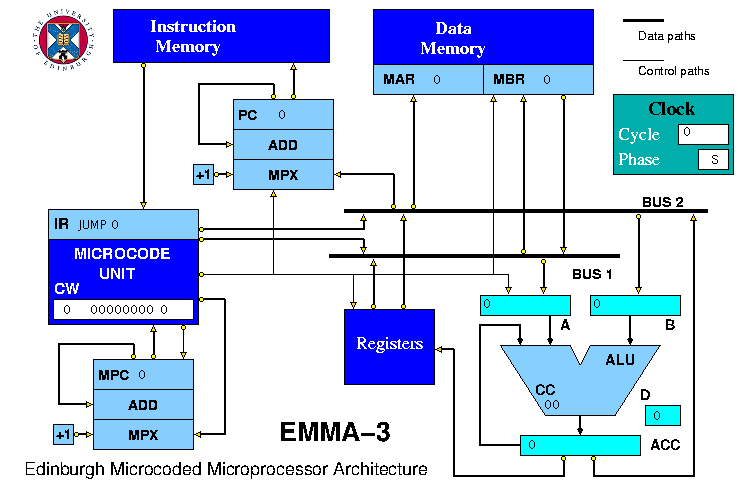
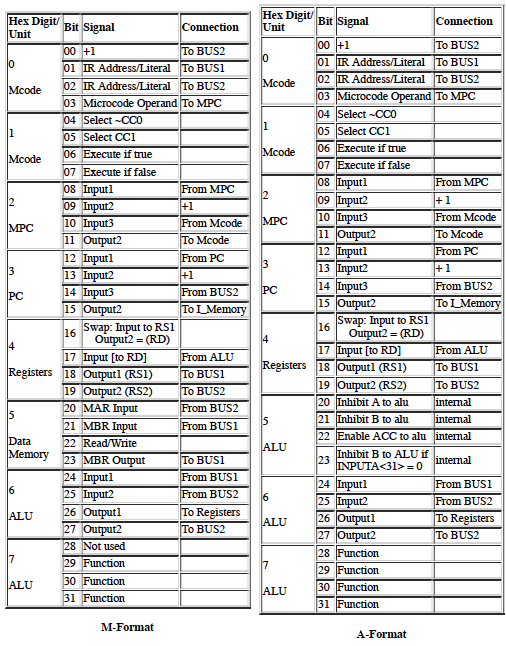
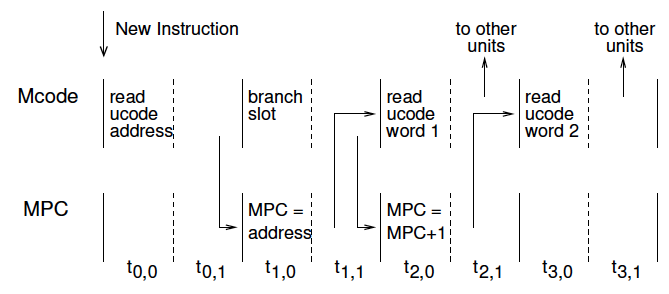

## EMMA: Edinburgh Microcoded Microprocessor Architecture

EMMA is a HASE simulation model of a simple load/store, register-register arithmetic microprocessor architecture designed for use in virtual laboratory exercises in computer design. The processor has a predefined instruction set but the down-loadable version of the model contains almost none of the microcode required to implement it. Instructors can propose exercises in which students write microcode to implement all or parts of the instruction set together with assembly code programs to demonstrate that the microcode operates correctly.

When EMMA was originally created in 2005, there were two versions, a basic version (EMMA-1), that could execute simple arithmetic and logic operations, and an enhanced version (EMMA-2), that contained facilities to allow multiplication and division to be implemented in microcode. The current version (EMMA-3) is a revised version of EMMA-2, capable of executing the full EMMA instruction set. The revisions include a change in the way  the microinstructions are represented, from an 8-digit hexadecimal value to a string of 8 hexadecimal characters, so as to provide better visualisation.

The files for EMMA-3 can be downloaded from <https://github.com/HASE-Group/emma/tree/V3.1>

Instructions on how to use HASE models can be downloaded from <https://github.com/HASE-Group/hase_iii_releases>

### EMMA-3 Processor Architecture

EMMA-3 is a simple load/store, register-register arithmetic processor implemented as shown in Figures 1. It uses a Harvard architecture, with separate instruction and data memories. The Program Counter (PC) acts as the memory address register for the Instruction Memory. Whenever PC receives an update command from the Microprogram Unit, it sends the new address to the Instruction Memory. The instruction read out from the Instruction Memory is sent to the Microcode unit where it is copied into the Instruction Register (IR).

**Figure 1. The EMMA-3 simulation model**

The Microcode Unit contains the Microcode Memory which is addressed by the function field of the Instruction Register in the clock cycle in which a new instruction is received from the Instruction Memory and by the Microcode Program Counter (MPC) in subsequent clock cycles. If the Microcode Unit receives an input from both the Instruction Memory and the Microcode Program Counter in the same clock cycle, the input from the Microcode Program Counter is discarded (this can happen during the execution of branch instructions) and a statement to this effect appears in the Output Pane of the HASE window.

Words in the Microcode Memory are structured as follows:

| Label | Microinstruction | Operand |
|:----:|:-----------------:|:-------:|

The Label is a string of characters used only for readability purposes.

The Microinstruction is a string of 8 characters representing a set of hexadecimal digits that can be interpreted in one of two different ways according to which half of the 256-word Microcode Memory it is stored in. Microcode words stored in the least significant half of the Microcode Memory are interpreted as being in M-Format, in which two of the hex digits control the Microcode Unit itself, one controls the MPC Unit, one the PC Unit, one the Registers, one the Data Memory and two the ALU. Microcode words stored in the most significant half of the Microcode Memory are interpreted as being in A-Format, in which the hex digit used to control the Data Memory in M-Format is instead used to provide extra control signals for the ALU (see Table 4 below).

The (8-bit integer) Operand field is used for jumps within the microcode memory or as an operand value for some microinstructions. The first 32 locations form a jump table indexed by the Function Number (see Table 2 below), except for locations 0 and 1 which each contain the (one) microcode word needed to implement the JUMP and BRANCH instruction.

EMMA operates on a two phase clock. In clock cycles in which they are active, each unit executes its internal actions in the first phase of the clock and sends out a result packet in the second phase. The Microcode Unit, for example, reads its microcode memory in the first phase and in the second phase sends the appropriate microcode fields to other units, if they are to be activated in the next clock cycle.

The Program Counter and Microprogram Counter units behave identically. They contain the relevant register together with an adder which receives one of its inputs from the register itself and the other from a multiplexer (MPX) which selects either +1 or a value taken from BUS2 in the case of PC or from the Microcode Unit in the case of MPC. (The +1 value is actually an internal connection, the +1 units are just included for visual clarity.)  Each has two outputs: Output1, which is connected back to the adder and is permanently enabled, and Output2 which is enabled under microcode control.  The bits in the microcode field controlling the Program Counter, for example, activate its inputs and output as follows:

| Signal | Connection |
|:---------|:-----------------|
| Input1 | From PC |
| Input2 | +1 |
| Input3 | From BUS2 |
| Output2 | To Instruction Memory |

Whenever the PC unit is activated by receipt of a microcode packet in one clock cycle (it should also have received appropriate data packets), it activates the appropriate inputs to the multiplexer and the adder and forms the result in phase 0 of the next clock cycle; in phase 1 of that clock cycle it sends the result of the addition to Output1, back to its own Input1, (always) and to Output2 if the corresponding microcode bit is set.

The buses (BUS1 and BUS2) have a number of input connections but should receive data from only one of them in any one (phase 1) clock period.  Inputs which do not receive data are set to zero.  The inputs are internally ORed together (simulating a wired-OR bus) and the result is sent to all the outputs half way through the clock phase in which they were received.

The Data Memory has its own built-in Memory Address Register (MAR) and Memory Buffer Register (MBR).  The microcode field controlling the memory is as follows:

| Signal | Connection |
|:---------|:----------------|
| MAR Input | From BUS2 |
| MBR Input | From BUS1 |
| Read/Write |  |
| MBR Output | To BUS1 |

For a read operation (Read/Write = 0), the address sent from BUS2 is copied into MAR in the next clock phase 0, the memory is read and the result copied into MBR.  In the subsequent clock phase 1, the value in MBR is sent to BUS1. For a write operation (Read/Write = 1), the address sent from BUS2 is copied into MAR in the next clock phase 0, the data value sent from BUS1 is copied into MBR and the value is written into the memory.

The Registers unit contains 16 general purpose registers, with R0 being permanently set to 0. It receives input values from the ALU and has two outputs connected to BUS1 and BUS2. Whenever the Microcode Unit sends a microcode command to the Registers unit, it appends the appropriate source and destination register numbers extracted from the instruction in IR.  The microcode field controlling the registers is as follows:

| Signal | Connection |
|:---------|:----------------|
| Swap |  |
| Input1 (to RD) | From ALU |
| Output1 (RS1) | To BUS1 |
| Output2 (RS2) | To BUS2 |

Executing an instruction such as ADD RD RS1 RS2 requires the execution of 3 microinstructions. The first microinstruction reads the values in registers RS1 and RS2 and sends them to BUS1 and BUS2 respectively. This is achieved by setting the Registers field in the microcode word to 0011.  The second microinstruction controls the adder, while the third causes the result sent from the adder to the Registers to be written into RD.  This microinstruction also increments the Program Counter. If the Swap bit is set, however, then the first microinstruction sends the value in RD to BUS2 instead of RS2 and the third microinstruction writes the result from the adder into RS1. This facility allows for the implementation in microcode of complex instructions such as forming the sum of the first *n* natural numbers.

The Arithmetic and Logic Unit (ALU) has two data inputs, one each from BUS1 and BUS2. Values received from the buses are loaded into registers A and B. The result of an operation is loaded into the Accumulator (ACC), which has two external outputs, one connected to the Registers Unit and one to BUS2, and one internal connection back into the ALU.  When the Microcode Unit sends a microcode command to the ALU, it appends the appropriate function code derived from the instruction in IR. There are two condition code bits: CC0 is set = 0 if the ALU result = 0; CC1 is set = 1 if the ALU result < 0. CC0 and CC1 are directly connected to the Microcode Unit which can use them in condition tests in the clock period after an ALU operation has been executed.

Eight Basic Functions are provided in the ALU, as shown in Table 1 below, together with the eight Extra Functions shown in Table 2 that allow for the implementation of multiplication and division in microcode.  Four of these extra functions operate on the A and B registers. The D register is intended for use in counting down the number of cycles during division.

| Fn | Action |
|:---|:------|
|  0  |  Add  |
|  1  |  Subtract  |
|  2  |  AND |
|  3  |  OR  |
|  4  |  XOR  |
|  5  |  Shift Left Logical  |
|  6  |  Shift Right Logical |
|  7  |  Shift Right Arithmetic  |

**Table 1. Basic Functions**

| Fn | Action |
|:---|:------|
|  8 | NOP  (No Operation)   |
|  9 | Reverse Subtract |
|  A | Negate A  |
|  B | Negate B  |
|  C | Shift A Right &amp; set CC  |
|  D | Shift B Left  |
|  E | Set D = Operand  |
|  F | Decrement D &amp; set CC  |

**Table 2. Extra Functions**

### The EMMA Instruction Set

Table 3 shows the instructions which the EMMA microcode is expected to implement. The instruction set includes absolute jumps (JUMP and JREG) and relative branches (BRANCH, BEQZ and BNEG), loads (LD, LDL, LDX) and stores (ST and STX), register-register operations (ADD, etc) and register-literal arithmetic operations (ADDL, etc). There are also two undefined arithmetic operations (OP1 and OP2) and a STOP instruction that stops the simulation. All Literal (Immediate) operands are treated as 16-bit signed integers, *i.e.* any literal values which require >16 bits for their representation are truncated and sign extended to the 32-bit representation used by the adders.

When downloaded, the model files include a **MICROCODE.Microcode.mem** file that contains microcode for the JUMP and LD instructions.  The first 32 locations of the microcode memory are used as a jump table, indexed by the function number (except for location 0, which contains the single microcode word required to implement the JUMP instruction).

|  Function Number | Instruction | Action |
|:------------|:-------------|:------|
|  00 | JUMP Literal | PC = Literal |!
|  01 | BRANCH Literal | PC = PC + Literal |!
|  02 | BEQZ Literal  | If CC0 = 0, PC = PC + Literal else PC = PC + 1 |!
|  03 | BNEG Literal  | If CC1 = 1, PC = PC + Literal else PC = PC + 1 |!
|  04 | JREG RS | PC = RS  |!
|  05 | LD RD Address  | RD = Memory[Address] |!
|  06 | LDL RD Literal  | RD = Literal  |!
|  07 | LDX RD Address(RS) | RD = Memory[Address+RS] |!
|  08 | ST Address RS  | Memory[Address] = RS |!
|  09 | STX Address(RS2) RS1  | Memory[Address+RS2] = RS1 |!
|  10 | ADD RD RS1 RS2  | RD = RS1 + RS2 |!
|  11 | ADDL RD RS1 Literal | RD = RS1 + Literal  |!
|  12 | SUB  RD RS1 RS2  |  RD = RS1 - RS2 |!
|  13 | SUBL RD RS1 Literal |  RD = RS1 - Literal  |!
|  14 | AND  RD RS1 RS2  |  RD = RS1 & RS2 |!
|  15 | ANDL RD RS1 Literal | RD = RS1 & Literal  |!
|  16 | OR  RD RS1 RS2  |  RD = RS1 | RS2 |!
|  17 | ORL RD RS1 Literal | RD = RS1 | Literal  |!
|  18 | XOR  RD RS1 RS2  |  RD = RS1 ^ RS2 |!
|  19 | XORL RD RS1 Literal | RD = RS1 ^ Literal  |!
|  20 | SLL  RD RS1 RS2  |  RD = RS1 << RS2 |!
|  21 | SLLL RD RS1 Literal | RD = RS1 << Literal  |!
|  22 | SRL  RD RS1 RS2  |  RD = RS1 >> RS2 |!
|  23 | SRLL RD RS1 Literal |  RD = RS1 >> Literal |!
|  24 | SRA  RD RS1 RS2  |  RD = RS1 >> RS2 |!
|  25 | SRAL RD RS1 Literal |  RD = RS1 >> Literal |!
|  26 | MUL  RD RS1 RS2  |  RD = RS1 * RS2  |!
|  27 | MULL RD RS1 Literal |  RD = RS1 * Literal  |!
|  28 | DIV  RD RS1 RS2  |  RD = RS1 / RS2  |!
|  29 | DIVL RD RS1 Literal |  RD = RS1 / Literal |!
|  30 | OP1  RD RS1 RS2  |   |!
|  31 | OP2  RD RS1 Literal  |   |!
|  --  | STOP  |Stops the simulation  |!

**Table 3. The EMMA Instruction Set**

#### JUMP Literal

JUMP takes a Literal (Immediate) operand which is loaded into PC as an instruction address. The value in PC is then sent to the instruction memory.  The microcode for this instruction comprises a single word, contained in location 0 of the microcode jump table.

#### BRANCH Literal

BRANCH takes a Literal (Immediate) operand which is added to the value in PC. The new value in PC is then sent to the instruction memory. Like the JUMP instruction, the BRANCH instruction can be implemented using a single microcode word which should be placed in location 2 of the microcode jump table.

#### BEQZ Literal

BEQZ takes a Literal operand, which, if CC0 = 0, is to be added to PC; if CC0 = 1, PC is to be incremented (using the +1 input). The value in PC is then to be sent to the instruction memory.

#### BNEG Literal

BNEG takes a Literal operand, which, if CC1 = 1, is to be added to PC; if CC1 = 0, PC is to be incremented (using the +1 input). The value in PC is then to be sent to the instruction memory.

#### JREG RS

JREG uses a single source register (RS), the contents of which are to be read and loaded into PC. The value in PC is then to be sent to the instruction memory.

#### LD RD Address

The jump table entry and microcode for this instruction are pre-loaded into the model, so when the IR register receives an LD instruction from the Instruction Memory, the MICROCODE UNIT loads the microinstruction at location 5 in the MICROCODE.Microcode.mem file into its CW (Current Word) register. This microinstruction loads the address it contains (39) into MPC and copies the microinstruction held in location 39 of the MICROCODE.Microcode.mem file into CW. This first LD microinstruction sends the Address in IR to the MAR register of the Data Memory via BUS2 and increments MPC. The second LD microinstruction transfers the value placed in MBR by the Data Memory to the ALU via BUS1. The third LD microinstrucion writes the value sent from the ALU to the Registers into the destination register (RD), increments PC and sends the new PC value to the instruction memory.

#### LDL RD Literal

LDL is required to load the value in the Literal field into the destination register (RD), via the ALU; PC is to be incremented and the new PC value sent to the instruction memory.

#### LDX RD Address(RS)

LDX is required to use the ALU to add the value in the Address field to the value held in the source register (RS), send the result to MAR to access the Data Memory and load the value in MBR into the destination register (RD), via the ALU; PC is to be incremented and the new PC value sent to the instruction memory.

#### ST Address RS

ST is required to read the value in RS and then send it to MBR at the same time as sending the Address field of the instruction to MAR, and write to the Data Memory; PC is to be incremented and the new PC value sent to the instruction memory.

#### STX Address(RS2) RS1

STX is required to use the ALU to add the value in the Address field to the value held in source register RS2, then send this address to MAR at the same time as sending the value in source register RS1 to MBR, and write to the Data Memory; PC is to be incremented and the new PC value sent to the instruction memory.

#### ADD RD RS1 RS2

ADD is required to read the values in RS1 and RS2 (these can be read simultaneously), send them to the ALU together with the appropriate ALU function code (= 0 for ADD) and then write the result into RD; PC is to be incremented and the new PC value sent to the instruction memory.

#### SUB, AND, OR and XOR 

are to work in exactly the same way as ADD, using the appropriate ALU function code (1, 2, 3, 4, respectively). 

#### ADDL RD RS Literal

ADDL is required to read the value in RS, send it to the ALU together
with the Literal value and the appropriate ALU function code (= 0 for
ADD) and then write the result into RD; PC is to be incremented and
the new PC value sent to the instruction memory.

#### SUBL, ANDL, ORL and XORL

are to work in exactly the same way as ADDL, using the appropriate ALU function code (1, 2, 3, 4, respectively).

#### SLL RD RS1 RS2

SLL (Shift Left Logical) is required to read the values in RS1 and RS2 (these can be read simultaneously), send them to the ALU together with the appropriate ALU function code (= 5 for SLL) and then write the result into RD (SLL shifts RS1 left by the number of places given by RS2); PC is to be incremented and the new PC value sent to the instruction memory.

#### SRL and SRA

SRL (Shift Right Logical) and SRA (Shift Right arithmetic) are to work in exactly the same way as SLL, using the appropriate ALU function code (6, 7, respectively); SRA copies the sign digit into digits to its left, SRL inserts zeros.

#### SLLL RD RS Literal

SLLL is required to read the value in RS, send it to the ALU together with the Literal value and the appropriate ALU function code (= 5 for SLLL) and then write the result into RD; PC is to be incremented and the new PC value sent to the instruction memory.

#### SRLL and SRAL

SRLL and SRAL are to work in exactly the same way as SLLL, using the appropriate ALU function code (6, 7, respectively).

#### MUL RD RS1 RS2 / MULL RD RS Literal

The ALU does not have a multiply function so multiplication can be performed (a) by means of an assembly code routine that uses the Add, Shift and Branch functions in the Basic Function set or (b) by implementing the multiply instructions (**MUL** and **MULL**) in microcode using the A-Format and the Extra Functions. The Suggested Exercises section gives more details concerning the multiplication algorithm that these function are intended to support.

#### DIV RD RS1 RS2 / DIVL RD RS Literal

The ALU does not have a divide function so division can be performed (a) by means of an assembly code routine that uses the Subtract, Shift and Branch functions in the Basic Function set or (b) by implementing the divide instructions (**DIV** and **DIVL**) in microcode using the A-Format and the Extra Functions. The Suggested Exercises section gives more details concerning the division algorithm that these function are intended to support.

#### OP1 and OP2

These instructions are available to allow other functions to be implemented in the microcode.

#### STOP

This instruction stops the simulation; it does not need any microcode.

### EMMA-3 Microinstruction Formats

The two alternative microinstruction formats are shown in Table 4. Words in locations 0-127 are interpreted as being in M-Format, words in locations 128-254 are interpreted as being in A-Format. Accessing location 255 causes the simulation to stop; this facility is included so that a division algorithm can prevent an attempt to divide by zero.

  
**Table 4. Microinstruction Format**

#### Microcode Unit Control Fields

The Microcode Unit has two microcode control fields (hex digits 0 &amp; 1), with hex digit 0 controlling its outputs (to BUS1, BUS2 and the Microprogram Counter) and hex digit 1 controlling conditional instruction execution.

The Microcode Unit has two inputs, four data outputs and control signal outputs to the PC unit, the Data Memory, the Registers and the ALU (to avoid screen clutter, the control outputs are not all shown separately). The Address or Literal (Immediate) field of the instruction in IR can be sent to BUS1 or BUS2, and the address field of the current microcode word (CW) can be sent to the Microprogram Counter. The Microcode Unit can also output the integer value +1 to BUS2.  This could be used in, for example, the implementation of a Load &amp; Decrement instruction. 

The bits in the second field select the ALU condition code (~CC0 or CC1) and determine whether the microcode subfield destined for the Microprogram Counter, the Program Counter, the Registers, the Data Memory or the ALU is sent or not according in one case to whether the condition is satisfied and the other case according to whether the condition is not satisfied. This facility can be used to implement conditional branch instructions (BNEG, BNEZ) and to implement loops within the microcode. The MICROCODE UNIT reads CC0 and CC1 directly from the ALU and can use them in condition tests in the clock period immediately following a clock period in which it initiates an ALU operation.

#### Microprogram Counter &amp; Program Counter Control Fields

The Microprogram Counter and Program Counter units are separate instantiations of the same HASE entity and are separately controlled by hex digits 2 and 3 respectively. In each clock cycle in which they are active, the microcode determines which of their inputs should be used and whether to send the result to Output2; the result is always sent to Output1. Output 1 is connected externally to Input1 and is then fed internally to one of the unit&#8217;s adder inputs. The other input to the adder comes either from Input2 or Input3.  For each unit, Input2 is shown connected to a +1 unit, though in fact Input2 is simply fed internally from the relevant microcode bit. Input3 comes from the Microcode Unit in the case of MPC and from BUS2 in the case of PC.

#### Registers Control Field

The Registers unit has one input (from the ALU) and two outputs, one to BUS1 and one to BUS2, each controlled by one of the microcode bits in hex digit 4.  Its most significant microcode bit is the Swap bit. When the Swap bit is set to 1, then if the Output2 bit is set, the value in RD is sent to BUS2 instead of these value in RS2. If the Input bit is set, then the value from the ALU is written in to RS1 instead of RD.

#### Data Memory Control Field (M-Format)

The Data Memory control field (hex digit 5) controls the Data Memory which has two inputs, one to the MAR from BUS2 and one to the MBR from BUS1, and one output from the MBR to BUS1. Inputs sent to the busses are sent to all outputs, but only used at the receiving units if the corresponding input control bit of the receiving unit is set to 1. The Memory unit also has a Read/Write control bit (0 = Read, 1 = Write).

#### ALU Control Fields (M-Format)

In M-Format microcode words hex digits 6 &amp; 7 control the ALU; hex digit 6 controls its inputs (one from each of BUS1 and BUS2) and its outputs (one to the Registers and one to BUS2), while hex digit 7 determines the function. The ALU interprets the function field as shown in Table 1.

#### ALU Control Fields (A-Format)
 
In A-Format hex digits 6 &amp; 7 control the ALU in exactly the same way as they do in M-Format but in A-Format they are augmented by hex digit 5 which is used to control internal connections within the ALU.

#### ALU Functions

Functions 0-7 are sufficient to allow Instructions 0-25 to be implemented using M-Format microinstructions. Instructions 26-29 require the use of functions 9-F.

Functions C and D take as their argument the Operand value in the microinstruction. This argument can be positive (for use in multiplication) or negative (for use in division).  When the argument is negative the shift is in the opposite direction to that shown in the table. In the case of a left shift on A, the value shifted into the least significant bit is the inverse of CC1, (*i.e.* = 1 if the value in ACC is non-negative). Normally the argument will be +1 or -1 but -16 is also required for division.

Function E also takes the Operand in the microinstruction as its argument. The counter D is set at the start of a divide operation to count the number of cycles (17 for the simplest algorithm).

### Microcode Timing

Figure 2 shows a timing diagram of the interactions between the Microcode Unit (Mcode) and the Microprogram Counter (MPC) following the receipt of a new instruction in the Instruction Register (IR) in the Microcode Unit. In the clock cycle following receipt of the new instruction (t0,0), the function field is used as an address to access the microcode memory. Except in the case of JUMP, the word read from the microcode memory will include an address to be loaded into MPC and the appropriate microcode bits to control MPC. This address and the microcode are sent to the MPC in the second phase of the clock (t0,1).

**Figure 2 Microcode Timing Diagram**

In t1,0 the address is loaded into MPC and in t1,1 it is sent back to the Microcode unit to be used in t2,0 to read the first microcode word for the new instruction in IR. There is thus a dead clock cycle in the Microcode unit, identified as the branch slot in the figure. However, unless the MPC receives an increment command, the Microcode unit will read the same word again in the next clock cycle. Therefore, during the branch slot, the Microcode unit automatically sends code to the MPC unit to cause MPC to be incremented.  As the Microcode unit reads the first microcode word for the new instruction, MPC is incremented to read the second.

If the instruction requires more than two microcode words, MPC must be incremented once for each additional word and, for every instruction, the last microinstruction to be executed must update PC. Except in the case of a branch or jump instruction, PC must be incremented by +1. In the case of a conditional branch, then depending on the outcome, a new instruction can arrive in IR at the same time as a new microinstruction. As noted earlier, this can happen during the execution of branch instructions and if it does, a statement to this effect appears in the Output Pane of the HASE window and the new microinstriction is simply ignored.

It is important to remember that when an ALU operation is initiated, the Condition Code bits should not be selected for use in a conditional operation until the clock period after the ALU operation has completed.

#### Using the Model

When first loaded, the model contains the microcode for the JUMP and LD instructions, as shown in Table 4.

| Label|Microinstruction| Operand|
|:-----|:---------------|:-------|
| JUMP | 20030000 | 0 |
| BRANCH | 00000000 | 0 |
| BEQZ | 00000000 | 0 |
| BNEG | 00000000 | 0 |
| JREG | 00000000 | 0 |
| LD   | 10300000 | 38 |
| ...  |          |    |
| ld   | 20D00900 | 0 |
| 39   | 000000E0 | 0 |
| 40   | 000D4000 | 0  |
| ...  |          |   |

**Table 4. Initial Microcode**

The Data Memory contains values in each of its first 32 locations equal to their address.  The assembly code contained in the Instruction Memory consists of just two instructions:

**LD R2 5** &nbsp;// Loads R2 from data memory word 5  
**STOP**  &nbsp; &nbsp; // Stops the simulation

To add additional microcode and assembly code to the model, edit the files called **MICROCODE.Microcode.mem** and **I_MEMORY.Instructions.mem**. Then reload the model, re-run the simulation and watch what happens.

When a simulation is run, the Output Pane of the HASE window records, for each clock cycle, the current Microcode Memory address and the codeword being processed. Sometimes this will be different from the codeword at that address because it is overridden by zeros in a branch slot.

### Suggested Exercises

1. Using only M-Format microinstructions, implement the remaining microcode for instructions 0 - 25 and write an appropriate assembly code program to demonstrate that they work.

2. Using A-Format microinstructions, implement the multiply and divide instructions and demonstrate that they work on suitable test data, including all possible combinations of positive and negative numbers. The microcode for divide the operations should stop the simulation if an attempt is made to divide by zero.

3. Implement OP1 and OP2 with functions of your own choice and demonstrate that they work on suitable test data. An example might be to form the sum of the first *n* natural numbers, where *n* is the number in RS1 and the result is stored in RD. Expect RS1 to be zero at the end of the operation.

### Multiplication

The ALU is designed to be able to multiply together the numbers in A and B by repeatedly adding the value in input B to the accumulator (ACC). In each cycle, either the value in B or zero is added to ACC according to the value of the least significant bit of A; A is then shifted right one place and B is shifted left.  The operation stops when A becomes zero (whenever A is shifted, the Condition Code bits are set according to the new value in A). This algorithm only works for positive values of A. If A is initially negative, it must first be negated and the final result negated before being returned to the 
destination register.

Since the result of a multiply operation must not exceed 32 bits and since the divide algorithm described below will only work with 16-bit numbers, then whenever the ALU receives new operands for a multiply or divide operation (as indicated by a boolean variable set in the Microcode Unit), it checks its input values and stops the simulation if one or other is out of range. Literal values are automatically truncated to be in range, so these checks only matter for variables read from the Data Memory.

### Division

The ALU is designed to be able to divide 16-bit numbers by first shifting the divisor in input B left 16 places and then repeatedly subtracting it from the value in ACC, testing for a negative result and shifting B right one place. If the result is negative, B is added back to ACC before repeating the cycle. Unlike multiplication, where the operation can be stopped when A becomes zero, division has to continue for a full set of 17 cycles, counted down to zero by decrementing and testing the value in register D.  At the start of the operation, the quotient in A is set to zero (this can be done by loading from the bus but without sending a value to the bus beforehand).  After each subtraction, A is shifted left one place (as described above, the value shifted into the least significant bit is the inverse of CC1, (*i.e.* = 1 if the value in ACC is non-negative) and at the end of the operation contains the quotient of the result, whilst the remainder is in ACC. However, there is no way in EMMA to return each value to different register.

This algorithm only works for 16-bit positive numbers.  The ALU checks its input values and stops the simulation if they are out of range.If either value is negative, it must be negated at the start and the result negated, if appropriate, at the end.  It&#8217;s also essential that the microcode stops the simulation (by jumping to location 255) if an attempt is to made to divide by zero.

### Hints

1. You will find it helps to use the Label field as exemplified in the figure, *i.e.* in the jump table section the label identifies the function whose numerical value corresponds to that address and in the remainder of the microcode memory the label is either the address of the location or the name of the instruction whose microcode starts at that location. You can download a microcode design sheet as an <a href="https://github.com/HASE-Group/hase_iii_models/tree/main/emma/images/design-sheet.html">html file</a> or as a <a href="https://github.com/HASE-Group/hase_iii_models/tree/main/emma/images/design-sheet.pdf">pdf file</a>.

2. All fields in the microcode word (Label, Microcode, Operand) must be filled.  
3. During development, some forms of error in the microcode can lead to the simulation running for ever (as can forgetting the STOP instruction at the end of the assembly code program). To prevent this happening, the Microcode unit checks the current clock number against the value of max\_cycles and stops the simulation if it is exceeded. max\_cycles is set at the beginning of each simulation by the statement  
 **max\_cycles&nbsp;=&nbsp;1&nbsp;<<&nbsp;log\_max\_cycles;**  
where log\_max\_cycles is a RANGE parameter set in the .edl file with a range of 1-20 and an initial value of 11. To change this value, adjust the slider as required before starting a simulation, then update the .params file by clicking the parameters update icon  in the top row of icons in the HASE window.  

4. When implementing MUL and DIV, it is helpful to draw flowcharts before microcoding to show how the microcode will deal with positive and negative values and in the case of DIV, a zero denominator.
