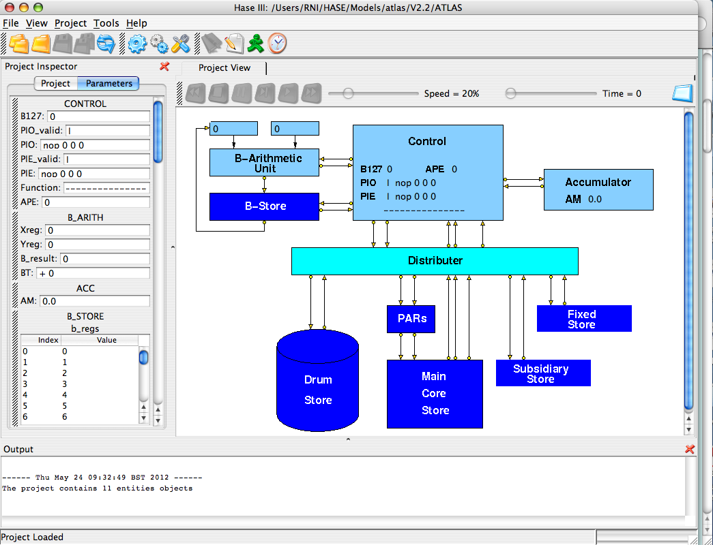
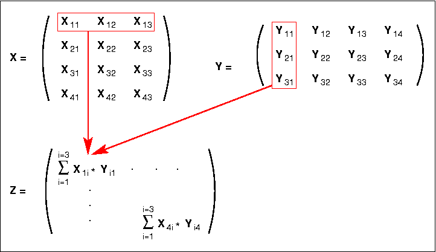

## Atlas

The first Ferranti Atlas computer was inaugurated at the University of Manchester in December 1962\. Designed by a team led by Professor Tom Kilburn, it incorporated a number of novel features, the most influential of which was Virtual Memory.

This document describes the design of the Atlas computer and explains how the HASE simulation model works. There are two versions of the model. Version 1 contains a program in its memory that demonstrates the operation of all the Atlas instructions implemented in the model. Version 2 contains a matrix multiplication program, designed to show in particular the operation of the scalar (dot) product calculation that forms the inner loop of matrix multiplication. Most early supercomputers were designed specifically to perform well on this problem, _e.g._ especially the Cray 1 of 1976\. The two versions of the model are otherwise identical.

The files for version 1 can be downloaded from [github.com/HASE-Group/atlas/tree/V1.5](https://github.com/HASE-Group/atlas/tree/V1.5). The files for version 2 can be downloaded from [github.com/HASE-Group/atlas/tree/V2.5](github.com/HASE-Group/atlas/tree/V2.5). The files for version 3 can be downloaded from [github.com/HASE-Group/atlas/tree/V3.5](github.com/HASE-Group/atlas/tree/V3.5).

Instructions on how to use HASE models can be found at [Downloading, Installing and Using HASE](http://www.icsa.inf.ed.ac.uk/research/groups/hase/models/use.html).

## Overview

The HASE user interface contains three windows. Figure 1 shows an image of the HASE user interface with the simulation model of Atlas in the main (right hand) Project View pane, model parameters (_e.g._ register and store contents) in the (left hand) Project Inspector pane. The lower, Output pane shows information produced by HASE. The icons in the top row allow the user to load a model, compile it, run the simulation code thus created and to load the trace file produced by running a simulation back into the model for animation.

**Figure 1\. The Atlas simulation model loaded into HASE**

Once a trace file has been loaded, the animation control icons at the top of the Project View window become active (Figure 2). From left to right, these allow the animation to be rewound, stopped, paused, single stepped, run or fast forwarded to the end. As the animation proceeds, packets of information can be seen passing between entities while the entities themselves change colour to reflect their states (idle, busy, waiting).

**Figure 2\. The Atlas simulation model during animation**

As indicated in the Output pane, the model contains 11 entities, 10 of which are displayed in the Project View (the 11th is a cycle counter which contains a limit on the total number of simulation time steps, to prevent run-aways). These are the B-Arithmetic Unit, the B-Store, the Control unit, the Accumulator, the Distributer, the Page Address Registers (PARs) and the Drum, Core, Subsidiary and Fixed Stores. In Figure 2 the B-Store and the Accumulator are busy, the Control unit is waiting and the rest are idle.

## The Atlas instruction set

Atlas had a 48-bit instruction word made up of a 10-bit function code, two 7-bit index addresses (Ba and Bm) and a 24-bit store address (Figure 3). Functions that operated on the Accumulator (A-codes) were thus one-address with double B-modification. B-line 0 always returned a value of 0, thus allowing for singly modified or unmodified accesses. The most significant bit of the address field distinguished between user addresses and system addresses, while the three least significant bits were used to address one of eight 6-bit characters within a store word.

**Figure 3\. Atlas instruction format**

The B-codes involved operations on one of the 128 B-lines specified by the Ba field in the instruction, Bm being used to specify a single modifier. The B-store was implemented as a fast core store (0.7 microsecs cycle time) of 120 24-bit words, together with eight flip-flop registers which served special purposes. These included the floating-point accumulator exponent, for example, and the three control registers (or program counters) used for user programs, extracode and interrupt control. The existence of these three control registers allowed the machine to switch rapidly from one context to another, while their inclusion within the addressable B-store avoided the need for separate control transfer functions. Extracodes were a set of functions which gave access to some 250 built-in subroutines held in the high-speed (0.5 microsecs) read-only fixed store. These included the more complex mathematical functions such as sin, log, etc., peripheral control orders, input/output conversion routines, etc. The extracodes made use of 30 of the B-lines, leaving 90 for use as index registers or fixed-point accumulators in user programs.

User addresses in Atlas (defined by a 0 in their most significant address bit) referred to a 1M word virtual address space, and were translated into real addresses through a set of page registers. The real store consisted of a total of 112K words of core and drum storage, combined together through the paging mechanism so as to appear to the user as a _one-level_ store [[1](#refs)]. Thus a user's total working store requirements could not exceed this amount, but code and data could be placed in any convenient part of the virtual address space. This led to an informal segmentation of the address space, a concept developed formally at MIT in MULTICS and at Manchester in MU5, the successor to Atlas.

Atlas addresses with a 1 in the most significant bit were system addresses rather than user virtual addresses, and referred to the fixed store (containing the extracodes), the subsidiary store (used as working space by the extracodes and operating system), or the V-store. The latter contained the various registers needed to control the tape decks, input/output devices, paging mechanism, etc., thus avoiding the need for special functions for this purpose. This technique of incorporating peripherals into the address space was subsequently used in a number of computer systems, notably the DEC PDP-11, and is now in common use as 'memory-mapped I/O'.

## The Simulation Model

In any simulation modelling system there is a trade-off between accuracy and performance. HASE was designed primarily as a high-level visualisation tool for computer architecture students and therefore simulates systems at register/word level rather than bit level. This inevitably imposes some limitations on the way models can be constructed, _e.g._ registers are modelled using typed variables and stores are modelled as arrays of typed variables. Thus the HASE Atlas simulation model is intended to provide a visual demonstration of the workings of the processor and memory system, rather than being designed to run real Atlas programs.

The two versions of the model available from the website contain different sequences of instructions, one designed to demonstrate the operation of each of the instructions implemented in the model, the other to demonstrate the operation of matrix multiplication, one of the most frequently used algorithms in supercomputers.

### The Drum and Core Stores

HASE models memories as arrays of elements which can be integers, floating-point numbers or instructions. Since these elements cannot be mixed together in a single array, the model takes advantage of the Atlas paging system by modelling the Drum Store as a set of pages and the Core Store as a set of blocks, each made up of 512 words, as in Atlas (though only 256 words are instantiated in the model for performace reasons), but with different blocks/pages containing different types of element.

At the start of each simulation the program and its data are contained in the Drum Store while the Core Store is empty (_i.e._ contains zeroes). The program code is in page 0 of the Drum, fixed-point integers are in page 2 and floating-point reals in page 3\. In the Core Store Block 0 is modelled as an instruction array, Block 1 as an integer array and Block 2 as a floating-point array. These arrays are themselves loaded from files such as DRUM_STORE.page0.mem when the simulation model is loaded into HASE.

The Fixed Store and Subsidiary Store are included as entities in the model but are not used in the two example simulation programs.

### The Page Address Registers

The PARs are modelled as a set of registers, each of which contains (from left to right in the Project Inspector pane) a use bit, a valid bit and an address. The initiallsation file for the Page Address Registers (PARs) sets all the PARs to zero (and thus invalid) at the start of a simulation. The first action in the simulation is an instruction access to word 0 of the virtual memory (because B127, the Program Counter, is initially set to 0). This causes a page fault in the PARs. The PARs are coded to imitate the actions of the Atlas Supervisor (the Atlas operating system) by copying page 0 from the Drum Store to block 0 of the Core Store and setting the first PAR to point to it. The actual movement of data is not shown in the visualistion (it would be very tedious to watch) but the Core Store contents are shown being updated when the first store request reaches it.

Subsequently, when accesses are made for data, similar actions occur on the first access. The first access to a fixed-point value causes a page transfer between block 2 of the Drum and page 1 of the Core, the first floating-point access a transfer between block 3 of the Drum and page 2 of the Core. A full demonstration of the paging system is beyond the scope of the current model.

### Instruction Format

Instructions are modelled as closely as possible to the Atlas format, with the Ba, Bm and Address fields being modelled as integers. However, HASE models the function field of instructions as elements of an enumerated type and these elements cannot be integers. Functions in the model are therefore of the form A314, B121, _etc_, which actually aids legibility.

### Instructions implemented in the HASE model

<table>

<tbody>

<tr>

<td>**A instructions**</td>

<td></td>

<td>**B instructions**</td>

</tr>

<tr>

<td valign="top" align="left">

<table border="">

<tbody>

<tr>

<td>A314</td>

<td>am = s</td>

</tr>

<tr>

<td>A315</td>

<td>am = -s</td>

</tr>

<tr>

<td>A320</td>

<td>am = am + s</td>

</tr>

<tr>

<td>A321</td>

<td>am = am - s</td>

</tr>

<tr>

<td>A322</td>

<td>am = s - am</td>

</tr>

<tr>

<td>A346</td>

<td>s = am, a = 0</td>

</tr>

<tr>

<td>A356</td>

<td>s = am</td>

</tr>

<tr>

<td>A362</td>

<td>am = am * s</td>

</tr>

<tr>

<td>A363</td>

<td>am = -am * s</td>

</tr>

<tr>

<td>A374</td>

<td>am = am / s</td>

</tr>

</tbody>

</table>

</td>

<td>

<table>

<tbody>

<tr>

<td> </td>

</tr>

</tbody>

</table>

</td>

<td valign="top" align="left">

<table border="">

<tbody>

<tr>

<td>B100</td>

<td>b = s - b</td>

</tr>

<tr>

<td>B101</td>

<td>b = s</td>

</tr>

<tr>

<td>B102</td>

<td>b = b - s</td>

</tr>

<tr>

<td>B103</td>

<td>b = -s</td>

</tr>

<tr>

<td>B104</td>

<td>b = b + s</td>

</tr>

<tr>

<td>B105</td>

<td>b = (64b) + s</td>

</tr>

<tr>

<td>B106</td>

<td>b = b X s</td>

</tr>

<tr>

<td>B107</td>

<td>b = b & s</td>

</tr>

<tr>

<td>B143</td>

<td>b = (b/2) - s</td>

</tr>

<tr>

<td>B147</td>

<td>b = b v s</td>

</tr>

<tr>

<td>B110</td>

<td>s = s - b</td>

</tr>

<tr>

<td>B111</td>

<td>s = -b</td>

</tr>

<tr>

<td>B112</td>

<td>s = b - s</td>

</tr>

<tr>

<td>B113</td>

<td>s = b</td>

</tr>

<tr>

<td>B114</td>

<td>s = b + s</td>

</tr>

<tr>

<td>B116</td>

<td>s = s X b</td>

</tr>

<tr>

<td>B117</td>

<td>s = b & s</td>

</tr>

</tbody>

</table>

</td>

<td valign="top" align="left">

<table border="">

<tbody>

<tr>

<td>B120</td>

<td>b = n - b</td>

</tr>

<tr>

<td>B121</td>

<td>b = n</td>

</tr>

<tr>

<td>B122</td>

<td>b = b - n</td>

</tr>

<tr>

<td>B123</td>

<td>b = -n</td>

</tr>

<tr>

<td>B124</td>

<td>b = b + n</td>

</tr>

<tr>

<td>B125</td>

<td>b = (64b) + n</td>

</tr>

<tr>

<td>B126</td>

<td>b = b X n</td>

</tr>

<tr>

<td>B127</td>

<td>b = b & n</td>

</tr>

<tr>

<td>B163</td>

<td>b = (b/2) - n</td>

</tr>

<tr>

<td>B164</td>

<td>b = b + (bm & n)</td>

</tr>

<tr>

<td>B165</td>

<td>b = bm & n</td>

</tr>

<tr>

<td>B167</td>

<td>b = b v n</td>

</tr>

<tr>

<td>B150</td>

<td>bt = s - b</td>

</tr>

<tr>

<td>B152</td>

<td>bt = b - s</td>

</tr>

<tr>

<td>B170</td>

<td>bt = n - b</td>

</tr>

<tr>

<td>B172</td>

<td>bt = b - n</td>

</tr>

</tbody>

</table>

</td>

<td valign="top" align="left">

<table border="">

<tbody>

<tr>

<td>B200</td>

<td>if bm /= 0, ba = n, bm + 1</td>

</tr>

<tr>

<td>B201</td>

<td>if bm /= 0, ba = n, bm + 2</td>

</tr>

<tr>

<td>B202</td>

<td>if bm /= 0, ba = n, bm - 1</td>

</tr>

<tr>

<td>B203</td>

<td>if bm /d = 0, ba = n, bm - 2</td>

</tr>

<tr>

<td>B210</td>

<td>if bm odd, ba = n</td>

</tr>

<tr>

<td>B211</td>

<td>if bm even, ba = n</td>

</tr>

<tr>

<td>B214</td>

<td>if bm = 0, ba = n</td>

</tr>

<tr>

<td>B215</td>

<td>if bm /= 0, ba = n</td>

</tr>

<tr>

<td>B216</td>

<td>if bm >= 0, ba = n</td>

</tr>

<tr>

<td>B217</td>

<td>if bm < 0, ba = n</td>

</tr>

<tr no="" border="">

<td></td>

<td></td>

</tr>

<tr>

<td>B220</td>

<td>if bt /= 0, ba = n, bm + 1</td>

</tr>

<tr>

<td>B221</td>

<td>if bt /= 0, ba = n, bm + 2</td>

</tr>

<tr>

<td>B222</td>

<td>if bt /= 0, ba = n, bm - 1</td>

</tr>

<tr>

<td>B223</td>

<td>if bt /= 0, ba = n, bm - 2</td>

</tr>

<tr>

<td>B224</td>

<td>if bt = 0, ba = n</td>

</tr>

<tr>

<td>B225</td>

<td>if bt /= 0, ba = n</td>

</tr>

<tr>

<td>B226</td>

<td>if bt >= 0, ba = n</td>

</tr>

<tr>

<td>B227</td>

<td>if bt < 0, ba = n</td>

</tr>

</tbody>

</table>

</td>

</tr>

</tbody>

</table>

### Floating-point Arithmetic

The model implements floating-point arithmetic using the floating-point operations provided by the underlying hardware of the computer on which the simulation runs, accessed via standard C++ operations. This is not an accurate representation of the way Atlas performed these operations, of course, but is adequate for the purposes of this demonstration. To simulate the 48-bit floating-point arithmetic used in Atlas would require bit-level coding of the Accumulator unit and would not be especially instructive, except to floating-point arithmetic gurus.

For the same reasons, the model does not implement the full set of Atlas floationg-point instructions, nor does it attempt to model the Accumulator as a double-length register. It just implements simple load, store, add, subtract, multiply and divide operations on AM, the most significant half of the Atlas double-length accumulator. Also, B124, the floating-point exponent register in Atlas, is not implemented.

## Demonstration Program

Version 1 of the model contains the demonstration program shown in Table 1 (below), together with some appropriate data. The program is initially held in Page 0 of the Drum Store and is copied into Block 0 of the Core Store following the page fault caused by the first instruction access. The integers held initially in Page 2 of the Drum Store are copied into Block 1 of the Core Store when the first integer operand access causes a page fault and likewise the floating-point numbers initially held in Page 3 of the Drum Store are copied into Block 2 of the Core Store. The program is essentially a test program that executes each of the instructions implemented in the model. These include all the B functions and the A functions as described above. The table shows the actions performed for each instruction and the resulting outcome.

AM = Accumulator, VS = Virtual Store, CS B2W8 = Core Store Block 2, Word 8

<table border="">

<tbody>

<tr>

<td>**B127**</td>

<td>**Instruction**</td>

<td>**Action**</td>

<td>**Result**</td>

</tr>

<tr>

<td>0</td>

<td>B121 0 0 42</td>

<td>Tries to load B0 with 42</td>

<td>B0 = 0</td>

</tr>

<tr>

<td>1</td>

<td>B101 18 0 8312</td>

<td>Loads B18 from VS word 1039 (for use later)</td>

<td>B18 = 527</td>

</tr>

<tr>

<td>2</td>

<td>A315 0 0 12296</td>

<td>Loads AM with VS word 1537 & negates AM</td>

<td>AM = -2.2</td>

</tr>

<tr>

<td>3</td>

<td>A314 0 0 12288</td>

<td>Loads AM from VS word 1536</td>

<td>AM = 1.1</td>

</tr>

<tr>

<td>4</td>

<td>A363 0 16 12288</td>

<td>Multiplies AM by VS word 1538 & negates AM</td>

<td>AM = -3.63</td>

</tr>

<tr>

<td>5</td>

<td>A320 24 40 12288</td>

<td>Adds VS word 1544 to AM</td>

<td>AM = 6.2</td>

</tr>

<tr>

<td>6</td>

<td>A362 24 32 12288</td>

<td>Multiplies AM by VS word 1543</td>

<td>AM = 54.56</td>

</tr>

<tr>

<td>7</td>

<td>A374 8 24 12288</td>

<td>Divides AM by VS word 1540</td>

<td>AM = 9.92</td>

</tr>

<tr>

<td>8</td>

<td>A321 8 40 12288</td>

<td>Subtracts VS word 1542 from AM</td>

<td>AM = 2.22</td>

</tr>

<tr>

<td>9</td>

<td>A322 8 16 12288</td>

<td>Subtracts AM from VS word 1539</td>

<td>AM = 2.18</td>

</tr>

<tr>

<td>10</td>

<td>A356 0 0 12352</td>

<td>Stores AM in VS word 1544</td>

<td>CS B2W8 = 2.18</td>

</tr>

<tr>

<td>11</td>

<td>A346 0 0 12360</td>

<td>Stores AM in VS word 1545 and sets AM = 0</td>

<td>CS B2W9 = 2.18, AM = 0</td>

</tr>

<tr>

<td>12</td>

<td>B100 11 0 8192</td>

<td>Subtracts value in B11 from VS word 1024 (= 512)</td>

<td>B11 = 501</td>

</tr>

<tr>

<td>13</td>

<td>B101 12 0 8200</td>

<td>Loads VS word 1025 to B12</td>

<td>B12 = 513</td>

</tr>

<tr>

<td>14</td>

<td>B102 13 0 8208</td>

<td>Subtracts VS word 1026 from B13</td>

<td>B13 = -501</td>

</tr>

<tr>

<td>15</td>

<td>B103 14 0 8216</td>

<td>Loads negated value in VS word 1027 to B14</td>

<td>B14 = -515</td>

</tr>

<tr>

<td>16</td>

<td>B104 15 0 8216</td>

<td>Adds VS word 1028 to B15</td>

<td>B15 = 531</td>

</tr>

<tr>

<td>17</td>

<td>B104 16 32 8224</td>

<td>Adds VS word (1037+4) to B16</td>

<td>B16 = 545</td>

</tr>

<tr>

<td>18</td>

<td>B106 17 0 8296</td>

<td>Forms XOR of VS word 1031 with B17</td>

<td>B17 = 534</td>

</tr>

<tr>

<td>19</td>

<td>B107 18 0 8240</td>

<td>Forms AND of VS word 1030 with B18</td>

<td>B18 = 523</td>

</tr>

<tr>

<td>20</td>

<td>B147 19 0 8216</td>

<td>Forms OR of VS word 1027 with B19</td>

<td>B19 = 531</td>

</tr>

<tr>

<td>21</td>

<td>B110 21 0 8256</td>

<td>Subtracts B21 from VS word 1032</td>

<td>CS B1W8 = 499</td>

</tr>

<tr>

<td>22</td>

<td>B111 21 0 8264</td>

<td>Stores negated value in B21 in VS word 1033</td>

<td>CS B1W9 = -21</td>

</tr>

<tr>

<td>23</td>

<td>B112 21 0 8272</td>

<td>Subtracts VS word 1034 from B21</td>

<td>CS B1W10 = -501</td>

</tr>

<tr>

<td>24</td>

<td>B113 23 0 8288</td>

<td>Stores B23 in VS word 1035</td>

<td>CS B1W11 = 23</td>

</tr>

<tr>

<td>25</td>

<td>B114 24 0 8288</td>

<td>Adds B24 to VS word 1036</td>

<td>CS B1W12 = 548</td>

</tr>

<tr>

<td>26</td>

<td>B116 26 0 8296</td>

<td>Forms XOR of B26 with VS word 1037</td>

<td>CS B1W13 = 535</td>

</tr>

<tr>

<td>27</td>

<td>B117 22 24 8280</td>

<td>Forms AND of VS word (1035+3) with B22</td>

<td>CS B1W14 = 6</td>

</tr>

<tr>

<td>28</td>

<td>B120 27 0 345</td>

<td>Subtracts value in B27 from 345</td>

<td>B27 = 318</td>

</tr>

<tr>

<td>29</td>

<td>B121 28 127 77654</td>

<td>Loads B28 with 77654 + value in B127</td>

<td>B28 = 77682</td>

</tr>

<tr>

<td>30</td>

<td>B122 29 0 54321</td>

<td>Subtracts 54321 from B29</td>

<td>B29 = -54292</td>

</tr>

<tr>

<td>31</td>

<td>B123 30 0 -8965</td>

<td>Loads -(-8965) to B30</td>

<td>B30 = 8965</td>

</tr>

<tr>

<td>32</td>

<td>B124 31 31 0</td>

<td>Adds B31 to itself</td>

<td>B31 = 62</td>

</tr>

<tr>

<td>33</td>

<td>B126 32 0 21</td>

<td>Forms XOR of B32 with 21</td>

<td>B32 = 53</td>

</tr>

<tr>

<td>34</td>

<td>B167 33 7 99</td>

<td>Forms OR of B33 with 99 + B7</td>

<td>B33 = 107</td>

</tr>

<tr>

<td>35</td>

<td>B164 34 33 35</td>

<td>Adds B33 & 35 to B34</td>

<td>B34 = 69</td>

</tr>

<tr>

<td>36</td>

<td>B165 35 33 62</td>

<td>Loads B35 with B33 & 62</td>

<td>B35 = 42</td>

</tr>

<tr>

<td>37</td>

<td>B101 36 0 1024</td>

<td>Loads B36 with CS word 512</td>

<td>B36 = 512</td>

</tr>

<tr>

<td>38</td>

<td>B163 36 0 52</td>

<td>Circular shift right B36 1 place and subtract 52</td>

<td>B36 = 204</td>

</tr>

<tr>

<td>39</td>

<td>B121 37 0 0</td>

<td>Sets B37 to 0</td>

<td>B37 = 0</td>

</tr>

<tr>

<td>40</td>

<td>B125 37 0 7</td>

<td>Circular shift B37 left 6 places and add 7</td>

<td>B37 = 7</td>

</tr>

<tr>

<td>41</td>

<td>B125 37 0 8</td>

<td>Circular shift B37 left 6 places and add 8</td>

<td>B37 = 456</td>

</tr>

<tr>

<td>42</td>

<td>B125 37 0 3</td>

<td>Circular shift B37 left 6 places and add 3</td>

<td>B37 = 29187</td>

</tr>

<tr>

<td>43</td>

<td>B125 37 0 5</td>

<td>Circular shift B37 left 6 places and add 5</td>

<td>B37 = 1867973</td>

</tr>

<tr>

<td>44</td>

<td>B125 37 0 0</td>

<td>Circular shift B37 left 6 places and add 0</td>

<td>B37 = 2109767</td>

</tr>

<tr>

<td>45</td>

<td>B127 37 0 63</td>

<td>Forms AND of B37 with 63 (selects 1st value added)</td>

<td>B37 = 7</td>

</tr>

<tr>

<td>46</td>

<td>B150 38 0 8320</td>

<td>Sets BT according to VS word 1040 - B38</td>

<td>bt = +, /0</td>

</tr>

<tr>

<td>47</td>

<td>B152 38 0 8320</td>

<td>Sets BT according to B38 - VS word 1040</td>

<td>bt = -. /0</td>

</tr>

<tr>

<td>48</td>

<td>B170 38 0 38</td>

<td>Sets BT according to B38 - 38</td>

<td>bt = +, 0</td>

</tr>

<tr>

<td>49</td>

<td>B172 38 0 29</td>

<td>Sets BT according to B38 - 39</td>

<td>bt = -, /0</td>

</tr>

<tr>

<td>50</td>

<td>B200 40 39 540</td>

<td>If B39 /=0, add 1 to B39, B40 = 540</td>

<td>B39 = 40, B40 = 540</td>

</tr>

<tr>

<td>51</td>

<td>B201 42 41 541</td>

<td>If B41 /=0, add 2 to B41, B42 = 541</td>

<td>B41 = 43, B42 = 541</td>

</tr>

<tr>

<td>52</td>

<td>B202 44 43 542</td>

<td>If B43/=0, add -1 to B43, B44 = 542</td>

<td>B43 = 42, B44 = 542</td>

</tr>

<tr>

<td>53</td>

<td>B203 46 45 543</td>

<td>If B45 /=0, add -2 to B45, B46 = 543</td>

<td>B45 = 43, B46 = 543</td>

</tr>

<tr>

<td>54</td>

<td>B200 46 0 544</td>

<td>If B0 /=0, add 1 to B0, B46 = 544 - test fails</td>

<td>B0 = 0, B46 = 543</td>

</tr>

<tr>

<td>55</td>

<td>B220 48 47 544</td>

<td>If bt /=0, add 1 to B47, B48 = 544</td>

<td>B47 = 48, B48 = 544</td>

</tr>

<tr>

<td>56</td>

<td>B221 50 49 545</td>

<td>If bt /=0, add 2 to B49, B50 = 545</td>

<td>B49 = 51, B50 = 545</td>

</tr>

<tr>

<td>57</td>

<td>B222 52 51 546</td>

<td>If bt /=0, add -1 to B51, B52 = 546</td>

<td>B51 = 50, B52 = 546</td>

</tr>

<tr>

<td>58</td>

<td>B223 55 53 547</td>

<td>If bt /=0, add -2 to B53, B55 = 547</td>

<td>B53 = 51, B54 = 547</td>

</tr>

<tr>

<td>59</td>

<td>B121 56 0 65</td>

<td>Loads B56 with 65</td>

<td>B56 = 65</td>

</tr>

<tr>

<td>60</td>

<td>B210 57 56 111</td>

<td>If B56 odd, load B57 with 111</td>

<td>B57 = 111</td>

</tr>

<tr>

<td>61</td>

<td>B121 56 0 64</td>

<td>Loads B56 with 64</td>

<td>B56 = 64</td>

</tr>

<tr>

<td>62</td>

<td>B211 58 56 222</td>

<td>If B56 even, load B58 with 222</td>

<td>B58 = 222</td>

</tr>

<tr>

<td>63</td>

<td>B121 56 0 0</td>

<td>Loads B56 with 0</td>

<td>B56 = 0</td>

</tr>

<tr>

<td>64</td>

<td>B214 59 56 333</td>

<td>If B56 = 0, load B59 with 333</td>

<td>B59 = 333</td>

</tr>

<tr>

<td>65</td>

<td>B121 56 0 42</td>

<td>Loads B56 with 42</td>

<td>B56 = 42</td>

</tr>

<tr>

<td>66</td>

<td>B215 60 56 444</td>

<td>If B56 /= 0, load B60 with 444</td>

<td>B60 = 444</td>

</tr>

<tr>

<td>67</td>

<td>B216 61 56 555</td>

<td>If B56 >=0, load B61 with 555</td>

<td>B61 = 555</td>

</tr>

<tr>

<td>68</td>

<td>B217 62 56 666</td>

<td>If B56 < 0, load B62 with 666 - test fails</td>

<td>B62 = 62</td>

</tr>

<tr>

<td>69</td>

<td>B121 56 0 -89</td>

<td>Loads B56 with -89</td>

<td>B56 = -89</td>

</tr>

<tr>

<td>70</td>

<td>B217 63 56 777</td>

<td>If B56 < 0, load B63 with 777</td>

<td>B63 = 777</td>

</tr>

<tr>

<td>71</td>

<td>B217 127 56 81</td>

<td>If B56 < 0, absolute jump to 79</td>

<td>B127 = 81</td>

</tr>

<tr>

<td>72</td>

<td>B172 64 0 64</td>

<td>Sets BT according to B64 - 64</td>

<td>bt = +, 0</td>

</tr>

<tr>

<td>73</td>

<td>B224 65 0 1111</td>

<td>If bt =0, B65 = 1111</td>

<td>B65 = 1111</td>

</tr>

<tr>

<td>74</td>

<td>B172 64 0 63</td>

<td>Sets BT according to B64 - 63</td>

<td>bt = +, /0</td>

</tr>

<tr>

<td>75</td>

<td>B225 66 0 2222</td>

<td>If bt /=0, B66 = 2222</td>

<td>B66 = 2222</td>

</tr>

<tr>

<td>76</td>

<td>B226 67 0 3333</td>

<td>If bt >=0, B67 = 3333</td>

<td>B67 = 3333</td>

</tr>

<tr>

<td>77</td>

<td>B172 64 0 65</td>

<td>Sets BT according to B64 - 65</td>

<td>bt = -, /0</td>

</tr>

<tr>

<td>78</td>

<td>B227 68 0 4444</td>

<td>If bt <0, B68 = 4444</td>

<td>B68 = 4444</td>

</tr>

<tr>

<td>79</td>

<td>B226 68 0 5555</td>

<td>If bt >=0, B68 = 5555 - test fails</td>

<td>B68 = 4444</td>

</tr>

<tr>

<td>80</td>

<td>STOP</td>

<td>Stops the simulation</td>

<td></td>

</tr>

<tr>

<td>81</td>

<td>B210 127 68 60</td>

<td>If B68 odd, B127 = 60 - test fails</td>

<td>B127 = 60</td>

</tr>

<tr>

<td>82</td>

<td>B122 127 0 10</td>

<td>Relative jump back to 72</td>

<td>B127 = 72</td>

</tr>

</tbody>

</table>

**Table 1\. The demonstration program**

## Matrix Multiplication Program

The matrix multiplication program contained in Version 2 of the HASE Atlas simulation model multiplies together a 4x3 matrix X and a 3x4 matrix Y to produce a 4x4 matrix Z, as shown in Figure 4\. The first element of the first row of Z is the scalar (dot) product of the first row of X and the first column of Y, the second is the scalar product of the first row of X with the second column of Y, _etc_.

Table 2 shows the program, which is in the form of a triple nested loop. The outer loop increments the X row at each iteration, the middle loop increments the Y column at each iteration while the inner loop forms the scalar products.

**Figure 4\. Matrix multiplication example**

<table border="" bgcolor="white">

<tbody>

<tr>

<td>**B127**</td>

<td>**Instruction**</td>

<td>**Purpose/Action**</td>

<td>**Result**</td>

</tr>

<tr>

<td>0</td>

<td>B121 1 24 0</td>

<td>B1 = X row length / Y column length (x8)</td>

<td>B1 = 24</td>

</tr>

<tr>

<td>1</td>

<td>B121 2 32 0</td>

<td>B2 = X column length / Y row length (x8)</td>

<td>B2 = 32</td>

</tr>

<tr>

<td>2</td>

<td>B121 3 0 0</td>

<td>B3 = current X row number</td>

<td>B3 = 0</td>

</tr>

<tr>

<td>3</td>

<td>B121 4 0 0</td>

<td>B4 = address of first column of current X row</td>

<td>B4 = 0</td>

</tr>

<tr>

<td>4</td>

<td>B121 5 0 0</td>

<td>B5 = current X column number</td>

<td>B5 = 0</td>

</tr>

<tr>

<td>5</td>

<td>B121 6 0 0</td>

<td>B6 = current Y column number</td>

<td>B6 = 0</td>

</tr>

<tr>

<td>6</td>

<td>B121 7 0 0</td>

<td>B7 = address of Y row element</td>

<td>B7 = 0</td>

</tr>

<tr>

<td>7</td>

<td>B121 8 0 0</td>

<td>B8 = Z index number (x8)</td>

<td>B8 = 0</td>

</tr>

<tr>

<td>8</td>

<td>A314 4 5 12288</td>

<td>Start of Loop: Loads ACC with element of X</td>

<td>ACC = X_ji_</td>

</tr>

<tr>

<td>9</td>

<td>A362 6 7 12348</td>

<td>Multiplies ACC by element of Y</td>

<td>ACC * Y_ij_</td>

</tr>

<tr>

<td>10</td>

<td>A320 8 0 12480</td>

<td>Adds element of Z to ACC</td>

<td></td>

</tr>

<tr>

<td>11</td>

<td>A356 8 0 12480</td>

<td>Writes ACC to element of Z</td>

<td></td>

</tr>

<tr>

<td>12</td>

<td>B124 5 0 8</td>

<td>Increment word address of X column number</td>

<td>B5 + 8</td>

</tr>

<tr>

<td>13</td>

<td>B124 7 2 0</td>

<td>Increment word address of Y row number</td>

<td>B7 + B2</td>

</tr>

<tr>

<td>14</td>

<td>B172 5 1 0</td>

<td>Test B5 against B1</td>

<td>Sets BT</td>

</tr>

<tr>

<td>15</td>

<td>B225 127 0 8</td>

<td>If BT /=0, jump back to start of Loop</td>

<td>B127 = 8</td>

</tr>

<tr>

<td>16</td>

<td>B121 5 0 0</td>

<td>Resets X column number to 0</td>

<td>B5 = 0</td>

</tr>

<tr>

<td>17</td>

<td>B124 6 0 8</td>

<td>Increments Y column number</td>

<td>B6 + 8</td>

</tr>

<tr>

<td>18</td>

<td>B121 7 0 0</td>

<td>Resets Y row number to 0</td>

<td>B7 = 0</td>

</tr>

<tr>

<td>19</td>

<td>B124 8 0 8</td>

<td>Increments Z index</td>

<td>B8 + 8</td>

</tr>

<tr>

<td>20</td>

<td>B172 6 2 0</td>

<td>Test B6 against B1</td>

<td>Sets BT</td>

</tr>

<tr>

<td>21</td>

<td>B225 127 0 8</td>

<td>If BT /=0, jump back to start of Loop</td>

<td>B127 = 8</td>

</tr>

<tr>

<td>22</td>

<td>B124 3 0 8</td>

<td>Increments X row number</td>

<td>B3 + 8</td>

</tr>

<tr>

<td>23</td>

<td>B124 4 1 0</td>

<td>Increment X row address</td>

<td>B4 + B1</td>

</tr>

<tr>

<td>24</td>

<td>B121 6 0 0</td>

<td>Resets Y column number</td>

<td>B6 = 0</td>

</tr>

<tr>

<td>25</td>

<td>B172 3 2 0</td>

<td>Tests B3 against B2</td>

<td>Sets BT</td>

</tr>

<tr>

<td>26</td>

<td>B225 127 0 8</td>

<td>If BT /=0, jump back to start of Loop</td>

<td>B127 = 8</td>

</tr>

<tr>

<td>27</td>

<td>STOP</td>

<td></td>

<td></td>

</tr>

</tbody>

</table>

**Table 2\. The matrix multiplication program**

## Sums of Squares

Version 3 of the HASE Atlas model contains a program written by John Buckle in 1962 as a Ferranti training exercise. Figure 5 shows the original code with comments (which include one minor mistake) and the corresponding HASE Atlas simulation code. The value of k is in virtual store word 1024\. Instead of print instructions, the first output values are written to locations 1025, 1026 and 1027, after which B8 is incremented so that subsequent sets of values are written to successive sets of 3 locations. When the simulation run ends the values in these locations are printed in the output pane of the HASE GUI. Note that this is appalling bad practice, since whereas Versions 1 and 2 differ only in terms of their memory contents, in Version 3 the simulation code for the core store entity has been modified to work with this specific Atlas machine code program. The value of k in the model is set at 8, so only produces the result 3, 4, 5\. The next set of values would be 5\. 12, 13, but the time taken for the model to run with values of k>8 is excessive.

<table>

<tbody>

<tr>

<td></td>

<td>

<table border="">

<tbody>

<tr>

<td>**B127**</td>

<td></td>

<td></td>

</tr>

<tr>

<td>0</td>

<td></td>

<td>B121 8 0 0</td>

</tr>

<tr>

<td>1</td>

<td></td>

<td>B121 1 0 0</td>

</tr>

<tr>

<td>2</td>

<td>1)</td>

<td>B124 1 0 1</td>

</tr>

<tr>

<td>3</td>

<td></td>

<td>B150 1 0 8192</td>

</tr>

<tr>

<td>4</td>

<td></td>

<td>B226 127 0 6</td>

<td>if bt>=0, skip next</td>

</tr>

<tr>

<td>5</td>

<td></td>

<td>STOP</td>

<td></td>

</tr>

<tr>

<td>6</td>

<td></td>

<td>B121 2 1 -1</td>

<td>b2=b1-1</td>

</tr>

<tr>

<td>7</td>

<td>2)</td>

<td>B124 2 0 1</td>

<td>b2=b2+1</td>

</tr>

<tr>

<td>8</td>

<td></td>

<td>B150 2 0 8192</td>

<td>bt=k-b2</td>

</tr>

<tr>

<td>9</td>

<td></td>

<td>B227 127 0 2</td>

<td>if bt>=o, ->1)</td>

</tr>

<tr>

<td>10</td>

<td></td>

<td>B121 3 2 0</td>

<td>b3 = b2</td>

</tr>

<tr>

<td>11</td>

<td>3)</td>

<td>B124 3 0 1</td>

<td>b3=b3+1</td>

</tr>

<tr>

<td>12</td>

<td></td>

<td>B150 3 0 8192</td>

<td>bt=k-b3</td>

</tr>

<tr>

<td>13</td>

<td></td>

<td>B227 127 0 7</td>

<td>if bt>=0, ->2)</td>

</tr>

<tr>

<td>14</td>

<td></td>

<td>B121 4 1 0</td>

<td>b4=b1</td>

</tr>

<tr>

<td>15</td>

<td></td>

<td>B121 5 2 0</td>

<td>b5=b2</td>

</tr>

<tr>

<td>16</td>

<td></td>

<td>B121 6 3 0</td>

<td>b6=b3</td>

</tr>

<tr>

<td>17</td>

<td></td>

<td>B1302 4 1 0</td>

<td>b4=b4*b1</td>

</tr>

<tr>

<td>18</td>

<td></td>

<td>B1302 5 2 0</td>

<td>b5=b5*b2</td>

</tr>

<tr>

<td>19</td>

<td></td>

<td>B1302 6 3 0</td>

<td>b6=b6*b3</td>

</tr>

<tr>

<td>20</td>

<td></td>

<td>B121 7 4 0</td>

<td>b7=b4</td>

</tr>

<tr>

<td>21</td>

<td></td>

<td>B124 7 5 0</td>

<td>b7=b7+b5</td>

</tr>

<tr>

<td>22</td>

<td></td>

<td>B122 7 6 0</td>

<td>b7=b7-b6</td>

</tr>

<tr>

<td>23</td>

<td></td>

<td>B214 127 7 26</td>

<td>if b7=0, ->5)</td>

</tr>

<tr>

<td>24</td>

<td></td>

<td>B217 127 7 7</td>

<td>if b7<0, ->2)</td>

</tr>

<tr>

<td>25</td>

<td></td>

<td>B121 127 0 11</td>

<td>-> 3)</td>

</tr>

<tr>

<td>26</td>

<td>5)</td>

<td>B113 1 8 8200</td>

<td>write b1 to VS word 1025+B8</td>

</tr>

<tr>

<td>27</td>

<td></td>

<td>B113 2 8 8208</td>

<td>write b2 to VS word 1026+B8</td>

</tr>

<tr>

<td>28</td>

<td></td>

<td>B113 3 8 8216</td>

<td>write b3 to VS word 1027+B8</td>

</tr>

<tr>

<td>29</td>

<td></td>

<td>B124 8 0 24</td>

<td>b8=b8+24</td>

</tr>

<tr>

<td>30</td>

<td></td>

<td>B121 127 0 7</td>

<td>-> 2)</td>

</tr>

</tbody>

</table>

</td>

</tr>

</tbody>

</table>

**Figure 5\. Sums of Squares**

## Reference

<dl compact="">

<dt><a name="kil62">**1**</a></dt>

<dd>T. Kilburn, D.B.G. Edwards, M.J. Lanigan and F.H. Sumner  
"One-level Storage System"  
_IRE Trans., Vol EC-11, pp 223-234_ 1962 [Return](#ref1)</dd>

</dl>
