## The HASE MIPS1 Model - A Simple MIPS Pipeline

The MIPS architecture was first described in 1981 by John Hennessy and his colleagues working at Stanford University. Since then it has become one of the most successful commercial RISC microprocessors and now exists in numerous versions.  The HASE MIPS1 model is a simple integer pipline version of the MIPS, based on the MIPS I instruction set.  It contains a program in its Instruction Memory that finds all prime numbers between 0 and 15. The Data Memory is initilised with the numbers 0 to 15. After the program has executed the remaining non-zero numbers in memory are prime numbers.

The files for the Simple MIPS Pipeline model can be downloaded from

<a href="mips_v1.3.zip">mips_v1.3.zip</a>

*This MIPS model, based on an earlier model of the DLX architecture, was built by David Dolman during tenure of a University of Edinburgh College of Science &amp; Engineering Strachan Scholarship.*

Instructions on how to use HASE models can be downloaded from
<https://github.comHASE-Group/hase_iii_releases>

Figure 1 shows a typical implementation of a simple pipelined MIPS architecture.  The Integer Unit is used for both data and address arithmetic, so load/store instructions are processed by the Integer Unit before being sent to the Memory Access Unit and thence to Memory. The Integer Unit also executes the additions required for integer test and relative branch instructions, so the Memory Access Unit also executes branches.

The Integer Unit receives its operands from the Instruction Decode Unit, which is closely coupled to the Registers. These consist of 32 Integer Registers. The results from both arithmetic/logic and load instructions are returned to the Registers by the Write Back Unit.

 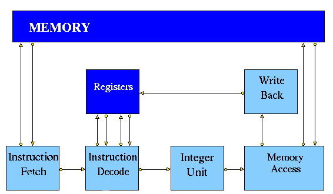
 
 **Figure 1. Typical Simple MIPS Pipeline**

### HASE MIPS1 Simulation Model

The HASE simulation of the simple pipeline version of the MIPS processor is one of a number of HASE MIPS/DLX simulations, each of which attempts to model one of the ways in which a MIPS or DLX architecture might be implemented in hardware.  The MIPS models contain entities representing each of the components in the MIPS architecture, the memory, the registers and the pipeline units, together with three other entities which aid visualisation of the activities in the system: the Clock, the Data Hazard and Pipeline displays. In all, six types of file are required to construct the model:

1. HASE definition files (EDL and ELF)
2. Entity behavioural definition files
3. Ancillary entity files (the Clock, etc)
4. Global function files
5. Icon files (held in a sub-directory)
6. Memory and register content files

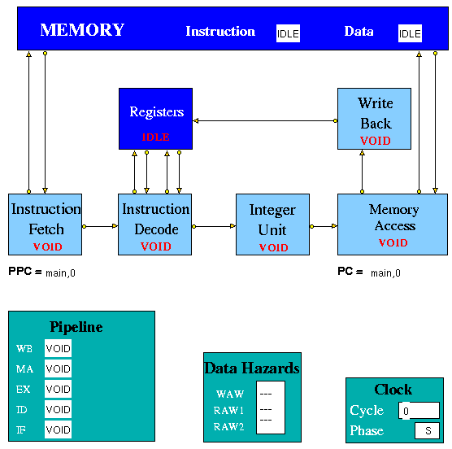
**Figure 2. The HASE MIPS1 Model**

The Clock entity sends (untraced) clock signal packets to the other units and each Unit sends a DONE signal back to clock when it has completed its actions. Each clock signal is generated when all units are done, thus ensuring that the architecture acts as a synchronous system. There are two signals in each clock period (corresponding to rising and falling edges of a squarewave in hardare) denoting the start of phases 0 and 1 of the period. Entities compute in phase 0 and communicate in phase 1. During animation the Clock icon displays the current phase of the clock (P0 or P1) and the value of a clock cycle counter. The simulation ends when the Clock Counter value reaches a parameter value set in the Parameters box or when a BREAK instruction is executed.

### MIPS1 - Instruction Set

The HASE simulation model of the MIPS with a simple pipeline implements the subset of the MIPS I instruction set shown in Tables 1a - 1f.

#### Branch and Jump Instructions

To simplify programming of the simulation model, jump and branch instructions can use either integer addresses/offsets or labels (as they would in assembly code). Labels can be added anywhere in the program; they should occupy their own line and end with a colon (:). The Demonstration program shows an example of how labels can be used.

The PC and PPC each have two fields: a label and an offset.  At the start of the simulation, the Memory entity creates a table of labels and their absolute addresses.  When fetching instructions, the Memory entity adds the offset to the label to get the absolute address of the instruction.

For a branch instruction, the use of a label differs from the use of an offset value. When an integer offset is used, the offset value in the instruction is added to the current value of the PC offset field. When a label is used, the label in the instruction is copied into the PC label field and the offset field is set to 0.

Similarly, when a jump instruction uses an integer value, the offset field in PC is set equal to this value and the label field is set to 'main'. When a jump instruction uses a label, the label in the instruction is copied into the PC label field and the offset field is set to 0.

The initial value of the label in the PPC and PC is 'main'; this is the starting address of the program (instruction memory address 0).

**Note:** Despite labels occupying their own line they do not count as instructions and therefore take up no instruction memory. This is an important consideration when using an (absolute) jump or (relative) branch, as line numbers will not reflect instruction addresses. Therefore it is advisable not to use a mixture of labels and offset values in one program.

| **Instruction** | **Description** | **Example** | **Result** |
|:-------|:------|:-------|:-------|
| LB | Load Byte | LB R3 1(R0) | Loads Byte from memory location 1 |
| LBU | Load Byte Unsigned | LBU R4 1(R0) | Loads Byte Unsigned from memory location 1 |
| SB | Store Byte | SB R1 1(R0) | Stores Byte in R1 into memory location 1 |
| LH | Load Halfword | LH R4 2(R0) | Loads Halfword from memory location 2 into R4 |
| LHU | Load Halfword Unsigned | LHU R4 2(R0) | Loads Halfword Unsigned from memory location 2 into R4 |
| LUI | Load Upper Immediate | LUI R1 124 | Load 124 in the the upper half of regester R1 |
| SH | Store Halfword | SH R5 6(R0) | Stores Halfword from R5&nbsp;into memory loction 6 |
| LW | Load Word | LW R4 8(R0) | Loads Word from data memory location word&nbsp;8 into R4 |
| SW | Store Word | SW R3 16(R0) | Stores Word in R3 into location&nbsp;16 in&nbsp;data memory |

**Table 1a. Load/Store Instructions**

| **Instruction** | **Description** | **Example** | **Result** |
|:-------|:------|:-------|:-------|
| ADDI | Add Immediate Word | ADDI R1 R2 -4 | Store R2 + -4 in R1 |
| ADDIU | Add Immediate Unsigned Word | ADDIU R1 R2 16 | Store R2 + 16 in R1 |
| ADD | Add Word | ADD R1 R2 R3 | Store R2 + R3 in R1 |
| ADDU | Add Word Unsigned | ADD R1 R2 R3 | Store R2 + R3 in R1 |
| SUB | Subtract Word | SUB R1 R2 R3 | Store R2 - R3 in R1 |
| SUBU | Subtract Word Unsigned | SUB R1 R2 R3 | Store R2 - R3 in R1 |
| SLT | Set on less than | SLT R1 R2 R3 | If R2 is less than R3 set R1 to **1** else set R1 to 0 |
| SLTI | Set on less than Immediate | SLTI R1 R2 5 | If R2 is less than 5 then set R1 to **1** else set R1 to **0** |
| SLTU | Set on less than Unsigned | SLTU R1 R2 R3 | If the unsigned value of R2 is less than the unsigned value R3 set R1 to **1** else set R1 to **0** |
| SLTIU | Set on less than Immediate Unsigned | SLTIU R1 R2 6 | If the R2 is less than 6 (after sign extension) set R1 to **1** else set R1 to **0** |

**Table 1b. Arithmetic Instructions**

| **Instruction** | **Description** | **Example** | **Result** |
|:-------|:------|:-------|:-------|
| AND | And | AND R1 R2 R3 | Stores result of R2 AND R3 into R1 |
| ANDI | And Immediate | ANDI R1 R1 19 | Stores the result of R1 AND 19 back into R1 |
| OR | Or | OR R1 R2 R3 | Stores result of R2 OR R3 into R1 |
| ORI | Or Immediate | ORI R1 R1 128 | Stores the result of R1 OR 128 back into R1 |
| XOR | Exclusive Or | XOR R1 R2 R3 | Stores result of R2 XOR R3 into R1 |
| XORI | Exclusive Or Immediate | XORI R1 R1 64 | Stores the result of R1 OR 64 back into R1 |
| NOR | Nor | NOR R1 R2 R3 | Stores result of R2 NOR R3 into R1 |
| SSL | Shift Word Left Logical | SSL R1 R2 4 | Shift R2 4 bits to the left and store in R1 |
| SRL | Shift Word Right Logical | SRL R1 R2 2 | Shift R2 2 bits to the right and store in R1 |
| SRA | Shift Word Right Arithmetic | SRA R3 R4 2 | Arithmrticaly shift R4 2 bits right and store in R3 |
| SLLV | Shift Word Left Logical Varable | SLLV R1 R2 R3 | Shift R2 left by R3 bits and store in R1 |
| SRLV | Shift Word Right Logical Varable | SRLV R1 R2 R3 | Shift R2 right by R3 bits and store in R1 |
| SRAV | Shift Word Right Arithmetic Varable | SRAV R1 R2 R3 | Shift R2 right arithemeticaly by R3 bits and store in R1 |

**Table 1c. Logical Instructions**

| **Instruction** | **Description** | **Example** | **Result** |
|:-------|:------|:-------|:-------|
| J | Jump | J 8 | Jump to instruction 8 |
| JR | Jump Register | J R1 | Jump to the instruction number held in R1 |

**Table 1d. Jump Instructions**

| **Instruction** | **Description** | **Example** | **Result** |
|:-------|:------|:-------|:-------|
| BEQ | Branch on equal | BEQ R1 R2 4 | Branch forward 4 instructions if  R1 and R2 are equal |
| BNE | Branch on not equal | BNE R1 R2 8 | Branch forward 8 instructions if  R1 and R2 are not equal |
| BLEZ | Branch on less than or equal to zero | BLEZ R2 -2 | Branch back 2 instructions if  R2 is less than or equal to zero |
| BGTZ | Branch on greater than zero | BGTZ R2 -2 | Branch back 2 instructions if  R2 is greater than zero |
| BLTZ | Branch on less than zero | BLTZ R2 3 | Branch forward 3 instructions if  R2 is less than zero |
| BGEZ | Branch on greater than or equal to zero | BGTZ R2 5 | Branch forward 5 instructions if  R2 is greater than or equal to zero |
| BLTZAL | Branch on less than zero and link | BLTZAL R2 3 | Branch forward 3 instructions if  R2 is less than zero |
| BGEZAL | Branch on greater than or equal to zero and link | BGTZAL R2 5 | Branch forward 5 instructions if  R2 is greater than or equal to zero and link |

**Table 1e. Branch Instructions**

| **Instruction** | **Description** | **Example** | **Result** |
|:-------|:------|:-------|:-------|
| BREAK | Breakpoint | BREAK | Halt |
| NOP | No Operation | NOP | No operation | 

**Table 1f. Other Instructions:**

###P ipeline Units

#### Instruction Fetch

The Instruction Fetch Unit accesses the Memory for instructions using the address in a Prefetch Program Counter (PPC). PPC is initially set equal to 0 (as is the PC register in the Memory Access Unit). If the IF Unit decodes a branch, it enters Held mode, waiting for the branch to be executed by the Memory Access Unit.  If the branch results in a change to PC (*i.e.* other than by a normal increment) the prefetched instruction waiting to be copied into the Input Buffer has to be discarded.  Because of the prefetching, there has to be at least one extra instruction (*e.g.* NOP 0) at the end of a program.

#### Instruction Decode

The Instruction Decode Unit receives instruction packets from the Instruction Fetch Unit and sends instruction/operand packets to the Integer Unit.  Before accessing operands from the Registers, it checks for data hazards (*q.v.*.  If a hazard is detected, the Unit enters the Held state and the instruction remains in the Instruction Decode Unit until the next clock, when the checks are repeated.

#### Integer Unit

The Integer Unit receive instruction/operand packets from the Instruction Decode Unit and sends instruction/operand packets to the Memory Access Unit. In the current model the result of the arithmetic/logic instruction is computed using native-mode operations of the simulation execution platform. Detailed register transfer level simulation models of the arithmetic units may be developed in the future.

#### Memory Access

The Memory Access Unit receives instruction packets from the Integer unit. Each packet contains two data fields in addition to the instruction and status fields.  Arithmetic instruction packets contain the data to be sent to the registers via the Write Back Unit in the data1 field.  Load instruction packets contain a memory address in the data1 field which is sent to the Memory Unit. The data returned from the Memory is passed to the Write Back Unit.  Store instruction packets contain a memory address in the data1 field and the data to be sent to Memory in the data2 field.  Branch instruction packets contain the new PC address or the offset in the instruction field of the packet. Conditions are evaluated in the relevant Execution Unit and carried through as bits in the Status field of the packet.  When the appropriate change has been made to the Program Counter, an untraced packet is sent to the Instruction Fetch Unit to unlock the Held condition in that Unit and to update the Prefetch Program Counter.

#### Write Back

The Write Back Unit receives packets from the Memory Access Unit. Whenever a valid packet is received, the Write Back Unit constructs a *Register Write Request* packet and sends it to the Registers. The Registers have three ports, two for reading and one for writing. The Registers unit is not clocked and acts immediately on each packet it receives.  To ensure that the simulation works correctly, there is a short delay in the Instruction Decode unit before it performs the WAW/RAW checks or reads the register values, *i.e.* a value being written in one clock cycle can also be read in that clock cycle.

### Memory and Registers

The contents of the memory and the registers are displayed in the HASE Project Inspector Panel via the Parameters tab. Sections of the Parameters display can be detached by clicking on the hashed area at the left of the section. Figure 3 shows examples of the detached memory and registers windows. Also shown is the Data Hazards display as seen in the Project pane when there is RAW hazard on register R5.

|:-----------|:------------|:----------|
| 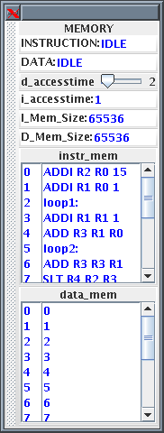 | 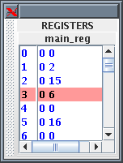 | 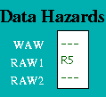 |

**Figure 3. Memory, Registers and Data Hazards Displays**

#### The Memory

The Memory contains two arrays, one for instructions and one for data. These are held separately because instructions are held in readable (string) form for visualisation purposes whilst data values are held as integers. Each word in both memories contain its own byte address as well as its instruction or data. When a project is loaded, HASE looks for files with the same name as each of the arrays declared in the .edl file, but with a .mem extension and loads the contents into the corresponding array, *e.g.* the contents of MEMORY.instr_mem.mem are loaded into the instruction memory. The default MEMORY.instr_mem.mem supplied with the project files contains a short demonstration program. Replacememt programs, which are copied into this file before a simulation us run, must contain the byte address as well as an instruction on each line.

The Memory receives instruction requests from the Instruction Fetch Unit and Read/Write requests from the Memory Access Unit and, as appropriate, either returns the contents of the requested memory word to the requesting unit or updates it.  It checks for invalid addresses, and sets an error flag in the Scoreboard if either occurs. The size of each array is determined by parameter of the Memory entity, set to 256 as a default.

#### The Registers

The Registers are defined in a similar way to the Memory. Each word in the Main Registers array contains an index number field, a data field and a 'Busy Bit' field. All the data and Busy Bit values are initially set to zero. Main Register 00 is read-only, *i.e.* writing to it has no effect.

### Data Hazards

Data Hazards occur when, for example, an instruction requires the result of a previously issued but as yet uncompleted instruction. Occurrences of these hazards are displayed by a separate Data Hazards entity in the HASE model

Data hazards are handled through <i>Use</i> bits. Each register has a Use bit which is set when an instruction that will write to the register is issued and reset when the result is written to the register. In the HASE MIPS model the registers are implemented as C++ structs with two fields: Use bit and value. In the Register Display Window shown in Figure 3, for example, Register 5 has its Use bit set and has a value of 16, while all the others are in the reset state. Before accessing a source or destination register, the Instruction Decode Unit invokes a class in the Registers entity which reads the relevant Use bit.  If the Use bit for a Register required as a source operand is set, then there is a RAW hazard, as shown for Register 5 in the Data Hazards Display window. If the Use bit for a Register required as a destination operand is set, then there is a WAW hazard.

#### The Pipeline Display

The animation facilities of HASE allow the user to observe the state of each pipeline entity (Void, Active, Held) and the contents of the memory and registers, and to see instruction/data packets moving between entities. Once these packets have arrived, however, the user can no longer see which instruction is in which unit. Displaying an instruction within or close to the corresponding icon would be possible (*c.f.* the PC and PPC values) but would clutter the display. A separate Pipeline Display entity is therefore used to allow the user to follow the progress of instructions through the pipeline.

At the start of Clock phase 0 each pipeline entity sends an (untraced) packet to the Pipeline Display entity containing a copy of the instruction and status fields from within its own input packet. If the instruction is valid, the Pipeline Display entity 'prints' the instruction to the appropriate place on the screen; if the instruction is not valid it prints 'VOID'.

### Demonstration Program

When first loaded, the model contains a program in its Instruction Memory which finds all prime numbers between 0 and 15.  The Data Memory is initilised with the numbers 0 to 15.  The program has two nested loops. The inner loop sets values in memory which are multiples of n (held in R1) to zero; n (initially set to 1) is incremented at the start of each iteration of the outer loop.  The program ends when n reaches the limit of 15 set in R2. The non-zero numbers remaining in memory are prime numbers.  The program runs for 615 clock cycles.

| **Instruction** | **Result/Comment**  |
|:--------------|:------------|
| ADDI R2 R0 15 |  R2 = R0 + 15 (=15) |
| ADDI R1 R0 1 |  R1 = R0 + 1 (=1) |
| loop1: |  Label - does not count as an instruction  |
| ADDI R1 R1 1 |  R1 = R1 + 1 (increment R1 by 1)  |
| ADD R3 R1 R0 |  R3 = R1 + R0 (copy R1 to R3)  |
| loop2: |  Label - does not count as an instruction  |
| ADD R3 R3 R1 |  R3 = R3 + R1 (increment R3 by R1)  |
| SLT R4 R2 R3 |  R4 = 1 if R2 &#60 R3 else R4 = 0  |
| BNE R4 R0 done |  Branch to <i>done</i> if R4 != R0 (R4 != 0)  |
| SLL R5 R3 2 |  R5 = R3 Left shifted 2 places  |
| J loop2 |  Branch to <i>loop2</i>  |
| SW R0 0(R5) |  Delay slot: Store R0 at memory location R5  |
| done: |  Label - does not count as an instruction  |
| BNE R1 R2 loop1 |  Branch to <i>loop1</i> if R1 != R2  |
| NOP |  Delay slot: No operation  |
| BREAK |  End the simulation  |
| NOP |  No operation  |

## The HASE MIPS2 Model - A Pipeline with Parallel Function Units

Figure 4 shows an implementation of a MIPS architecture with parallel function units. Like all register-register load/store architectures with parallel function units, the MIPS derives from the CDC 6600. To make effective use of this parallelism, the instruction set must include multiple-address (minimally two but more typically three) register-register arithmetic and logic operations, together with instructions which move data between the registers and memory, and sequencing (test and branch) instructions.

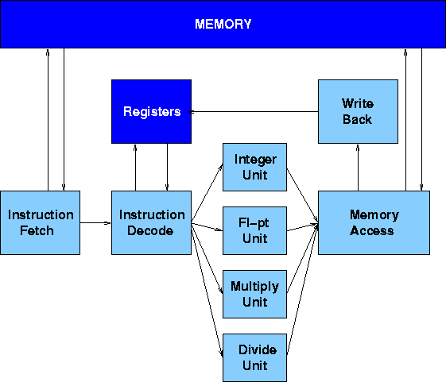

**Figure 4. MIPS with Parallel Function Units**

The CDC 6600 had ten parallel execution units but most modern systems have fewer - the HASE  MIPS2 model has four: an Integer Unit, a Floating-point Add Unit, a Multiply Unit and a Divide Unit (with both of the latter two operating on both integer and floating-point numbers). The Integer Unit is used for both data and address arithmetic, so load/store instructions are processed by the Integer Unit before being sent to the Memory Access Unit and thence to Memory. The Integer Unit also executes the additions required for integer test and relative branch instructions, so the Memory Access Unit also executes branches.

The Execution Units receive their operands from the Instruction Decode Unit, which is closely coupled to the Registers. These consist of 32 Integer registers, 32 Floating-point registers and the Hi-Lo registers used by multiply instructions. The results from both arithmetic/logic and load instructions are returned to the Registers by the Write Back Unit.

###H ASE MIPS2 Simulation Model

The HASE MIPS2 simulation model (Figure 5) is an extension of the MIPS1 model. It contains entities representing each of the components in the MIPS architecture, the memory, the registers and the pipeline units, together with three other entities which aid visualisation of the activities in the system: the Clock, the Scoreboard and the Pipeline Display.

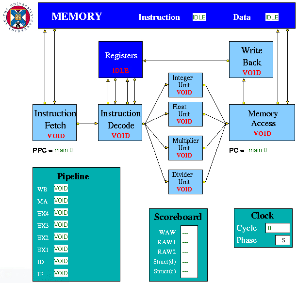

**Figure 5. The HASE MIPS2 Model**

Just as in the MIPS1 model, the Clock entity sends (untraced) clock signal packets to the other units and each Unit sends a DONE signal back to clock when it has completed its actions. Each clock signal is generated when all units are done, thus ensuring that the architecture acts as a synchronous system. There are two signals in each clock period (corresponding to rising and falling edges of a squarewave in hardware) denoting the start of phases 0 and 1 of the period. Entities compute in phase 0 and communicate in phase 1. During animation the Clock icon displays the current phase of the clock (P0 or P1) and the value of a clock cycle counter. The simulation ends when the Clock Counter value reaches a parameter value set in the Parameters box or when a BREAK instruction is executed.

#### Number Representation

In all HASE models, data items (*i.e.* numbers) in any one memory all have all to have the same type. In the DLX model, they are integers and tricky type conversions are used to deal with floating-point numbers. In the MIPS model, all numbers are floating-point, which means that numbers dislayed in the integer registers appear in floating-point format even though they are actually integers.

### MIPS2 Instructions
		
The instructions implemented in the MIPS2 model are shown in the following tables:		
		
| **Instruction** | **Description** | **Example** | **Result** |
|:-----|:--------|:---------|:-------|
| LB | Load Byte | LB R3 1(R0) | Loads Byte from memory location 1 |
| LBU | Load Byte Unsigned | LBU R4 1(R0) | Loads Byte Unsigned from memory location 1 |
| SB | Store Byte | SB R1 1(R0) | Stores Byte in R1 into memory location 1 |
| LH | Load Halfword | LH R4 2(R0) | Loads Halfword from memory location 2 into R4 |
| LHU | Load Halfword Unsigned | LHU R4 2(R0) | Loads Halfword Unsigned from memory location 2 into R4 |
| LUI | Load Upper Immediate | LUI R1 124 | Load 124 in the upper half of regester R1 |
| SH | Store Halfword | SH R5 6(R0) | Stores Halfword from R5&nbsp;into memory loction 6 |
| LW | Load Word | LW R4 8(R0) | Loads Word from data memory loaction word&nbsp;8 into R4 |
| SW | Store Word | SW R3 16(R0) | Stores Word in R3 into location&nbsp;16 in&nbsp;data memory |
| LWC1 | Load Word to an FPR | LWC1 F0 0(R0) | Loads Word from data memory location word 0 into F0 |
| SWC1 | Store Word from FPR | SWC1 F1 8(RO) | Stores Word in F1 into location 8 in data memory |

**Table 2a. Load/Store Instructions**

| ADDI | Add Immediate Word | ADDI R1 R2 -4 | Store R2 + -4 in R1 |
|:-----|:--------|:---------|:-------|
| ADDIU | Add Immediate Unsigned Word | ADDIU R1 R2 16 | Store R2 + 16 in R1 |
| ADD | Add Word | ADD R1 R2 R3 | Store R2 + R3 in R1 |
| ADDU | Add Word Unsigned | ADD R1 R2 R3 | Store R2 + R3 in R1 |
| MULT | Multiply integers | MULT R1 R2 | Store R1 x R2 in HI register |
| MULTU | Multiply unsigned integers | MULTU R3 R4 | Store R3 x R4 in HI register |
| DIV | Divide integers | DIV R1 R2 | Store R1 / R2 in HI register |
| DIVU | Divide unsigned integer | DIVU R3 R4 | Store R3 / R4 in HI register |
| SUB | Subtract Word | SUB R1 R2 R3 | Store R2 - R3 in R1 |
| SUBU | Subtract Word Unsigned | SUB R1 R2 R3 | Store R2 - R3 in R1 |
| SLT | Set on less than | SLT R1 R2 R3 | If R2 is less than R3 set R1 to **1** else set R1 to **0** |
| SLTI | Set on less than Immediate | SLTI R1 R2 5 | If R2 is less than 5 then set R1 to **1** else set it to **0** |
| SLTU | Set on less than Unsigned | SLTU R1 R2 R3 | If the unsigned value of R2 is less than the unsigned value R3 set R1 to **1** else set it to **0** |
| SLTIU | Set on less than Immediate Unsigned | SLTIU R1 R2 6 | If the R2 is less than 6 (after sign extension)set R1 to **1** else set it to **0** |

**Table 2b. Arithmetic Integer Instructions**

| **Instruction** | **Description** | **Example** | **Result** |
|:-----|:--------|:---------|:-------|
| AND | And | AND R1 R2 R3 | Stores result of R2 AND R3 into R1 |
| ANDI | And Immediate | ANDI R1 R1 19 | Stores the result of R1 AND 19 back into R1 |
| OR | Or | OR R1 R2 R3 | Stores result of R2 OR R3 into R1 |
| ORI | Or Immediate | ORI R1 R1 128 | Stores the result of R1 OR 128 back into R1 |
| XOR | Exclusive Or | XOR R1 R2 R3 | Stores result of R2 XOR R3 into R1 |
| XORI | Exclusive Or Immediate | XORI R1 R1 64 | Stores the result of R1 OR 64 back into R1 |
| NOR | Nor | NOR R1 R2 R3 | Stores result of R2 NOR R3 into R1 |
| SSL | Shift Word Left Logical | SSL R1 R2 4 | Shift R2 4 bits to the left and store in R1 |
| SRL | Shift Word Right Logical | SRL R1 R2 2 | Shift R2 2 bits to the right and store in R1 |
| SRA | Shift Word Right Arithmetic | SRA R3 R4 2 | Arithmetically shift R4 2 bits right and store in R3 |
| SLLV | Shift Word Left Logical Variable | SLLV R1 R2 R3 | Shift R2 left by R3 bits and store in R1 |
| SRLV | Shift Word Right Logical Variable | SRLV R1 R2 R3 | Shift R2 right by R3 bits and store in R1 |
| SRAV | Shift Word Right Arithmetic Variable | SRAV R1 R2 R3 | Shift R2 right arithmetically by R3 bits and store in R1 |

**Table 2c. Logical Instructions**

| **Instruction** | **Description** | **Example** | **Result** |
|:-----|:--------|:---------|:-------|
| BC1F | Branch on FP condition code false | BC1F loop | Branch to label 'loop' if FP code is false |
| BC1T | Branch on FP condition code true | BCT1 loop | Branch to label 'loop' if FP code is true |
| J | Jump | J 8 | Jump to instruction 8 |
| JR | Jump Register | J R1 | Jump to the instruction number held in R1 |

**Table 2d. Jump Instruction**

| **Instruction** | **Description** | **Example** | **Result** |
|:-----|:--------|:---------|:-------|
| BEQ | Branch on equal | BEQ R1 R2 4 | Branch forward 4 instructions if&nbsp;R1 and R2 are equal |
| BNE | Branch on not equal | BNE R1 R2 8 | Branch forward 8 instructions if R1 and R2 are not equal |
| BLEZ | Branch on less than or equal to zero | BLEZ R2 -2 | Branch back 2 instructions if R2 is less than or equal to zero |
| BGTZ | Branch on greater than zero | BGTZ R2 -2 | Branch back 2 instructions if R2 is greater than zero |
| BLTZ | Branch on less than zero | BLTZ R2 3 | Branch forward 3 instructions if R2 is less than zero |
| BGEZ | Branch on greater than or equal to zero | BGTZ R2 5 | Branch forward 5 instructions if R2 is greater than or equal to zero |

**Table 2e. Branch Instructions**

| **Instruction** | **Description** | **Example** | **Result** |
|:-----|:--------|:---------|:-------|
| BREAK | Breakpoint | BREAK | Halt |
| NOP | No Operation | NOP | No operation |

**Table 2f. Other Instructions**

| **Instruction** | **Description** | **Example** | **Result** |
|:-----|:--------|:---------|:-------|
| MFHI | Copy the special purpose HI register to a GPR | MFHI R2 | Copies the HI register to R2 |
| MFLO | Copy the special purpose LO register to a GPR | MFLO R2 | Copies the LO register to R2 |
| MTHI | Copy a GPR to the special purpose HI register | MFHI R5 | Copies R5 to the HI register |
| MTLO | Copy a GPR to the special purpose LO register | MFLO R5 | Copies R5 to the LO register |
| MTC1 | Copy a word from a GPR to a FPU register | MTC1 R3 F2 | Copies R3 to F2 |
| MFC1 | Copy a word from a FPU register to a GPR | MFC1 R5 F3 | Copies F3 to R5 |
| MOVS | Copy a word between FPU registers | MOVS F1 F2 | Copies F2 to F1 |

**Table 2g. Move Instructions**

| **Instruction** | **Description** | **Example** | **Result** |
|:-----|:--------|:---------|:-------|
| CVTWS | Convert a FP value to a 32-bit fixed-point value | CVTWS F0 F2 | The value in F2 is converted to a 32-bit word and stored in F0 |
| CVTSW | Convert a 32-bit fixed-point to a FP value | CVTSW F0 F1 | The value in F1 is converted to a FP value and stored in F0 |

**Table 2h. Floating point Conversion Instructions**

| **Instruction** | **Description** | **Example** | **Result** |
|:-----|:--------|:---------|:-------|
| ABSS | Compute absolute value of an FP value | ABSS F2 F3 | Store absolute value of F3 in F2 |
| ADDS | Add FP values | ADDS F1 F2 F3 | Store F2 + F3 in F1 |
| NEGS | Negate an FP value | NEGS F1 F2 | The negated value of F2 is stored in F1 |
| SUBS | Subtract FP values | SUB F1 F2 F3 | Store F2 - F3 in F1 |
| MULS | Multiply FP values | MULS F1 F2 F3 | Store F2 x F3 in F1 |
| DIVS | Divide FP values | DIVS F1 F2 F3 | Store F2 / F3 in F1 |

**Table 2i. Floating point Arithmetic Instructions**

| **Instruction** | **Description** | **Example** | **Result** |
|:-----|:--------|:---------|:-------|
| CFS | Set FP condition code false | CFS R1 R2 | Sets FP condition code false |
| CEQS | Set FP condition code on equal | CEQS R2 R3 | Sets FP condition code true if R2 is equal to R3 else set it false |
| COLTS | Set FP condition code on less than | COLTS R3 R4 | Sets FP condition code true if R3 is less than R4 else set it false |
| COLES | Set FP condition code on less than or equal to | COLES R4 R5 | Sets FP condition code true if R4 is less than or equal to R5 else set it false |

** Table 2j. Floating point Compare Instructions**

### Pipeline Units

The Instruction Fetch, Instruction Decode, Memory Access and Write Back entities are copies of the corresponding entities in the MIPS1 model.

#### Execution Units

The Execution Units receive instruction/operand packets from the Instruction Decode Unit and send instruction/operand packets to the Memory Access Unit. Each contains a pipeline with length equal to its latency value. Except in the case of the Integer Unit, which has a fixed latency value of 1, this value is a parameter of the Unit, and the code is designed to deal with any value (>= 1) up to a maximum of 8 so that it can be common to all units. In the current model the result of the arithmetic/logic instruction is computed in the first stage of each unit, using native-mode operations of the simulation execution platform, and simply copied through the remaining pipeline stages. Detailed register transfer level simulation models of the arithmetic units may be developed in the future.

### Memory and Registers

As in the MIPS1 model, the contents of the memory and the registers are displayed in the HASE Project Inspector Panel via the Parameters tab. Sections of the Parameters display can be detached by clicking on the hashed area at the left of the section. Figure 6 shows examples of the detached memory and registers windows.

#### The Memory

The Memory contains two arrays, one for instructions and one for data. These are held separately because instructions are held in readable (string) form for visualisation purposes whilst data values are held as floats. Each word in both memories contain its own byte address as well as its instruction or data. When a project is loaded, HASE looks for files with the same name as each of the arrays declared in the .edl file, but with a .mem extension and loads the contents into the corresponding array, *e.g.* the contents of MEMORY.instr_mem.mem are loaded into the instruction memory. The default MEMORY.instr_mem.mem supplied with the project files contains a short demonstration program. Replacememt programs, which are copied into this file before a simulation is run, must contain the byte address as well as an instruction on each line.

The Memory receives instruction requests from the Instruction Fetch Unit and Read/Write requests from the Memory Access Unit and, as appropriate, either returns the contents of the requested memory word to the requesting unit or updates it. It checks for invalid addresses, and sets an error flag in the Scoreboard if either occurs. The size of each array is determined by parameter of the Memory entity, set to 256 as a default.

| 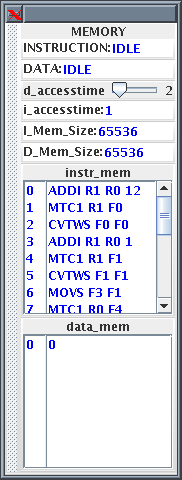 | 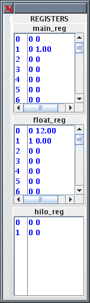 |
|:-----------|:------------|

**Figure 6. MIPS2 Memory and Registers Displays**

#### The Registers

The Registers are defined in a similar way to the Memory. Each word in the Main Registers array, Floating-point Registers array, and the Hi-Lo Registers array contains an index number field, a data field and a 'Busy Bit' field. All the data and Busy Bit values are initially set to zero. Main Register 00 is read-only, *i.e.* writing to it has no effect.

The Hi-Lo Register is used to hold the result of MULT and DIV instructions with 64 bit accuracy. However this model simplifies the Hi-Lo registers using only the Hi register to return the result of a integer multiply or divide, for future development however the Lo register is also include in the model.

### The Scoreboard

The Scoreboard is implemented as a separate entity which works in conjunction with the Instruction Decode unit to implement the mechanisms needed to deal with data and structural hazards. The Scoreboard also shows when and why the various hazards occur.

#### Data Hazards

The Scoreboard handles data hazards through Use bits. Each register has a Use bit which is set when an instruction that will write to the register is issued and reset when the result is written to the register. In the HASE MIPS2 model the registers are implemented as C++ structs with three fields: register number, value and Use bit. In Figure 7(a), for example, which shows a sub-set of the floating-point registers, Register 1 has its Use bit set, while all the others are in the reset state. (Register 0 is highlighted because it was the last one to be accessed.) Before accessing a source or destination register, the Instruction Decode Unit invokes a class in the Registers entity which reads the relevant Use bit. If the Use bit for a Register required as a source operand is set, the Scoreboard registers a RAW hazard; if the Use bit for a Register required as a destination operand is set, the Scoreboard registers a WAW hazard.

Figure 7(b) shows the Scoreboard display when the first of the following pair of instructions reaches the Integer Execution Unit:

LW R1 1(R0)
ADDI R1 R1 2

The first instruction loads R1 with a value accessed from memory, and until it completes, the second instruction, which increments R1, suffers both a WAW and a RAW hazard. In the following sequence:

 LF F1 4(R0)
LF F2 5(R0)
ADDS F3 F1 F2

the third instruction requires the values which the previous two instructions load into F1 and F2, and when it reaches the Instruction Decode Unit, it suffers a RAW hazard on both its source operands, as illustrated in Figure 7(c).

|  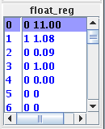 | 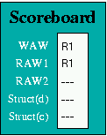 | 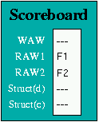|
|:-----:|:-----:|:-----:|
| (a) | (b) | (c) |
| | 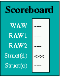 | 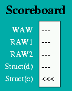|
| | (d) | (e) |

**Figure 7. Hazard Displays**

#### Structural Data Hazards

Structural Hazards occur when two instructions try to use the same pipeline stage simultaneously. In the HASE MIPS model, this situation can (potentially) occur in the Memory Access unit. Thus although there are four arithmetic Execution Units operating in parallel, the Memory Access Unit can only receive one result from these units in any one clock period. If the Instruction Decode Unit issues a 3-clock multiply instruction in one clock period, for example, then it cannot be allowed to issue a 2-clock floating-point add instruction in the immediately subsequent clock period because the floating-point add instruction would then arrive at the Memory Access Unit at the same time as the multiply instruction.

To ensure that such situations are correctly handled, the Scoreboard maintains a Latency Pipeline. When an instruction is issued, its latency value is entered into the Latency Pipeline. As an instruction moves through the Execution Unit pipeline, its latency value moves through the Latency Pipeline, decremented by 1 at each move. Thus a multiply instruction has a latency of 3 when it is issued, but in the next clock its remaining latency is only 2.

As latency values are moved through the Latency Pipeline in each clock period, the presence or absence of each possible latency value is recorded. If an instruction about to be issued to one of the execution units has the same latency value as an instruction already in the Latency Pipeline, it is held up for one clock period and then the check is performed again. Once there is no latency value in the Latency Pipeline equal to the new instruction's latency value, it can be issued. The Scoreboard displays the existence of a Struct(d) hazard as shown in Figure 7(d). 

#### Structural Control Hazard

Branch instructions require an operand to be accessed via the normal route through the Integer Unit, so in the HASE model the Program Counter has been placed in the Memory Access Unit. Since any instructions following a Conditional Branch might have to be discarded, the Instruction Fetch Unit detects the presence of a Branch and goes into the Held state. It sends a copy of the Branch down the pipeline and then waits until the Memory Access Unit sends it the new PC value. This value is copied into PPC; the Instruction Fetch Unit returns to the Active state and recommences instruction fetching from the Memory.

A Branch cannot, in any case, be executed until all previous instructions have completed. Since a Branch instruction passing through the Integer Unit could overtake an instruction in the Multiply or Divide Units, a Branch must also be held up in the Instruction Decode Unit until there are no instructions in any of the Execution Units. This condition is monitored by the Scoreboard, which records the presence of any instruction with a latency value greater than zero in its Latency Pipeline, and displayed as a Struct(c) hazard as shown in Figure 7(e).

Clearly there are many alternative strategies for dealing with Branch instructions which could be modelled, and different HASE models will be developed over time. The current model shows the hold-ups ocurring in the Instruction Fetch and Instruction Decode Units and the values of PC and PPC changing.

### Scoreboard Demonstration

The model contains a program in its Instruction Memory which generates 'e', the natural number. The instructions cause the following actions to occur:

|**0:** | ADDI R1 R0 12 | R1 = R0 + 12 (=12) |
|:-----|:----------|:---------|
|**1:** | MTC1 R1 F0 | F0 = R1 (copy R1 to F0) |
|**2:** | CVTWS F0 F0 | F0 = F0 converted from 32-bit fixed point to a FP value (=12.0) |
|**3:** | ADDI R1 R0 1 | R1 = R0 + 1 (=0) |
|**4:** | MTC1 R1 F1 | F1 = R1 (copy R1 to F1) |
|**5:** | CVTWS F1 F1 | F1 = F1 converted from 32-bit fixed point to a FP value (=1.0) |
|**6:** | MOVS F3 F1 | F3 = F1 (copy F1 to F3) |
|**7:** | MTC1 R0 F4 | F4 = R0 (copy R0 to F4) |
|**8:** | CVTWS F4 F4 | F4 = F4 converted from 32-bit fixed point to a FP value (=0.0) |
|**loop:** || Label (loop) - does not count as an instruction |
|**9:** | DIVS F2 F3 F0 | F2 = F3 / F0 |
|**10:** | MULS F1 F1 F2 | F1 = F1 x F2 |
|**11:** | SUBS F0 F0 F3 | F0 = F0 - F3 (decrement F0 by 1) |
|**12:** | ADDS F1 F1 F3 | F1 = F1 + F3 (increment F1 by 1) |
|**13:** | CEQS F0 F4 | If F0 = F4 (F0 = 0) set the FP condition code to true, else to false |
|**14:** | BC1F loop | Branch to label <i>loop</i> if the condition code is false |
|**15:** | NOP | No operation |
|**16:** | SWC1 F1 0(R0) | Store the value in F1 to memory byte location 0 |
|**17:** | BREAK | Halt the processor |
|**18:** | NOP | No operation |

