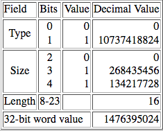

## MU5

MU5 was the fifth computer system to be designed and built at the University of Manchester, in succession to a series of innovative projects dating back to the late 1940s. MU5 introduced a number of new ideas, particularly in terms of its instruction set, which was designed with high-level language compilation in mind, and novel uses for associative stores. The technical aspects of the project have been well documented in numerous papers and a book. Many of the design ideas developed in MU5 were used in the ICL 2900 series of computers.

This document describes the design of the MU5 computer, explains how the HASE simulation model works and includes a list of relevant publications. The most recent version of the model (V4.1) includes a Console entity containing a **Prog_No** parameter that can be edited after the model has been loaded into HASE. **Prog_No** can take values of 0, 1. 2 allowing the user to select one of three programs contained in the model.  Program 0 demonstrates the operation of the MU5 Name Store, Program 1 executes a scalar product program, Program 2 demonstrates the use of string processing instructions.

The files for version 4 can be downloaded from <a href="http://www.icsa.inf.ed.ac.uk/research/groups/hase/models/mu5/MU5_V4.1.zip">MU5_V4.1.zip</a>.

Instructions on how to use HASE models can be found at <a href="http://www.icsa.inf.ed.ac.uk/research/groups/hase/models/use.html" target="_blank">Downloading, Installing and Using HASE</a>.

### Overview

Figure 1 shows an image of the HASE user interface with the simulation model of MU5 in the main (right hand) Project View pane and model parameters *e.g. register and store contents) in the (left hand) Project Inspector pane. The lower, Output pane shows information produced by HASE. The icons in the top row allow the user to load a model, compile it, run the simulation code thus created and to load the trace file produced by running a simulation back into the model for animation.

**Figure 1. The MU5 simulation model loaded into HASE**

Once a trace file has been loaded, the animation control icons at the top of the Project View window become active (Figure 2). From left to right, these allow the animation to be rewound, stopped, paused, single stepped, run or fast forwarded to the end.  As the animation proceeds, packets of information can be seen passing between entities while the entities themselves change colour to reflect their states (idle, busy, waiting).

**Figure 2. The MU5 simulation model during animation**

The model contains 23 active units (entities in simulation terms). These are the Console, the two parts of the Instruction Buffer Unit, the six stages of the Primary Operand Unit (PROP), plus one for PROP itself (containing the beat generation code), the Central Highway, the B-Arithmetic Unit, the Descriptor Addressing and the Descriptor Operand Processing Units, the three sections of the Operand Buffer System, the Accumulator Unit, the Store Access Control Unit (containing the Current Page Registers), the Local Store and the Disc Store. Although they are shown on-screen as parts of the model, the IBU, Name Store, SEOP and Operand Buffer System entities are simply icons, with no corresponding simulation code. The 23rd entity is a time counter containing a limit on the total number of simulation time steps, to prevent run-aways; its icon is the key to the unit states.

### MU5 Design Considerations

During the design of MU5 the prime target was fast, efficient processing of high-level language programs in an interactive environment.  This requirement led to the need for an instruction set which satisfied the following conditions:

1. Generation of efficient code by compilers must be easy.
2. Programs must be compact.
3. The instruction set must allow a pipeline organisation of the processor leading to a fast execution rate.
4. Information on the nature of operands should be available to allow optimal buffering of operands.

Algol and FORTRAN were taken as being typical of two major classes of programming languages in common use at the time, distinguished by the use of recursive routines (or procedures) and dynamic storage allocation in the former, and non-recursive routines and compile time storage allocation in the latter, but having the following features in common:

1. Each routine has local working space consisting of named variables of integer (fixed-point) and real (floating-point) types, and structured data sets (arrays, for example) which are also named.
2. A routine may refer to non-local names either of an enclosing routine or in a workspace common to all routines.
3. Statements involve an arbitrary number of operands which may be real names, array elements, function calls or constants.

In order to reconcile feature 3 with condition 1 and 4, it was decided that there would be an address form corresponding to each of the different operand forms.  However, it was felt that to have more than one such operand specification per instructions would conflict with conditions (2) and (3). The option of using addressable fast registers to allow short instructions was also rejected.  There were two arguments against registers.  The first was the desire to simplify the software by eliminating the need for compilers to optimise their use. The second was the desire to avoid the need to dump and restore register values during procedure entry and exit and process changes. The alternative arrangement proposed for MU5 was a small associatively addressed Name Store, described in more detail below.

### The MU5 instruction set

*To avoid tortuous grammatical constructs, the following description of MU5 is written in the present tense, even though the real MU5 no longer exists.*

The instruction format chosen for MU5 represents a merger of single address and stacking machine concepts.  All the arithmetic and logical operations involve the use of an accumulator and an operand specified in the instruction, but there is a variant of the load order (*=) which causes the accumulator to be stacked before being re-loaded.  In addition, there is an address form (STACK) which unstacks the last stacked quantity.  Thus the expression

RESULT := (A + B) * ((C + D)/(E + F))

can be compiled into

ACC =  A  
ACC +  B  
ACC *= C  
ACC +  D  
ACC *= E  
ACC +  F  
ACC &#8709; STACK
ACC *  STACK  
ACC => RESULT 

The function <tt> &#8709;</tt> is *reverse divide*
(*i.e.* ACC = STACK/ACC); if the operand to the left of an operator is stacked, it subsequently appears as the right hand side of a machine function (as the dividend in this case).  Thus, for the non-commutative operations <tt> -</tt> and <tt> /</tt>, the corresponding reverse operations have to be provided. In pure stacking machines, all subtractions and divisions are implicitly reverse operations.

The instruction set is summarised in Figure 3. There are two basic formats, one for computational functions and one for organisational functions (control transfers, base register manipulations, *etc*.). They are distinguished by the *type of function* bits and use four and six bits respectively to specify the function.  The remaining nine or seven bits specify the *primary* operand.  The *k* field indicates the kind of operand, and determines how the *n* field is interpreted.  Where the *k* field indicates the Extended Operand Specification, the instruction is extended by an additional 16 bits in the case of a name, or by 16, 32, or 64 bits in the case of a literal.

**Figure 3. The MU5 instruction set**

The virtual address space is formally segmented: the unique identity of store words belonging to different processes is maintained by splitting the address into three separate fields, a 4-bit Process Number, a 14-bit Segment Number, and a 16-bit address defining a 32-bit word within a segment. Segments 8192 to 16383 are common to all processes, allowing a single copy of a compiler, for example, to be shared by all active processes. Scalar variables are normally held in a single segment of a process (normally segment 0) at addresses formed by adding the 6 or 16-bit name in the instruction to the contents of the Name Base register (RNB).  The name segment number and the process number (both held in special registers in the processor) are concatenated with these addresses to form the full virtual addresses required for store accessing. The value held in RNB is unique to the name space associated with each procedure, and is altered at each procedure change.  Accesses to names of other procedures and to common variables are made using the Extra Name Base (RXNB), while using zero as base allows absolute addressing into the Name Segment (to access the Name Base values of different procedures, for example).  The Stack Front register (RSF) points to the area immediately beyond the name space of the current procedure, so that stacked variables are contained within the same address space as the names.  RSF is automatically incremented or decremented during the execution of a stacking function or a STACK operand access respectively.

Scalar variables can be of size 32 bits and 64 bits. They are accessed from a 32-line Name Store using an address formed by adding the name to the base register specified in the instruction (implicitly the Name Base in 16-bit instructions). The Name Store has two parts, 32 associatively accessed address registers and 32 64-bit value registers, so although a name + base address can point to a 32-bit variable, the base registers themselves can only point to 64-bit quantities. Thus the least significant bit of each of the base registers is set to zero and the name of a 64-bit variable is shifted left one place before being used to form an address.

Access to array elements is achieved through a descriptor mechanism. When a data structure element is specified by the *k* field, the corresponding primary operand is a 64-bit descriptor.  This descriptor is sent to a D-unit within the processor, together with the contents of the B register if the *k* field specifies modification.  The D-unit interprets the descriptor and makes a *secondary* store access for the element.  This detachment of secondary addresses from instructions, and the use of names within instructions, allows the full 30-bit virtual address space available to a process to be referenced by 16-bit instructions.

There are two main types of descriptor:

<table no border>
<tr><td> Vector descriptor: </td><td> Tv </td><td> Bound </td><td> Origin</td></tr>
<tr><td> String descriptor: </td><td> Ts </td><td> Length </td><td> Origin </td></tr>
<tr align=center><td> </td><td>  8 </td><td>  24 </td><td>  32 </td></tr>
</table>

The size of the elements in a vector is specified within the type bits (Tv) and may be between 1 and 64 bits.  If the operand access is modified, the modifier must be greater than or equal to zero and less than the bound.  This check is carried out automatically by hardware with virtually no time penalty, and removes the need for the costly software bound check which is often required, particularly during program development.

String descriptors describe strings of bytes.  The length field specifies the number of bytes, and the origin specifies the byte address of the first byte.  Strings are normally used in conjunction with string processing orders (which may be two-address operations involving the use of two descriptors).  These orders provide facilities for the manipulations of data records in languages such as COBOL, PL/1 and Algol 68 (move, compare, logically combine, *etc*.).

### The Simulation Model

In any simulation modelling system there is a trade-off between accuracy and performance. HASE was designed primarily as a high-level visualisation tool for computer architecture students and therefore simulates systems at register/word level rather than bit level. This inevitably imposes some limitations on the way models can be constructed, *e.g.* registers are modelled using typed variables and stores are modelled as arrays of typed variables. Thus the HASE MU5 simulation model is intended to provide a visual demonstration of the workings of the processor and memory system, rather than being designed to run real MU5 programs. There are also constraints on nomenclature. The type field, function field, etc in instructions are modelled using the C++ enum construct, the elements of which can only contain alphanumeric characters. Thus the MU5 function '<tt>NB&nbsp;=</tt>', for example, is represented in the model as '<tt>NBld</tt>' and the base registers are given the names used in the hardware design diagrams (RNB, RXNB, RSF) to avoid clashes with NB, XNB, SF in instructions.

### The Instruction Set

The MU5 instruction set used in the model follows the spirit of the original, rather than the detail, in particular because the instruction format and size have to be fixed in HASE, rather than both being variable as they were in MU5. In fact these restrictions are not particularly significant: it was difficult for compilers to optimise object code to use the short-form 16-bit format, so apart from the long literals option (32-bit and 64-bit), most instructions were 32 bits long anyway. The instruction set of the ICL 2900 series, which was closely modelled on that of MU5, did not allow the long literal options and the MU5 hardware designers would themselves have gladly forgone this option.

Figure 4 shows the instruction set used in the model. The additional *Type of Instruction* (T) character is included in instruction registers, and in packets containing instructions, to represent the extra function bits that were used in the hardware of MU5 to control the execution of instructions. Details are given below in the Primary Operand Unit section.

**Figure 4. The HASE MU5 instruction set**

The functions are shown in Tables 1 and 2 below. Empty boxes correspond to functions that have not yet been implemented in the model (and in some cases may never be), or did not exist in the real MU5. "Op" means "operand".

The B functions correspond exactly to those mplemented in MU5. COMP (*compare*) sets the two test bits T1 (=&nbsp;0 / &#8800;&nbsp;0) and T2 (&#8805;&nbsp;0 / <&nbsp;0) according to the result of <tt>B - operand</tt>; B itself remains unaltered. In the real MU5, a third test bit (T0) was set to 1 if the comparison produced an overflow; in the model, an arithmetic overflow would be caught by the underlying runtime system, so T0 is not implemented.  CINC (*compare & increment*) acts similarly but increments B after the comparison. CINC was intended for use with a subsequent conditional branch instruction in the implementation of *for* loops.

The ACC (Accumulator) functions are implemented in the model in exactly the same way as the corresponding B functions, *i.e.* as 32-bit integer operations, rather than as floating-point operations. The reason for this is explained below in the Address Space section.

The STS functions (SLGC, SMVB, SCMP, BLGC, BMVB, BMVE, SMVF, BSCN and BCMP) perform string processing operations. They were designed for use in record processing applications written in languages such as COBOL, PL/1 and Algol68. Their operation is explained in the description of the actions that take place during execution of the String Processing Program (Progam 2 in the model,

| Function | Action | Function | Action | Function | Action | Function | Action |
| :-------: | :---------: | :-------: | :-------: | :-------: | :-------: | :-------: | :-------: |
| BR | ->   (CO = CO + Op) | EXIT | | | | | |
| JUMP |CO = Op |RETURN| | | | | |
| XC0 | eXecutive&nbsp;Call (not&nbsp;implemented) | XC1  | | XC2 |  | XC3  |   |
| XC4 |  |XC5| | XC6 |  | STACK&nbsp;LINK  | |
| MS = |  | | | | | SET LINK  |  |
| XNB_LD | RXNB = Op |  |  | XNB_PL| RXNB&nbsp;=&nbsp;RXNB&nbsp;+&nbsp;Op | XNB_ST| RXNB&nbsp;=>&nbsp;Op |
| SF_LD | RSF = Op | SF_PL | RSF&nbsp;=&nbsp;RSF&nbsp;+&nbsp;Op | SFNB_PL | RSF = RNB + Op | SF_ST | RSF => Op  |
| NB_LD | RNB = Op | NBSF_PL | RNB = RSF + Op | NB_PL | RNB = RNB + Op | NB_ST | RNB => Op  |
| BReq | -> if = 0 | BRne | -> if /= 0 | BRge | -> if >= 0 | BRlt | -> if < 0 |
| BRle | -> if =< 0 | BRgr | -> if > 0 | OVERFLOW | -> if overflow  (not implemented) | BRBn | -> if Bn = 1 |
| Bneq | Set Bn if = 0 | Bnne | Set Bn if /= 0 | Bnge | Set Bn if >= 0 | Bnlt | Set Bn if < 0 |
| Bnle | Set Bn if =< 0 | Bngr | Set Bn if > 0 | OVERFLOW | Set Bn if overflow  (not implemented) | BnBn | Set&nbsp;Bn&nbsp;if&nbsp;Bn&nbsp;=&nbsp;1 |
|  |  |   |   |  |  |   |   |
|  |  |   |   |  |  |   |   |
|  |  |   |   |  |  |   |   |
|  |  |   |   |  |  |   |   |

**Table 1. Organisational Instructions**

| Function | Action | Function | Action | Function | Action | Function | Action |
| :-------: | :-------: | :-------: | :-------: | :-------: | :-------: | :-------: | :-------: |
| LD  | B = Op  |XDO_LD|XDO = Op|DO_LD|DO = Op| LD  | ACC = Op  |
| LDD | B = Op - 1 |XD_LD|XD = Op|D_LD|D = Op| nop |  |
| SLD | Stack B  B = Op |STACK |Stack Op |D_SLD|Stack D D = Op| SLD | Stack ACC  ACC = Op |
| ST |  B => Op|XD_ST|XD => Op|D_ST|D => Op| ST |  ACC => Op|
| ADD | B = B + Op |XDB_LD|XDB = Op|DB_LD|DB = Op| ADD | ACC = ACC + Op |
| SUB | B = B - Op | | | | | SUB | ACC = ACC - Op |
| MUL | B = B * Op | | |MOD|DO&nbsp;=&nbsp;DO&nbsp;+&nbsp;Op DB = DB - Op| MUL | ACC = ACC * Op |
| DIV | DUMMY  |XMOD|XDO&nbsp;=&nbsp;XDO&nbsp;+&nbsp;Op XDB = XDB - Op | | | DIV | ACC = ACC / Op |
| XOR | B = B xor Op | SLGC | | BLGC | | XOR | ACC&nbsp;=&nbsp;ACC&nbsp;xor&nbsp;Op |
| OR  | B = B v Op | SMVB | | BMVB | | OR  | ACC = ACC v Op |
| SHL | B = B &#8592; Op | | | BMVE | | SHL | ACC = ACC &#8592; Op |
| AND  | B = B & Op |  | | SMVF | | AND | ACC = ACC & Op |
| RSUB | B = Op - B | | | | | RSUB | ACC = Op - ACC |
| COMP | set&nbsp;T1&nbsp;&amp;&nbsp;T2&nbsp;acc. B - Op | | | BSCN| | COMP | set T1 &amp; T2 acc. ACC - Op |
| CINC | set T1 &amp; T2 acc. B - Op; B = B + 1 | SCMP | | BCMP | | nop | |
| RDIV | DUMMY | | | | | RDIV | ACC = Op / B |

**Table 2. B, STS/D and Accumulator Instructions**

#### The Address Space

Because each memory is modelled as an array of elements of a particular HASE types, it is not possible to mix instructions, integers (fixed-point numbers) and reals (floating-point numbers) in one array. However, in a paged machine it is possible to allocate separate blocks of memory to different types. This works well in the HASE Atlas model because the fixed-point and floating-point numbers and code can be in separate areas of the virtual address space. In MU5, however, the address space is formally segmented into a segment for named variables (the Name Segment), segments for code and segments for array elements.  In the Name Segment, fixed-point variables, floating-point variables and descriptors are intimately mixed together. Descriptors can be represented fairly simply as a pair of 32-bit variables, but for floating-point variables the choice is between representing them as the integer equivalents of their floating-point bit patterns (as in version 2 of the HASE DLX model), and implementing the appropriate conversions, or simply confining the model to fixed-point variables.  The latter option was chosen for MU5.

The translation of virtual to real addresses in MU5 used a more complex paging mechanism than that used in Atlas (the first virtual m emory computer).  In the intervening years, main memory sizes had expanded enormously, requiring the use of many more paging registers. However, the nature of associative technology made this infeasible, so in most large computers with virtual memory, only a subset of the full virtual-to-real mapping table is held in hardware, as Current Page Registers (CPRs). CPRs differ from PARs in that they require a Real Address Field as well as an associative Virtual Address Field.  Using CPRs means that on many occasions when a page fault occurs, the operating system just needs to update a Current Page Register without the need for any transfer of memory contents between the main store and the backing store.

MU5 had 32 CPRs, implemented in such a way that the page size could be varied. For user programs the page size was 256 32-bit words, meaning that the page table for any one segment (of 65536 words) could itself be contained in a single page. For system programs, the page size was equal to the segment size. In the HASE model of MU5, the page size is 256 words and there are just four CPRs. At the start of a simulation the CPRs all have their Valid bits set to 0, so the first request for an instruction, integer variable or character causes a page fault. In the real MU5 a page fault would have caused an interupt and the operating system would have organised the updating of a CPR and the transfer, if necessary, of the required page from the Disc or Mass Store to the Local Store via the Exchange (*c.f.* [15]). The model simply includes the Disc Store, containing the three programs and connected directly to the Local Store. The allocation of CPRs and blocks in the Local Store is built into the Hase++ code of the CPRs and Disc Store. The occurence of a page fault is indicated by the Store Access Control Unit entering its Held state.

#### The Primary Operand Unit

The design of the Primary Operand Unit in the model follows as closely as possible the design of the Primary Operand Unit (PROP) in the real MU5. It consists of six pipeline stages, each modelled as a separate entity and designated Decode, Add Associate, Read, Assemble and Execute. The Decode stage receives instructions from the Instruction Buffer Unit and decodes them to determine the source and/or sink of the operand(s) and whether the instruction is to be executed by PROP itself or sent to another unit. The Add stage forms the sum of name+base for appropriate instructions. The result is presented to the associatively accessed virtual address field of the Name Store in the Associate stage and, if the address is present, the value is read from the value field of the Name Store in the Read stage. (The Name Store in MU5 contained 32 lines, 28 for user programs and 4 for the operating system; the Name Store in the model just contains 8 user lines, making it easier to demonstrate the actions involved in managing the Name Store.) The Assemble Stage selects the appropriate parts of this value (*e.g.* all 64 bits or the upper or lower 32 bits). The Execute stage determines the unit to which the instruction should be sent (the B-arithmetic unit, the Secondary Operand Unit (SEOP) or PROP itself in the case of Organisational orders) and increments the Control Register (program counter) once the instruction has been sent via the Central Highway to B or SEOP or has been completed by PROP.

The PROP entity models the clocking system used to progress instructions through the pipeline.  As in the real PROP, instructions are moved through the pipeline in a series of *beats*, with each beat being generated when an instruction leaves PROP or is completed by PROP itself (including the (non-)execution of instructions marked Invalid (I)). Each beat propagates through the pipeline from the Execute stage back to the Decode stage, and thence to the IBU, with a 1-unit HASE time delay between stages, representing the 10 ns stagger between stages in the real PROP (this stagger was necessary because of the nature of the ECL technology used to implement MU5). Although the timing between PROP stages is fixed, the actual generation of beats is asynchronous in the model, as it was in MU5; there is no central clock.

The function registers in the real MU5 had extra function bits associated with them, one of which indicated whether or not the instruction was valid.  Other bits indicated a variety of different conditions. These bits are represented in the HASE model by an additional (character) Type field. This Type field is used to represent the various types of instruction and address packets used throughout the model, as shown in Table 3.

| Type | Use|
| :--- | :--------------------------------------------------------- |
| A | ACC instruction with named variable finding NEQ in PROP NS |
| B | first phase of a Double ACC instruction finding NEQ in PROP NS |
| C | Compare result |
| D | first phase of a Double instruction |
| F | "From address" for branch prediction |
| I | Invalid instruction |
| K | acKnowledge packet, e.g. B to Highway to PROP |
| L | Load phase of a string-string order |
| M | Modifier request to B-Arithmetic Unit |
| N | PROP Name Store NEQ request |
| O | Ordinary instruction request |
| P | Priority instruction request (as a result of a branch) |
| R | Read packet to memory |
| S | Sequence bit - first instruction of a predicted sequence    Store phase of a byte/string order in SEOP  SAC = source of NEQ data in PROP Name Store |
| T | "To address", = new CO value, may be used for branch prediction|
| U | Version of V used in PROP Assemble stage to select an operand read from OBS Name Store |
| V | Valid instruction |
| W | Write packet (from B or Acc or to memory) |
| Z | STOP packet from ACC to PROP |

**Table 3. Packet Types**

The influence of these Types on the various actions that occur in the processor as different instructions are executed is explained below with reference to the execution of the demonstration programs pre-loaded into the three different versions of the model.

#### The Instruction Buffer Unit

The Instruction Buffer Unit (IBU) is implemented in the model as two entities corresponding to the two main sections of the IBU in the real MU5, the Store Request System (SRS) and Data Flow. As in the real MU5, the SRS contains a Jump Trace, an associatively addressed store that keeps track of the *jump-from* and *jump-to* addresses of branch instructions.

The first action that occurs at the start of a simulation is that PROP sends the address in CO (the program counter, always called the Control Register in Manchester computers) to the Store Request System. This address is loaded into the Advance Control register (AC) and forwarded to the Store Access Control Unit (SAC), marked as a Priority (P) request. The SRS then increments AC twice (instructions are fetched in pairs), each time testing the new address against the Jump-From field of the Jump Trace, and sends a second request to SAC marked as an Ordinary (O) request. The IBU maintains an Outstanding request counter and continues to send Ordinary requests to SAC whilst the number of outstanding requests is less than or equal to the number of empty buffers in the instruction return path in the Data Flow section (there are 8 32-bit buffers in the model). The Outstanding counter is decremented whenever the second instruction of a pair is sent to PROP, allowing further instructions to be pre-fetched.

If a new value in AC matches an entry in the jump-from field of the Jump Trace, the address read out from the jump-to field is substituted for the matching address and pre-fetching of instructions is restarted from the jump-to address. Whenever the SRS sends a request to SAC, information about the request is loaded into an Unpack Record in the Data Flow section. This information is used by the Data Flow section to unpack the two 32-bit instructions returned from SAC - depending on the jump-from and jump-two addresses, either or both of these instructions may be required. One of the fields in this entry is a sequence bit. If the sequence bit is set for a branch instruction being sent to PROP, its Type field is set to S. This indicates to PROP that the instruction is being followed by instructions at the jump-to address, rather than those in normal sequence. Simulation experiments undertaken during the design of MU5 showed that this system, using 8 lines in the Jump Trace, would correctly predict around 75% of branches.

The Data Flow section receives instructions in pairs from SAC, unpacks them according to the entry in the appropriate entry in the Unpack Record and enters them into the instruction buffers. These are implemented in the model as a drop-down stack, *i.e.* an instruction is taken off the bottom of the stack whenever PROP requests one and each new instruction is entered into the lowest free position in the stack.

#### The Secondary Operand Unit

The Secondary Operand Unit is mainly concerned with accessing data structure elements (typically array elements) specified as secondary operands by means of descriptors. It consists of three major sections, the Descriptor Addressing Unit (Dr), the Operand Buffer System (OBS) and the Descriptor Operand Processing Unit (Dop). An instruction that specifies an array element picks up its descriptor from the Name Store as it passes through PROP. PROP sends the instruction to Dr, where it is loaded into the D (Descriptor) Register (DR). If the operand kind field specifies a modified access, PROP also sends a command to the B-Arith Unit telling it to send the value in the B register to Dr. If the Base specified in the instruction is D (not a real base register), the existing descriptor in DR is used.

Dr actually contains two descriptor registers, DR and XDR; XDR is used by string processing orders, as described below in the String Processing Progam section. In the model, each 64-bit descriptor is held as two successive 32-bit integers in memory, the most significant word containing the Type, Size and Bound/Length fields and the least significant word the Origin. In the Dr registers, the more significant half is displayed in a more readable, disaggregated form. Thus DR_TSB contains three fields, the descriptor Type, the operand Size and the Bound (or length in the case of a Type 1 descriptor). Program 0 in the model involves two descriptors, both of Type 1, Size 3 (*i.e*. 2^3 bits, = 1 byte, mandatory with Type 1 descriptors) and a Length of 10. In memory these values appear as 1476395018.

In the Scalar Product program the descriptors are Type 0, Vector descriptors.  The Dr Unit adds the modifier to the Origin to form the address of the required element and performs a bound check by subtracting the modifier from the Bound. In the real MU5, hardware space constraints meant that the adder used to form the address was also used as the subtractor. This was less than ideal, so the model assumes that there is a separate subtractor. If the Modifier exceeded the Bound in MU5, an interrupt was generated; in the model, the simulation is stopped and a report displayed in the Output pane.

The address created by Dr is sent to OBS, which, like the Name Store in PROP, is invisible to the programmer and exists only to improve the instruction execution rate. OBS makes the necessary store request and sends the 64-bit word it receives from SAC to Dop, which contains masking and shifting circuitry to select the array element from the appropriate position in the word. It does this using the Dop Bits, generated by Dr at the same time as the address, and carried through OBS with the instruction.  The Dop Bits identify the Most Significant Byte Address (MSBA), the Most Significant bit Address (MSbA) and the Least Significant Byte Address (LSBA). These bits allow any 1, 4, 8, 16 or 32-bit element, or the whole word, to be selected from the 64-bit word sent to Dop.

In the model, OBS is made up of three entities that correspond closely to the sub-units of OBS in MU5 itself. These are the Input Process, the Queue and the Output Process. The Input Process contains the associatively accessed Virtual Address field of the operand buffers, 8 lines for named 64-bit variable words and 8 lines for 64-bit array element words. (In MU5 itself there were 24 lines for 64-bit named variable words and 8 addressable lines for 128-bit array element words, though these were implemented in hardware as 16 lines x 64-bits.) If the address field of an incoming instruction finds a match in one of these lines, the line number is encoded as a Tag and carried through the OBS Queue with the instruction. If there is no match, a new line is allocated and its Tag is carried through SAC, the CPRs and the Local Store, so that when the store word arrives at the OBS Output Process, the Output Process can write the value into the appropriate line in the Value Field and can set the Full bit in that line. When an instruction is at the Head of the Queue, its Tag is used to access the appropriate line in the Value Field.

The Queue has space for up to 8 instructions and is controlled by two counters, the Head and Tail counters. Initially both are set to zero. When the first instruction arrives it is written into location 0 and the Tail counter is incremented. Subsequent instructions are written into successive locations, modulo 8, unless the Tail counter becomes equal to the Head counter, in which case the Queue is full and the Input Process is held up. The Output Process continually checks for a Queue Ready signal, which is set when there is a valid instruction at the Head of the Queue and for which the corresponding Full bit is set. When the Queue Ready signal is true, the Output Process copies the instruction from the Head of the Queue, reads its operand store word from the OBS Value Field and sends both to Dop. It then sets the Type field of that instruction in the Queue to Invalid.

#### The Local and Disc Stores

The Local Store is modelled as four blocks of 256 words with blocks 0 and 2 being arrays of pairs of integers, block 1 an array of instructions and block 3 an array of 8-character strings.  The Disc Store is similarly modelled as nine blocks, with one instruction block and two data blocks for each program plus a character block for program 2.

### Demonstration Program (Program 1)

The demonstration program contained in the model is shown in Table 4. During its execution it demonstrates the way in which many of the MU5 instructions were implemented by the MU5 hardware, particularly the way in which the Name Store worked. Table 4 lists the instructions in the program, showing their virtual addresses (CO value), their actions and the results they produce. Below the table is a detailed explanation of what happens in the model as each instruction is executed.

Variables used by B, Dr and PROP instructions are normally held in the PROP Name Store, while variables used by ACC instructions are normally held in the OBS Name Store. However, because Name Store lines hold 64-bit store words, a 32-bit variable used by a B instruction can sometimes be part of the same 64-bit store word as an adjacent 32-bit variable used by an ACC instruction, and because the Name Store protocol is copy-back rather than write-through, variables can sometimes be in the "*wrong*" Name store.  To avoid "*sloshing*", *i.e.* variables being transferred back and forth between Name Stores, a variable is only moved between Name Stores when it is the target of a write instruction. The demonstration program shows what happens in the Name Stores:

- as the PROP and OBS Name Stores fill up
- when a line currently in use but unaltered is re-allocated
- when a line currently in use and altered is re-allocated
- when a read access has to wait for a write order to complete
- when two write orders occur in close succession
- when an ACC instruction reads a variable in the PROP Name Store
- when an ACC instruction writes to a variable in the PROP Name Store
- when a B instruction reads a variable in the OBS Name Store
- when a B instruction writes to a variable in the OBS Name Store

|**CO**|**Instruction**|**Action**|**NS line**|**Result**|
| :--- | :------------ | :-------- | :---------- | :------|
|65536|Org NB_LD lit Z 16| NB = literal | |RNB = 16 |
|65537|Org SFNB_PL lit Z 22| SF = NB + literal | | RSF = 38 |
|65538|B LD V32 NB 0| B = [VA 8.0] | P0 | B = 528 |
|65539|B ADD V32 NB 1| B = B + [VA 8.1]  | P0 | B = 1057 |
|65540|B MUL V32 NB 2| B = B * [VA 9.0]  | P1 |B = 560210  |
|65541|B ST V32 NB 3| B =&#62; [VA 9.1] | P1 | [VA 9.1] = 560210 |
|65542|B SUB V32 NB 4| B = B - [VA 10.0] | P2 | B = 559678 |
|65543|B DIV V32 NB 6| B = B (dummy order)| P3 | B = 559678 |
|65544|B XOR V32 NB 8| B = B xor [VA 12.0] | P4 | B = 559142 |
|65545|B OR V32 NB 10| B = B v [VA 13.0] | P5 | B = 559678 |
|65546|B SHL lit Z 3| B = B &#60; literal 3 | | B = 4477424 |
|65547|B AND V32 NB 12| B = B &amp; [VA 14.0] | P6 | B = 16 |
|65548|B RDIV V32 NB 18| B = B (dummy order) | P7 | B = 16 |
|65549|B RSUB V32 NB 17| B = [VA 16.1] - B | P0 | B = 529 |
|65550|B ST V32 NB 11| B =&#62; [VA 13.1] | P5 | [VA 13.1] = 529 |
|65551|B LD V32 NB 10| B = [VA 13.0] | P5 | B = 538 |
|65552|B ADD V32 NB 20| B = B + [VA 18.0] | P1 | B = 1086 |
|65553|B ST V32 NB 13|B =&#62; [VA 14.1] | P6 | [VA14.1] = 1086|
|65554|B SLD V32 NB 9|SF = SF + 2   B =&#62; [VA 20.1]   B = [VA 12.1] |    P2 P4 | RSF = 40   [VA 20] = 0,1086   B = 537 |
|65555|STS STACK V32 NB 11| SF = SF + 2  [VA 21] = 0,[VA 14.1] |  P3 P5| RSF = 42  [VA 21] = 0,529|
|65556|Org NBSF_PL lit Z -2| NB = SF + literal </td> <td> |NB = 40|
|65557|Org SFNB_PL lit Z 20| SF = NB + literal </td> <td> |SF = 60|
|65558|ACC LD V32 NB 1| ACC = [VA 20.1]  </td> <td> P2| ACC = 1086|
|65559|ACC ADD V32 NB 3| ACC = ACC + [VA 21.1] </td> <td> P3| ACC = 1615|
|65560|ACC MUL V32 NB 4| ACC = ACC * [VA 22.0] </td> <td> O0| ACC = 897940|
|65561|ACC ST V32 NB 0| ACC =&#62; [VA 20.0] </td> <td> P2 -&#62; O1 | [VA 20] = 897940,1086|
|65562|ACC SUB V32 NB 6| ACC = ACC - [VA 23.0]  </td> <td> O2| ACC = 897382|
|65563|ACC DIV V32 NB 8| ACC = ACC / [VA 24.0]  </td> <td> O3 | ACC = 1602 |
|65564|ACC XOR V32 NB 11| ACC = ACC xor [VA 25.1]   </td> <td> O4| ACC = 1137|
|65565|ACC OR V32 NB 12| ACC = ACC v [VA 26.0]  </td> <td> O5| ACC = 1653|
|65566|ACC SHL lit Z 2| ACC = ACC &#60; literal 2  </td> <td> O5| ACC = 6612|
|65567|ACC AND V32 NB 15| ACC = ACC &amp; [VA27.1]  </td> <td> O6| ACC = 20|
|65568|ACC RDIV V32 NB 16| ACC = [VA 28.0] / ACC   </td> <td> O7| ACC = 28|
|65569|ACC RSUB V32 NB 18| ACC = [VA 29.0] - ACC   </td> <td> O0| ACC = 542|
|65570|ACC ST V32 NB 15| ACC =&#62; [VA 27.1] </td> <td> O6| [VA27.1] = 542|
|65571|ACC LD V32 NB 14| ACC = [VA 27.0] </td> <td> O6| ACC = 566|
|65572|ACC ADD V32 NB 20| ACC = ACC + [VA 30.0] </td> <td> O1| ACC = 1138|
|65573|ACC ST V32 NB 13| ACC =&#62; [VA 26.1] </td> <td> O5| [VA 26.1] = 1138|
|65574|ACC SLD V32 NB 9| SF = SF + 2   ACC =&#62; [VA 31.1]   ACC = [VA 24.1]  </td> <td>   O2  O3| RSF = 62   [VA 31] = 0,1138   ACC = 561 |
|65575|B LD stack Z 0| B = [VA 31.1]   SF = SF - 2</td> <td> O2   -| B = 1138  SF = 60 |
|65576|B ST V32 NB 10| B = [VA 25.0] </td> <td> O4 -&#62; P4| [VA25.0] = 1138|
|65577|Org NB_LD V32 Z 0|NB = [VA 0.0] </td> <td>P5 |RNB = 8 |
|65578|Org SFNB_PL lit Z 6|SF = NB + literal  </td> <td> |RSF = 14 |
|65579|STS D_LD V64 NB 0|D = [VA 4]  </td> <td>P6 |DR_TSB = 1 3 10 DR_O = 524288  |
|65580|STS XD_LD V64 NB 1|XD = [VA 5]  </td> <td>P7 |XDR_TSB = 1 3 10  XDR_O = 524328 |
|65581|STS MOD lit Z 5|DB = DB - literal DO = DO + literal  </td> <td> |DR_B = 5 DR_O = 524293|
|65582|STS XMOD lit Z 3|XDB = XDB - literal XDO = XDO + literal  </td> <td> |XDR_O = 7 XDR_O = 534331 |
|65583|STS D_ST V64 NB 2|D => [VA 6] </td> <td>P0 |[VA 6] = 1476395013  524293 |
|65584|STS XD_ST V64 NB 3|XD => [VA 7]</td> <td>P1 |[VA 7] = 1476395015  524331 |
|65585|STS D_SLD V64 NB 1|SF = SF + 2 D => [VA 8] D = [VA 5]</td> <td>P2 |RSF = 16  [VA 8] = 1476395013  524293 DR_TSB = 1 3 10 DR_O = 524328 |
|65586|ACC STOP lit Z 0| Stops simulation </td> <td> | |

**Table 4. Demonstration Program**

#### Org NBld lit Z 16

NBld is an example of a base manipulation order, all of which are executed in a similar fashion. Here the NBld instruction loads literal value 16 into the Name Base register (RNB). Since a subsequent instruction might well use the Name Base, the Decode stage sets a hold-up in the PROP timing chain such that no more instructions are taken from the IBU until the NBld instruction has completed. In principle, because the operand is a literal in this case, the instruction could be completed immediately but, because the operand could be of any kind, the simplest solution is to hold up subsequent instruction regardless of the kind of operand. The instruction proceeds through the pipeline followed by copies of the instruction marked Invalid, until it reaches the Execute stage. Here the operand is sent from the Highway Input (HI) register to the Central Highway and thence back to the Highway Output register (HO). Once it has been received in HO, the value is sent to the Decode stage and loaded into RNB. (In the real MU5, the name+base adder was used to execute base manipulation orders; the model assumes for simplicity that there is an adder in the Decode stage.) At the same time the Control register (CO) is incremented and the hold-up is released.

#### Org SFNBpl lit Z 22

This non-overlapped base manipulation instruction adds the literal operand 22 to the value in RNB and writes it into RSF, thus setting the top-of-stack location to 38, above the named variables that are about to be used for the B instructions.

#### B LD V32 NB 0

This instruction loads the B register with the value of the 32-bit word held at the virtual address formed by adding 0 to the value in RNB, *i.e.* address 16. Because Name Store lines hold 64-bit words, this address is shown as 8.0 in Table 4, *i.e.*  it is the 32-bit word held in the most significant half of 64-bit word 8. So address 8 is presented to the virtual address field of the Name Store in the Associate Stage of the PROP pipeline.  The virtual address field contains three subfields: the virtual address itself, a Valid bit and an Altered bit. Initially the Valid and Altered bits are all set to 0, so this first Name Store access does not find a match with any of the entries because they are all invalid. This is detected when the instruction reaches the Read stage where the content of the Line Register (LR) is tested. LR contains one bit per line, each showing the result of the match with that line.  Only one line, or none, will show a match for any one instruction, in this case none. This constitutes a Name Store Non-Equivalence (NSNE) which is dealt with as follows.

A hold-up is set (in the PROP entity) such that the Decode, Add, Associate and Read stages of the pipeline enter the Held state until the NSNE actions have been completed.  The failing address is carried through the PROP pipeline with the instruction marked as an N Type in the model. When this instruction reaches the Execute stage it is sent to the Descriptor Addressing Unit and thence to OBS. The OBS Name Store is meant to store values being used as variables in Accumulator instructions. However, names can sometimes be in the "*wrong*" Name Store, *e.g.* because a 32-bit name being used in a B instruction and a 32-bit name being used by an Accumulator instruction can be in the same 64-bit store word, so a check must always be made in the OBS Name Store. OBS sets a variable in PROP (not displayed in the model) to indicate the source of the required store word (OBS or the Store Access Control Unit (SAC)).  Since this is a B instruction, and since the OBS Name Store is empty at this point, the required store word will come from SAC, so OBS sends the address to SAC, which accesses the CPRs to translate the virtual address to a real address, and this is sent to the Local Store.

Once PROP know that the required store word will come from SAC, it selects a Name Store line to contain the required virtual address and 64-bit store word using the Line Pointer (LP) register. LP contains one bit per line, with the first initially set to 1 and the rest to 0, *i.e.* it points to the first of the 8 lines (line 0). After each NSNE the single bit in LP is shifted one place, modulo 8, to select the line to be used at the next NSNE.

The value read from the Local Store is returned to SAC and thence to PROP, which updates its Name Store Address Field and Value Field (with values 528 and 529 in this case), releases the hold-up and allows the instruction to proceed along the pipeline, marked as a V Type. The Assemble stage selects the m.s.  half of the 64-bit word from the Value Field and when the instruction reaches the Execute stage, it is sent to the Central Highway and thence to the B-arithmetic Unit which loads the value (528) into the B register.

#### B ADD V32 NB 1

This instruction adds to the B register the value held at the virtual address formed by adding 1 to the value in RNB, *i.e.* address 17 (8.1 in Table 4).  This address does not cause an NSNE since the virtual address of the corresponding 64-bit quantity (8) is already in line 0 of the virtual address field of the Name Store. The value in line 0 is simply read from the Value Field and the Assemble stage selects the value in the l.s. half (529).  The result in B is 1057.

#### B MUL V32 NB 2

This instruction multiplies the value in the B register by the value held in the m.s. half of the word at the virtual address formed by adding 2 to the value in RNB, *i.e.* address 18 (32-bit word 9.0 in Table 4). This address causes an NSNE that updates line 1 of the Name Store with virtual address 9 and values 530 and 531. The result in B is 560210.

#### B ST V32 NB 3

This instruction writes the value in B into the l.s. half of the word at the virtual address formed by adding 3 to the value in RNB. It does not cause an NSNE since the virtual address of the corresponding 64-bit quantity (9) is already in line 1 of the virtual address field of the Name Store. However, the value to be stored is not available at this point because the instruction still has to progress through the pipeline to the B-Arithmetic unit. It would be possible simply to hold up the pipeline in a similar manner to the hold-up used for base manipulation orders but B store orders are more frequent, so a different technique was used in MU5 and is replicated here. The content of the Line Register is copied into a B Write register (BW). BW also contains bits that indicate whether the value from B is being written to a 64-bit operand (in which case zero is written to the m.s. half) or (more likely) to a 32-bit operand and if the latter, to which half of the Name Store word. The instruction proceeds through the pipeline as for a non-store order. When it reaches the B-Arithmetic Unit, and when all preceding instructions have completed, the value is sent back to the Execute stage of PROP marked as Type W. When the Execute stage completes its current action, it enters a hold state while the new value is written into the Name Store line addressed by BW. BW is then cleared and the Execute stage initiates the next PROP beat.  If a second B store order were to reach the Name Store before the first had completed, or if a subsequent order were to try to read the value which has not yet been written, a hold-up would occur. This latter is the well known *Read-After-Write* situation.

#### B SUB V32 NB 4 

This instruction subtracts from B the value held in the m.s. half of the word at the virtual address formed by adding 4 to the value in RNB, *i.e.* 32-bit address 20, 64-bit address 10.0. This address causes an NSNE that fills line 2 of the Name Store with virtual address 10 and values 532 and 533. The result in B is 559678.

#### B DIV V32 NB 6 

There was no divider in the MU5 B-Arith unit because (a) there's normally no need to use a divide operation when dealing with indices and (b) divide needs a lot of hardware, so although this instruction fetches an operand and sends it to the B-Arith unit, B remains unaltered. The operand is at the virtual address formed by adding 6 to the value in RNB, *i.e.* 32-bit address 22, 64-bit address 11.0. It also causes an NSNE that updates line 3 of the Name Store with virtual address 11 and values 534 and 536. What actually happened in MU5 is lost in the mists of time, though clearly no compiler would ever have tried to invoke a B DIV or B RDIV.

#### B XOR V32 NB 8 

This instruction forms the eXclusive OR of B with the value held in the m.s. half of the word at the virtual address formed by adding 8 to the value in RNB, *i.e.*  address 12.0. It also causes an NSNE that updates line 4 of the Name Store with virtual address 12 and values 536 and 537. The result in B is 1536.

#### B OR V32 NB 10 

This instruction forms the logical OR of B with the value held in the m.s. half of the word at the virtual address formed by adding 10 to the value in RNB, *i.e.* address 23.0. It also causes an NSNE that updates line 5 of the Name Store with virtual address 13 and values 538 and 539. The result in B is 1562.

#### B SHL lit Z 3 

This instruction shifts the value in B three (binary) places to the left. The result in B is 12496, *i.e.* 1562 * 2^8.

#### B AND V32 NB 12 

This instruction forms the logical AND of B with the value held in the m.s. half of the word at the virtual address formed by adding 12 to the value in RNB, *i.e.* 32-bit address 28. It also causes an NSNE that updates line 6 of the Name Store with virtual address 14 and values 540 and 541. The result in B is 16.

#### B RDIV V32 NB 18 

As for DIV, the absence of a divider in the B-Arith unit means that B remaisn unaltered. The operand is nevertheless fetched and sent to the B-Arith unit from the virtual address formed by adding 17 to the value in RNB, *i.e.*  32-bit address 34. This also causes an NSNE that updates line 7 of the Name Store with virtual address 17 and values 546 and 547.

#### B RSUB V32 NB 17 

This instruction subtracts B from the value held in the m.s. half of the word at the virtual address formed by adding 17 to the value in RNB, *i.e.* 32-bit address 33, 64-bit address 16.1. This also causes an NSNE.  All lines in the Name Store now contain valid entries and LP points to line 0 again.  The content of this line has remained unaltered since the values were fetched from the Local Store, so it can simply be overwritten with the new address and values (544, 545). The result in B is 511.

#### B ST V32 NB 11

This instruction writes the value in B into the m.s. half of the word at 64-bit address 13. This word is already in line 5 of the Name Store so the instruction proceeds normally through the pipeline setting BW to point to line 5 as it passes through the Read stage.

#### B LD V32 NB 10

This instruction requires the value in the l.s. half of the word at virtual 32-bit address 26 and finds a match in line 5 of the Name Store.  However, BW is set to line 5 because of the previous **B ST** order.  This is an example of the classic *Read-After-Write* situation. The **B LD** instruction is held up in the Read stage of the pipeline until the value returned by the **B ST** instruction has been written into line 5 of the Name Store. The result in B is 538.

#### B ADD V32 NB 20

This instruction requires the value in 32-bit virtual address 36, which causes an NSNE. The line selected for use (P1) currently contains 64-bit address 9 which was modified by a previous B Store instruction. This address and the corresponding values are therefore read out of the Name Store and sent via SAC to the Local Store before the line is updated with the new values fetched from the Local Store.

#### B ST V32 NB 13

This instruction sets the BW register to point to line P6 as it passes through the Read stage and eventually writes the content of B to 32-bit virtual address 14.1.

#### B SLD V32 NB 9 

This is a double (two-phase) instruction that writes the content of B to the top-of-stack location, increments RSF and loads B with the value held in 32-bit virtual address 18. The Decode stage creates a hold-up in the PROP pipeline control logic and forwards the first phase of the instruction to the Add stage, with RSF as the base and a name value of 2, with the function field changed to ST and marked as Type D. Once the Add stage has performed the name+base addition, it writes the value of RSF+2 (40) to RSF. When the first phase reaches the Read stage LR is zero, *i.e.* a Name Store non-equivalence occurs. However, because the preceding instruction was also a write order and set the appropriate digit in BW, this first phase is held up (with BW2 displayed) until the write order completes. As soon as the BW hold-up is released, the NSNE hold-up is invoked. The line selected (P2) is in use but unaltered, so can simply be overwritten.

Once the NSNE actions are complete, BW is set to point to this line and the instruction proceeds to the B-Arithmetic unit, without incrementing CO. It returns the value of B to PROP and Name Store line 2 is overwritten with 0,1086 (stacked operands are all 64-bit). The values returned from the Local Store as a result of the NSNE are thus not used, but the NSNE actions have to be completed in order to ensure that when the operand at this virtual address is eventually written back the Local Store, it will not cause a page fault (as it could in the real MU5, though not in this model). The second phase proceeds through the pipeline as if it were a normal LD order. It finds 64-bit virtual address 12 in line 4 of the Name Store and loads B with 537.

The second phase of the instruction increments CO and also copies the new value of SF, carried through the pipeline in registers S3, S4 and S5, into S6 and sets S6 valid (S6 has two components, its value and a valid bit). If a branch occurs whilst a stacking instruction is in the pipeline, the value in SF will be incorrect and must be replaced by the value in S6. An organisational order that alters SF sets S6 invalid.

#### STS STACK V32 NB 11 

The STACK instruction was designed to allow parameters to be passed from the name space of a calling procedure to the name space of a procedure being called.  As in the case of the SLD instruction, STACK is a two-phase instruction. In this case, the first (Type D) phase accesses the operand at 32-bit virtual address 16+11 (26.1), currently in line 5 of the Name Store (with value 511). Because there is an outstanding B write, however, the STACK order must wait for this write to complete before it can proceed beyond the Read stage.  Once the BW2 hold-up is reset, the order proceeds and 511 is sent to the Central Highway by the Execute stage and returned to HO.

The second phase increments RSF by 2 to create a new top-of-stack address (64-bit address 21). The resulting NSNE generates an access to the Local Store and the values (554/555) are loaded into line 3 of the Name Store. The 64-bit value field is then overwritten, with zero in the m.s. half and the 32-bit value being stacked in the l.s. half, the result being that the line contains 0,511.

#### Org NBSFpl lit Z -2 

The previous two instructions stacked two variables and left the Stack Front register (RSF) pointing to the second of these. This instruction adjusts the Name Base register so that it points to the first of the two stacked values.

#### Org SFNBpl lit Z 20

This non-overlapped base manipulation instruction adds the literal operand 22 to the value in RNB and writes it into RSF, thus setting the top-of-stack location to 60, above the named variables that are about to be used for the ACC instructions. It sets S6 invalid.

#### ACC LD V32 NB 1

The operand for this instruction is the l.s. half of the 64-bit operand stacked by the B SLD instruction. Because this is an ACC order, this operand is in the "*wrong*" Name Store but it remains here and its value is carried through Dr, OBS and Dop as a literal. Its value (1086) is loaded into the Accumulator (ACC).

#### ACC ADD V32 NB 3

The operand for this instruction is the l.s. half of the 64-bit operand stacked by the STACK instruction. This value is also carried through Dr, OBS and Dop as a literal. The result in ACC is 1615.

#### ACC MUL V32 NB 4

The operand address for this instruction (64-bit address 22) does not find a match in the PROP Name Store but this does not cause an NSNE. Instead, the instruction Type field is changed from V to A, so that when the instruction reaches OBS, the OBS Input Process looks for a match in the Name Store section of the Operand Buffers. Since there are no entries at this point, an OBS non-equivalence (OBSNE) occurs and OBS takes similar actions to those in the PROP Name store, *i.e.* the OBS Line Pointer (OLP) is used to select a line (O0) in the OBS Name Store (*i.e.* the lower half of the OBS Buffers) and a request is sent to SAC. The OBS Line Register (OLR) is encoded as a tag and is carried through SAC and the Local Store and with the OBS Queue entry for the instruction. When the store request is returned to OBS the tag is used to select the appropriate line in the Value Field for updating and when the instruction reaches the front of the Queue the tag is used to read this same line. The resulting value in ACC is 897940.

#### ACC ST V32 NB 0

The operand to be written to by this instruction is in the PROP Name Store but because this is an ACC store order, the operand has to be in the OBS Name Store. Being part of the variable stacked by the earlier B&nbsp;SLD instruction, it is in the Altered state and must therefore be written back to the Local Store before it can be deleted from the PROP Name Store. An Acc Write Equivalence (AWE) hold-up occurs while this request is being sent and then the instruction proceeds through the pipeline in an A Type packet. When it reaches OBS, it causes an OBSNE that creates an entry in line O1 of the OBS Name Store. As in the case of a B&nbsp;ST order in the PROP pipeline, an ACC&nbsp;ST order is not held up at this stage. Instead, a copy of OLR is stored in register AW. When the instruction reaches Dop, the store word is copied into register WR and the order proceeds to the Accumulator Unit. When the preceding order has completed in the Accumulator Unit, the result is sent to Dop via the Central Highway. Dop copies this result into the appropriate part of WR and returns the content of WR to OBS, where the Output Process updates the line in its Name Store addressed by AW. (There was not space in the hardware of the real MU5 to include register WR; instead the value was re-read from the OBS Names Store, updated in Dop and returned to OBS.)

####  ACC SUB V32 NB 6   ACC DIV V32 NB 8   ACC XOR V32 NB 11  

ACC OR V32 NB 12  
ACC SHL lit Z 0  
ACC AND V32 NB 15  
ACC RDIV V32 NB 16

These instructions are executed in the Accumulator Unit in an analogous manner to the corresponding B-Arith instructions, except that they cause lines in the OBS Name Store to be filled.

#### ACC RSUB V32 NB 18

This instruction requires the value in virtual address 29.0, which causes an OBS NSNE. The line selected for use (O0) currently contains 64-bit address 22, whose corresponding values have not been targets of a store order so remain unaltered and can simply be overwritten.

#### ACC ST V32 NB 15

This instruction writes the value in ACC into the m.s. half of the word at 64-bit virtual address 27, currently in line 6 of the OBS Name Store so the instruction proceeds normally through the pipeline setting AW to point to line 6 as it passes through the OBS Input Process.

#### ACC LD V32 NB 14

This instruction requires the value in the l.s. half of the word at virtual 32-bit address 54 and finds a match in line 6 of the OBS Name Store. However, AW is set to line 6 because of the previous ACC ST order. This is another example of the classic Read-After-Write situation.  The ACC LD instruction is held up in the OBS Input Process until the value returned by the ACC ST instruction has been written into line 6 of the OBS Name Store. The result in ACC is 566.

#### ACC ADD V32 NB 20

The 32-bit virtual address for this instruction (60) causes an NSNE. The line selected for use (O1) currently contains 64-bit address 20 and a value modified by a previous ACC Store instruction. This address and the corresponding values are therefore read out of the OBS Name Store and sent via SAC to the Local Store. At the same time, the Full bit in the Value Field is reset to 0, so that when the instruction reaches the output end of the Queue, it will be held up unless the line has already been updated with the new values fetched from the Local Store.

#### ACC ST V32 NB 13

This instruction sets the AW register to point to line O5 as it passes through the OBS Input Process and eventually writes the content of ACC to 32-bit virtual address 26.1.

#### ACC SLD V32 NB 9

Similarly to the B SLD instruction, this is a double (two-phase) instruction that writes the content of ACC to the top-of-stack location, increments RSF and loads B with the value held in 32-bit virtual address 49. The Decode stage creates a hold-up in the PROP pipeline control logic and forwards the first phase of the instruction to the Add stage, with RSF as the base and a name value of 2, with the function field changed to ST and marked as Type D. Once the Add stage has performed the name+base addition, it writes the value of RSF+2 (40) to RSF. When the first phase reaches the OBS Input Process, it is held up as a second ACC write instruction (with AW2 displayed), since AW is set for the preceding ACC ST instruction. Once the ACC ST order completes its write, an NSNE occurs.  The new line selected (O2) is in use but unaltered, so can simply be overwritten.  Once the NSNE actions are complete, AW is set to point to this line and the instruction proceeds to the Accumulator unit. It returns the value of ACC to OBS and line O2 is overwritten with 0,1138 (stacked operands are all 64-bit). As in the case of the B SLD instruction, the values returned from the Local Store as a result of the NSNE are not actually used.

The second phase proceeds through the pipeline as if it were a normal LD order. It finds 64-bit virtual address 24 in line O3 and loads ACC with 561.

#### B LD stack Z 0

The value at the current top-of-stack location is in OBS line O2, so this instruction causes an NSNE in the PROP Name Store. When the N-Type packet reaches OBS, OBS finds that it has a copy in its Name store and signals to PROP that it (OBS) will supply the store word. Because this is a non-store order, however, the entry in the OBS Name Store remains unaltered and PROP does not create an entry in its own Name Store. The store word from OBS is copied into the VU register, so a special packet Type (X) is used in the Assemble stage to select VU rather than VF.

Instructions destined for the B-Arith Unit (or PROP or Dr) pass through the Queue Bypass Line, rather than the Queue, allowing them to overtake ACC instructions. This was done in MU5 for two reasons, one concerned with the after-effects of a CPR NEQ (not implemented in this model) and the other with performance. The B-Arith Unit, PROP and Dr, situated earlier in the pipeline than the Accumulator Unit, are concerned with suppling operand addresses to OBS in order to keep the Accumulator Unit (which is executing the "useful" part of the program) busy, so it would be counter-productive to queue instructions destined for these units behind ACC instructions.

#### B ST V32 NB 10

The store word required by this instruction is also in the OBS Name Store, so OBS supplies PROP with the store word, but because this is a store order, OBS effectively deletes its entry (by resetting the Valid bit in the Address Field and the Full bit in the Value Field) and PROP creates one.

#### Org NB_LD V32 Z 0 

This instruction is an example of the Name Base register being loaded with a value accessed using the Zero base option, in this case in virtual address 0. This causes a NSNE which requires the current contents of line 5 of the PROP Name Store to be read out and sent to the Local Store before the new address and value can be loaded.

#### Org SFNB_PL lit Z 6 

The Stack Front register is set to point to an address above the name space being used by instructions that follow it.

#### STS D_LD V64 NB 0 

This instruction loads the pair of 32-bit variables held in 64-bit virtual address location 4 into the two halves of the Descriptor Register, DR_TSB, containing the Descriptor Type, Size and Bound/Length (1-3-10 in this case), and DR_O, containing the Origin (524288 in this case). The NSNE causes line 6 of the PROP Name Store to be read out before the new address and values can be loaded.

#### STS XD_LD V64 NB 1 

Similarly, the two halves of the XD Register are loaded with 1-3-10 and 524328. The Name Store line selected as a result of the NSNE can, in this case, simply be overwritten.

#### STS MOD lit Z 5   STS XMOD lit Z 3 

The <tt>MOD</tt> and <tt>XMOD</tt> orders operate on D and XD respectively by adding the operand value to the Origin and subtracting the operand value from the Bound/Length.

#### STS D_ST V64 NB 2  STS XD_ST V64 NB 3 

These <tt>D_ST</tt> and <tt>XD_ST</tt> orders write the current values in D and XD respectively to 64-bit virtual address locations 6 and 7 in Name Store lines 0 and 1 respectively. The contents of D/XD are sent to OBS via the Bypass Register, then to Dop and from there to the Central Highway and onwards to PROP. PROP is held up at the Name Store Read stage until the value has returned and been written into the Name Store.

#### STS D_SLD V64 NB 1 

The <tt>D SLD</tt> order is split into two phases at the PROP Decode stage, similarly to a <tt>B SLD</tt> or <tt>ACC SLD</tt> order.  The first phase proceeds as for the <tt>D ST</tt> order, *i.e.* it is held up at the Name Store Read stage until the value in D has been returned to PROP and written into the Name Store. The second phase loads D with the descriptor previously loaded into XD.

 
#### ACC STOP lit Z 0 

The STOP instruction is a feature of the HASE simulation model, not MU5 itself. It stops the simulation once it has reached the Accumulator Unit and sent a reply back to PROP; at this point all other instructions in the pipeline have been completed. As it passes through the processor, STOP causes the contents of those Name Store words and OBS buffers that have been updated to be written back to Local Store.

### Scalar Product Program (Program 2)

The scalar (or *dot*) product program (Program 2) forms the sum of the products of corresponding pairs of elements of two 10-element vectors **X** and **Y** as shown in Figure 5.

**Figure 5. Scalar Product example**

Table 5 lists the program instructions, showing their virtual addresses (CO values) and their actions. The explanation below the table of what happens in the model as the program is executed assumes familiarity with the explanations given above of the actions of the instructions in the Name Store demonstration program.

|**CO**|**Instruction**|**Action**|
|:-- |:----------- |:---------|
|65536|Org NBld V32 Z 0|NB = [VA 0]|
|65537|Org SFNBpl lit Z 6|SF = NB + 6|
|65538|B LD lit Z 0|B = 0|
|65539|ACC LD lit Z 0| ACC = 0|
|65540|ACC SLD SB NB 0| SF = SF + 2 ACC =&#62; [VA 4]   DR = [VA 0]  ACC = [DR.origin + B] |
|65541|ACC MUL SB NB 1| DR = [VA 1] ACC = ACC * [DR.origin + B] |
|65542|B CINC lit Z 9|Set T1 & T2 according to B - 9   B = B + 1 |
|65543|ACC ADD stack Z 0| ACC = ACC + [VA 4]  SF = SF - 2|
|65544|Org BRne lit Z -4|If T1 /= 0, CO = CO - 4|
|65545|ACC ST V32 NB 4|ACC =&#62; [VA 2.0]|
|65546|ACC STOP lit Z 0| Stops simulation |

**Table 5. Scalar Product Program**

The first two instructions set up the base registers NB and SF. The first (<tt>Org NBld V32 Z 0</tt>) loads RNB with name 0 (= 16). This is an example of how, in compiled code in MU5, Name Base values for each of the procedures in a program were held in the name segment starting at location 0, and accessed using Base 0.  The second instruction (<tt>Org SFNBpl lit Z 6</tt>) adds the literal operand 6 to the value in NB and writes it into SF, thus setting the top-of-stack location to 22, above the named variables that are about to be used for the ACC instructions. It sets S6 invalid.  The next two instructions (<tt>B LD lit Z 0</tt> and <tt>ACC LD lit Z 0</tt>) initialises B and ACC to 0. B holds the index and loop count variable (*i*) and ACC the running total of the scalar product.

The first instruction of the scalar product loop (<tt>ACC SLD SB NB 0</tt>) increments SF and writes the current content of the Accumulator to the top-of-stack location. It then loads DR with the descriptor of the X vector (0-5-10, 524288), instructs the B-Arith unit to send the value in B to DR, forms the address of the *i*th element of X and loads ACC with the corresponding value. The first time this instruction is executed, it causes a Vector Store non-equivalence in OBS, which writes the failing address into the Address Field and sends a request to SAC. When the store word arrives back from SAC it is written into the OBS Value Field and the Full bit is set for that line. During the second iteration of the loop, the address of the second element does not cause a non-equivalence because the store word received as a result of the first non-equivalence contains the first and second elements of the vector.

Likewise, a non-equivalence occurs during the third iteration but not in the fourth, and so on. During the ninth iteration, the Vector Store is full, so the first entry is overwritten. At the same time as writing in the new address in this cycle, the Full bit is reset for this line in the Value Field, so that if the instruction emerges from the Queue before the store word is returned (as it does in this case), the instruction does not pick up the previous value.

The multiply instruction (<tt>ACC MUL SB NB 1</tt>) multiplies the element of vector X, loaded into ACC by the preceding instruction, by the corresponding element of the second vector (Y). Similar to the execution of the second phase of the SLD instruction, this instruction loads DR with the descriptor of Vector Y (0-5-10, 524328, and forms the required address by adding the modifier from B to the Origin address. Likewise a non-equivalence occurs in the OBS Vector Store in odd numbered iterations of the loop but not in even numbered iterations.

The Compare &amp; INCrement instruction (<tt>B CINC lit Z 9</tt>) is executed as a two-part instruction in the B-Arith Unit. The first part subtracts the incoming operand (9 in this case) from B, and sets the test bits T1 and T2 accordingly, but without altering the value in B. The second part increments B by 1. The <tt>B CINC</tt> comes before the <tt>ACC ADD stack Z 0</tt> instruction that adds the running total of products back into the Accumulator because the branch instruction that closes the loop (<tt>Org BRne lit Z -4</tt>) has to wait for the comparison result to be returned to PROP before it can be executed, *i.e.* the code has been re-ordered to optimize performance.

The first 10 times that the Branch-if-not-equal instruction (<tt>Org BRne lit Z -4</tt>) is executed, T1 is set to /= 0 so the Branch is taken. The first time this happens, the pipeline is cleared and the jump-from Control address (65544) and the jump-to Control address (65540) are both sent to the IBU to set up an entry in the Jump Trace. Prefetching is restarted from 65539 but when the AC register next gets to 65544, there is a match in the Jump Trace, so instead of fetching the next instruction from address 65545, the ACC SLD instruction and its successors are prefetched instead. When this happens, the BRne instruction is passed to PROP marked as Type S. When it reaches the Execution stage, and the Branch is taken again, the pipeline is not cleared, since this time the predicted (out-of-sequence) instructions are already in the pipeline. On the 10th execution of the BRne instruction, however, the Branch is not taken, so once again the pipeline is cleared and prefetching is restarted at Control address 65545.

On leaving the loop, the result of the scalar product operation is written to name 4 by the <tt>ACC ST V32 NB 4</tt> instruction.

### String Processing Program (Program 3)

The string processing program (Program 3) performs three tasks. The first creates the composite string *"Hello world"* from individual strings containing its component parts. The second finds the first non-zero digit in the digit string 00083576 and places the ASCII representation of its value in the B register. The third searches for the word *light* in the sentence '*Let there be light.*'. Once it has been found, the B register indicates its position in the sentence.

The strings are held in Block 3 of the Local Store. Each word in this block contains 8 characters. Because the simulation code is written in Hase++ (a superset of C++), it is strongly type-checked. Thus in order to process these characters using the same simulated hardware as that used for integer values, characters are converted to their ASCII integer values and packed into a pair of 32-bit integer words whenever they are read out of memory and, correspondingly, returning integer words are unpacked during a write-to-store operation. Similarly in the Descriptor Operand Processing Unit (Dop), each character is manipulated as an integer value, so for visualisation purposes, an extra register FRc is used to show the integer values in register FR, converted to character format. The SSA_SSB register shown in the Project Inspector frame is also a character display register, corresponding to the actual register ssa_ssb used internally within the code.

There are two types of string processing instruction: *byte-string* and *string-string*. Executing each of them involves the execution of a number of cycles of different types: *first cycle*, *load cycle*, *store cycle* and *compare cycle*. Each instruction starts with a *first cycle* which transfers the operand specified by the instruction to the MASK_BYTE register in Dop. The MASK is used in the BLGC and SLGC (logic) instructions (not yet implemented in this model).  BYTE is used as the source byte in a byte-string instruction and as a filler byte in some string-string instructions. A *load cycle* fetches a byte from the source string in a string-string order, while a *store cycle* writes a byte to the destination string. A *compare cycle* compares the source byte and destination byte (but does not write to the destination byte) and returns the result of the comparison (=, &#62; or &#60;) to Dr.

Table 6 lists the program instructions and their actions.

| Instruction | Action |
|:----------- |:---------------------------------------- |
|**Org&nbsp;NB_LD&nbsp;V32&nbsp;Z&nbsp;0** | Loads the value in virtual address 0 into the Name Store and thence into NB, so that NB points to VA 16. |
|**STS&nbsp;D_LD&nbsp;V64&nbsp;NB&nbsp;3** | Loads the DR register with the descriptor held in VA 19. This is a Type 1 descriptor with size 8 (mandatory for a Type 1 descriptor), length 16 and an origin field that points to the starting byte location in Block 3 of the Local Store where the composite string will be stored. Since descriptors are stored in Block 0, they must be stored as pairs of 32-bit integers; the table below shows how the integer value of the most sigificant word, containing the Type, Size and Length, is constructed.   |
|**STS&nbsp;XD_LD&nbsp;V64&nbsp;NB&nbsp;0** | Loads the XDR register with the descriptor held in VA 16; the origin of this descriptor points to the first source string which contains just one element, &#168;. |
|**STS SMVB lit Z 32** | SMVB moves (strictly speaking, *copies*) one byte from the source string to the destination string. The Origin fields of DR and XDR are each incremented by 1 and the Length fields are decremented by one. The destination string initially contains 16 bytes, held as two sequential words in the Local Store, each containing the string '-------'. At the end of the SMVB instruction the first word, *i.e.* the word currently in FRc, contains '&#168;-------'. |
|**STS XD_LD V64 NB 1** | Loads the XDR register with the descriptor held in VA 17; the origin of this descriptor points to the second source string; this contains the word *hello*.|
|**STS SMVE lit Z 32**|SMVE moves (*i.e.* copies) the source string to the destination string using an alternating sequence of *load cycles* and *store cycles*; at the end the first word of the destination string contains '&#168;hello--'. |
|**STS BMVB lit Z 32**| During its *first cycle*, BMVB load the operand (32, the ASCII decimal value of the 'space' character) into the MASK_BYTE register and then moves one copy of BYTE to the destination string; the first word of the destination string now contains '&#168;hello&nbsp;-'. |
|**STS XD_LD V64 NB 2** | Loads the XDR register with the descriptor held in VA 18; the origin of this descriptor points to the third source string; this contains the word *world*.|
|**STS SMVE lit Z 34** | At the end of this SMVE instruction the first destination word contains '&#168;hello w' while the second, the word currently shown in FRc, contains 'orld----'.|
|**STS XD_LD V64 NB 0** | Re-loads the XDR register with the descriptor of the first source string. |
|**STS SMVF lit Z 32** | This SMVF (String MoVe and Fill) instruction moves the single byte (&#168;) in the source string to the destination string. The destination string is not yet full, however, so at the end of the first *store cycle*, instead of a second *load cycle*, further *store cycles* are sent through OBS to Dop with the function field changed to BMVB. This causes the remainder of the 16-byte destination string to be filled with copies of BYTE, in this case with spaces. |
|**STS D_LD V64 NB 3** | Re-loads the descriptor that points to the start of the destination string.|
|**STS BSCN lit Z 104** | Scans the destination string looking for ASCII character 104 (h); the order terminates when if finds the 'h' in 'hello'. |
|**STS BMVB lit Z 72** | Moves (replaces) the 'h' in hello with 'H'. |
|**STS D_LD V64 NB 4** | Loads the descriptor held in VA20; this descriptor points to a string of digits '00083576' held in Block 3 of the Local Store. |
|**STS BCMP lit Z 48** | This Byte Compare instruction tests each character in turn for equality with ASCII character 48 (*i.e.* 0); it terminates when it finds the first non-zero digit, *i.e.* 8 and leaves the descriptor in DR pointing to this digit. |
|**B LD S0 D 0** | Loads the character to which DR is now pointing into the B register; on completion, the value in B is the ASCII decimal code for '8', *i.e.* 56. |
|**B LD lit Z 0** | Resets B to 0. |
|**STS XD_LD V64 NB 5** | Loads XDR with the descriptor in VA21; this descriptor points to the start of the string 'Let&#95;there&#95;be&#95;light.' |
|**STS D_LD V64 NB 6** | Loads DR with the descriptor in VA22; this descriptor points to the start of the string 'light.' |
|**STS SCMP lit Z 46** | Following the *first cycle*, the String Compare instruction is executed as a sequence of *load cycles* and *compare cycles* in which it compares corresponding bytes of the source and destination strings; it terminates when they differ or when it reaches the end of the destination string; if it reaches the end of the source string before finding an inequality, it uses BYTE as further source bytes. In this case BYTE is the full stop character, so that if the word being sought is at the end of the sentence, as it is here, it will actually be found. |
|**Org BReq lit Z 6** | If/when the SCMP instruction finds equality (*i.e.* the test bits T1 and T2 are set to =0), this instruction causes a branch to the ACC STOP instruction. |
|**STS BSCN lit Z 95** | Scans the destination string looking for the &#95; character *i.e.*  the SCMP instruction terminated before the end of the current word was reached, so the descriptor now needs to be moved forward to the start of the next word. This BSCN order leaves DR pointing to the (underscore) separator, so the next instruction: |
|**STS MOD lit Z 1** | moves DR forwards by 1 to point to the start of the next word. |
|**STS XD_LD V64 NB 5** | Re-loads XDR to point to the start of 'light'. |
|**B ADD lit Z 1** | Increments the B register, so that when the loop terminates, B indicates which word in the destination string is the one being sought. |
|**Org BR lit Z -6** | Branches back to the SCMP order at the start of the loop. |
|**ACC STOP lit Z 0** | Stops the simulation but, before it reaches the accumulator, causes the contents of those Name Store words and OBS buffers that have been updated to be written back to Local Store. |

**Table 6 String Processing Program**

### Bibliography

1. T. Kilburn, D. Morris, J.S. Rohl &amp; F.H.  Sumner,  
 "A System Design Proposal"
 *Information Processing 1968*, Vol 2, pp 806-811, North Holland, 1969.  

2. D. Aspinall, D.J. Kinniment and D.B.G. Edwards,  
"Associative Memories in Large Computer Systems"
*Information Processing 68*, Vol 2, pp 796-800, North Holland, Amsterdam, 1969.  

3. J.B. Gosling,  
"Review of High-speed Addition Techniques"
*IEE Proceedings, Vol 118*, pp 29-35, 1971.  

4. R.N. Ibbett,  
"The MU5 Instruction Pipeline"
*Computer Journal*, Vol 15, pp 43-50, 1972.  

5. J. Standeven, S. Lanyado, &amp; D. B.G. Edwards,  
"The MU5 Secondary Operand Unit"
*IERE Conference Proceedings*, Vol. 25, pp 429-440, 1972.  

6. H.J. Kahn &amp; J.W.R. May,  
"The Use of Logic Simulation in the Design of a Large Computer System"
*IERE Conference Proceedings*, Vol. 25, pp. 19-30, 1972.  

7. P.C. Capon, R.N. Ibbett &amp; C.R.C.B Parker,  
"The Implementation of Record Processing in MU5"
*IEE Conference Proceedings*, Vol.121, pp 226-235, 1974.  

8. J.V. Woods &amp; F.H. Sumner,  
"Operand Accessing in a Pipelined Computer System"
*IEE Conference Proceedings*, Vol.121, pp 326-43, 1974.  

9. F.H. Sumner,  
"MU5 - An Assessment of the Design"
*Information Processing 74*, North-Holland, Amsterdam, pp 133-136, 1974.  

10. N.A. Yannacopoulos, R.N. Ibbett &amp; R.W. Holgate,  
"Performance Measurements of the MU5 Primary Instruction Pipeline"
*Information Processing 77*, North Holland, Amsterdam, pp 471-476, 1977.  

11. R.N. Ibbett &amp; P.C. Capon,  
"The Development of the MU5 Computer System"
*Communications of the ACM*, pp 13-24, 1978.

12. John K. Buckle,  
*"The ICL 2900 Series"*, The Macmillan Press, London, 1978.

13. Derrick Morris &amp; Roland N. Ibbett,  
*"The MU5 Computer System"*
The Macmillan Press, London, 1979.

14. R.N. Ibbett,  
 "The University of Manchester MU5 Project"
*IEEE Annals of the History of Computing*, Vol. 21, No1, pp 24-33, 1999.

15. R.N. Ibbett  
"The University of Manchester MU5 Computer System"
<http://ethw.org/The_University_of_Manchester_MU5_Computer_System>
IEEE Engineering and Technology History Wiki
