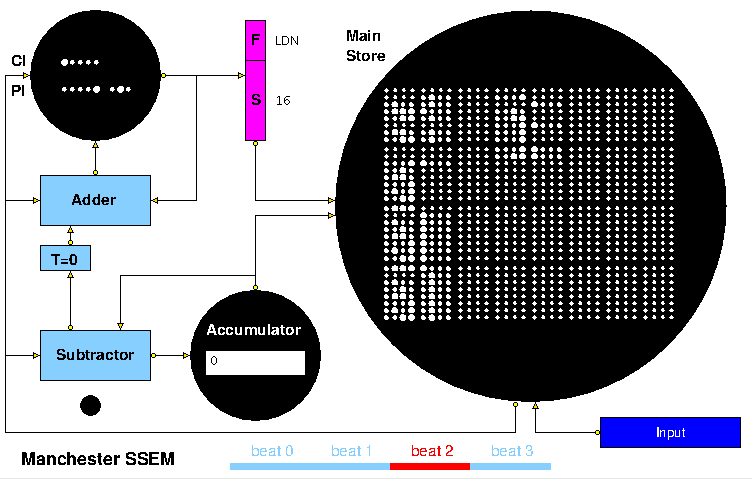
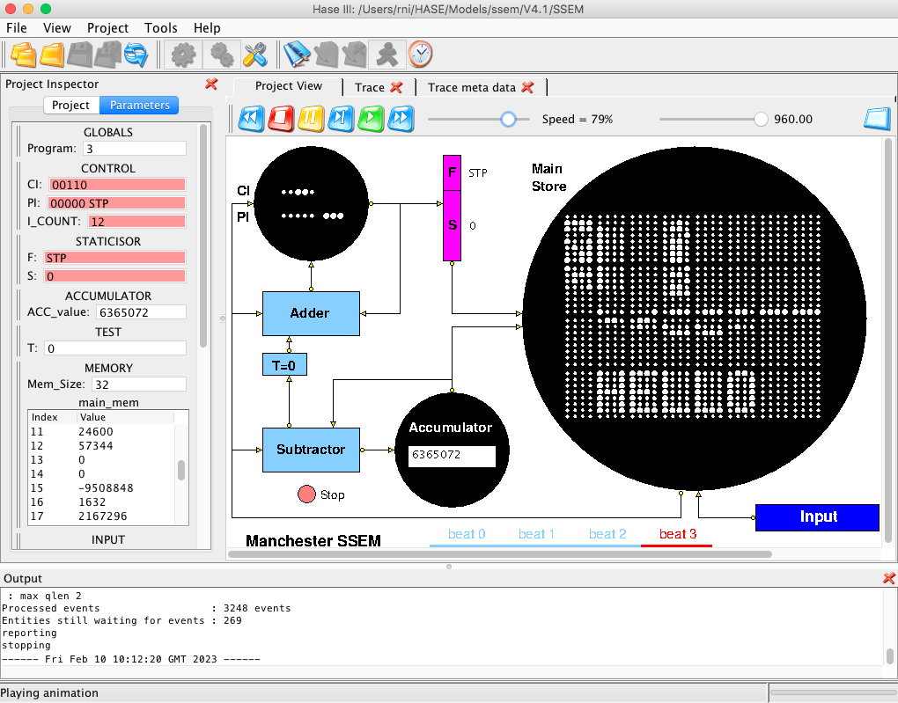

## HASE Manchester SSEM ("Baby") Simulation Model

On 21st June 1948 the University of Manchester Small Scale Experimental Machine, affectionally known as the "Baby", became the first computer to execute a program stored in addressable read-write electronic memory.  This memory was a specially adapted cathode ray tube now known as a Williams-Kilburn Tube. The Baby demonstrated that the Williams-Kilburn Tube could be used as a random-access memory.  Subsequent developments led to the 1949 Manchester Mark I, which pioneered index registers, and, in February 1951, to Ferranti Ltd's commercial derivative, the Ferranti Mark I, becoming the first electronic computer marketed as a standard product and delivered to a customer.

Like the Baby itself, the main emphasis of the HASE Baby model is to demonstrate the operation of the Williams-Kilburn Tube Main Store. The model includes three programs: Program 1 demonstrates the operation of all the SSEM instructions; Program 2 is the 18th July 1948 version of the highest factor program, the first program to be run on the SSEM; the purpose of Program 3 becomes clear once the playback of the simulation ends. The code and data for these programs are held in the <b>INPUT</b> entity. Program selection is determined by a GLOBALS parameter <b>Program</b> that can be edited after the model has been loaded into HASE. <b>Program</b> can take values of 1, 2. 3 or 4, <i>i.e.</i>  there is space for a fourth program.  After editing, clicking the "Write Parameters" button  updates the model's parameters file.

The files for version 4.1 can be downloaded from https://github.com/HASE-Group/mu_baby/tree/V4.1

Instructions on how to use HASE models can be downloaded from https://github.com/HASE-Group/hase_iii_releases

### Design of the Baby

*(Much of the text in this section has been adapted from [1])*

Charles Babbage's idea of creating an automatic computing engine was hampered by the limitations of the mechanical devices available to him in the 1860s.  In the 1940s, as electronic devices became available, creating automatic computing machines became much more feasible. What was still required was an inexpensive high-speed large-capacity storage system. The practical systems available at the time were mecury delay-line stores and cathode ray tube (CRT) stores. The Baby, more formally known as the Small-Scale Experimental Machine, was:

 *"an experimental computing machine built, primarily, to investigate the engineering problems involved in the use of the cathode-ray-tube storage-system"* [2]

Thus the main feature of the Baby was the cathode-ray tube main store, with the rest of the machine being a prototype computer that would:

*"subject the system to the most searching tests possible"*

Expressed in modern terms, this computer had the following specification:

- 32-bit word length
- single-address instruction format
- serial binary arithmetic using two's complement integers
- 32-word random access main store, extendable to 8192 words
- 1.2 ms per instruction computing speed

The main store consisted of a single CV113 Williams Cathode-Ray Tube (now known as a Williams-Kilburn Tube) with each 32-digit line occupying about 10 cms on the screen and being scanned in 272 &#956;s. A complete 'beat' of 306 &#956;s consisted of 32 x 8.5 &#956;s digit periods plus a four-digit fly-back time.  The rhythm of the whole processor was synchronised to this store beat. 

The arithmetic unit was based on a serial subtractor. The logic employed EF50 pentode valves (also known as tubes), used widely for wartime applications. Using this technology, bistable flip-flops circuits were extremely costly and temporary storage throughout the central machine was implemented with Williams-Kilburn Tubes wherever possible. Thus the accumulator and control register (instruction counter, referred to as the Control Instruction (CI) register in Baby documentation) were Williams-Kilburn Tubes. One incidental advantage of the use of CRTs was that the contents of main store, accumulator and control register could be viewed on a monitor CRT during or after a computation - so providing a simple output mechanism. Input for the prototype was via a 32-position keyboard and operator's control switches.

The main components of the Baby can be seen in the image of the HASE simulation model (Figure 1). The Williams-Kilburn Tube that implemented CI was also used to hold the Present Instruction (PI) subsequent to its being read out of the main store. Either the value of CI or PI could be fed from the Control Tube to an 8-bit flip-flop register known as the staticisor.  This staticised the function bits (F) and the operand address bits (S) during the execution of an order and then staticised the address of the next order during the instruction fetch phase. In what today seems like an anomaly, numbers were stored with the least-significant digit on the left, a consequence of CRTs being scanned from left to right and the fact that in a serial arithmetic unit, computations must start with the least-significant digit. In the model, digits in the Main Store are shown as they would have appeared using the focus/defocus representation, in which a 0 appears as a small dot and a 1 as a larger dot.  

**Figure 1. The Baby simulation model**  

Instructions in the Baby were of the form **s,f** where **s**
represented a Store address and **f** represented a
Function. Each Baby instruction occupied one 32-bit line in the
memory, though only 8 bits were used.  The instruction format is
described in [3] as follows:
  

*"An instruction has two components: a "line number" and a "function number". The line number indicates the line of the store on which the instruction should operate, and the function number indicates the operation to be performed on that line. The "CMP" and "STOP" instructions do not use the line number, and ignore anything in that line of the store.  One line in the store holds one instruction with the following layout:*  

<table>
<tr><td>|</td><td> Line No. </td><td>|</td><td> Not Used </td><td>|</td><td> Func. No. </td><td>|</td><td> Not Used </td><td>|</td></tr>
<tr><td>|</td><td> 0 1 2 3 4 </td><td>|</td><td> 5 .. 12 </td><td>|</td><td> 13
 14 15 </td><td>|</td><td> 16 .. 31 </td><td>|</td></tr>
</table>

*Only the eight defined bits are used in an instruction - the unused bits may be used for any purpose by the programmer and will be ignored by the instruction decoder."*

Leaving a gap between the **s** bits and the **f** bits was done in anticipation of larger store sizes becoming available, potentially up to 256 Williams-Kilburn Tubes, to yield a total storage capacity of 8192 words.

The following table describing the function codes is adapted from [3]:

<table bgcolor= white>
<tr><td>Function &nbsp; &nbsp;  Number </td><td> Binary &nbsp; &nbsp; code1</td><td>
Ref. [2] &nbsp; &nbsp;   notation2</td><td> 'Modern'  
mnemonic &nbsp; &nbsp; </td><td> Description  </td></tr>

<tr><td>0</td><td> 000 </td><td> s , C </td><td> JMP </td><td> Copy content of Store line to CI</td></tr>
<tr><td>1 </td><td> 100 </td><td> c + s , C </td><td> JRP </td><td>Add content of Store line to CI</td></tr>
<tr><td> 2</td><td> 010 </td><td>- s , A </td><td>LDN </td><td>Copy content of Store line,
negated, to Accumulator.</td></tr>
<tr><td> 3 </td><td>110</td><td> a , S</td><td> STO</td><td> Copy content of Acccumulator to Store line.</td></tr>
<tr><td> 4 </td><td>001</td><td> a - s , A </td><td>SUB </td><td>Subtract content of Store line from Accumulator</td></tr>
<tr><td> 5 </td><td>101</td><td> -</td><td> - </td><td>Same as function number 4</td></tr>
<tr><td> 6 </td><td>011 </td><td>Test </td><td>CMP </td><td>Skip next instruction if content of Accumulator is negative</td></tr>
<tr><td> 7 </td><td>111 </td><td>Stop </td><td>STOP </td><td>Light "Stop" neon and halt the machine</td></tr>
</table>

**Table 1. Baby Function Codes**

#### Notes

1. In the Baby, binary codes had the least significant digit to the left.

2. The Ref. [2] notation shows the way the instruction was named when
the Baby was built in 1948.

Because the main emphasis of the project was to prove the practicality of the Williams-Kilburn Tube for realising the stored-program concept, the arithmeic logic was kept as simple as possible. To this end the Subtractor was the onsly arithmetic facility provided, it being preferred to an adder because a subtractor can be used to form complements and to perform additions whereas the converse is not true. As can be seen in Figure 1, an operand entered the Accumulator via the Subtractor where it was subtracted from zero and thus complemented before it reached the Accumulator. A Test bit, shown as T=0 in Figure 1, recorded whether or not the value in the Accumulator was negative; it was used by the CMP instruction to decide whether to add 2 or 1 to CI at the start of the next instruction. A positive load could be programmed in two instructions by performing a negative load and then subtracting the contents of the Accumulator from a zero operand. Since the first action in the execution of an instruction is to increment CI, the first instruction of any program must be placed in location 1, leaving location 0 as a convenient source of 0 as an operand value.

### The HASE Baby Model

Figure 2 shows an image of the HASE user interface with the simulation model of the Baby in the main (right-hand) Project View pane. The left-hand Project Inspector pane displays the model parameters, <i>e.g.</i> register and store contents, while the lower, Output pane, shows information produced by HASE when a model is loaded or compiled or when a simulation is run. The icons in the top row allow the user to load a model, compile it, run the simulation code thus created and to load the trace file produced by running a simulation back into the model for animation. Once a trace file has been loaded, the animation control icons at the top of the Project View window become active. From left to right, these allow the animation to be rewound, stopped, paused, single stepped, run or fast forwarded to the end.  As the animation proceeds, packets of information can be observed passing between entities while the entities themselves can change colour to reflect their states, <i>e.g.</i> idle (blue) or busy (red).

**Figure 2. The HASE User Interface**

Like the Baby itself, the main emphasis of the HASE model is to demonstrate the operation of the Williams-Kilburn Tube Main Store. This requires its icon to be large enough to clearly display the Baby's 32 lines of 32 bits each. To allow for this, the Accumulator and CI/PI icons are much smaller. In the case of the Accumulator a further compromise is that the value is displayed as an integer rather than a pattern of 32 dots and in the case of the CI/PI icon, only the relevant bits of the CI and PI words are displayed, <i>i.e.</i> 5 bits and 8 bits respectively. The PI bits are only visible whilst PI is in use.

At the start of each simulation the program and its data are contained in two separate files associated with the INPUT entity, **INPUT.prog_mem.mem** and **INPUT.data_mem.mem**, while the intial values for the **main_mem** array in the Memory entity are held in the **MEMORY.main_mem.mem** file. During the first clock period of a simulation the two INPUT files are transfered into the **main_mem** array in the Memory entity. Entries from the program file are converted from the human-readable form in the **INPUT.prog_mem.mem** file into Baby format and transfered to **main_mem** starting at location 1 (because the first action in the Baby is to increment the value held in the CI register). The remaining locations in **main_mem** are then filled with data from the **INPUT.data_mem.mem** file. Each word in **main_mem** is then displayed on the screen in Baby focus/defocus format, with the least significant digit at the left-hand end.

Reading a line in a Williams-Kilburn Tube involved a destructive write, <i>i.e.</i> a 1 was written to each bit and, if this changed its value, the change in charge on the screen induced a voltage in a pick-up plate placed close to the screen. In the HASE model a line being read from the Main Store is shown changing to all 1s and then changing back to its original value, though this is purely a feature of the display, the **main_mem** array remains unaltered and is simply read by an assignment statement.

A further difference between the model and the Baby itself concerns the way in which the serial nature of the Baby is visualised. Watching 32 bits transfer between entities at a rate of one per clock period would be extremely tedious, so words and addresses are each transferred in a single HASE clock period with their integer values represented by strings of 0s and 1's. As described above, the time taken to read a full word from the Main Store, plus the fly-back time, constituted a 'beat' of the machine. Four beats were required to execute an instruction. In the model these are:  

1. add +1 or +2 to CI, copy CI to staticisor
2. read Main Store, send instruction to PI
3. copy PI to staticisor, fetch operand from Main Store
4. execute the present instruction  

The timing bar at the bottom of the Project View pane shows which beat is active as each instruction is executed. The black dot below the Subtractor represents the neon lamp that lights up when a Stop instruction is executed.

### Demonstration Program (Program 1)

The code and data for Program 1 is contained in locations 0-31 in the **INPUT.prog_mem.mem** and **INPUT.data_mem.mem** files, with unused locations in the code file containing EOP (end of program) instructions, and unused locations in the data file containing 0. The EOP instruction is a feature of the model ratherthan the Baby itself. This sequence of instructions is designed to demonstrate the operation of each of the Baby's instructions, as shown in Table 2. The program is essentially a simple test program that shows that each of the instructions works as intended. The CMP instruction appears twice since it can have two alternative outcomes.  EOP is used in the model to signal to the INPUT entity that this is the end of the program code. This is needed because the two input files are held in different kinds of array to allow the program to be human-readable and because the STP instruction, which might seem an obvious choice, is notnecessarily the last instruction in the static code (<i>c.f.</i> this program and the Highest Factor program below).

<table>
<tr><td>
<table border bgcolor=white>
<tr><td> <b>Line</b> </td><td> <b>Instruction</b> </td><td> <b>Action</b> </td><td> <b>Result</b> </td></tr>
<tr><td> 1 </td><td> LDN 13 </td><td> Acc = -[Store line 13] </td><td> Acc = 5768543, T = 1 </td></tr>
<tr><td> 2 </td><td> SUB 14 </td><td> Acc = Acc - [Store line 14]</td><td> Acc = -1110667 </td></tr>
<tr><td> 3 </td><td> JRP  11 </td><td> CI = CI + [Store line 15] </td><td> CI = 10 </td></tr>
<tr><td> 4 </td><td> STO 15 </td><td> Acc -> Store line 15 </td><td> Store line 15 = -1110667 </td></tr>
<tr><td> 5 </td><td> CMP 0 </td><td> If T = 0, next CI inc = 1   If T = 1, next CI inc = 2 </td><td> next CI = 7, T = 0 </td></tr>
<tr><td> 6 </td><td> LDN 16 </td><td> Not executed </td><td>  </td></tr>
<tr><td> 7 </td><td> LDN 15 </td><td> Acc = -[Store line 22] </td><td> Acc = 1110667, T = 0 </td></tr>
<tr><td> 8 </td><td> CMP 0 </td><td> If T = 0, next CI inc, = 1   If T = 1, nextCI inc = 2 </td><td> next CI = 9 </td></tr>
<tr><td> 9 </td><td> STP 0 </td><td> Stop program </td><td> Stop neon 'lit' </td></tr>
<tr><td> 10 </td><td> JMP 12 </td><td> CI = [Store line 12] </td><td> CI = 3, then 4 </td></tr>
</table>
</td><td>&nbsp; &nbsp; &nbsp;
</td><td>
<table border bgcolor=white>
<tr><td> <b>Line</b> </td><td> <b>Data</b> </td></tr>
<tr><td> 11 </td><td> 6 </td></tr>
<tr><td> 12 </td><td> 3 </td></tr>
<tr><td> 13 </td><td> -5768543 </td></tr>
<tr><td> 14 </td><td> 6879210 </td></tr>
<tr><td> 15 </td><td> 0 </td></tr>
<tr><td> 16 </td><td> 3579 </td></tr>
</table>
</td></tr>
</table>  

**Table 2. Demonstration Program**

### Highest Factor Program (Program 2)

Program 2, contained in locataion 32-63 in the INPUT files, is the 18th July 1948 version of the first program to be run on the Baby, as described by Geoff Tootill in [4] and shown in Table 3, along with (mostly) his explanatory comments. The number under investigation, a, is set to 4537 (= 13 x 349) in the **INPUT.data_mem.mem** file, this being one of the numbers used in the first tests of the Baby on 21st June 1948.  The initial trial factor, b1, for that test was 4537 but in the model it is set to 360 to avoid a very long simulation run. At the end of a simulation run, the highest factor of 4537, 349, is in Line 27 of the Main Store Of course users of the model can set the input values to numbers of their own choice.

<table>
<tr><td>
<table border bgcolor=white>
<tr><td> <b>Line</b> </td><td> <b>Instruction</b> </td><td> <b>Action</b> </td></tr>
<tr><td> 1 </td><td> LDN 24 </td><td> load -b1 </td></tr>
<tr><td> 2 </td><td> STO 26 </td><td> store -b1 </td></tr> 
<tr><td> 3 </td><td> LDN 26 </td><td> load +b1 </td></tr> 
<tr><td> 4 </td><td> STO 27 </td><td> store +b1 </td></tr> 
<tr><td> 5 </td><td> LDN 23 </td><td> load a </td></tr> 
<tr><td> 6 </td><td> SUB 27 </td><td> trial subtraction </td></tr> 
<tr><td> 7 </td><td> CMP 0 </td><td> is difference negative? </td></tr> 
<tr><td> 8 </td><td> JRP 20 </td><td> no, jump back 2 lines </td></tr> 
<tr><td> 9 </td><td> SUB 26 </td><td> overshot, add back bn </td></tr> 
<tr><td> 10 </td><td> STO 25 </td><td> store +rn  </td></tr> 
<tr><td> 11 </td><td> LDN 25 </td><td> load -rn </td></tr> 
<tr><td> 12 </td><td> CMP 0 </td><td> is remainder zero? </td></tr> 
<tr><td> 13 </td><td> STP 0 </td><td> yes, stop  </td></tr> 
<tr><td> 14 </td><td> LDN 26 </td><td> no, load +bn </td></tr> 
<tr><td> 15 </td><td> SUB 21 </td><td> form bn+1 = bn - 1 </td></tr> 
<tr><td> 16 </td><td> STO 27 </td><td> store bn+1 </td></tr> 
<tr><td> 17 </td><td> LDN 27 </td><td> load -bn+1 </td></tr> 
<tr><td> 18 </td><td> STO 26 </td><td> store -bn+1 </td></tr> 
<tr><td> 19 </td><td> JMP 22 </td><td> jump to line 5 </td></tr> 

</table>
</td><td>&nbsp; &nbsp; &nbsp;
</td><td>
<table border bgcolor=white>
<tr><td> <b>Line</b> </td><td> <b>initial</b> </td><td> <b>current</b> </td><td> <b>final</b> </td><td> <b>Comment</b> </td></tr>
<tr><td> 20 </td><td> -3 </td><td> </td><td> </td><td> line 8 operand</td></tr>
<tr><td> 21 </td><td> 1 </td><td> </td><td> </td><td> line 21 operand </td></tr>
<tr><td> 22 </td><td> 4 </td><td> </td><td> </td><td> line 19 operand</td></tr>
<tr><td> 23 </td><td> -a </td><td> </td><td>  <td> number under  investigation</td></tr>
<tr><td> 24 </td><td> b1 </td><td> </td><td> </td><td> initial trial factor </td></tr>
<tr><td> 25 </td><td> 0 </td><td> rn</td><td> rN (=0) </td><td> remainder </td></tr>
<tr><td> 26 </td><td> 0 </td><td> -bn </td><td> -bN </td><td></td></tr>
<tr><td> 27 </td><td> 0 </td><td> bn </td><td> bN </td><td> </td></tr>
</table>
</td></tr>
</table>

**Table 3. Highest Factor Program**

### References

1. S.H. Lavington  
"History of Manchester Computers", NCC, 1975.

2. F.C. Williams, T. Kilburn and G.C. Tootill  
["Universal High-Speed Digital Computers: A Small-Scale Experimental Machine"](http://curation.cs.manchester.ac.uk/computer50/www.computer50.org/kgill/mark1/ssem.html)  
Originally published in *Proc IEE, Vol 98, Part 2, No 61, Feb 1951, pp 13-28*

3. C.P. Burton  
[The Manchester University Small-Scale Experimental Machine Programmer's Reference Manual](http://curation.cs.manchester.ac.uk/computer50/www.computer50.org/mark1/prog98/ssemref.html)

4. Geoff Tootill  
["The Original Original Program"](https://www.computerconservationsociety.org/resurrection/res20.htm#e)  
*Resurrection, Issue 20, Summer 1998.*

