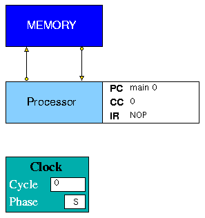

## A Simple Computer

The Simple Computer model consists of a Processor and a Memory (Figure 1). The Memory contains two arrays to hold instructions and data (instr\_mem and data\_mem), while the Processor contains a single array forming the programmable registers (main\_reg). The Processor instruction set, defined in s-comp.edl, contains simple load/store and register-register arithmetic instructions together with a Jump Immediate, a Jump Register and a Branch instruction. The outcome of the branch instruction is determined by a Condition Code (CC) register set according to the result of one of six possible comparisons between two register values. There is also a No Operation (NOP) instruction and a STOP instruction.  

**Figure 1. Simple Computer Model**

Along with the Condition Code register, the Program Counter (PC) and Instruction Register (IR) are displayed in the Project View panel. The Program Counter has two fields, a label (**main** in the figure) and an offset (**0** in the figure), because the instruction array in the Memory is declared using the ARRAYI construct.

The project is made up of the files listed below. These files illustrate many of the features of HASE described in the User Guide.

#### Definition files

- s-comp.edl
- s-comp.elf

#### Entity Behaviour files

- proc.hase
- memory.hase

#### Global Function files

- global_fns.h
- global_fns.cpp

#### Register/Memory content files

- PROC.main_reg.mem
- MEMORY.instr_mem.mem
- MEMORY.data_mem.mem

#### Entity icons 
(*In bitmaps subdirectory*)

- proc\_idle.gif
- proc\_busy.gif
- memory\_idle.gif
- memor\_busy.gif
- title.gif
