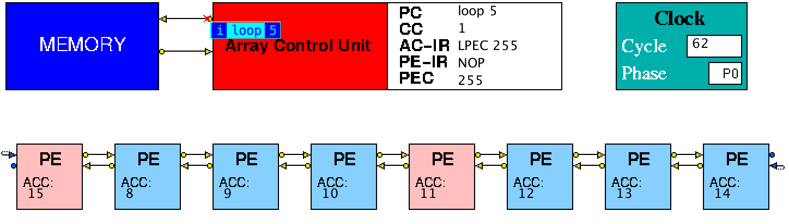
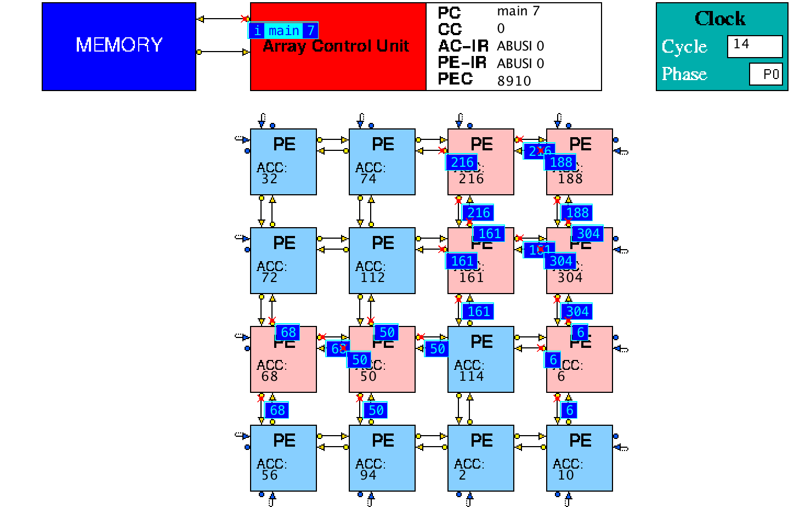
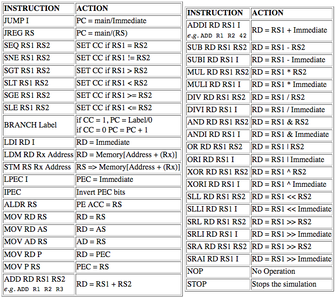

## HASE SIMD Array Processor Models

The HASE SIMD-1 and SIMD-2 simulation models are designed to show the principles of operation of a 1-dimensional and a 2-dimensional Single Instruction Multiple Data processing system. Each consists of a Memory, an Array Control Unit (ACU) and an SIMD array of simple processing elements (PEs). The models both use the same Memory, ACU and PE entities and differ only in terms of the number PES and the configuration of the array.  This website describes the architectures of the SIMD-1 and SIMD-2 models and the instruction sets of the ACU and the Processing Elements used in their construction.  The models can be used in virtual laboratory exercises in computer architecture or introductory parallel programming; suggested student exercises are included below.

The files for SIMD-1 can be downloaded from https://github.com/HASE-Group/simd/tree/V1.4

The files for SIMD-2 can be downloaded as a zip file from https://github.com/HASE-Group/simd/tree/V2.3

Instructions on how to use HASE models can be downloaded from https://github.com/HASE-Group/hase_iii_releases

### The SIMD-1 Model

Figure 1 shows the initial image seen when the SIMD-1 model is loaded into HASE. The array is opened for viewing by left clicking on its icon. Figure 2 shows an image taken during animation of a simulation.

**Figure 1. The SIMD-1 simulation model loaded into HASE**

**Figure 2. The SIMD-1 simulation model during animation**

### The SIMD-2 Model

Figure 3 shows the initial image seen when the model is loaded into HASE. The array is opened for viewing by left clicking in its icon. Figure 4 shows an image taken during animation of a simulation.

**Figure 3. The SIMD-2 simulation model loaded into HASE**

**Figure 4. The SIMD-2 simulation model during animation**

### System Operation

The systems operates on a two phase clock. In clock cycles in which they are active, each unit executes its internal actions in the first phase of the clock and sends out a result packet in the second phase. The Memory, for example, reads an instruction or operand in the first phase and sends its output to the ACU in the second phase. The ACU is a simple load/store, register-register arithmetic processor.  It has 16 general purpose registers, a Program Counter (PC), a Condition code Register (CC) and an Instruction Register (AC-IR). The Program Counter has two fields: label and offset. The label field is initially set to "main" and the offset to zero. The ACU also uses two other registers, the Processing Element Instruction Register (PE-IR) and the Processing Element Control register (PEC) which are global registers used to communicate with the SIMD Array. The Processing Elements operate in lock step, *i.e.* each active PE (determined by the state of its PEC bit) obeys the same instruction at the same time. Whenever a PE ACC is updated by a PE instruction, the PE sends the new ACC value to each of its neighbours.

### The ACU Instruction Set

Table 1 shows the instruction set of the ACU.  It includes absolute jumps (JUMP and JREG) a relative branch (BRANCH), loads (LD, LDL, LDX) and stores (ST and STX), a move instruction (MOV) which allows values to be transferred between the ACU registers and the PE Accumulators, register-register operations (ADD, etc) and register-literal arithmetic operations (ADDL, etc). All Literal (Immediate) operands are treated as 16-bit signed integers, *i.e.* any literal values which require >16 bits for their representation are truncated and sign extended to the 32-bit representation used by the adders.

**Table 1. ACU instruction set**

#### JUMP Literal

JUMP takes a Literal (Immediate) operand which is loaded into the offset field of PC as an absolute instruction address; the label field of PC is set to "main". The value in PC is then sent to the Memory.

#### JREG RS

JREG uses a single source register (RS), the contents of which are read and loaded into the offset field of PC as an absolute instruction address; the label field of PC is set to "main". The value in PC is then sent to the Memory.

#### Compare Instructions

Compare instructions (SEQ, SNE, SGT, SLT, SGE, SLE) compare the values in registers RS1 and RS2 and set CC accordingly.

#### BRANCH

BRANCH takes a label as its operand.  If CC = 1, the label is loaded into the label field of PC while the offset field is set to 0; if CC = 0, the offset field of PC is incremented. The value in PC is then sent to the Memory.

#### LDL RD Literal

LDL loads the value in the Literal field into the destination register (RD).

#### LDM RD Rx Address

LDM adds the value held in register Rx to the value in the Address field, sends the result to the Data Memory and loads the value received from the Memory into the destination register (RD). 

#### STM RS Rx Address

STX adds the value in register Rx to the value in the Address field, then sends this address to Memory together with the value in source register RS.

#### LPEC Literal

LPEC loads the value in the Literal field into the PE Control Register.  It's convenient to specify the Literal in hex format in the instruction (*e.g.* 0xff in SIMD-1 or 0xffff in SIMD-2 to set all the processors active), though it will be displayed in decimal in the Instruction Register (AC-IR).

#### ALDR RS

The ACU sets the function in PE-IR to ALDI and copies the value in RS to the Immediate field in PE-IR. Those PEs that have their PE control bit set to *active* then execute the ALDI instruction.

#### ALDR Address(RS)

The ACU sets the function in PE-IR to ALDM and copies the value of Address plus the value in RS to the Address field in PE-IR. Those PEs that have their PE control bit set to *active* then execute the ALDM instruction.

#### MOV

MOV allows values to be moved from one R register to another, between an R register and the Accumulator of one of the Processing Elements in the array, or between an R register and PEC. Other combinations will cause the simulation to stop.

- <tt>MOV RD RS</tt> : moves the value in RS to RD
- <tt>MOV RD AS</tt> : moves the value in the ACC of the PE specified by AS to RD
- <tt>MOV AD RS</tt> : loads the value in RS into the ACC of the PE specified by AS 
- <tt>MOV RD P</tt> : loads RD with the value in PEC
 -<tt>MOV P RS</tt> : loads PEC with the value in RS 

#### Aritmetic Operations

**ADD/ADDL** adds the values in RS1 and RS2/Literal and writes the result into RD.

**SUB/SUBL** subtracts the value in RS2/Literal from the value in RS1 and writes the result into RD.

**MUL/MULL** multiplies the values in RS1 and RS2/Literal and writes the result into RD.

**DIV/DIVL** divides the value in RS1 by RS2/Literal and writes the result into RD.

**AND/ANDL** ands the values in RS1 and RS2/Literal and writes the result into RD.

**OR/ORL** ors the values in RS1 and RS2/Literal and writes the result into RD.

**XOR/XORL** xors the values in RS1 and RS2/Literal and writes the result into RD.
 
#### Shift Instructions

**SLL and SLLL** (Shift Left Logical) shifts left the value in RS1 by the number of places specified in RS2 (SLL) or the Literal (SLLL) and writes the result into RD.

**SRL and SLRL** (Shift Right Logical) shifts right the value in RS1 by the number of places specified in RS2 (SRL) or the Literal (SRLL), inserting zeros into digits to the left of the most significant bit; the result is written into RD.

**SRA and SRAL** (Shift Right Arithmetic) shifts right the value in RS1 by the number of places specified in RS2 (SRA) or the Literal (SRAL), copying the sign digit into digits to its left; the result is written into RD.

**STOP** stops the simulation.

### The Array Processing Element Instruction Set

Table 2 shows the instruction set of the Processors in the Array.  The processors take their instructions from the Instruction Register (PE-IR), which is loaded by the ACU. Instructions are divided into *Arithmetic/Logical* instructions and *PE Control Setting* instructions. The Arithmetic/Logical instructions are further divided into three subgroups with opcodes of the form ***Opcode***, ***Opcode*I** and ***Opcode*M**. All are single address instructions which combine the value in their Accumulator (ACC) with an input Operand and return the result to their own ACC. At the end of an operation which updates the ACC, each active PE sends the value in its Accumulator to its neighbours.

In the SIMD-1 model the source of the Operand for an ***Opcode*** instructions can be **E0**, **E1**, **W0**, **W1** or **P**, while in the SIMD-2 model the Operand can be **N0**, **N1**, **E0**, **E1**, **W0**, **W1**, **S0**, **S1** or **P**, where an 

- **N** Operand = value sent by processor above  
- **E** Operand = value sent by processor to the right  
- **W** Operand = value sent by processor to the left  
- **S** Operand = value sent by processor below  
- **P** Operand = Processor's own number within the array (0-7 in SIMD-1, 0-15 in SIMD-2) 

and where **0** and **1** indicate the *Wraparound* condition:

- **N0**/**E0**/**W0**/**S0** a PE at the end of a row/column uses zero as its operand 
- **N1**/**E1**/**W1**/**S1** a PE at the end of a row/column uses the value sent from the PE at the other end of the row/column  

For an ***Opcode*I** instruction, the Operand is the Immediate value in PE-IR.

For and ***Opcode*M** instruction, the ACU reads the value in Rx from within its own Registers, adds this to the value in the Address field in AC-IR and loads this modified value into the address field of the instruction as it is copied into PE-IR. Each Processing Element accesses its own memory to obtain the operand using the modified address in PE-IR, *i.e.* it ignores the Rx field.

PE Control Setting Instructions are of the ***Opcode*I** type. When executing these instructions, each PE sets its own control bit in the PE Control Register (PEC) according to the condition selected by the Opcode.

  

**Table 2 Array Element instruction set**

### Using the SIMD-1 Model

When first loaded, the model contains a program (Figure 5) that reverses the order of the values held in memory locations 0 and 2 of the Processing Elements and leaves the results in location 1 and 3 of each of their memories, *i.e.* it moves the data in memory locations 0 and 2 of PEs 0-7 into memory locations 1 and 3 of PEs 7-0.

The files for the SIMD-1 model include:

| File | Purpose |
|:--------------------------- |:----------------------------|
| **MEMORY.instr_mem.mem** **MEMORY.data_mem.mem** | the initial contents of the ACU Instruction and Data memories contained within the Memory Unit |
| **ACU.main_reg.mem** | the initial contents of the ACU registers;  this file should not be edited |
| **SIMD1.pe1.pe_mem.mem** | the initial contents of the PE memories |

Because the SIMD Array of processing elements (SIMD1) is defined as a mesh (MESH1D in the simd-1.edl file), HASE automatically loads the memories in the SIMD1 array from the **SIMD1.pe1.pe_mem.mem** file. This file has the following form:

0  
0  
0  
0  
//$next section  
1  
0  
9  
0  
//$next section  

Thus the first four values are loaded into locations 0-3 of PE0's memory, the second four into locations 0-3 of PE1's memory, *etc*.

| Instruction | Comment |
|:------------|:--------------------------------------|
| LDI R1 0 | R1 is used as an index into the PE memory|
| LDI R2 4 | R2 is used as the limiting index value|
| loop:  | |
| ALDM R1 0 | load data into ACCs |
| ALD W1 | load data from west neighbour|
| LPEC 0x88 | load PE Control register|
| ASTM R1 1 | Write data to memories of selected PEs|
| LPEC 0xFF | |
| ALD W1 | |
| ALD W1 | |
| LPEC 0x44 | |
| ASTM R1 1 | |
| LPEC 0xFF | |
| ALDM R1 0 | |
| ALD E1 | |
| LPEC 0x11 | |
| ASTM R1 1 | |
| LPEC 0xFF | |
| ALD E1 | |
| ALD E1 | |
| LPEC 0x22 | |
| ASTM R1 1 | |
| LPEC 0xFF | |
| ALDM R1 1 | |
| ADDI R1 R1 2 | |
| SLT R1 R2 | test for limiting index value|
| BRANCH loop |  |
| STOP | |

**Figure 5. SIMD-1 Demonstration Program Code**

To run a new program, edit **MEMORY.instr_mem.mem** and, if appropriate, **MEMORY.data_mem.mem** and **SIMD1.pe1.pe_mem.mem**. Then just press run. The new contents of the memories will appear in the parameters panel as the locations are accessed during animation. To get the values to appear immediately, re-load the model after closing the edits.

#### Suggested Student Exercise

For the SIMD-1 Array Processor model, write an assembly code program, together with appropriate data in the PE memories, that loads 0 into the ACC of processor 0, 1 into the ACC of processor 1, etc, and then forms the set of parallel pre-fix sums for these numbers. You can load the ACCs from memory or by using the own processor number facility in the instruction set.

Your submission for this part should consist of three documents:

1. a commented listing of the program  
2. an uncommented listing of the program suitable for copying and pasting into the ACU memory file (*so that the instructor can run it*)  
3. a text file containing a note of the number of simulated clock cycles your program took to execute and comments on the degree of parallelism during its execution.

### Using the SIMD-2 Model

When first loaded, the model contains the program shown in Figure 6. The first instruction loads each PE ACC with the PE's own number in the array. The second instruction loads each PE ACC with the value in word 0 of its memory, in this case equal to the process number, so the result should be 0 in each ACC. The next four instructions load the ACC with the value in word 1, multiply it by the value in word 2, subtract the value in word 3 and then set the PE Control bit if the result is negative. The next instruction (Reverse Subtract) is only executed in PEs with a negative ACC (making their ACC values positive). Finally, the PE control bits are all set to 1 and all ACC values are written to memory word 4.

The files for the SIMD-2 model include:

| File | Purpose |
|:-------------------------- |:------------------------------|
| **MEMORY.instr_mem.mem** **MEMORY.data_mem.mem** |  the initial contents of the ACU Instruction and Data memories contained within the Memory Unit |
| **ACU.main_reg.mem** | the initial contents of the ACU registers;  this file should not be edited |
| **SIMD2.pe2.pe_mem.mem** | the initial contents of the PE memories |

Similarly to the SIMD1 Array, the SIMD Array of processing elements (SIMD2) is defined as a mesh (MESH2D in the simd-2.edl file), HASE automatically loads the memories in the SIMD2 array from the **SIMD2.pe2.pe_mem.mem** file. This file has the same form as **SIMD1.pe1.pe_mem.mem** so the first four values are loaded into locations 0-3 of PE0's memory, the second four into locations 0-3 of PE1's memory, *etc*. Note that the PEs are numbered in column order.

| Instruction | Comment |
|:------------|:---------------------------------------------|
| ALD P | load ACC with PE's own number |
| ASUBM R0 0 | subtract value in memory word 0 from ACC |
| ALDM R0 1 | load ACC from memory word 1 |
| AMULM R0 1 | multiply by value in memory word 2 |
| ASUBM R0 3 | subtract value in memory word 3 |
| ASLT 0 | set PE Control bit if ACC -ve |
| ABUSI 0 | negate value in ACC |
| LPEC 0xFFF | set all PE Control bits |
| ASTM R0 4 | write ACC value to memory word 4 |
| STOP |   |

**Figure 6. SIMD-2 Demonstration Program Code**

#### Suggested Student Exercise

Figure 7 shows a data file suitable for use as a
**SIMD2.pe2.pe_mem.mem** file. Copy this data into the file of this name in your copy of the SIMD-2 model files. For each PE, locations 1-4 and 5-8 contain elements of vectors A and B respectively.  Write an assembly code program for SIMD-2 which first of all forms the scalar product of these two vectors, leaving the result in location 0 of the memory of each PE. The program should then form the sum of (a) all the positive scalar product results (copying this result into ACU Register 3) (b) the sum of all the negative scalar product results (copying this result into ACU Register 4).

Your submission for this part should consist of four documents:

1. a commented listing of the program  
2. an uncommented listing of the program suitable for copying and pasting into the ACU memory file (*so that the instructor can run it*)  
3. a listing of the contents of the ACU registers at the end of the program
4. a text file containing a note of the number of simulated clock cycles your program took to execute and comments on the degree of parallelism during its execution.  

0  
1  
2  
3  
4  
5  
6  
7  
8  
0  
//$next section  
0  
9  
10  
11  
12  
-13  
14  
15  
-16  
0  
//$next section  
0  
17  
18  
19  
20  
21  
22  
23  
24  
0  
//$next section  
0  
25  
26  
27  
28  
29  
-30  
31  
-32  
0  
//$next section  
0  
33  
34  
35  
36  
37  
38  
38  
40  
0  
//$next section  
0  
41  
-42  
43  
44  
45  
46  
47  
-48  
0  
//$next section  
0  
49  
50  
51  
52  
53  
54  
55  
56  
0  
//$next section  
0  
-57  
58  
59  
60  
61  
62  
63  
-64  
0  
//$next section  
0  
65  
66  
-67  
68  
69  
70  
71  
72  
0  
//$next section  
0  
73  
74  
75  
76  
77  
78  
79  
80  
0  
//$next section  
0  
81  
82  
-83  
84  
85  
86  
87  
-88  
0  
//$next section  
0  
89  
90  
91  
92  
93  
94  
95  
96  
0  
//$next section  
0  
97  
98  
99  
100  
101  
102  
103  
104  
0  
//$next section  
0  
105  
106  
107  
-108  
-109  
110  
111  
112  
0  
//$next section  
0  
113  
114  
115  
116  
117  
-118  
119  
120  
0  
//$next section  
0  
121  
122  
123  
124  
125  
126  
-127  
-128  
0  

**Figure 7. Data file for SIMD-2 Exercise**
