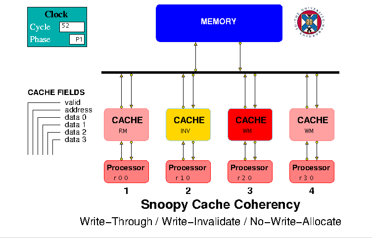
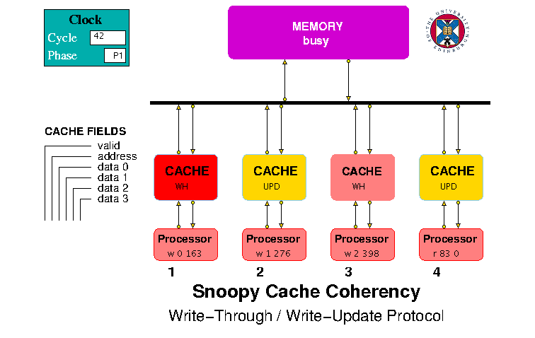
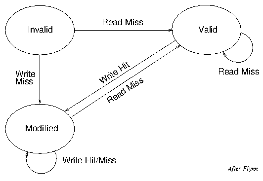
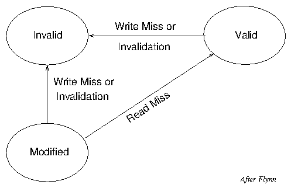
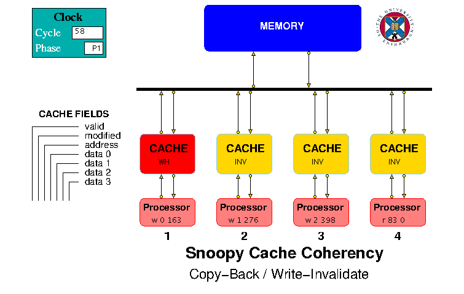

## Snoopy Cache Coherence

In a bus-based multiprocessor system, cache coherence can be ensured using a snoopy protocol in which each processor's cache monitors the traffic on the bus and takes appropriate action when it sees a write request being sent to memory for a variable at an address matching one that it holds. This document describes a number of models demonstrating different types of snoopy protocol.

1. Write-Through / Write-Invalidate / No-Write-Allocate (WTWI-N) protocol, for which the model files can be downloaded from <https://github.com/HASE-Group/snoopy-cache/tree/V4.1>  
2. Write-Through / Write-Invalidate / Write-Allocate (WTWI-A) protocol, for which the model files can be downloaded from <https://github.com/HASE-Group/snoopy-cache/tree/V5.1>  
3. Write Through / Write Update (WTWU) protocol, for which the model files can be downloaded from <https://github.com/HASE-Group/snoopy-cache/tree/V6.1>  

4. Copyback / Write Invalidate (CBWI) protocol, for which the model files can be downloaded from <https://github.com/HASE-Group/snoopy-cache/tree/V7.1>  

Instructions on how to use HASE models can be found at <https://github.com/HASE-Group/hase_iii_releases>

### Snoopy Cache Protocols

In any system with a cache, a read access to the cache generates a Read Hit or a Read Miss. For a Read Hit, the cache simply returns the requested value to the processor, while for a Read Miss the cache control hardware sends a request to the next level in the memory hierarchy (*e.g.* the Main Memory or a Level 2 Cache) and when it receives a reply, updates whichever cache line has been selected to hold the missing data. The way this line is selected depends on the way the cache is organised, *e.g.*  associative, set-associative or direct-mapped.

Regardless of the organisation, the content of the selected line may or may nothave to be written back to the next level in the hierarchy, depending on (a) whether the content is *valid*, *i.e.* whether or not it contains an up-to-date copy of the data required in the next hierarchy level; (b) on how the cache handles write requests. If a *write-through* protocol is used, the cache line can simply be overwritten; if a *copyback* protocol is used, the existing content ofa valid line must be written back to the next level before it can be over-written. In the case of a *write-though* protocol, it is not necessary to allocate acache line in the event of a Write Miss, so the protocol may or may not do this. To implement a *write-allocate* protocol, each cache line must have a *modified* bit (sometimes called a *dirty* bit) as well as a *valid* bit. Clearly a *copyback* protocol must also be a *write-allocate* protocol.

In a multi-processor system, some means must be provided to ensure consistency between caches, since two or more caches may each contain a copy of a particular variable. In bus-based systems, snoopy protocols are normally used, whereby all the caches snoop on the bus and can react to traffic generated by any of the other caches. There is then a further protocol choice: whether to *update* or *invalidate* any copies of a variable held in caches other than the one executing a write request to that line.

### HASE Snoopy Cache Models

The five HASE Snoopy Cache Protocol Models included here (three earlier models are deprecated) all have the same structure in terms of their entities and differ only in terms of the way the entities interact and the number of status bits in each cache line.  The caches are all single-level, direct-mapped caches.  As an example, Figure 1 shows the screen image of the Write-Through / Write-Invalidate / No-Write Allocate Protocol model.

**Figure 1. HASE Write-Through / Write-Invalidate / No-Write Allocate Protocol Model**

In each model a memory and 4 caches are interconnected via a bus and each cache is connected to a processor that generates a sequence of read and write requests. The entities attached to the bus are numbered 0-5 with the memory being 0 and the caches 1-4.  The memory simply contains data values.  The processors are modelled as arrays containing sequences of read (r or R) and write (w or W) requests to locations in the memory address space, *e.g.*  

<table>
<tr><td>r</td><td>0</td><td>0</td></tr>
<tr><td>r</td><td>1</td><td>0</td></tr>
<tr><td>w</td><td>2</td><td>475</td></tr>
<tr><td>r</td><td>5</td><td>0</td></tr>
<tr><td>w</td><td>7</td><td>541</td></tr>
<tr><td>z</td><td>0</td><td>0</td></tr>
</table>

Both write and read requests require a data field, because of type checking in the (C++ like) simulation language (Hase++) used to model the entities. At the start of the simulation, each processor sends its first request to its cache and, when it receives a response, issues the next request in the succeeding clock period. When it encounters a request which is not r, R, w or W, this is treated as an end-of-list marker and the processor then increments a global *nodes_done* variable. *nodes_done* is monitored by the bus in each clock period and when it reaches 4, the bus stops the simulation. If the user omits an end-of-list marker, the simulation will eventually be stopped by a time-out.

#### The Caches

The caches each contain 8 lines, each of which contains three fields: &nbsp; **| Status | Address | Data |**. In the Write-Through models the status field is simply a *valid* bit, while in the Copyback and Update models there are two bits: *valid* and *modified*.  The Data field (and each line in the memory) can hold a quad-word (made up of 4 integer values), so within the cache the 2 least significant bits of an incoming address are used to select the required data value within a quad-word. The remaining bits constitute the quad-word address, the3 least significant bits of which are used to select a line in the cache.  The Address field in a valid cache line is the quad-word address of the data in theData field, and when a line is read from the cache, this address is compared with the requested quad-word address to check for a Hit or a Miss.

The caches send and receive packets to/from their respective processors and to/from the bus.  The caches are all initially *idle* and each becomes *busy* whenit receives a request from its processor. The actions that occur in response toa processor request depend on whether it is a read or write request, whether the request gets a hit or a miss in the cache and on the protocol. In the case ofa read hit, the cache simply sends the required value back to the processor. Inthe case of a write hit, then depending on the protocol, the cache may simplyreturn an acknowledge signal to the processor or may also send a packet to the bus destined for the other caches and/or the memory. In the case of a read or write miss, the cache always sends a packet to the bus, destined for the other caches and/or the memory. Depending on the protocol, a cache may also respond to an input from the Bus causing it to *invalidate* (INV) or *update* (UPD) one of its lines.

#### The Bus

The bus has five pairs of inputs and outputs, one pair for each of the caches and one for the memory. Access to the bus is controlled by a request/grant mechanism, together with a round-robin priority system. Each cache can make requeststo take ownership of the bus but, at any one time, only one request can be granted. Whilst a particular cache has ownership of the bus, it can send packets toand receive packets from the memory. Because the memory only sends packets inresponse to cache requests, it does not need bus ownership.

A packet sent to the bus is forwarded to all units (caches and memory) attached to the bus, apart from the sending unit.  The memory only responds to packets sent to it; a packet sent from the memory contains the same source address as the packet it received. The caches act on memory response packets containing their own source number and, depending on the packet type and the protocol, on packets sent by other caches. In a real computer system, all bus signals would be active during any transfer but to avoid unnecessary screen clutter, the models employ a number of different bus packet types, *e.g.* READ\_MEM, WRITE\_MEM, READ\_REPLY and WRITE\_REPLY; a READ\_MEM packet, for example, does not include a data field.

None of the models contains a mechanism to ensure exclusive access to data values. In a real multiprocessor system such a mechanism would exist, to avoid two processors attempting to update the same variable simultaneously and thus (at least potentially) leading to software malfunctioning. In practice, in the models as in real hardware, only one processor at a time can access the bus, so two processors can only write to the same data location in succession though the order in which they write is determined by the bus access protocol, so the outcome is indeterminate from the processors' perspectives.

#### The Processors

The processor array files included in the model contain a series of Read and Write requests which demonstrate the various protocol actions. Users of the models are invited to observe the simulation play-back to see their effects.

The processors are initially *idle*, become *busy* when the simulation starts and each returns to the *idle* state once it has sent its last request to its cache.

#### The Memory

The Memory can contain up to 4096 integer values held in an array of 1024 quad-words, *i.e.* each array element contains 4 integer values. Only 32 of these quad-words are initialised by the MEMORY.data_mem.mem file supplied as one of the model files, though users can both extend this file up to the maximum defined size and increase the array size by editing the .edl file. Table 1 shows the data values held at each line of the memory, together with their quad-word addresses and the cache line to which they are mapped whenever they are in the cache.

<table>
<tr><td>
<table>
<tr><td> Memory Address </td><td> Data </td><td> Q-word address </td><td> Cache Line </td></tr>
<tr><td>0 - 3</td><td>15&nbsp;16&nbsp;17&nbsp;18</td><td> 0 </td><td> 0 </td></tr>
<tr><td>4 - 7</td><td>19 20 21 22</td><td> 1 </td><td> 1 </td></tr>
<tr><td>8 - 11</td><td>23 24 25 26</td><td> 2 </td><td> 2 </td></tr>
<tr><td>12 - 15</td><td>27 28 29 30</td><td>3 </td><td> 3 </td></tr>
<tr><td>16 - 19</td><td>31 32 33 34</td><td>4 </td><td> 4 </td></tr>
<tr><td>20 - 23</td><td>35 36 37 38</td><td>5 </td><td> 5 </td></tr>
<tr><td>24 - 27</td><td>39 40 41 42</td><td>6 </td><td> 6 </td></tr>
<tr><td>28 - 31</td><td>43 44 45 46</td><td>7 </td><td> 7 </td></tr>
<tr><td>32 - 35</td><td>47 48 49 50</td><td>8 </td><td> 0 </td></tr>
<tr><td>36 - 39</td><td>51 52 53 54</td><td>9 </td><td> 1 </td></tr>
<tr><td>40 - 43</td><td>55 56 57 58</td><td>10 </td><td> 2 </td></tr>
<tr><td>44 - 47</td><td>59 60 61 62</td><td>11 </td><td> 3 </td></tr>
<tr><td>48 - 51</td><td>63 64 65 66</td><td>12 </td><td> 4 </td></tr>
<tr><td>52 - 55</td><td>67 68 69 70</td><td>13 </td><td> 5 </td></tr>
<tr><td>56 - 59</td><td>71 72 73 74</td><td>14 </td><td> 6 </td></tr>
<tr><td>60 - 63</td><td>75 76 77 78</td><td>15 </td><td> 7 </td></tr>
</table>
</td> &nbsp; &nbsp; <td>

<table>
<tr><td> Memory Address </td><td> Data </td><td> Q-word address </td><td> Cache Line </td></tr>
<tr><td>64-67</td><td>79&nbsp;80&nbsp;81&nbsp;82</td><td>16 </td><td> 0 </td></tr>
<tr><td>68 - 71</td><td>83 84 85 86</td><td>17 </td><td> 1 </td></tr>
<tr><td>72 - 75</td><td>87 88 89 90</td><td>18 </td><td> 2 </td></tr>
<tr><td>76 - 79</td><td>91 92 93 94</td><td>19 </td><td> 3 </td></tr>
<tr><td>80 - 83</td><td>95 96 97 98</td><td>20 </td><td> 4 </td></tr>
<tr><td>84 - 87</td><td>99&nbsp;100&nbsp;101&nbsp;102</td><td>21 </td><td> 5 </td></tr>
<tr><td>88 - 91</td><td>103&nbsp;104&nbsp;105&nbsp;106</td><td>22 </td><td> 6 </td></tr>
<tr><td>92 - 95</td><td>107 108 109 110</td><td>23 </td><td> 7 </td></tr>
<tr><td>96 - 99</td><td>111 112 113 114</td><td>24 </td><td> 0 </td></tr>
<tr><td>100&nbsp;-&nbsp;103</td><td>115 116 117 118</td><td>25 </td><td> 1 </td></tr>
<tr><td>104 - 107</td><td>119 120 121 122</td><td>26 </td><td> 2 </td></tr>
<tr><td>108 - 111</td><td>123 124 126 127</td><td>27 </td><td> 3 </td></tr>
<tr><td>112 - 115</td><td>127 128 129 130</td><td>28 </td><td> 4 </td></tr>
<tr><td>116 - 119</td><td>131 132 133 134</td><td>29 </td><td> 5 </td></tr>
<tr><td>120 - 123</td><td>135 136 137 138</td><td>30 </td><td> 6 </td></tr>
<tr><td>124 - 127</td><td>139 140 141 142</td><td>31 </td><td> 7 </td></tr>
</table>
</td></tr>
</table>

 **Table 1. Address Mapping and Data in the Models** 

### Write-Through / Write-Invalidate / No-Write-Allocate Protocol

The simplest snoopy protocol is the write-through / write-invalidate protocol with no-write-allocate. It requires each cache line to have a single status bit to indicate whether or not the contents of the line are *valid*, *i.e.* whether or not the line contains an up-to-date copy of the corresponding line in the memory. The result of a processor request can be Read Hit, Read Miss, Write Hit or Write Miss; Tables 2 and 3 show the actions that occur for each. Table 4 shows the actions taken in response to a request sent to the bus by a different cache for a memory line with a matching address.

<table>
<tr><td> </td><td align=center>Hit</td><td align=center> Miss</td></tr>
<tr><td>Invalid</td><td>Cannot occur</td><td>Issue Read Miss Next state: Valid</td></tr>
<tr><td>Valid</td><td>Supply data to processor Next state: Valid</td><td>Issue Read Miss Next state: Valid</td></tr>
</table>

**Table 2. CPU Initiated Actions: Read Requests**

<table>
<tr><td> </td><td align=center>Hit</td><td align=center>Miss</td></tr>
<tr><td>Invalid</td><td>Cannot occur</td><td>Write to memory Next state: Invalid</td></tr>
<tr><td>Valid</td><td>Write to cache and memory Next state: Valid</td><td>Write to memory Next state: Valid</td></tr>
</table>

**Table 3. CPU Initiated Actions: Write Requests**

<table>
<tr><td> </td><td align=center>Memory Read</td><td align=center>Memory Write</td></tr>
<tr><td>Invalid</td><td>No action</td><td>No action</td></tr>
<tr><td>Valid</td><td>No action</td><td>Invalidate  Next state: Invalid</td><td></tr>
</table>

**Table 4. Bus Initiated Actions**

### Write-Through / Write-Invalidate / No-Write-Allocate  Model

The HASE Write Through / Write Invalidate / No-Write-Allocate Protocol (WTWI-N) model is shown Figure 1. The actions that occur in response to a processor request depend on whether it is a read or write request and whether the request gets a hit or a miss in the cache, *i.e.* whether the (quad-word) address in the request matches the address in the cache line accessed using the least significant 3 bits of the quad-word address in the request and that the valid bit for that cache line is set to 1.  Except in the case of a read hit, the cache sends a packet to the bus, destined for the memory.  Bus packets contain some or all of the fields shown in Table 5.

<table>
<tr><td rowspan=4>Packet Type </td><td>MR</td><td> Memory Read Request</td></tr>
<tr><td>RR</td><td> Read Response from Memory</td></tr>
<tr><td>MW</td><td> Memory Write Request</td></tr>
<tr><td>WR</td><td> Write Response from Memory</td></tr>
<tr><td>Address</td><td> </td><td> </td> </tr>
<tr><td>Data</td><td> </td><td> </td></tr>
<tr><td>Source</td><td> Number of the originating cache</td><td></td></tr>
</table>  

**Table 5. WTWI-N Bus Packet Format**

#### Request Outcomes

The possible outcomes and actions for read requests and write requests are shown in Tables 6 and 7.

<table>
<tr><td>Outcome</td><td>State</td><td align=center>Action</td></tr>
<tr><td> Read Hit </td><td>RH</td><td> Send data to processor</td></tr>
<tr><td>Read Miss</td><td>RM</td><td> 
   1. Issue Memory Read (MR) 
   2. When memory replies (RR), write memory word to cache, send data to processor</td></tr>
</table>

**Table 6. WTWI-N Read Request Outcomes**

<table>
<tr><td>Outcome</td><td>State</td><td align=center>Action</td></tr>
<tr><td>Write Hit</td><td>WH</td><td>
    1. Send MW packet to memory 
    2. When memory replies (WR), update cache and send ack to processor </td></tr>
<tr><td>Write Miss</td><td>WM</td><td>
    1. Send MW packet to memory 
    2. When memory replies (WR), send ack to processor </td></tr>
</table>

**Table 7. WTWI-N Write Request Outcomes**

For a Read Miss, the required line in the cache can simply be overwritten with the new address and data because even if the line already contains a valid entry, the data value in memory is guaranteed to be the same as that in the cache: new values created by write requests are always written to the memory. Because no line is allocated in the cache in the case of a Write Miss, a choice has to be made in the design as to whether the Memory should contain circuitry to allow one word within a quad-word to be updated, or whether a quad-word should be sent to the cache, updated and returned, but not written into the cache. This model is based on the former choice, so in the event of a Write Hit or a Write Miss, just the new value is sent to the Memory, which updates the selected word within the relevant quad-word. When the Memory acknowledges receipt by returninga WR packet, the cache sends an acknowldege to the processor and in the case ofa Write Hit, updates its copy of the relevant quad-word. 

The caches act on WR packets containing their own source number and to MW packets sent by other caches. If an MW packet sent by a different cache contains the same address as a valid address in one of its own lines, it sets the Valid bit for that line to 0. If the cache has an outstanding read or write request when it invalidates a line (*i.e.* it is waiting for a turn to access the bus), it re-checks for a Hit or Miss.

### Write-Through / Write-Invalidate / Write-Allocate Protocol

The Write-Allocate version of the Write-Through / Write-Invalidate protocol differs from the No-Write-Allocate version in that, when a Write Miss occurs, a request is made to memory for the missing line. When this line is received in the cache, it is updated with the value sent from the processor and then both written into the cache and sent back to the memory. Tables 8 and 9 summarise the CPU initiated actions for both read and write requests. Bus inititated actions are identical to those shown in Table 4.

<table>
<tr><td> </td><td align=center>Hit</td><td align=center> Miss</td></tr>
<tr><td>Invalid</td><td>Cannot occur</td><td>Issue Read Miss Next state: Valid</td></tr>
<tr><td>Valid</td><td>Supply data to processor Next state: Valid</td><td>Issue Read Miss Next state: Valid</td></tr>
</table>

**Table 8. CPU Initiated Actions: Read Requests**

<table>
<tr><td> </td><td align=center>Hit</td><td align=center>Miss</td></tr>
<tr><td>Invalid</td><td>Cannot occur</td><td>Issue Write Miss Next state: Valid</td></tr>
<tr><td>Valid</td><td>Write to cache and memory Next state: Valid</td><td>Issue Write Miss Next state: Valid</td></tr>
</table>

**Table 9. CPU Initiated Actions: Write Requests**

### Write-Through / Write-Invalidate / Write-Allocate  Model

The Write-Through / Write-Invalidate / Write-Allocate Model differs from the Write-Through / Write-Invalidate / No-Write-Allocate Model in terms of the actions that occur in the event of a Write Miss, as shown in Tables 10 and 11.

<table>
<tr><td>Outcome</td><td>State</td><td align=center>Action</td></tr>
<tr><td> Read Hit </td><td>RH</td><td> Send data to processor</td></tr>
<tr><td>Read Miss</td><td>RM</td><td>
   1. Issue Memory Read (MR) 
   2. When memory replies (RR), write memory word to cache, send data to processor</td></tr>
</table>

**Table 10. WTWI-A Read Request Outcomes**

<table>
<tr><td>Outcome</td><td>State</td><td align=center>Action</td></tr>
<tr><td>Write Hit</td><td>WH</td><td>
    1. Send MW packet to memory 
    2. When memory replies (WR), update cache, send ack to processor </td></tr>
<tr><td>Write Miss</td><td>WM</td><td>
    1. Issue Memory Read (MR) 
    2. When memory replies, update word in quad-word 
    3  Send MW packet to memory 
    4. When memory replies (WR), update cache, send ack to processor </td></tr>
</table>

**Table 11. WTWI-A Write Request Outcomes**

### Write-Through / Write-Update Protocol

One of the first systems to implement a snoopy cache was the Sequent Balance whicb used a Write-Through / Write-Invalidate protocol. Because the valid bits were implemented in hardware external to the cache memory circuits, they could bereset without involving a full cache memory cycle. Otherwise, a cycle would have had to be "stolen" from the processor, thus reducing performance.

The disadvantage of this scheme is that if a processor re-accesses a variable shortly after that variable has been invalidated, it incurs a considerable time penalty in making a relatively slow memory access to retrieve the updated version. An alternative scheme is the Write-Through / Write-Update protocol in whichcaches snoop on the bus for memory write accesses and if they have a copy of the variable being written to, update their own copy (a No-Write-Allocate versionof this protocol would of course be pointless.)

### Write-Through / Write-Update Model

  

**Figure 2. HASE Write-Through / Write-Update Protocol Model**

The possible outcomes and actions for read requests and write requests in the Write-Through / Write-Update Protocol Model (Figure 2) are shown in Tables 12, 13 and 14. For both RM and WM, the required line in the cache can simply be overwritten with the new address and data because even if the line already contains a valid entry, the data value in memory is guaranteed to be the same as that in the cache: new values created by write requests are always written to the memory as well as to the cache.  When a Write Miss occurs, the required quad-word has first to be read from memory, then updated and then returned to memory and written into the cache.  Whenever a Memory Write is sent from any one cache to the bus, the other caches check the address against their own valid lines and if there is a match, update the contents of the matching line.

<table>
<tr><td>Outcome</td><td>State</td><td align=center>Action</td></tr>
<tr><td> Read Hit </td><td>RH</td><td> Send data to processor</td></tr>
<tr><td>Read Miss</td><td>RM</td><td> 
   1. Issue Memory Read (MR) 
   2. When memory replies (RR), write data to cache and send to processor</td></tr>
</table>

**Table 12. WTWU Read Request Outcomes**

<table>
<tr><td>Outcome</td><td>State</td><td align=center>Action</td></tr>
<tr><td>Write Hit</td><td>WH</td><td>
    1. Send MW packet to memory 
    2. When memory replies (WR), write memory word to cache 
    3. Update cache 
    4. Send ack to processor </td></tr>
<tr><td>Write Miss</td><td>WM</td><td>
    1. Issue Memory Read (MR) 
    2. When memory replies, update value 
    3. Send MW packet to memory 
    4. When memory replies (WR), write memory word to cache 
    5. Update cache 
    6. Send ack to processor </td></tr>
</table>

**Table 13. WTWU Write Request Outcomes**

<table>
<tr><td> </td><td align=center>Memory Read</td><td align=center>Memory Write</td></tr>
<tr><td>Invalid</td><td>No action</td><td>No action</td></tr>
<tr><td>Valid</td><td>No action</td><td>Update cache line Next state: Valid</td></tr>
</table>

**Table 14. WTWU Bus Initiated Actions**

### Copyback / Write-Invalidate Protocol

The Copyback / Write-Invalidate (CBWI) protocol (see section 8.9 of [1]) requires each cache line to have two status bits: a *valid* bit and a *modified* bit.Each line can be in one of three possible states, as shown in Table 15.

<table>
<tr><td>State</td><td>Valid Bit</td><td>Modified Bit</td></tr>
<tr><td>Invalid</td><td align=center>0</td><td align=center>0</td></tr>
<tr><td>Valid</td><td align=center>1</td><td align=center>0</td></tr>
<tr><td>Modified</td><td align=center>0</td><td align=center>1</td></tr>
</table>

**Table 15. Cache Line States**

The actions that occur in the caches in response to read and write requests from their respective CPUs and to signals from the Bus are shown in Tables 16, 17 and 18.  Figures 3 and 4 show the corresponding state transition diagrams.  The figures only show the state of a line, so that when a Read Miss occurs whilst the line is in the Valid state, for example, its content will change as a result of the Miss, but not its state. On the other hand when a Write Hit ocurs whilst a line is in the Valid state, its data is updated and its state changes to Modified, but it still contains the same address.

<table>
<tr><td> </td><td align=center>Hit</td><td align=center> Miss</td></tr>
<tr><td>Invalid</td><td>Cannot occur</td><td>Issue Read Miss Next state: Valid</td></tr>
<tr><td>Valid</td><td>Supply data to processor Next state: Valid</td><td>Issue Read Miss Next state: Valid</td></tr>
<tr><td>Modified</td><td>Supply data to processor Next state: Modified</td><td>Write to memory Issue Read Miss Next state: Valid</td></tr>
</table>

**Table 16. CPU Initiated Actions: Read Requests**

<table>
<tr><td> </td><td align=center>Hit</td><td align=center>Miss</td></tr>
<tr><td>Invalid</td><td>Cannot occur</td><td>Issue Write Miss Next state: Modified</td></tr>
<tr><td>Valid</td><td>Issue Invalidation Write data Next state: Modified</td><td>Issue Write Miss; Next state: Modified</td></tr>
<tr><td>Modified</td><td>Write data Next state: Modified</td><td>Write to memory Issue Write Miss Next state: Modified</td></tr>
</table>

**Table 17. CPU Initiated Actions: Write Requests**

<table>
<tr><td> </td><td align=center>Read Miss</td><td align=center>Write Miss</td><td>Invalidation</td></tr>
<tr><td>Invalid</td><td>No action</td><td>No action</td><td>No action</td></tr>
<tr><td>Valid</td><td>No action</td><td>Supply data from memory Next state: Valid</td><td>Next state:  Invalid</td></tr>
<tr><td>Modified</td><td>Supply data Update memory Next state: Valid</td><td>Supply data Update memory Next state: Invalid</td><td>n/a</td></tr>
</table>

**Table 18. Bus Initiated Actions**

**Figure 3: CPU Initiated State Transitions**

**Figure 4: Bus Initiated State Transitions**

### Copyback / Write Invalidate Model

The HASE Copyback / Write Invalidate protocol model is shown in Figure 5. This model differs from those described above by having two bits in the cache line Status field, *valid* and *modified*.  It also uses an additional packet type, **BR** in Table 19, signifying a Bus Read Request, sent to the bus when a cache gets a read or write miss on a request from its processor. If the target line for the request already contains a different, modified quad-word, this line is sent to the memory (copyback). After this the actions are the same as for a miss requiring an unmodified line. The first of these actions involves sending a BR request: if one of the other caches has a modified copy of the required quad-word when it receives a BR request, it must copy that quad-word back to Memory in the next clock period, using an MW packet, and mark its line Invalid. The originating cache monitors the bus for the occurence of such an MW packet. If there is no MW packet, it can immediately send an MR packet requesting the missing quad-word; if there is an MW packet, it must wait for the WR packet from the Memory to appear on the bus before sending its MR packet.  This mechanism ensuresthat, at any one time, only one cache can ever hold a modified copy of a quad-word.

  

**Figure 5. HASE Copyback / Write Invalidate Protocol Model**

<table>
<tr><td rowspan=6>Packet Type </td>
  <td>BR</td><td> Bus Read Request (to other caches)</td></tr>
  <tr><td>IV</td><td> Invalidate</td></tr>
  <tr><td>MR</td><td> Memory Read Request</td></tr>
  <tr><td>MW</td><td> Memory Write Request</td></tr>
  <tr><td>RR</td><td> Read Response from Memory </td></tr>
  <tr><td>WR</td><td> Write Response from Memory</td></tr>
<tr><td>Address</td><td> </td><td> </td> </tr>
<tr><td>Data</td><td> </td><td> </td></tr>
<tr><td>Source</td><td> Number of the originating cache</td><td></td></tr>
</table>

**Table 19. Bus Packet format**

More than one cache can of course hold a copy of an unmodified quad-word, so ifa write request from a processor gets a Write Hit on an unmodified line, that cache must send an **IV** (Invalidate) packet to all the other caches and set its own copy to Modified. Tables 20 and 21 summarise all the actions that can occur in response to processor read and write requests. Table 22 shows the actionsthat occur in response to packets received from the Bus.

<table>
<tr><td>Outcome</td><td>State</td><td align=center>Action</td></tr>
<tr><td> Read Hit   Unmodified </td><td>RH</td><td>
    Supply data to processor; state remains unchanged</td></tr>
<tr><td>Read Hit   Modified </td><td>RH</td><td>
    Supply data to processor; state remains unchanged</td></tr>
<tr><td>Read Miss   Umodified</td><td>RM</td><td> 
    1. Send Bus Read Request 
    2. In next clock cycle: check if there's an MW packet 
      &nbsp; &nbsp; (a) if not, issue Memory Read 
      &nbsp; &nbsp; (b) if so, wait for WR packet 
      &nbsp; &nbsp; then issue Memory Read 
    3. When memory replies (RR), write data to cache, send data to processor</td></tr>
<tr><td>Read Miss   Modified</td><td>RMM</td><td>
    1. Write modified data to memory 
    2. Proceed as for Read Miss Unmodified</td></tr>
</table>

**Table 20. Read Request Outcomes**

<table>
<tr><td>Outcome</td><td>State</td><td align=center>Action</td></tr>
<tr><td>Write Hit  Unmodified</td><td>WH</td><td>
    1. Send Invalidate packet to Bus 
    2. Write data to cache 
    3. Set state to Modified</td></tr>
<tr><td>Write Hit   Modified</td><td> WHM</td><td>
    Write data to cache; 
    state remains unchanged</td></tr>
<tr><td>Write Miss  Unmodified</td><td>WM</td><td>
    1. Send Bus Read Request 
    2. In next clock cycle: check if there's an MW packet 
      &nbsp; &nbsp; (a) if not, issue Memory Read 
      &nbsp; &nbsp; (b) if so, wait for WR packet 
      &nbsp; &nbsp; then issue Memory Read 
    3. When memory replies (RR), write updated data to cache</td></tr>
<tr><td>Write Miss   Modified</td><td>WMM</td><td>
        1. Write modified data to memory 
       2. Proceed as for Write Miss Unmodified</td></tr>
</table>

**Table 21. Write Request Outcomes**

<table>
<tr><td>BR</td><td>If state is Modified, send MW request to bus to write
value back to memory;  
    &nbsp; &nbsp; set state to Invalid, re-check for hit/miss</td></tr>
<tr><td>IV</td><td>Set state to Invalid</td></tr>
<tr><td>RR</td><td>If processing a Read Request, write quad-word to the cache line, 
    &nbsp; &nbsp; send required word to processor 
    If processing a Write Request, update quad-word with value from processor, 
    &nbsp; &nbsp; write quad-word to cache line</td></tr>
<tr><td>WR</td><td>
If processing Read Miss Modified, proceed as for Read Miss Unmodified 
If processing Write Miss Modified, proceed as for Write Miss Unmodified 
If a BR packet has been sent, proceed with Read Request
</table>

**Table 22. Bus Packet Actions**

### Results

When downloaded, the models all contain the same set of read and write requests in their processor array files, so at the end of the simulations of the Write-Through models, their memories should all contain the same values, even though the cache contents may be different. For the Copyback model, the cache contentswill also be different from the others but so too would the Memory if the cachecontents were not purged back to Memory. To allow correct operation of the Copyback model to be checked, the code for its Cache entity includes extra instructions in the $report section that writes any modified lines in the caches back to the Memory.

Table 23 shows the number of read accesses and write accesses made in each model, the hit rates for each of the caches, the average hit rate and the number ofclock cycles required to complete the simulation. These results are not particularly significant since the number of requests made by the processors are very small. The simulations are simply intended to demonstrate the actions that occur in the models as the requests are processed.

<table>
<tr><td></td><td>WTWI-N</td><td>WTWI-A</td><td>WTWU </td><td>CBWI</td></tr>
<tr><td>Memory Read Accesses</td><td align=right>18</td><td align=right>25</td><td align=right>21</td><td align=right>25 </td></tr>
<tr><td>Memory Write Accesses</td><td align=right>10</td><td align=right>10</td><td align=right>11</td><td align=right>6 </td></tr>
<tr><td>Cache 1 Hit Rate</td><td align=right>30% </td><td align=right>40% </td><td align=right>50% </td><td align=right>40% </td></tr>
<tr><td>Cache 2 Hit Rate</td><td align=right>40% </td><td align=right>50% </td><td align=right>50% </td><td align=right>50% </td></tr>
<tr><td>Cache 3 Hit Rate</td><td align=right>40% </td><td align=right>40% </td><td align=right>50% </td><td align=right>50% </td></tr>
<tr><td>Cache 4 Hit Rate</td><td align=right>30% </td><td align=right>30% </td><td align=right>40% </td><td align=right>30% </td></tr>
<tr><td>Average Hit Rate</td><td align=right>35% </td><td align=right>40% </td><td align=right>47.5% </td><td align=right>42.5% </td></tr>
<tr><td>Clock cycles</td><td align=right>147 </td><td align=right>182 </td><td align=right>162 </td><td align=right>206</td></tr>
</table>

**Table 23. Simulation Results**

### Reference

1. M.J. Flynn, "Computer Architecture", Jones and Bartlett, 1995.

