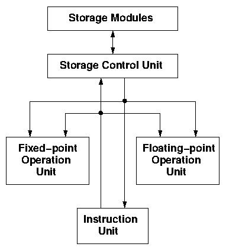

## The HASE Tomasulo's Algorithm Simulation Model

Tomasulo's algorithm was first used in the IBM System/360 Model 91 Floating-point Unit and is still used today in a variety of modern microprocessor. It uses a tag mechanism to control the movement of operands between programmable registers and parallel arithmetic units. Tomasulo's algorithm is difficult to explain to students without a dynamic demonstration so a HASE simulation model of the 360/91 Floating-point Unit has been built for this purpose.

This document explains how the algorithm worked in the IBM system/360 Model 91 and how the HASE model works.

The files for this model can be downloaded from <https://github.com/HASE-Group/tomasulo/tree/V1.8>

Instructions on how to use HASE models can be found at <https://github.com/HASE-Group/hase_iii_releases>

### The IBM System/360 Model 91

Tomasulo's Algorithm [1] was used in conjunction with the IBM Common Data Bus used to interconnect the component parts of the System/360 Model 91 Floating-point Unit.  The Model 91 was developed in the mid 1960s with the primary aim of providing "the highest performance capability that advanced design philosophy and System/360 circuit technology extensions could achieve, within a balanced development schedule [2]" Performance was taken to mean general computer availability and high-speed execution of general problem programs, and a factor of between one and two orders of magnitude over the earlier 7090 was achieved, depending on the nature of the problem. Only a small number of Model 91s were actually produced, but most of its architectural features were carried over into the commercially more successful Model 195.

One of the problems facing the designers of high-speed computer systems at the time was the difficulty of achieving the fastest possible execution times for a particular technology in universal execution units. Circuitry designed to carry out both multiplication and addition, for example, could do neither as fast as two units each limited to one kind of operation. Thus not only did the Model 91 contain separate fixed-point and floating-point execution areas, but the floating-point area contained separate add and multiply/divide units capable of concurrent operation (Figure 1). Although both units were internally pipelined, only the add unit (a two-stage pipeline) could start a new operation in each (60 ns) clock cycle. The multiply/divide unit took three cycles to execute a multiply and 12 cycles to execute a divide, but could only deal with one instruction at a time.

**Figure 1. The IBM 360 Model 91 Processor**

    
### The HASE Simulation Model

The HASE simulation model shown in Figure 2 closely follows the design of the IBM System/360 Model 91 Floating-point Unit.  Tomasulo's Algorithm was designed to maximise the benefit of the parallel floating-point arithmetic units provided in the Model 91 by controlling the movement of data between the floating-point registers and these units.  The 360 processor and memory are represented in the model by an Instruction/Data Source Unit which stores a sequence of instructions and a set of data values. As in the Model 91, the instructions are converted into pseudo register-register instructions before being sent to the FLOS. For instructions which specify a storage address, the corresponding operands are sent via a queue within the Source Unit (equal in length to the assumed memory latency) to the Floating-point Buffers (FLBs). These buffers are allocated cyclicly and the corresponding FLB number is entered into the pseudo instruction issued to the FLOS.

**Figure 2. The HASE Tomasulo's Algorithm model**

Each FLB is represented as a separate entity in the model and displayed with the colour of the tag it will send to the Common Data Bus next to it.  Once a buffer has sent its operand to the bus, it notifies the Source. The Source keeps a count of the number of FLBs in use and if the number of FLBs in use reaches the maximum (of 6), it waits until the number in use falls below 6 before processing further instructions.

Instructions in the Source memory can be of the form:

<table>
<tr><td>LOAD </td><td> Fx </td><td> <i>memory address</i></td></tr>
<tr><td>STORE </td><td> Fx </td><td> <i>memory address</i></td></tr>
<tr><td>ADDRR </td><td> Fx </td><td> Fy</td></tr>
<tr><td>ADDRS </td><td> Fx </td><td> <i>memory address</i></td></tr>
<tr><td>SUBRR </td><td> Fx </td><td> Fy</td></tr>
<tr><td>SUBRS </td><td> Fx </td><td> <i>memory address</i></td></tr>
<tr><td>MULRR </td><td> Fx </td><td> Fy</td></tr>
<tr><td>MULRS </td><td> Fx </td><td> <i>memory address</i></td></tr>
<tr><td>DIVRR </td><td> Fx </td><td> Fy</td></tr>
<tr><td>DIVRS </td><td> Fx </td><td> <i>memory address</i></td></tr>
<tr><td>STOP 0
</table>

where Fx and Fy are floating-point registers, RR implies a register-register operation and RS a register-storage operation. The IBM System/360 used a two-address instruction format, so that ADDRR Fx Fy, for example, executes:

<table>
<tr><td> Fx </td><td> = </td><td> Fx </td><td> + </td><td> Fy</td></tr>
</table>

The corresponding pseudo instructions are of the form:

<table>
<tr><td>LD </td><td> Fx </td><td> FLBy</td></tr>
<tr><td>ST </td><td> Fx </td><td> SDBy</td></tr>
<tr><td>ADD </td><td> Fx </td><td> Fy</td></tr>
<tr><td>ADD </td><td> Fx </td><td> FLBy</td></tr>
<tr><td> etc</td></tr>
</table>

where SDB is a Store Data Buffer. Whenever the Source decodes a STORE instruction it enters the memory address into a local table and, when iext ClockPhase1) and which Reservation Station register it is destined for.

### The Common Data Bus

The CDB receives input requests from the Decoder, the Floating-point Registers, the Floating-point Buffers and the Arithmetic Units and sends values to the Reservation Stations, the Floating-point registers, and the Store Data Buffers. Several requests may arrive in one clock period. The model assumes that, as in the 360/91, operands received from the Floating-point Buffers can be routed to the Floating-point Registers and the Reservation Stations by an FLB bus, separate from the actual Common Data Bus, and that operands from the Floating-point Registers can be routed to the Reservation Stations and the Store Data buffers by a separate FLR bus. The CDB unit can therefore deal with several requests simultaneously.

Requests from the Decoder, Add and Multiply units can only be dealt with one at a time. In the original IBM scheme, the Add unit, for example, had to give notice that it was going to produce a result two clock cycles ahead of time.  In the HASE model each sending unit enters a Held state and only frees when it gets an acknowledge from the CDB. The CDB deals with simultaneous requests in successive clock periods in the following priority order: Multiply, Add, Decoder.

Request packets from the Decoder contain the following fields:

- the Sink and Source Tag numbers,
- the Sink and Source Reservation Station register numbers,
- the instruction

The CDB decodes the instruction to determine the number of inputs to expect from the Floating-point Registers. Packets from the FLRs (which are sent in response to a command from the Decoder) contain the number of the Reservation Station register for which they are destined and the CDB uses this number to determine whether the operand is a Sink or Source operand.

The CDB uses the Sink Reservation Station register number to select the RS Control register to which it will send the instruction along with the RS Tag number which will be copied through the arithmetic unit and presented to the CDB with the result operand.

If the Sink/Source Tag number is zero, the CDB extracts the Sink/Source operand from the packet sent by the FLR and later sends it to the appropriate RS register. If the Tag is non-zero, it will send the corresponding Tag to the Tag display register (the Decoder will have updated the Tag Array). Before sending either an operand or a Tag, however, the CDB checks the contents of any FLB, Add or Multiplier packets it may have received in the same clock.

When an input packet is received from a Floating-point Buffer, the CDB first checks the tags in any current FLR packets.  If the FLB tag matches a Sink/Source tag in a waiting packet, the CDB copies the FLB operand into the Sink/Source operand field in the waiting packet, sets the corresponding tag field to zero and updates the Decoder Tag Array for that Sink/Source.

The CDB then checks the FLB tag value against each of the entries in the Tag Array in the Decoder and, if the there is a match, sends the FLB operand to the corresponding register. At the same time it resets that Tag Array entry to zero and sends a packet to the corresponding Tag Display Register (which resets the displayed Tag to the zero state).

When an input packet is received from an arithmetic unit, the CDB first selects the one with higher priority (if there are two), then checks the tags in any packets waiting to go the Reservation Stations or Store Data Buffers (and updates them if necessary) and then checks the arithmetic unit tag against the tags in the Decoder Tag Array. If there is a match it prepares to send the operand and tag to the corresponding operand and tag display registers and resets the entry in the Tag Array to zero.

Once all the checks any packet updates have been completed, the CDB sends any waiting instructions, operands and/or tags to their destinations. Whenever an instruction or operand is sent to a Reservation Station register, the CDB notifies the relevant Reservation Station entity, which monitors the state of the RS registers. If the instruction and operand registers are all full for a particular RS, its contents can be sent to the corresponding arithmetic unit.

### The Reservation Stations

Each Reservation Station is made up of two Operand registers (Source and Sink), together with their associated Tag Display registers, and a Control register. In the display these registers appear against a background which shows the colour of the tag which will appear at the arithmetic unit output when the result produced by the instruction held in that Reservation Station is sent to the Common Data bus.

When the Common Data Bus sends an instrucion to a Reservation Station, the Control Register receives a packet from the CDB containing an instruction and a tag number, the latter being the number of the Reservation Station. The Control Register displays the function field of the instruction. If the operands are available, they are sent to the Operand registers, which change state and display their operand values.  If an operand is not available, the tag for that operand is sent to the corresponding tag register. When a result is subsequently sent to the Common Data Bus containing that tag, the waiting Operand Register receives its operand and changes state accordingly. At the same time, its tag register is returned to the zero state.

As each Reservation Station register receives a packet from the Common Data Bus, the appropriate Add or Multiply/Divide Reservation Station entity itself is notified that the register is ready. The Reservation Station entities monitor the states of their individual Control and Operand registers and when all three registers in one Reservation Station become full, the Reservation Station entity invokes a method in these registers telling them to send their contents to their outputs (from whence they go to the appropriate Arithmetic Unit).  If more than one Add or one Multiply Reservation Station becomes full in any one clock period, the operation in the Station with the lowest station number is processed first. The Control Register sends both its function and tag value. The tag is copied through to the output of the arithmetic unit where it appears as the result tag.

The Control Register continues to display its function until the result of that function has been sent to its destination and the corresponding reservation station Busy Bit has been reset in the Decoder, after which it returns to the FREE state. The Operand Registers return to the idle state as soon as they have sent their operands to their arithmetic unit and reset their operand values to zero.

### The Arithmetic Units

#### The Add Unit

The Add Unit executes the ADD and SUB instructions.  It receives instruction and operand packets from the RS registers and sends an operand result packet to the Common Data Bus.  The number of clock periods (latency value) required to execute an instruction is a parameter of the model read from the Parameters entity at the start of a simulation. The *add_latency* parameter is initially set to 2,
corresponding to the value in the IBM Sytem/360 Model 91, but this value can be altered by the user. It is checked to ensure that it is within range:

1 < add_latency =< 8

The Unit is implemented as an 8-stage pipeline, and can accept another instruction in each clock period.  It computes its result in the first stage and simply copies it through the remaining stages. The result is taken from the stage corresponding to the latency and sent to the CDB, *i.e.* if the latency is <8, the remaining pipeline stages are ignored.

#### The Multiply Unit

The Multiply Unit executes the MUL and DIV instructions.  It receives instruction and operand packets from the RS registers and sends an operand result packet to the Common Data Bus.  The number of clock periods (latency values) required to execute MUL and DIV are parameters of the model read from the Parameters entity at the start of a simulation. The *mul_latency* parameter is initially set to 3 and the *div_latency* to 12, corresponding to the values in the IBM System/360 Model 91, but these values can be altered by the user.  They are checked to ensure that they are within range:

1 < mul_latency =< 8  
1 < div_latency =< 16

The Unit is implemented as a 16-stage pipeline, although it cannot accept another instruction until it has sent the result of an existing instruction to the CDB. It computes its result in the first stage and simply copies this result through the remaining stages. The result is taken from the stage corresponding to function's latency and sent to the CDB.

At the start of a DIV, the unit checks for divide by zero and, if a zero is found, the simulation is stopped and an error message is displayed in the Output pane.

### Demonstration Program

The model contains a Demonstration Program which forms the scalar (dot) product of two 4-element vectors.  The following table lists the program instructions in the form in which they are held in the Source Unit's instruction memory and the corresponding pseudo instructions which the Source Unit sends to the Floating-point Operation Stack:

<table bgcolor=white align=center border>
<tr>
<th>Program instructions</th><th>Pseudo instructions</th>
</tr>
<tr><td>LOAD F0 0</td><td>LD F0 FLB1</td></tr>
<tr><td>LOAD F1 2</td><td>LD F1 FLB2</td></tr>
<tr><td>MULRS F1 3</td><td>MUL F1 FLB3</td></tr>
<tr><td>ADDRR F0 F1</td><td>ADD F0 F1</td></tr>
<tr><td>LOAD F2 4</td><td>LD F2 FLB4</td></tr>
<tr><td>MULRS F2 5</td><td>MUL F2 FLB5</td></tr>
<tr><td>ADDRR F0 F2</td><td>ADD F0 F2</td></tr>
<tr><td>LOAD F3 6</td><td>LD F3 FLB6</td></tr>
<tr><td>MULRS F3 7</td><td>MUL F3 FLB1</td></tr>
<tr><td>ADDRR F0 F3</td><td>ADD F0 F3</td></tr>
<tr><td>LOAD F1 8</td><td>LD F1 FLB2</td></tr>
<tr><td>MULRS F1 9</td><td>MUL F1 FLB3</td></tr>
<tr><td>ADDRR F0 F1</td><td>ADD F0 F1</td></tr>
<tr><td>STORE F0 1</td><td>ST F0 SDB1</td></tr>
<tr><td>STOP 0</td><td>STOP 0</td></tr>
</table>

As the program executes, the following actions occur in the system:

#### LD F0 FLB1

- Sets FLB1 tag in FPR0; when the data arrives in FLB1 it is copied into FPR0

#### LD F1 FLB2

- Sets FLB2 tag in FPR1; before the data arrives, the tag has been moved to Multiply RS1 Source, so the data goes there instead

#### Mul F1 FLB3

- Uses Multiply Reservation Station 1
- Copies FLB2 tag from FPR1 to RS1 Sink and sets Multiply RS1 tag in FPR1
- Sets FLB3 tag in RS1 Source; when the data arrives in FLB3 it is copied into RS1 Source
- When result appears on CDB it is copied into FPR1 and Add RS1 Source

#### ADD F0 F1 

- Uses Add Reservation Station 1
- Copies data from FPR0 to RS1 Sink and sets Add RS1 tag in FPR0
- Copies Multiply RS1 tag from FPR1 to RS1 Source
- When result appears on CDB it is copied into Add RS2 Sink

#### LD F2 FLB4

- Sets FLB4 tag in FPR2; before the data arrives in FLB4, the tag has been moved into Multiply RS2 Source so the data goes there instead

#### Mul F2 FLB5

- Uses Multiply Reservation Station 2
- Copies FLB4 tag from FPR2 to RS2 Sink and sets Multiply RS2 tag in FPR2 
- Sets FLB5 tag in RS2 Source; when data arrives in FLB5 it is copied into Multiply RS2 Source
- When result appears on CDB it is copied into FPR2 and Add RS2 Source

#### ADD F0 F2

- Uses Add Reservation Station 2
- Copies Add RS1 tag from FPR0 to RS2 Source and sets Add RS2 tag in FPR0
- Copies Multiply RS2 tag from FPR2 to RS2 Sink
- When result appears on CDB it is copied into Add RS3 Sink

#### LD F3 FLB6

- Sets FLB6 tag in FPR3; as the data arrives in FLB6, the tag is being moved into Multiply RS2 Source so the data goes there instead

#### Mul F3 FLB1

- Uses Multiply Reservation Station 1
- Sets Multiply RS1 tag in FPR3
- Takes FLB6 tag from FPR3, but FLB6 tag and data appear on the CDB before the tag is sent to RS1 Sink, so the data is sent instead
- Sets FLB1 tag in RS1 Source
- When result appears it is copied into FPR3 and Add RS3 Source

#### ADD F0 F3

- Uses Add Reservation Station 3
- Copies Add RS1 tag from FPR0 to RS3 Sink and sets Add RS3 tag in FPR0
- Copies Multiply RS2 tag from FPR3 into RS3 Source
- When result appears it is copied into Add RS1 Sink

#### LD F1 FLB2

- Sets FLB2 tag in FPR1; when the data arrives it is copied into Multiply RS1 Source

#### Mul F1 FLB3

- Uses Multiply Reservation Station 2
- Takes Add RS3 tag from FPR1, but this tag appears on the CDB before the tag is sent to Multiply RS2 source, so data is sent instead
- Sets Multiply RS2 tag in FPR1
- Would set FLB3 tag in RS2 Source, but FLB3 tag and data appear on the CDB before the tag is sent to RS2, so data is sent instead
- When result appears it is copied into FPR1 and Add RS1 Source

#### ADD F0 F1

- Uses Add Reservation Station 1
- Copies Add RS3 tag from FPR0 to RS1 Sink and sets Add RS1 tag in FPR0
- Copies Multiply RS2 tag from FPR1 to RS1 Source
- When result appears it is copied into FPR0 and SDB1

#### ST F0 SDB1

- Copies Add RS1 tag from FPR0 into SDB1. When the data arrives it is sent to Memory

### References

1. R.M. Tomasulo  
 "An Efficient Algorithm for Exploiting Multiple Arithmetic Units"  
*IBM Journal of R & D, Vol 11, pp 25-33 1967*
2. M.J. Flynn and P.R. Low  
"The IBM System/360 Model 91: Some Remarks on System Development"  
*IBM Journal of R & D, Vol 11, pp 2-7 1967*
